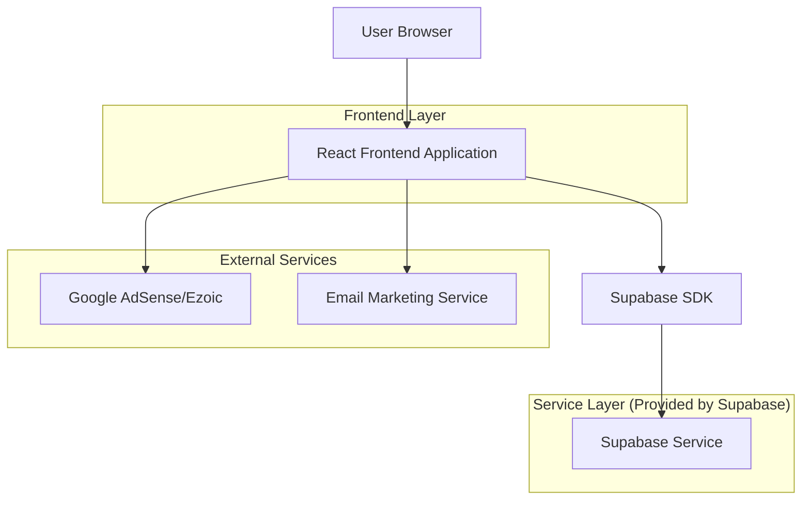
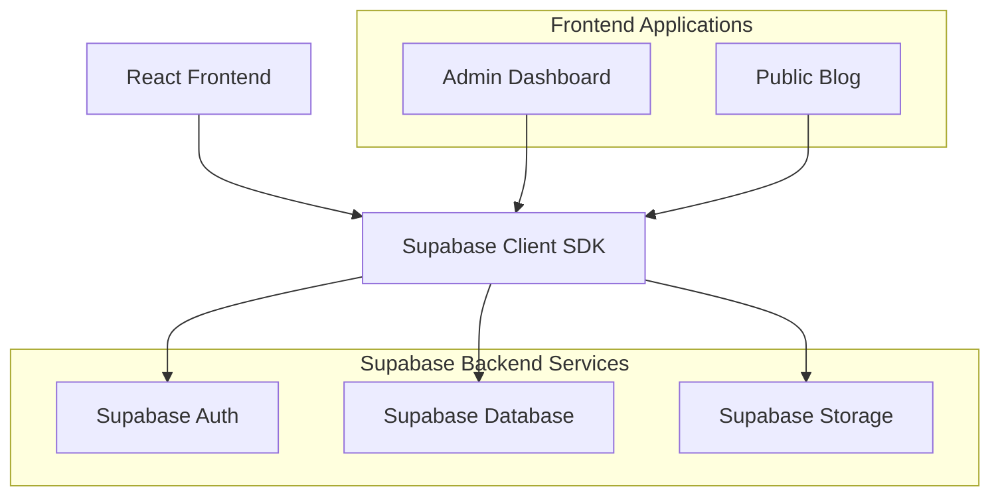
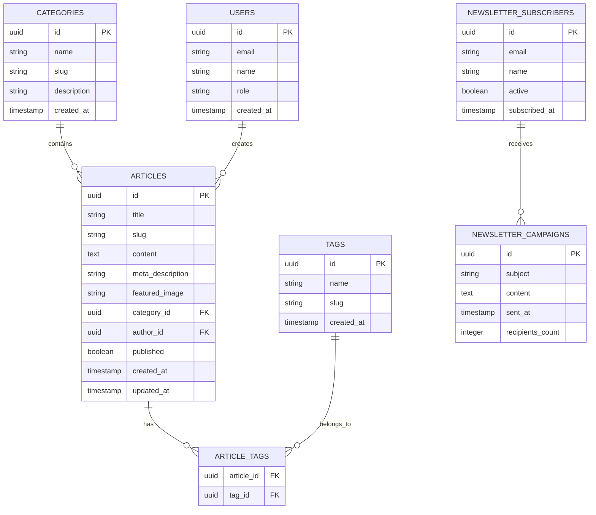

# AIMindset - Documento de Arquitetura Técnica

## 1. Architecture design



## 2. Technology Description

* Frontend: React\@18 + TailwindCSS\@3 + Vite + React Router

* Backend: Supabase (Authentication, Database, Storage)

* Email Marketing: Integração com serviços como Mailchimp ou ConvertKit

* Monetização: Google AdSense/Ezoic para ads, sistema próprio para links de afiliados

* SEO: React Helmet para meta tags, sitemap automático

## 3. Route definitions

| Route             | Purpose                                                   |
| ----------------- | --------------------------------------------------------- |
| /                 | Home page, exibe banner principal, destaques e categorias |
| /tutoriais        | Página de categoria para tutoriais de IA                  |
| /comparativos     | Página de categoria para reviews e comparativos           |
| /dicas            | Página de categoria para dicas e hacks                    |
| /novidades        | Página de categoria para novidades de IA                  |
| /artigo/:slug     | Página individual do artigo com conteúdo completo         |
| /newsletter       | Página de inscrição e gerenciamento da newsletter         |
| /admin            | Dashboard administrativo (protegido por autenticação)     |
| /admin/artigos    | Gerenciamento de artigos no dashboard                     |
| /admin/categorias | Gerenciamento de categorias e tags                        |
| /admin/newsletter | Gerenciamento de assinantes da newsletter                 |
| /admin/analytics  | Métricas e analytics do blog                              |

## 4. API definitions

### 4.1 Core API

**Artigos**

```
GET /api/articles
```

Request:

| Param Name | Param Type | isRequired | Description                  |
| ---------- | ---------- | ---------- | ---------------------------- |
| category   | string     | false      | Filtrar por categoria        |
| tag        | string     | false      | Filtrar por tag              |
| limit      | number     | false      | Número de artigos por página |
| offset     | number     | false      | Paginação                    |

Response:

| Param Name | Param Type | Description      |
| ---------- | ---------- | ---------------- |
| articles   | Article\[] | Lista de artigos |
| total      | number     | Total de artigos |

```
POST /api/articles
```

Request:

| Param Name        | Param Type | isRequired | Description             |
| ----------------- | ---------- | ---------- | ----------------------- |
| title             | string     | true       | Título do artigo        |
| content           | string     | true       | Conteúdo em markdown    |
| category          | string     | true       | Categoria do artigo     |
| tags              | string\[]  | false      | Tags do artigo          |
| featured\_image   | string     | false      | URL da imagem destacada |
| meta\_description | string     | false      | Meta descrição para SEO |

**Newsletter**

```
POST /api/newsletter/subscribe
```

Request:

| Param Name | Param Type | isRequired | Description        |
| ---------- | ---------- | ---------- | ------------------ |
| email      | string     | true       | Email do assinante |
| name       | string     | false      | Nome do assinante  |

Response:

| Param Name | Param Type | Description             |
| ---------- | ---------- | ----------------------- |
| success    | boolean    | Status da inscrição     |
| message    | string     | Mensagem de confirmação |

**Autenticação Admin**

```
POST /api/auth/login
```

Request:

| Param Name | Param Type | isRequired | Description            |
| ---------- | ---------- | ---------- | ---------------------- |
| email      | string     | true       | Email do administrador |
| password   | string     | true       | Senha do administrador |

Response:

| Param Name | Param Type | Description               |
| ---------- | ---------- | ------------------------- |
| token      | string     | JWT token de autenticação |
| user       | User       | Dados do usuário          |

## 5. Server architecture diagram



## 6. Data model

### 6.1 Data model definition



### 6.2 Data Definition Language

**Tabela de Artigos (articles)**

```sql
-- create table
CREATE TABLE articles (
    id UUID PRIMARY KEY DEFAULT gen_random_uuid(),
    title VARCHAR(255) NOT NULL,
    slug VARCHAR(255) UNIQUE NOT NULL,
    content TEXT NOT NULL,
    meta_description VARCHAR(160),
    featured_image VARCHAR(500),
    category_id UUID REFERENCES categories(id),
    author_id UUID REFERENCES auth.users(id),
    published BOOLEAN DEFAULT false,
    view_count INTEGER DEFAULT 0,
    created_at TIMESTAMP WITH TIME ZONE DEFAULT NOW(),
    updated_at TIMESTAMP WITH TIME ZONE DEFAULT NOW()
);

-- create indexes
CREATE INDEX idx_articles_category_id ON articles(category_id);
CREATE INDEX idx_articles_published ON articles(published);
CREATE INDEX idx_articles_created_at ON articles(created_at DESC);
CREATE INDEX idx_articles_slug ON articles(slug);

-- RLS policies
ALTER TABLE articles ENABLE ROW LEVEL SECURITY;
GRANT SELECT ON articles TO anon;
GRANT ALL PRIVILEGES ON articles TO authenticated;
```

**Tabela de Categorias (categories)**

```sql
-- create table
CREATE TABLE categories (
    id UUID PRIMARY KEY DEFAULT gen_random_uuid(),
    name VARCHAR(100) NOT NULL,
    slug VARCHAR(100) UNIQUE NOT NULL,
    description TEXT,
    created_at TIMESTAMP WITH TIME ZONE DEFAULT NOW()
);

-- create index
CREATE INDEX idx_categories_slug ON categories(slug);

-- RLS policies
ALTER TABLE categories ENABLE ROW LEVEL SECURITY;
GRANT SELECT ON categories TO anon;
GRANT ALL PRIVILEGES ON categories TO authenticated;

-- init data
INSERT INTO categories (name, slug, description) VALUES
('Tutoriais de IA', 'tutoriais', 'Guias passo a passo de ferramentas populares de IA'),
('Comparativos', 'comparativos', 'Avaliação de softwares e apps de IA'),
('Dicas e Hacks', 'dicas', 'Como automatizar tarefas e ganhar produtividade'),
('Novidades de IA', 'novidades', 'Lançamentos, tendências e notícias importantes');
```

**Tabela de Tags (tags)**

```sql
-- create table
CREATE TABLE tags (
    id UUID PRIMARY KEY DEFAULT gen_random_uuid(),
    name VARCHAR(50) NOT NULL,
    slug VARCHAR(50) UNIQUE NOT NULL,
    created_at TIMESTAMP WITH TIME ZONE DEFAULT NOW()
);

-- create index
CREATE INDEX idx_tags_slug ON tags(slug);

-- RLS policies
ALTER TABLE tags ENABLE ROW LEVEL SECURITY;
GRANT SELECT ON tags TO anon;
GRANT ALL PRIVILEGES ON tags TO authenticated;
```

**Tabela de Relacionamento Artigo-Tags (article\_tags)**

```sql
-- create table
CREATE TABLE article_tags (
    article_id UUID REFERENCES articles(id) ON DELETE CASCADE,
    tag_id UUID REFERENCES tags(id) ON DELETE CASCADE,
    PRIMARY KEY (article_id, tag_id)
);

-- RLS policies
ALTER TABLE article_tags ENABLE ROW LEVEL SECURITY;
GRANT SELECT ON article_tags TO anon;
GRANT ALL PRIVILEGES ON article_tags TO authenticated;
```

**Tabela de Assinantes da Newsletter (newsletter\_subscribers)**

```sql
-- create table
CREATE TABLE newsletter_subscribers (
    id UUID PRIMARY KEY DEFAULT gen_random_uuid(),
    email VARCHAR(255) UNIQUE NOT NULL,
    name VARCHAR(100),
    active BOOLEAN DEFAULT true,
    subscribed_at TIMESTAMP WITH TIME ZONE DEFAULT NOW()
);

-- create index
CREATE INDEX idx_newsletter_email ON newsletter_subscribers(email);
CREATE INDEX idx_newsletter_active ON newsletter_subscribers(active);

-- RLS policies
ALTER TABLE newsletter_subscribers ENABLE ROW LEVEL SECURITY;
GRANT SELECT ON newsletter_subscribers TO authenticated;
GRANT INSERT ON newsletter_subscribers TO anon;
```

