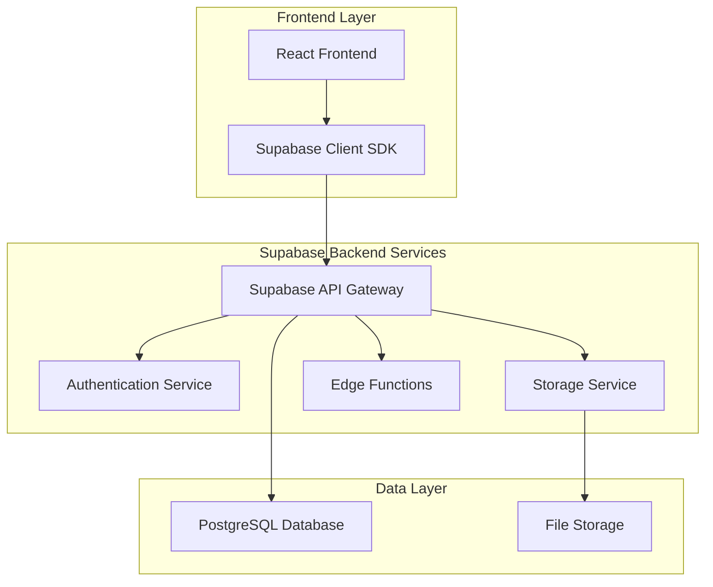
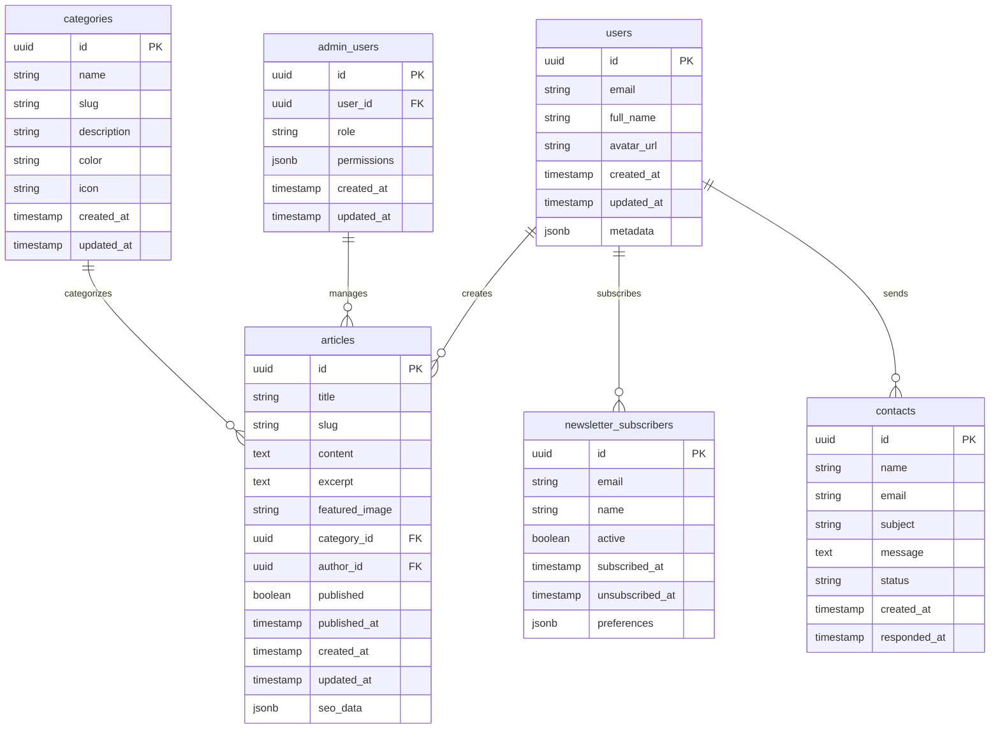

# AIMindset - Arquitetura Backend Supabase

## 1. Arquitetura Geral



## 2. Tecnologias Utilizadas

- **Frontend**: React@18 + TypeScript + Vite + TailwindCSS
- **Backend**: Supabase (PostgreSQL + Auth + Storage + Edge Functions)
- **Database**: PostgreSQL (via Supabase)
- **Authentication**: Supabase Auth
- **Storage**: Supabase Storage
- **Real-time**: Supabase Realtime

## 3. Estrutura do Banco de Dados

### 3.1 Modelo de Dados



### 3.2 DDL (Data Definition Language)

```sql
-- Enable necessary extensions
CREATE EXTENSION IF NOT EXISTS "uuid-ossp";

-- Users table (extends Supabase auth.users)
CREATE TABLE public.users (
    id UUID REFERENCES auth.users(id) PRIMARY KEY,
    email VARCHAR(255) UNIQUE NOT NULL,
    full_name VARCHAR(255),
    avatar_url TEXT,
    created_at TIMESTAMP WITH TIME ZONE DEFAULT NOW(),
    updated_at TIMESTAMP WITH TIME ZONE DEFAULT NOW(),
    metadata JSONB DEFAULT '{}'::jsonb
);

-- Categories table
CREATE TABLE public.categories (
    id UUID PRIMARY KEY DEFAULT uuid_generate_v4(),
    name VARCHAR(100) NOT NULL,
    slug VARCHAR(100) UNIQUE NOT NULL,
    description TEXT,
    color VARCHAR(7) DEFAULT '#3B82F6',
    icon VARCHAR(50) DEFAULT 'folder',
    created_at TIMESTAMP WITH TIME ZONE DEFAULT NOW(),
    updated_at TIMESTAMP WITH TIME ZONE DEFAULT NOW()
);

-- Articles table
CREATE TABLE public.articles (
    id UUID PRIMARY KEY DEFAULT uuid_generate_v4(),
    title VARCHAR(255) NOT NULL,
    slug VARCHAR(255) UNIQUE NOT NULL,
    content TEXT NOT NULL,
    excerpt TEXT,
    featured_image TEXT,
    category_id UUID REFERENCES public.categories(id),
    author_id UUID REFERENCES public.users(id),
    published BOOLEAN DEFAULT false,
    published_at TIMESTAMP WITH TIME ZONE,
    created_at TIMESTAMP WITH TIME ZONE DEFAULT NOW(),
    updated_at TIMESTAMP WITH TIME ZONE DEFAULT NOW(),
    seo_data JSONB DEFAULT '{}'::jsonb
);

-- Newsletter subscribers table
CREATE TABLE public.newsletter_subscribers (
    id UUID PRIMARY KEY DEFAULT uuid_generate_v4(),
    email VARCHAR(255) UNIQUE NOT NULL,
    name VARCHAR(255),
    active BOOLEAN DEFAULT true,
    subscribed_at TIMESTAMP WITH TIME ZONE DEFAULT NOW(),
    unsubscribed_at TIMESTAMP WITH TIME ZONE,
    preferences JSONB DEFAULT '{}'::jsonb
);

-- Contacts table
CREATE TABLE public.contacts (
    id UUID PRIMARY KEY DEFAULT uuid_generate_v4(),
    name VARCHAR(255) NOT NULL,
    email VARCHAR(255) NOT NULL,
    subject VARCHAR(255) NOT NULL,
    message TEXT NOT NULL,
    status VARCHAR(20) DEFAULT 'pending',
    created_at TIMESTAMP WITH TIME ZONE DEFAULT NOW(),
    responded_at TIMESTAMP WITH TIME ZONE
);

-- Admin users table
CREATE TABLE public.admin_users (
    id UUID PRIMARY KEY DEFAULT uuid_generate_v4(),
    user_id UUID REFERENCES public.users(id) UNIQUE,
    role VARCHAR(50) DEFAULT 'admin',
    permissions JSONB DEFAULT '{}'::jsonb,
    created_at TIMESTAMP WITH TIME ZONE DEFAULT NOW(),
    updated_at TIMESTAMP WITH TIME ZONE DEFAULT NOW()
);

-- Indexes for performance
CREATE INDEX idx_articles_published ON public.articles(published, published_at DESC);
CREATE INDEX idx_articles_category ON public.articles(category_id);
CREATE INDEX idx_articles_author ON public.articles(author_id);
CREATE INDEX idx_articles_slug ON public.articles(slug);
CREATE INDEX idx_categories_slug ON public.categories(slug);
CREATE INDEX idx_newsletter_active ON public.newsletter_subscribers(active, subscribed_at DESC);
CREATE INDEX idx_contacts_status ON public.contacts(status, created_at DESC);

-- Triggers for updated_at
CREATE OR REPLACE FUNCTION update_updated_at_column()
RETURNS TRIGGER AS $$
BEGIN
    NEW.updated_at = NOW();
    RETURN NEW;
END;
$$ language 'plpgsql';

CREATE TRIGGER update_users_updated_at BEFORE UPDATE ON public.users FOR EACH ROW EXECUTE FUNCTION update_updated_at_column();
CREATE TRIGGER update_articles_updated_at BEFORE UPDATE ON public.articles FOR EACH ROW EXECUTE FUNCTION update_updated_at_column();
CREATE TRIGGER update_categories_updated_at BEFORE UPDATE ON public.categories FOR EACH ROW EXECUTE FUNCTION update_updated_at_column();
CREATE TRIGGER update_admin_users_updated_at BEFORE UPDATE ON public.admin_users FOR EACH ROW EXECUTE FUNCTION update_updated_at_column();
```

## 4. Row Level Security (RLS) Policies

```sql
-- Enable RLS on all tables
ALTER TABLE public.users ENABLE ROW LEVEL SECURITY;
ALTER TABLE public.articles ENABLE ROW LEVEL SECURITY;
ALTER TABLE public.categories ENABLE ROW LEVEL SECURITY;
ALTER TABLE public.newsletter_subscribers ENABLE ROW LEVEL SECURITY;
ALTER TABLE public.contacts ENABLE ROW LEVEL SECURITY;
ALTER TABLE public.admin_users ENABLE ROW LEVEL SECURITY;

-- Users policies
CREATE POLICY "Users can view their own profile" ON public.users
    FOR SELECT USING (auth.uid() = id);

CREATE POLICY "Users can update their own profile" ON public.users
    FOR UPDATE USING (auth.uid() = id);

-- Articles policies
CREATE POLICY "Anyone can view published articles" ON public.articles
    FOR SELECT USING (published = true);

CREATE POLICY "Authenticated users can view all articles" ON public.articles
    FOR SELECT USING (auth.role() = 'authenticated');

CREATE POLICY "Authors can manage their articles" ON public.articles
    FOR ALL USING (auth.uid() = author_id);

CREATE POLICY "Admins can manage all articles" ON public.articles
    FOR ALL USING (
        EXISTS (
            SELECT 1 FROM public.admin_users 
            WHERE user_id = auth.uid()
        )
    );

-- Categories policies
CREATE POLICY "Anyone can view categories" ON public.categories
    FOR SELECT USING (true);

CREATE POLICY "Admins can manage categories" ON public.categories
    FOR ALL USING (
        EXISTS (
            SELECT 1 FROM public.admin_users 
            WHERE user_id = auth.uid()
        )
    );

-- Newsletter policies
CREATE POLICY "Anyone can subscribe to newsletter" ON public.newsletter_subscribers
    FOR INSERT WITH CHECK (true);

CREATE POLICY "Subscribers can view their subscription" ON public.newsletter_subscribers
    FOR SELECT USING (email = auth.jwt() ->> 'email');

CREATE POLICY "Admins can manage newsletter" ON public.newsletter_subscribers
    FOR ALL USING (
        EXISTS (
            SELECT 1 FROM public.admin_users 
            WHERE user_id = auth.uid()
        )
    );

-- Contacts policies
CREATE POLICY "Anyone can create contact" ON public.contacts
    FOR INSERT WITH CHECK (true);

CREATE POLICY "Admins can manage contacts" ON public.contacts
    FOR ALL USING (
        EXISTS (
            SELECT 1 FROM public.admin_users 
            WHERE user_id = auth.uid()
        )
    );

-- Admin users policies
CREATE POLICY "Admins can view admin users" ON public.admin_users
    FOR SELECT USING (
        EXISTS (
            SELECT 1 FROM public.admin_users 
            WHERE user_id = auth.uid()
        )
    );
```

## 5. Storage Configuration

```sql
-- Create storage buckets
INSERT INTO storage.buckets (id, name, public) VALUES 
('articles', 'articles', true),
('avatars', 'avatars', true),
('uploads', 'uploads', false);

-- Storage policies
CREATE POLICY "Anyone can view article images" ON storage.objects
    FOR SELECT USING (bucket_id = 'articles');

CREATE POLICY "Authenticated users can upload article images" ON storage.objects
    FOR INSERT WITH CHECK (
        bucket_id = 'articles' AND 
        auth.role() = 'authenticated'
    );

CREATE POLICY "Users can manage their avatars" ON storage.objects
    FOR ALL USING (
        bucket_id = 'avatars' AND 
        auth.uid()::text = (storage.foldername(name))[1]
    );
```

## 6. Edge Functions

### 6.1 Newsletter Email Function
```typescript
// supabase/functions/send-newsletter/index.ts
import { serve } from "https://deno.land/std@0.168.0/http/server.ts"
import { createClient } from 'https://esm.sh/@supabase/supabase-js@2'

serve(async (req) => {
  const { subject, content, recipients } = await req.json()
  
  // Send emails using your preferred email service
  // Implementation depends on email provider (SendGrid, Resend, etc.)
  
  return new Response(
    JSON.stringify({ success: true }),
    { headers: { "Content-Type": "application/json" } }
  )
})
```

### 6.2 Contact Form Handler
```typescript
// supabase/functions/handle-contact/index.ts
import { serve } from "https://deno.land/std@0.168.0/http/server.ts"
import { createClient } from 'https://esm.sh/@supabase/supabase-js@2'

serve(async (req) => {
  const { name, email, subject, message } = await req.json()
  
  const supabase = createClient(
    Deno.env.get('SUPABASE_URL') ?? '',
    Deno.env.get('SUPABASE_SERVICE_ROLE_KEY') ?? ''
  )
  
  // Insert contact and send notification email
  const { data, error } = await supabase
    .from('contacts')
    .insert({ name, email, subject, message })
  
  if (error) {
    return new Response(
      JSON.stringify({ error: error.message }),
      { status: 400, headers: { "Content-Type": "application/json" } }
    )
  }
  
  return new Response(
    JSON.stringify({ success: true }),
    { headers: { "Content-Type": "application/json" } }
  )
})
```

## 7. Dados Iniciais

```sql
-- Insert default categories
INSERT INTO public.categories (name, slug, description, color, icon) VALUES
('Inteligência Artificial', 'inteligencia-artificial', 'Artigos sobre IA e Machine Learning', '#3B82F6', 'brain'),
('Produtividade', 'produtividade', 'Dicas e ferramentas para aumentar a produtividade', '#10B981', 'zap'),
('Tecnologia', 'tecnologia', 'Novidades e tendências em tecnologia', '#8B5CF6', 'cpu'),
('Tutoriais', 'tutoriais', 'Guias passo a passo e tutoriais', '#F59E0B', 'book-open'),
('Ferramentas', 'ferramentas', 'Reviews e análises de ferramentas', '#EF4444', 'tool');

-- Insert admin user (replace with actual user ID after authentication)
-- INSERT INTO public.admin_users (user_id, role, permissions) VALUES
-- ('your-user-id-here', 'super_admin', '{"all": true}'::jsonb);

-- Insert sample articles
INSERT INTO public.articles (title, slug, content, excerpt, category_id, published, published_at) VALUES
('Como a IA está Revolucionando o Trabalho', 'como-ia-revolucionando-trabalho', 
'Conteúdo completo do artigo sobre IA...', 
'Descubra como a inteligência artificial está transformando o mercado de trabalho.',
(SELECT id FROM public.categories WHERE slug = 'inteligencia-artificial'),
true, NOW()),

('10 Ferramentas de Produtividade com IA', '10-ferramentas-produtividade-ia',
'Conteúdo completo sobre ferramentas...', 
'Lista das melhores ferramentas de IA para aumentar sua produtividade.',
(SELECT id FROM public.categories WHERE slug = 'produtividade'),
true, NOW());
```

## 8. Configuração de Ambiente

```typescript
// .env.local
VITE_SUPABASE_URL=your_supabase_url
VITE_SUPABASE_ANON_KEY=your_supabase_anon_key
SUPABASE_SERVICE_ROLE_KEY=your_service_role_key
```

## 9. Monitoramento e Analytics

- **Logs**: Supabase Dashboard logs
- **Metrics**: Database performance metrics
- **Alerts**: Email notifications for errors
- **Backup**: Automated daily backups
- **Monitoring**: Real-time database monitoring

## 10. Segurança

- **RLS**: Row Level Security habilitado em todas as tabelas
- **JWT**: Tokens JWT para autenticação
- **HTTPS**: Todas as comunicações via HTTPS
- **Validation**: Validação de dados no frontend e backend
- **Rate Limiting**: Limitação de requisições por IP
- **CORS**: Configuração adequada de CORS