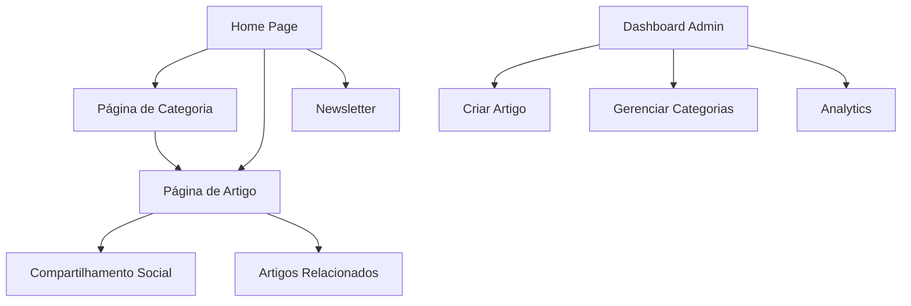

# AIMindset - Documento de Requisitos do Produto (PRD)

## 1. Product Overview

AIMindset é um blog especializado em Inteligência Artificial e ferramentas digitais, focado em educar profissionais, estudantes e entusiastas através de tutoriais práticos, comparativos detalhados e novidades do setor.

O projeto visa resolver a necessidade crescente de conhecimento prático sobre IA, oferecendo conteúdo de qualidade que ajuda usuários a automatizar tarefas e aplicar ferramentas digitais no dia a dia profissional.

O blog tem potencial para se tornar uma referência no mercado brasileiro de educação em IA, com monetização através de links de afiliados e publicidade.

## 2. Core Features

### 2.1 User Roles

| Role | Registration Method | Core Permissions |
|------|---------------------|------------------|
| Visitante | Acesso livre | Pode ler artigos, assinar newsletter |
| Administrador | Login direto | Pode criar, editar e gerenciar artigos, newsletter e configurações |

### 2.2 Feature Module

Nosso blog AIMindset consiste nas seguintes páginas principais:

1. **Home Page**: banner principal com slogan, seção de destaques, categorias em destaque, newsletter e navegação.
2. **Página de Artigo**: conteúdo detalhado, compartilhamento social, artigos relacionados.
3. **Página de Categoria**: listagem de artigos por categoria (Tutoriais, Comparativos, Dicas, Novidades).
4. **Dashboard Administrativo**: gerenciamento de artigos, categorias, tags e newsletter.
5. **Página de Newsletter**: inscrição e gerenciamento de assinantes.

### 2.3 Page Details

| Page Name | Module Name | Feature description |
|-----------|-------------|---------------------|
| Home Page | Header Fixo | Logo AIMindset, slogan, menu de navegação responsivo (Home, Tutoriais, Comparativos, Dicas, Novidades, Newsletter) |
| Home Page | Banner Principal | Seção hero com slogan "Domine a IA, domine o mundo", CTA "Comece agora" com efeitos neon |
| Home Page | Seção Destaques | Cards de artigos recentes/populares com imagens, títulos e resumos |
| Home Page | Categorias em Destaque | 4 seções principais, cada uma mostrando preview de 3 posts mais recentes |
| Home Page | Newsletter CTA | Campo de email, botão "Assinar" com design futurista, texto chamativo, validação em tempo real |
| Home Page | Footer | Links rápidos, política de privacidade, redes sociais, copyright |
| Página de Artigo | Cabeçalho do Artigo | Título grande, subtítulo chamativo, data de publicação, categoria |
| Página de Artigo | Corpo do Artigo | Conteúdo formatado com imagens, listas, dicas, links de afiliados destacados |
| Página de Artigo | Compartilhamento Social | Botões para Facebook, Twitter, LinkedIn, WhatsApp |
| Página de Artigo | Artigos Relacionados | Seção com 3-4 artigos similares por categoria/tags |
| Página de Categoria | Listagem de Artigos | Grid responsivo de cards com filtros por tags, paginação |
| Página de Categoria | Filtros e Busca | Sistema de tags, busca por palavra-chave, ordenação por data/popularidade |
| Dashboard Admin | Gerenciamento de Artigos | Criar, editar, excluir artigos, editor WYSIWYG, inserção de links de afiliados |
| Dashboard Admin | Gerenciamento de Categorias | CRUD de categorias e tags, organização hierárquica |
| Dashboard Admin | Analytics | Visualização de métricas de artigos, newsletter, links de afiliados |
| Newsletter | Formulário de Inscrição | Campos de email e nome, validação de email, prevenção de duplicatas, confirmação via Supabase |
| Newsletter | Gerenciamento Admin | Lista de assinantes com filtros (ativo/cancelado), exportação CSV, logs de envio, criação de campanhas |
| Newsletter | Sistema de Envio | Edge Function para envio via Resend API, logs automáticos, feedback em tempo real, templates responsivos |

## 3. Core Process

**Fluxo do Visitante:**
O usuário acessa a home page, navega pelas categorias de interesse, lê artigos completos, pode se inscrever na newsletter (com validação de email e prevenção de duplicatas) e compartilhar conteúdo nas redes sociais. Links de afiliados são destacados visualmente para facilitar conversões.

**Fluxo do Administrador:**
O admin acessa o dashboard, cria novos artigos usando o editor, adiciona tags e categorias, insere links de afiliados, publica o conteúdo e monitora métricas de performance. Na seção Newsletter, pode visualizar assinantes com filtros, exportar dados em CSV, criar campanhas de email e acompanhar logs de envio em tempo real.

**Fluxo da Newsletter (Backend Supabase):**
1. Usuário se inscreve → Validação de email → Verificação de duplicatas → Inserção no Supabase
2. Admin cria campanha → Edge Function busca assinantes ativos → Envio via Resend API → Log automático na tabela newsletter_logs
3. Feedback em tempo real para admin com status de envio e métricas detalhadas



## 4. User Interface Design

### 4.1 Design Style

- **Cores Primárias:** Azul Escuro (#0D1B2A) para confiança e tecnologia, Roxo Neon (#6A0DAD) para destaque e modernidade
- **Cores Secundárias:** Cinza Futurista (#B0B0B0) para textos neutros, Verde Limão (#32CD32) para botões de ação e links de afiliados
- **Estilo de Botões:** Bordas arredondadas com efeitos neon no hover, gradientes sutis
- **Tipografia:** Orbitron Bold para cabeçalhos (futurista), Montserrat Semi-Bold para subtítulos, Roboto Regular para corpo do texto
- **Layout:** Card-based com navegação superior fixa, elementos com sombras e efeitos de profundidade
- **Ícones:** Estilo minimalista com acentos neon, ícones de IA e tecnologia

### 4.2 Page Design Overview

| Page Name | Module Name | UI Elements |
|-----------|-------------|-------------|
| Home Page | Header | Background azul escuro (#0D1B2A), logo com efeito neon roxo, menu horizontal responsivo |
| Home Page | Banner Principal | Gradiente azul-roxo, tipografia Orbitron Bold, botão CTA verde limão com hover neon |
| Home Page | Cards de Artigos | Background cinza escuro, bordas roxas sutis, imagens com overlay, hover com elevação |
| Home Page | Newsletter | Seção destacada com background roxo neon, campo de input moderno, botão verde limão |
| Página de Artigo | Cabeçalho | Tipografia Orbitron para título, Montserrat para subtítulo, breadcrumbs com cores neon |
| Página de Artigo | Conteúdo | Roboto Regular, links de afiliados destacados em verde limão, imagens com bordas arredondadas |
| Dashboard Admin | Interface | Sidebar escura, cards com métricas, tabelas modernas, botões com estados visuais claros |

### 4.3 Responsiveness

O produto é mobile-first com design responsivo completo. Otimizado para touch interaction em dispositivos móveis, com menu hambúrguer, cards empilháveis e botões de tamanho adequado para toque. Breakpoints principais: 320px (mobile), 768px (tablet), 1024px (desktop).

## 5. Newsletter - Especificações Backend Supabase

### 5.1 Estrutura do Banco de Dados

**Tabela newsletter_logs (Nova):**
```sql
CREATE TABLE public.newsletter_logs (
    id UUID PRIMARY KEY DEFAULT uuid_generate_v4(),
    subject VARCHAR(255),
    content TEXT,
    total_sent INT DEFAULT 0,
    status VARCHAR(50) DEFAULT 'pending',
    created_at TIMESTAMP WITH TIME ZONE DEFAULT NOW()
);
```

**Índices para Performance:**
```sql
CREATE INDEX idx_newsletter_email ON public.newsletter_subscribers(email);
CREATE INDEX idx_articles_created_at ON public.articles(created_at DESC);
CREATE INDEX idx_newsletter_logs_created_at ON public.newsletter_logs(created_at DESC);
```

**Políticas RLS (Row Level Security):**
```sql
-- Newsletter Subscribers: INSERT para autenticados, SELECT apenas para admins
ALTER TABLE public.newsletter_subscribers ENABLE ROW LEVEL SECURITY;

CREATE POLICY "Allow public insert" ON public.newsletter_subscribers
    FOR INSERT WITH CHECK (true);

CREATE POLICY "Allow admin select" ON public.newsletter_subscribers
    FOR SELECT USING (
        EXISTS (
            SELECT 1 FROM public.admin_users 
            WHERE user_id = auth.uid()
        )
    );

-- Admin Users: Apenas super_admins podem adicionar novos admins
CREATE POLICY "Only super_admins can add admin users" ON public.admin_users
    FOR INSERT USING (
        EXISTS (
            SELECT 1 FROM public.admin_users
            WHERE user_id = auth.uid() AND role = 'super_admin'
        )
    );
```

### 5.2 Edge Function send-newsletter

**Funcionalidades:**
- Busca automática de emails ativos no Supabase
- Integração com Resend API para envio real
- Registro de logs automático na tabela newsletter_logs
- Retorno de status detalhado para feedback no frontend

**Estrutura da Function:**
```typescript
// Buscar assinantes ativos
const { data: subscribers } = await supabase
  .from("newsletter_subscribers")
  .select("email")
  .eq("status", "ativo");

// Envio via Resend API (ou mock se não configurada)
// Registrar log do envio
await supabase.from("newsletter_logs").insert({
  subject,
  content,
  total_sent: subscribers.length,
  status: "completed"
});
```

### 5.3 Painel Admin - Seção Newsletter

**Funcionalidades Implementadas:**
- **Lista de Assinantes:** Dados reais do Supabase com filtros por status (ativo/cancelado)
- **Exportar CSV:** Botão funcional para download da lista de assinantes
- **Logs de Envio:** Tabela com histórico completo (data, assunto, total enviado, status)
- **Criar Campanha:** Interface para composição e envio de newsletters
- **Feedback em Tempo Real:** Toasts com status de sucesso/erro após envios

### 5.4 Segurança e Validações

**Frontend:**
- Validação de formato de email antes do envio
- Verificação de duplicatas antes da inserção
- Feedback visual para campos inválidos
- Loading states durante operações

**Backend:**
- Políticas RLS para controle de acesso
- Sanitização de dados de entrada
- Rate limiting para prevenção de spam
- Logs de auditoria para todas as operações

### 5.5 Integração e Boas Práticas

**Comentários no Código:**
- Pontos de integração futura documentados (Resend, SendGrid, Mailgun)
- Explicações sobre configurações de API
- Guias para expansão de funcionalidades

**Performance:**
- Índices otimizados para consultas frequentes
- Paginação para listas grandes
- Cache de dados quando apropriado

**Manutenibilidade:**
- Código modular e reutilizável
- Tratamento de erros consistente
- Logs detalhados para debugging

**Resultado Esperado:**
Newsletter 100% funcional com Supabase real, registrando envios e logs, com base segura, rápida e sem alterar o visual do AIMindset. Sistema pronto para produção com integração completa de email marketing.