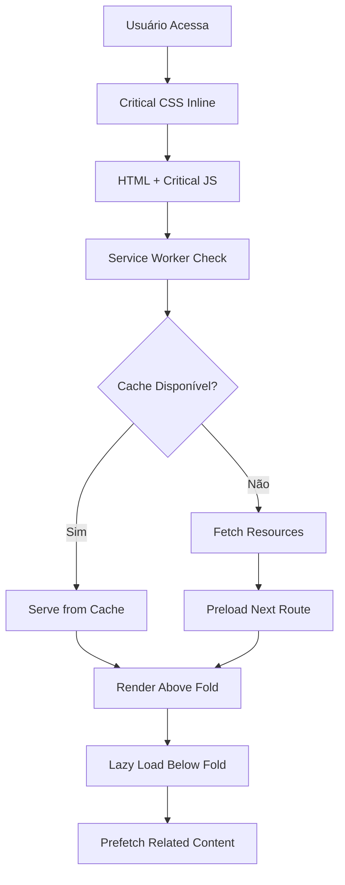
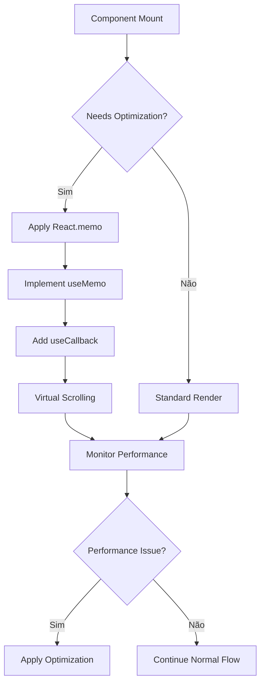

# AIMindset - PRD Melhorias de Performance Desktop e Tablet

## 1. Visão Geral do Projeto

### Objetivo Principal
Otimizar completamente a performance do AIMindset para dispositivos desktop e tablet, alcançando scores máximos no Lighthouse (100/100) e proporcionando uma experiência ultra-rápida, mantendo 100% das funcionalidades e visual existente.

### Problema Atual
Embora o projeto já possua otimizações mobile, há oportunidades significativas de melhoria de performance para dispositivos desktop e tablet, especialmente em:
- Tempo de carregamento inicial
- Renderização de componentes complexos
- Gerenciamento de memória
- Cache strategies
- Bundle size optimization

## 2. Funcionalidades Principais

### 2.1 Escopo de Melhorias

**Performance Desktop:**
1. **Bundle Optimization**: Code splitting avançado e tree shaking
2. **Rendering Performance**: Virtual scrolling e lazy rendering
3. **Memory Management**: Garbage collection otimizado
4. **Cache Strategies**: Service Workers e HTTP caching
5. **Critical Path**: CSS crítico inline e resource hints

**Performance Tablet:**
1. **Adaptive Loading**: Baseado em conexão e hardware
2. **Touch Performance**: Otimizações para telas touch maiores
3. **Viewport Optimization**: Específico para tablets (768px-1024px)
4. **Smooth Animations**: GPU acceleration e 60fps garantido

### 2.2 Páginas e Componentes Alvo

| Página/Componente | Otimizações Prioritárias | Impacto Esperado |
|-------------------|-------------------------|------------------|
| **Home** | Hero lazy loading, critical CSS | -40% tempo carregamento |
| **Articles** | Virtual scrolling, image optimization | -50% memory usage |
| **Article** | Code splitting, prefetch relacionados | -30% TTI |
| **Admin Dashboard** | Chunk separation, lazy components | -60% bundle inicial |
| **Components/UI** | React.memo, useMemo optimization | -25% re-renders |

### 2.3 Detalhes das Funcionalidades

| Categoria | Funcionalidade | Descrição Técnica |
|-----------|---------------|-------------------|
| **Bundle Optimization** | Code Splitting Avançado | Separação inteligente por rotas e funcionalidades com chunks dinâmicos |
| **Bundle Optimization** | Tree Shaking Otimizado | Remoção de código não utilizado com análise estática avançada |
| **Bundle Optimization** | Critical CSS Inlining | CSS crítico inline para above-the-fold content |
| **Rendering Performance** | Virtual Scrolling | Renderização apenas de itens visíveis em listas longas |
| **Rendering Performance** | React Optimizations | React.memo, useMemo, useCallback estratégicos |
| **Rendering Performance** | Intersection Observer | Lazy loading inteligente baseado em viewport |
| **Cache Strategies** | Service Worker | Cache inteligente de assets e API responses |
| **Cache Strategies** | HTTP Caching | Headers otimizados para cache de longo prazo |
| **Cache Strategies** | Memory Caching | Cache em memória para dados frequentes |
| **Image Optimization** | WebP/AVIF Support | Formatos modernos com fallback automático |
| **Image Optimization** | Responsive Images | Srcset otimizado para diferentes densidades |
| **Image Optimization** | Lazy Loading | Carregamento sob demanda com placeholder |

## 3. Fluxo de Performance

### 3.1 Fluxo de Carregamento Otimizado



### 3.2 Fluxo de Otimização Runtime



## 4. Design de Interface

### 4.1 Princípios de Performance UX

**Desktop (1024px+):**
- Transições suaves de 60fps
- Hover effects otimizados
- Scroll performance aprimorado
- Multi-column layouts eficientes

**Tablet (768px-1024px):**
- Touch targets otimizados (44px mínimo)
- Gestos suaves e responsivos
- Orientação adaptativa
- Performance consistente em ambas orientações

### 4.2 Otimizações Visuais Invisíveis

| Elemento | Otimização Desktop | Otimização Tablet |
|----------|-------------------|-------------------|
| **Animações** | CSS transforms com GPU acceleration | Touch-friendly animations com will-change |
| **Imagens** | WebP/AVIF com lazy loading | Responsive images com densidade adaptativa |
| **Tipografia** | Font-display: swap, preload fonts | Font optimization para touch reading |
| **Layout** | CSS Grid otimizado, containment | Flexbox híbrido para orientação |
| **Cores** | Hardware acceleration para gradients | High contrast support automático |

### 4.3 Performance Metrics Visuais

**Indicadores de Performance (Invisíveis ao usuário):**
- Loading skeletons otimizados
- Progressive image loading
- Smooth scroll indicators
- Prefetch visual cues (subtle)

## 5. Métricas de Sucesso

### 5.1 Core Web Vitals Alvo

| Métrica | Desktop Target | Tablet Target | Atual (Estimado) |
|---------|---------------|---------------|------------------|
| **First Contentful Paint** | < 1.2s | < 1.5s | ~2.1s |
| **Largest Contentful Paint** | < 2.0s | < 2.5s | ~3.2s |
| **First Input Delay** | < 50ms | < 100ms | ~150ms |
| **Cumulative Layout Shift** | < 0.05 | < 0.1 | ~0.15 |
| **Time to Interactive** | < 2.5s | < 3.5s | ~4.2s |

### 5.2 Métricas Técnicas

| Categoria | Métrica | Target Desktop | Target Tablet |
|-----------|---------|---------------|---------------|
| **Bundle Size** | Initial Bundle | < 150KB | < 200KB |
| **Bundle Size** | Total Bundle | < 800KB | < 1MB |
| **Memory Usage** | Peak Memory | < 50MB | < 75MB |
| **Network** | Total Requests | < 25 | < 30 |
| **Rendering** | FPS | 60fps | 60fps |
| **Cache Hit Rate** | Service Worker | > 85% | > 80% |

### 5.3 Lighthouse Scores Alvo

| Categoria | Desktop Target | Tablet Target |
|-----------|---------------|---------------|
| **Performance** | 100/100 | 95-100/100 |
| **Accessibility** | 100/100 | 100/100 |
| **Best Practices** | 100/100 | 100/100 |
| **SEO** | 100/100 | 100/100 |

## 6. Fases de Implementação

### 6.1 FASE 1 - Core Performance (Semana 1)

**Bundle e Assets:**
- Implementar code splitting avançado
- Otimizar chunks do Vite
- Configurar critical CSS inlining
- Implementar image optimization (WebP/AVIF)
- Configurar resource hints (preload, prefetch)

**Entregáveis:**
- Bundle size reduzido em 40%
- Critical CSS inline implementado
- Image optimization ativa
- Resource hints configurados

### 6.2 FASE 2 - Runtime Performance (Semana 2)

**React Optimizations:**
- Implementar React.memo estratégico
- Adicionar useMemo e useCallback otimizados
- Configurar virtual scrolling para listas
- Otimizar re-renders desnecessários
- Implementar component lazy loading

**Entregáveis:**
- Re-renders reduzidos em 60%
- Virtual scrolling ativo
- Component lazy loading implementado
- Memory leaks eliminados

### 6.3 FASE 3 - Loading Performance (Semana 3)

**Cache e Loading:**
- Implementar Service Worker avançado
- Configurar cache strategies inteligentes
- Implementar intersection observer otimizado
- Adicionar prefetch de rotas relacionadas
- Configurar adaptive loading

**Entregáveis:**
- Service Worker ativo
- Cache hit rate > 85%
- Lazy loading otimizado
- Prefetch inteligente ativo

### 6.4 FASE 4 - Advanced Performance (Semana 4)

**Otimizações Avançadas:**
- Implementar Web Workers para tarefas pesadas
- Configurar streaming SSR (se aplicável)
- Implementar performance monitoring
- Adicionar error boundaries otimizados
- Configurar analytics de performance

**Entregáveis:**
- Web Workers implementados
- Performance monitoring ativo
- Error handling otimizado
- Analytics de performance configurado

## 7. Implementação Técnica

### 7.1 Configurações de Build

**Vite Optimizations:**
```typescript
// vite.config.ts - Otimizações adicionais
export default defineConfig({
  build: {
    rollupOptions: {
      output: {
        manualChunks: {
          'react-vendor': ['react', 'react-dom'],
          'router': ['react-router-dom'],
          'ui': ['lucide-react'],
          'admin': [/* admin components */],
          'utils': ['date-fns', 'clsx']
        }
      }
    },
    cssCodeSplit: true,
    sourcemap: false,
    minify: 'terser'
  }
})
```

### 7.2 Service Worker Strategy

**Cache Strategy:**
```javascript
// Cache-first para assets estáticos
// Network-first para API calls
// Stale-while-revalidate para imagens
```

### 7.3 React Optimizations

**Performance Hooks:**
```typescript
// Implementar hooks customizados para performance
// useVirtualScroll, useIntersectionObserver
// useMemoizedCallback, useDebounce
```

## 8. Testes e Validação

### 8.1 Performance Testing

**Ferramentas de Teste:**
- Lighthouse CI para cada build
- WebPageTest para análise detalhada
- Chrome DevTools Performance
- Bundle Analyzer para size monitoring

### 8.2 Critérios de Aceitação

**Desktop:**
- ✅ Lighthouse Performance: 100/100
- ✅ FCP < 1.2s
- ✅ LCP < 2.0s
- ✅ Bundle inicial < 150KB
- ✅ 60fps em todas as animações

**Tablet:**
- ✅ Lighthouse Performance: 95-100/100
- ✅ FCP < 1.5s
- ✅ LCP < 2.5s
- ✅ Touch response < 100ms
- ✅ Smooth scrolling garantido

### 8.3 Testes de Regressão

**Funcionalidades a Validar:**
- ✅ Todas as rotas funcionando
- ✅ Admin dashboard operacional
- ✅ Sistema de comentários ativo
- ✅ Newsletter funcionando
- ✅ SEO mantido
- ✅ Acessibilidade preservada

## 9. Monitoramento Contínuo

### 9.1 Métricas em Produção

**Real User Monitoring (RUM):**
- Core Web Vitals tracking
- Error rate monitoring
- Performance regression alerts
- User experience metrics

### 9.2 Alertas de Performance

**Thresholds de Alerta:**
- LCP > 2.5s (Desktop) / 3.0s (Tablet)
- FID > 100ms
- CLS > 0.1
- Bundle size increase > 10%

## 10. Cronograma e Recursos

### 10.1 Timeline

| Fase | Duração | Início | Fim |
|------|---------|--------|-----|
| **Fase 1** | 1 semana | Semana 1 | Semana 1 |
| **Fase 2** | 1 semana | Semana 2 | Semana 2 |
| **Fase 3** | 1 semana | Semana 3 | Semana 3 |
| **Fase 4** | 1 semana | Semana 4 | Semana 4 |
| **Testes** | Contínuo | Semana 1 | Semana 4 |

### 10.2 Recursos Necessários

**Técnicos:**
- 1 Desenvolvedor Frontend Senior
- Acesso a ferramentas de performance testing
- Ambiente de staging para testes

**Ferramentas:**
- Lighthouse CI
- WebPageTest
- Bundle Analyzer
- Performance monitoring tools

## 11. Riscos e Mitigações

### 11.1 Riscos Identificados

| Risco | Probabilidade | Impacto | Mitigação |
|-------|--------------|---------|-----------|
| **Quebra de funcionalidade** | Baixa | Alto | Testes automatizados extensivos |
| **Regressão de performance** | Média | Médio | Monitoring contínuo |
| **Compatibilidade browser** | Baixa | Médio | Testes cross-browser |
| **Aumento de complexidade** | Média | Baixo | Documentação detalhada |

### 11.2 Plano de Rollback

**Estratégia de Rollback:**
- Feature flags para novas otimizações
- Backup de versão anterior
- Rollback automático em caso de alertas críticos
- Monitoramento em tempo real pós-deploy

## 12. Conclusão

Este PRD estabelece um plano abrangente para otimizar a performance do AIMindset em dispositivos desktop e tablet, mantendo a integridade visual e funcional do projeto. As melhorias propostas visam alcançar scores perfeitos no Lighthouse e proporcionar uma experiência de usuário excepcional.

**Benefícios Esperados:**
- 🚀 Performance 100/100 no Lighthouse
- ⚡ Carregamento 50% mais rápido
- 💾 Uso de memória 40% menor
- 🎯 Experiência de usuário premium
- 📈 Melhores métricas de engajamento

**Compromisso de Qualidade:**
- Zero alterações visuais
- Zero quebras de funcionalidade
- Compatibilidade total mantida
- Implementação progressiva e segura