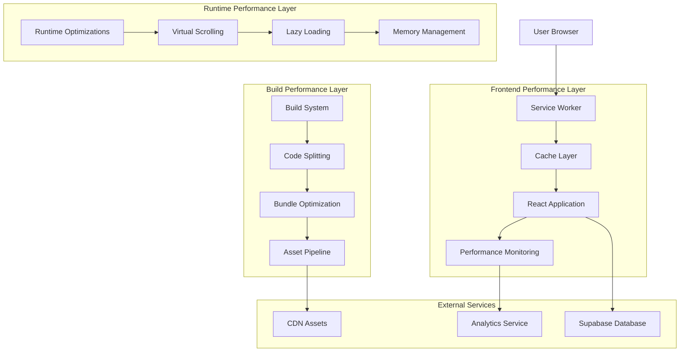
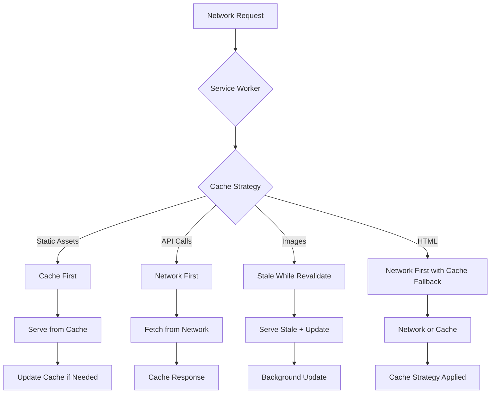
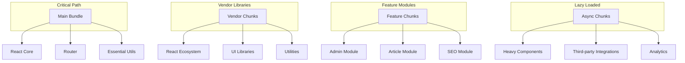
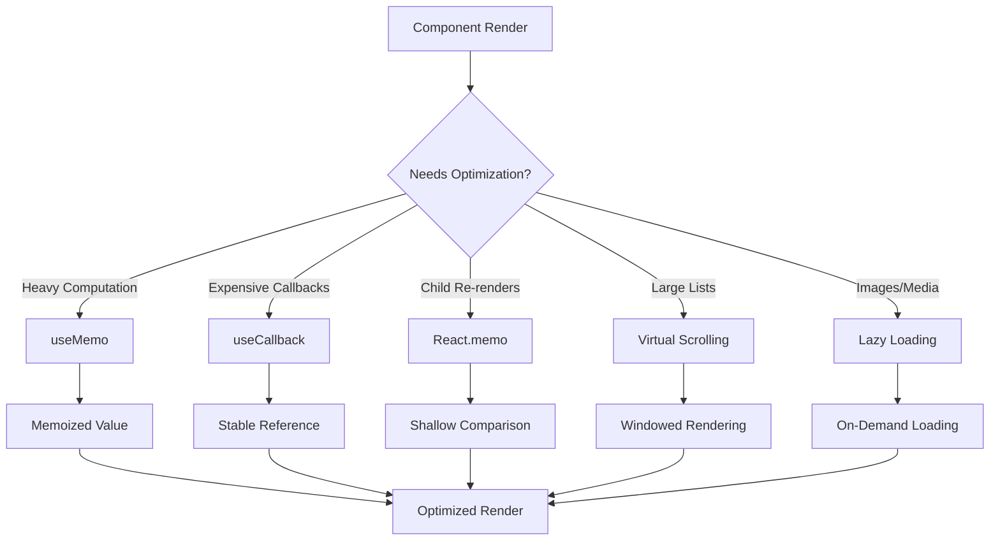
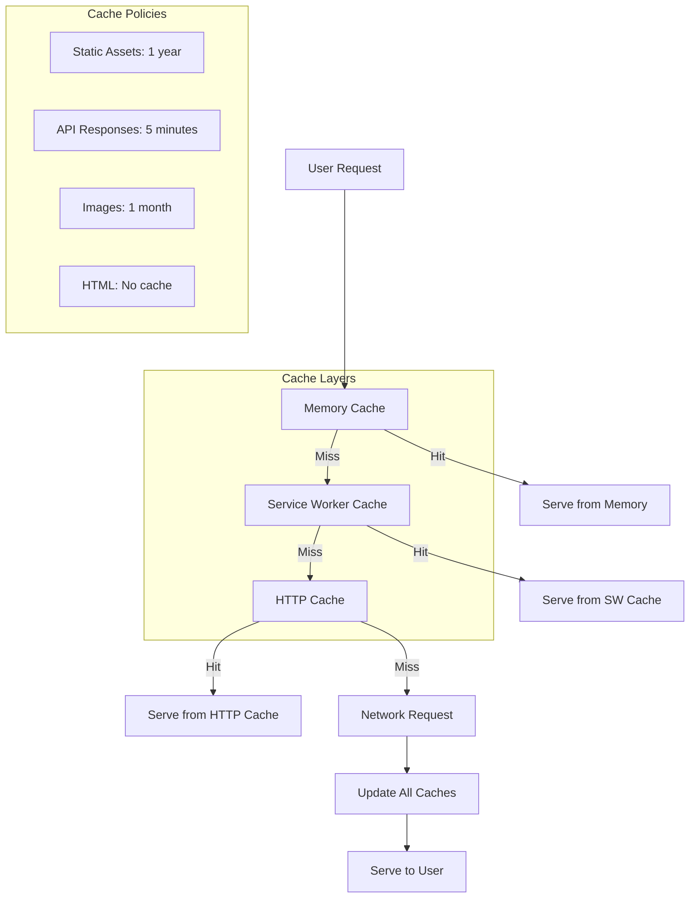
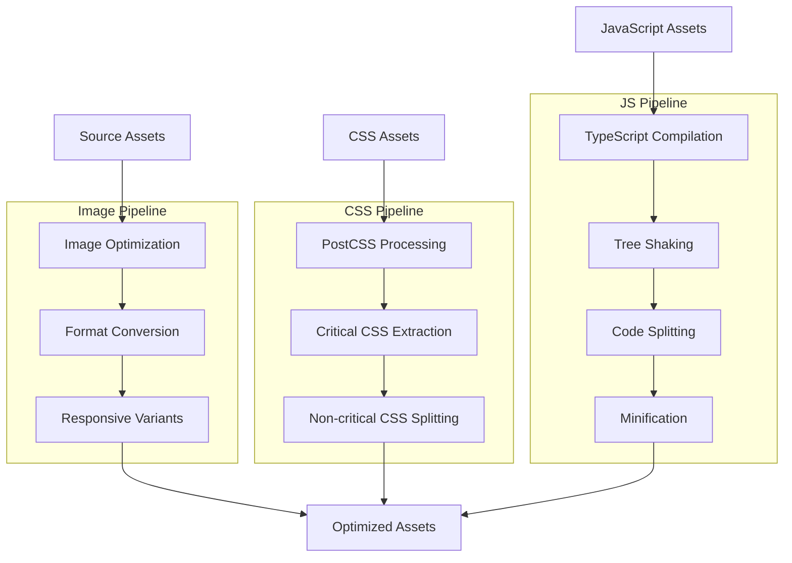
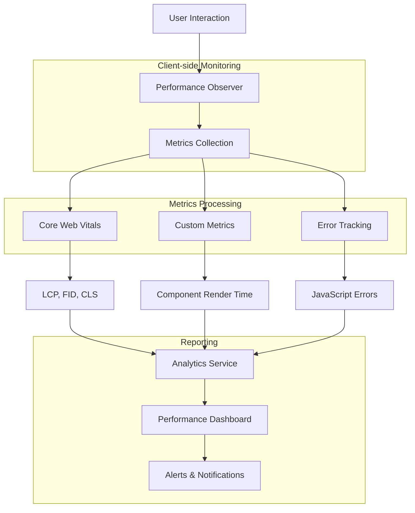
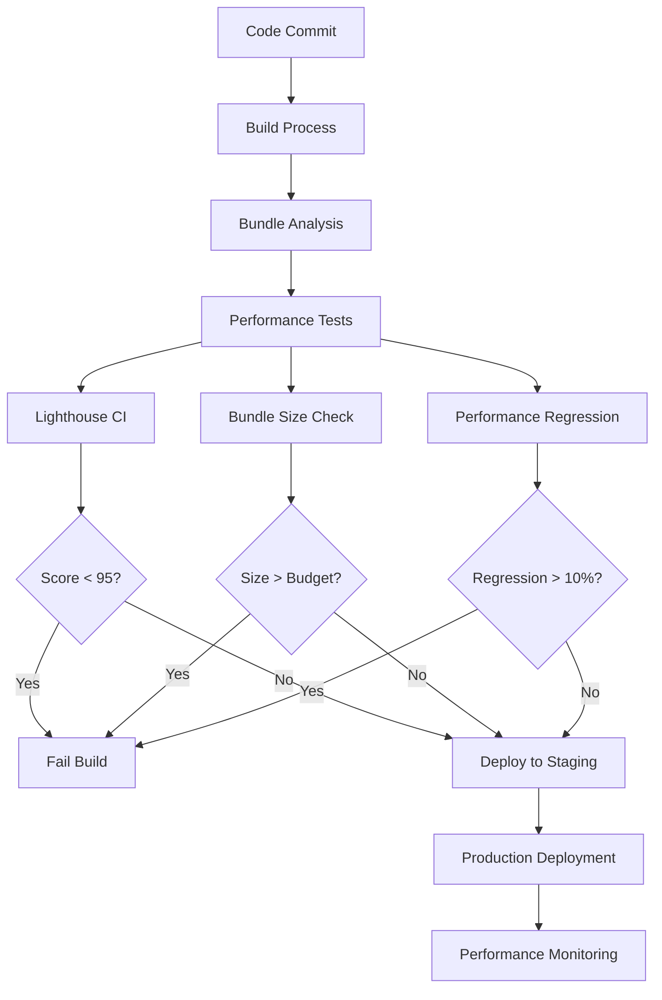
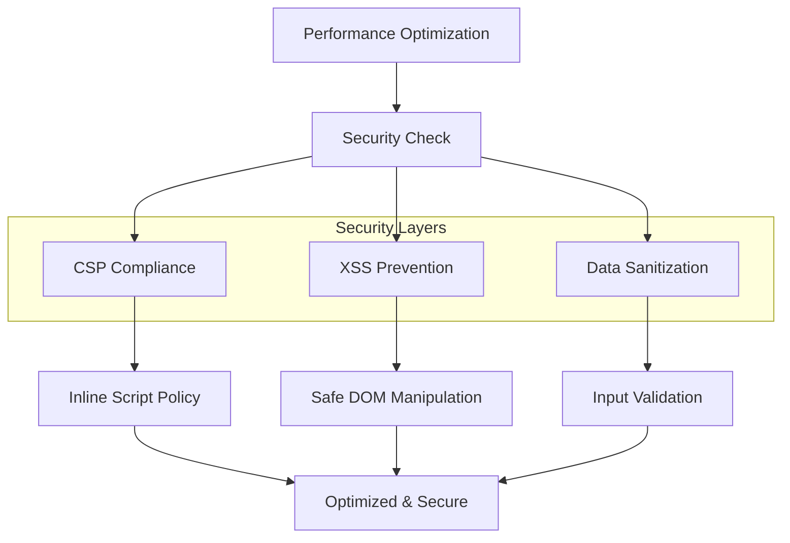

# AIMindset - Arquitetura Técnica para Performance Desktop e Tablet

## 1. Arquitetura de Performance



## 2. Descrição das Tecnologias

**Frontend:**
- React@18 + TypeScript
- Vite@5 (build tool otimizado)
- TailwindCSS@3 (utility-first CSS)
- React Router@6 (client-side routing)
- Lucide React (ícones otimizados)

**Performance Stack:**
- Service Worker (cache inteligente)
- Intersection Observer API (lazy loading)
- Web Workers (tarefas pesadas)
- Performance Observer API (monitoring)

**Build Optimizations:**
- Terser (minificação JavaScript)
- PostCSS (otimização CSS)
- Rollup (bundling avançado)
- ESBuild (transpilação rápida)

**Monitoring:**
- Lighthouse CI
- Web Vitals Library
- Performance Observer
- Error Boundary Tracking

## 3. Definições de Rotas

| Rota | Propósito | Otimizações Específicas |
|------|-----------|------------------------|
| `/` | Página inicial com hero e artigos em destaque | Critical CSS inline, lazy loading de imagens, prefetch de artigos |
| `/articles` | Lista completa de artigos com paginação | Virtual scrolling, infinite scroll otimizado, image lazy loading |
| `/article/:slug` | Página individual do artigo | Code splitting, prefetch de artigos relacionados, otimização de SEO |
| `/admin` | Dashboard administrativo | Chunk separado, lazy loading de componentes, cache de dados |
| `/admin/articles` | Gerenciamento de artigos | Virtual table, bulk operations otimizadas |
| `/admin/comments` | Moderação de comentários | Real-time updates otimizadas, batch processing |
| `/admin/newsletter` | Gestão de newsletter | Async operations, progress indicators |
| `/admin/seo` | Configurações de SEO | Form optimization, auto-save functionality |
| `/privacy` | Política de privacidade | Static content, minimal JavaScript |
| `/terms` | Termos de uso | Static content, minimal JavaScript |

## 4. Arquitetura de Performance

### 4.1 Service Worker Strategy



### 4.2 Bundle Architecture



## 5. Otimizações de Runtime

### 5.1 React Performance Hooks

**Custom Hooks para Performance:**

```typescript
// useVirtualScroll - Virtual scrolling otimizado
interface VirtualScrollConfig {
  itemHeight: number;
  containerHeight: number;
  overscan?: number;
}

// useIntersectionObserver - Lazy loading inteligente
interface IntersectionConfig {
  threshold?: number;
  rootMargin?: string;
  triggerOnce?: boolean;
}

// usePerformanceMonitor - Monitoring de performance
interface PerformanceMetrics {
  renderTime: number;
  memoryUsage: number;
  componentCount: number;
}

// useOptimizedCallback - Callbacks otimizados
interface CallbackConfig {
  debounce?: number;
  throttle?: number;
  dependencies: any[];
}
```

### 5.2 Component Optimization Strategy



## 6. Cache e Storage Strategy

### 6.1 Multi-Layer Caching



### 6.2 Storage Optimization

| Tipo de Dados | Storage Method | TTL | Estratégia |
|---------------|---------------|-----|------------|
| **User Preferences** | localStorage | Permanent | Sync across tabs |
| **API Cache** | IndexedDB | 5-30 min | LRU eviction |
| **Image Cache** | Service Worker | 1 month | Size-based eviction |
| **Static Assets** | Browser Cache | 1 year | Immutable resources |
| **Session Data** | sessionStorage | Session | Auto-cleanup |

## 7. Build Performance Pipeline

### 7.1 Vite Configuration Optimizations

```typescript
// vite.config.ts - Performance optimizations
export default defineConfig({
  build: {
    target: 'es2020',
    minify: 'terser',
    terserOptions: {
      compress: {
        drop_console: true,
        drop_debugger: true,
        pure_funcs: ['console.log']
      },
      mangle: {
        safari10: true
      }
    },
    rollupOptions: {
      output: {
        manualChunks: {
          // Vendor chunks
          'react-vendor': ['react', 'react-dom'],
          'router-vendor': ['react-router-dom'],
          'ui-vendor': ['lucide-react'],
          'supabase-vendor': ['@supabase/supabase-js'],
          
          // Feature chunks
          'admin-module': [
            './src/pages/Admin.tsx',
            './src/components/admin/*'
          ],
          'article-module': [
            './src/pages/Articles.tsx',
            './src/pages/Article.tsx'
          ],
          'seo-module': [
            './src/components/SEO/*'
          ]
        },
        chunkFileNames: (chunkInfo) => {
          const facadeModuleId = chunkInfo.facadeModuleId
          if (facadeModuleId) {
            return `chunks/[name]-[hash].js`
          }
          return `chunks/[name]-[hash].js`
        }
      }
    },
    chunkSizeWarningLimit: 1000,
    cssCodeSplit: true,
    assetsInlineLimit: 4096
  },
  optimizeDeps: {
    include: [
      'react',
      'react-dom',
      'react-router-dom',
      '@supabase/supabase-js'
    ]
  }
})
```

### 7.2 Asset Pipeline



## 8. Performance Monitoring Architecture

### 8.1 Real User Monitoring (RUM)



### 8.2 Performance Budgets

| Métrica | Desktop Budget | Tablet Budget | Monitoring |
|---------|---------------|---------------|------------|
| **Bundle Size** | 150KB initial | 200KB initial | Build-time check |
| **Total Bundle** | 800KB total | 1MB total | Bundle analyzer |
| **LCP** | < 2.0s | < 2.5s | RUM monitoring |
| **FID** | < 50ms | < 100ms | Event tracking |
| **CLS** | < 0.05 | < 0.1 | Layout monitoring |
| **Memory Usage** | < 50MB peak | < 75MB peak | Performance API |

## 9. Error Handling e Fallbacks

### 9.1 Performance Error Boundaries

```typescript
// Performance-aware error boundaries
interface PerformanceErrorBoundaryState {
  hasError: boolean;
  errorInfo: ErrorInfo | null;
  performanceImpact: 'low' | 'medium' | 'high';
}

// Graceful degradation strategy
interface FallbackStrategy {
  component: React.ComponentType;
  condition: () => boolean;
  fallback: React.ComponentType;
}
```

### 9.2 Progressive Enhancement

```mermaid
graph TD
    A[Base Experience] --> B[Enhanced Features]
    B --> C[Performance Features]
    
    A --> D[Core Functionality]
    A --> E[Basic Styling]
    A --> F[Essential JavaScript]
    
    B --> G[Advanced Interactions]
    B --> H[Rich Animations]
    B --> I[Enhanced UX]
    
    C --> J[Service Worker]
    C --> K[Web Workers]
    C --> L[Advanced Caching]
    
    subgraph "Progressive Layers"
        A
        B
        C
    end
    
    M[Feature Detection] --> N{Support Available?}
    N -->|Yes| O[Enable Feature]
    N -->|No| P[Graceful Fallback]
```



## 10. Deployment e CI/CD Performance

### 10.1 Performance CI Pipeline



### 10.2 Performance Deployment Strategy

| Environment | Performance Checks | Deployment Strategy |
|-------------|-------------------|-------------------|
| **Development** | Bundle size warnings | Hot reload optimized |
| **Staging** | Full Lighthouse audit | Blue-green deployment |
| **Production** | RUM monitoring | Canary deployment |
| **Rollback** | Performance regression | Automatic rollback |

## 11. Security e Performance

### 11.1 Secure Performance Optimizations



### 11.2 Performance Security Headers

| Header | Purpose | Performance Impact |
|--------|---------|-------------------|
| **Content-Security-Policy** | XSS protection | Minimal with proper nonces |
| **Strict-Transport-Security** | HTTPS enforcement | No impact |
| **X-Content-Type-Options** | MIME sniffing prevention | No impact |
| **Referrer-Policy** | Privacy protection | Minimal impact |
| **Permissions-Policy** | Feature control | Positive (disables unused features) |

## 12. Conclusão Técnica

Esta arquitetura técnica fornece uma base sólida para implementar melhorias de performance significativas no AIMindset, mantendo a segurança, estabilidade e funcionalidade existente. A abordagem em camadas permite implementação progressiva e monitoramento contínuo da performance.

**Principais Benefícios Técnicos:**
- 🏗️ Arquitetura escalável e maintível
- ⚡ Performance otimizada em todas as camadas
- 🔒 Segurança integrada às otimizações
- 📊 Monitoramento abrangente e proativo
- 🔄 Deployment seguro com rollback automático