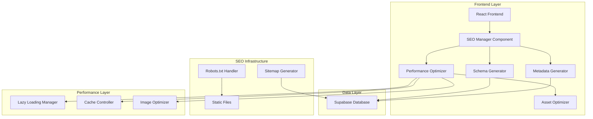
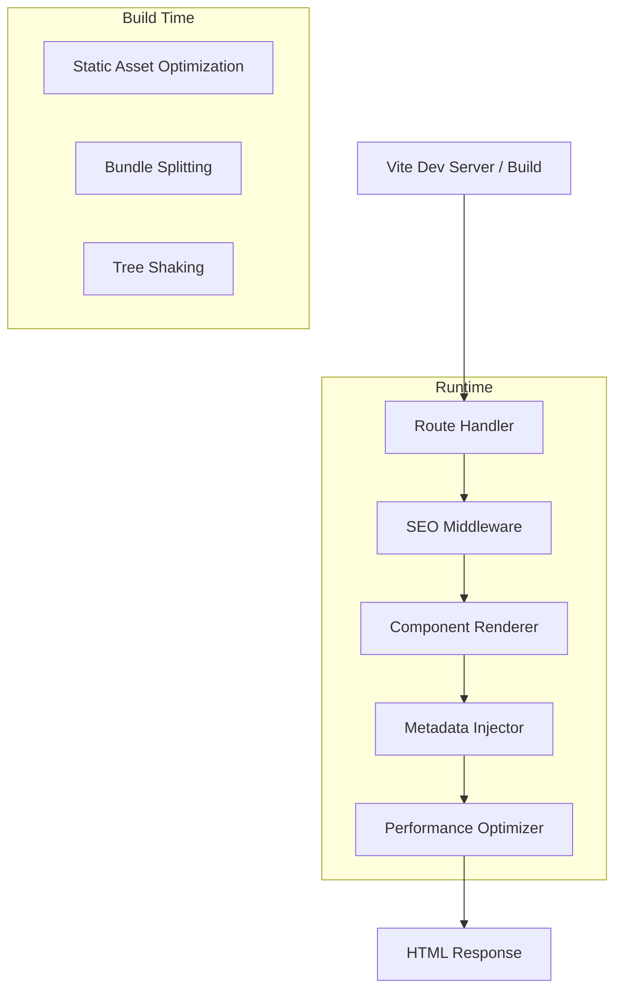
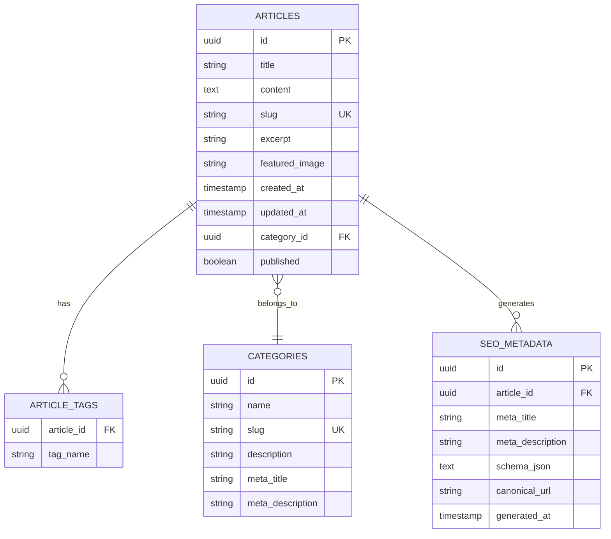

# 🏗️ AIMindset - Arquitetura Técnica para Otimização SEO e Performance

## 1. Arquitetura do Sistema



## 2. Descrição das Tecnologias

- **Frontend**: React@18 + TypeScript + Vite + TailwindCSS
- **Backend**: Supabase (PostgreSQL + Auth + Storage)
- **SEO**: React Helmet Async + Schema.org JSON-LD
- **Performance**: Vite Bundle Analyzer + React.lazy + Intersection Observer API
- **Build**: Vite com otimizações de produção + Rollup plugins

## 3. Definições de Rotas

| Rota | Propósito | Otimizações SEO |
|------|-----------|-----------------|
| / | Página inicial com hero e artigos em destaque | Schema Organization, metadados dinâmicos |
| /artigos | Lista completa de artigos | Schema CollectionPage, paginação SEO |
| /artigos/:slug | Página individual do artigo | Schema BlogPosting, metadados dinâmicos |
| /categorias | Lista de categorias | Schema CollectionPage, navegação estruturada |
| /categorias/:slug | Artigos por categoria | Schema CollectionPage, filtros SEO |
| /sobre | Página institucional | Schema AboutPage, metadados estáticos |
| /contato | Página de contato | Schema ContactPage, formulário otimizado |
| /newsletter | Página de newsletter | Schema WebPage, formulário otimizado |
| /admin/* | Painel administrativo | Metadados básicos, noindex |
| /sitemap.xml | Sitemap dinâmico | XML estruturado com todos os artigos |
| /robots.txt | Arquivo robots | Configuração de indexação |

## 4. Definições de API

### 4.1 APIs Core do SEO

**Busca de Metadados de Artigo**
```typescript
// Hook personalizado para metadados
const useArticleSEO = (slug: string) => {
  // Busca dados do artigo no Supabase
  // Gera metadados dinâmicos
  // Retorna dados estruturados para SEO
}
```

**Geração de Sitemap**
```typescript
// Endpoint virtual para sitemap.xml
GET /sitemap.xml
```

Resposta:
```xml
<?xml version="1.0" encoding="UTF-8"?>
<urlset xmlns="http://www.sitemaps.org/schemas/sitemap/0.9">
  <url>
    <loc>https://aimindset.com.br/</loc>
    <lastmod>2024-01-01</lastmod>
    <priority>1.0</priority>
  </url>
  <!-- URLs dinâmicas dos artigos -->
</urlset>
```

### 4.2 APIs de Performance

**Otimização de Imagens**
```typescript
// Componente de imagem otimizada
interface OptimizedImageProps {
  src: string;
  alt: string;
  lazy?: boolean;
  webp?: boolean;
}
```

**Cache de Metadados**
```typescript
// Sistema de cache para metadados
interface MetadataCache {
  key: string;
  data: SEOMetadata;
  timestamp: number;
  ttl: number;
}
```

## 5. Arquitetura do Servidor



## 6. Modelo de Dados

### 6.1 Definição do Modelo de Dados



### 6.2 Linguagem de Definição de Dados

**Tabela de Metadados SEO (Extensão)**
```sql
-- Criar tabela para cache de metadados SEO
CREATE TABLE IF NOT EXISTS seo_metadata (
    id UUID PRIMARY KEY DEFAULT gen_random_uuid(),
    article_id UUID REFERENCES articles(id) ON DELETE CASCADE,
    meta_title VARCHAR(60) NOT NULL,
    meta_description VARCHAR(160) NOT NULL,
    schema_json JSONB NOT NULL,
    canonical_url VARCHAR(255) NOT NULL,
    og_image VARCHAR(255),
    keywords TEXT[],
    generated_at TIMESTAMP WITH TIME ZONE DEFAULT NOW(),
    updated_at TIMESTAMP WITH TIME ZONE DEFAULT NOW()
);

-- Índices para performance
CREATE INDEX idx_seo_metadata_article_id ON seo_metadata(article_id);
CREATE INDEX idx_seo_metadata_canonical ON seo_metadata(canonical_url);

-- Função para auto-gerar metadados
CREATE OR REPLACE FUNCTION generate_article_seo_metadata()
RETURNS TRIGGER AS $$
BEGIN
    -- Auto-gerar metadados quando artigo é criado/atualizado
    INSERT INTO seo_metadata (
        article_id,
        meta_title,
        meta_description,
        schema_json,
        canonical_url,
        og_image,
        keywords
    ) VALUES (
        NEW.id,
        COALESCE(NEW.title, 'AIMindset'),
        COALESCE(NEW.excerpt, LEFT(NEW.content, 160)),
        jsonb_build_object(
            '@context', 'https://schema.org',
            '@type', 'BlogPosting',
            'headline', NEW.title,
            'description', NEW.excerpt,
            'author', 'AIMindset',
            'datePublished', NEW.created_at
        ),
        'https://aimindset.com.br/artigos/' || NEW.slug,
        NEW.featured_image,
        ARRAY(SELECT unnest(string_to_array(NEW.tags, ',')))
    )
    ON CONFLICT (article_id) DO UPDATE SET
        meta_title = EXCLUDED.meta_title,
        meta_description = EXCLUDED.meta_description,
        schema_json = EXCLUDED.schema_json,
        canonical_url = EXCLUDED.canonical_url,
        og_image = EXCLUDED.og_image,
        keywords = EXCLUDED.keywords,
        updated_at = NOW();
    
    RETURN NEW;
END;
$$ LANGUAGE plpgsql;

-- Trigger para auto-geração
CREATE TRIGGER trigger_generate_seo_metadata
    AFTER INSERT OR UPDATE ON articles
    FOR EACH ROW
    EXECUTE FUNCTION generate_article_seo_metadata();

-- Políticas RLS para metadados SEO
ALTER TABLE seo_metadata ENABLE ROW LEVEL SECURITY;

-- Permitir leitura pública dos metadados
CREATE POLICY "Allow public read access to seo_metadata" ON seo_metadata
    FOR SELECT USING (true);

-- Permitir escrita apenas para usuários autenticados
CREATE POLICY "Allow authenticated write access to seo_metadata" ON seo_metadata
    FOR ALL USING (auth.role() = 'authenticated');

-- Dados iniciais para páginas estáticas
INSERT INTO seo_metadata (
    article_id,
    meta_title,
    meta_description,
    schema_json,
    canonical_url
) VALUES 
(
    NULL, -- Para páginas estáticas
    'AIMindset - Inteligência Artificial e Produtividade',
    'Descubra como a IA pode transformar sua produtividade. Artigos, dicas e insights sobre inteligência artificial aplicada ao dia a dia.',
    '{"@context": "https://schema.org", "@type": "Organization", "name": "AIMindset", "url": "https://aimindset.com.br"}',
    'https://aimindset.com.br/'
);
```

## 7. Estrutura de Componentes SEO

### 7.1 Componente SEO Manager
```typescript
// src/components/SEO/SEOManager.tsx
interface SEOManagerProps {
  title?: string;
  description?: string;
  keywords?: string[];
  image?: string;
  url?: string;
  type?: 'website' | 'article';
  article?: Article;
  schema?: object;
}
```

### 7.2 Hooks Personalizados
```typescript
// src/hooks/useSEO.ts - Hook principal para SEO
// src/hooks/useSchema.ts - Hook para Schema.org
// src/hooks/useSitemap.ts - Hook para geração de sitemap
// src/hooks/usePerformance.ts - Hook para otimizações de performance
```

### 7.3 Utilitários SEO
```typescript
// src/utils/seo.ts - Funções utilitárias para SEO
// src/utils/schema.ts - Geradores de Schema.org
// src/utils/performance.ts - Otimizações de performance
// src/utils/metadata.ts - Processamento de metadados
```