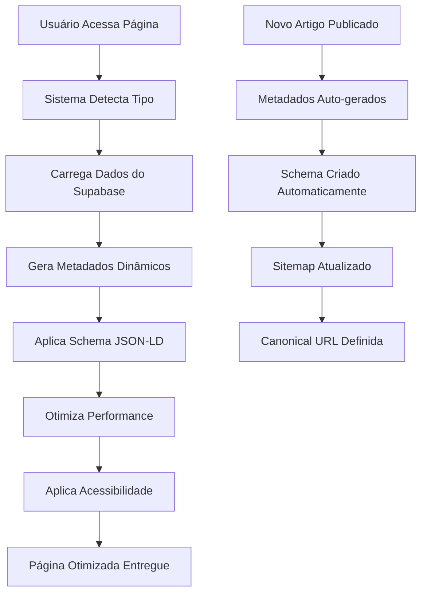

# 🚀 AIMindset - Otimização SEO e Performance Completa (PRD)

## 1. Visão Geral do Produto

O AIMindset implementará uma otimização completa de SEO técnico, performance e acessibilidade para atingir pontuação 99+ no Google Lighthouse em todas as métricas (SEO, Performance, Best Practices e Acessibilidade). As melhorias serão aplicadas de forma global e automática a todas as páginas e artigos, sem alterar o design ou comportamento visual existente.

- **Objetivo Principal**: Maximizar a visibilidade nos motores de busca e otimizar a experiência do usuário através de performance superior
- **Público-Alvo**: Usuários finais que acessam o blog, motores de busca para indexação, e administradores que publicam conteúdo
- **Valor de Mercado**: Posicionamento superior no Google, maior tráfego orgânico, melhor experiência do usuário e credibilidade técnica

## 2. Funcionalidades Principais

### 2.1 Papéis de Usuário
Não aplicável - as otimizações são transparentes para todos os usuários.

### 2.2 Módulos de Funcionalidade

As otimizações serão implementadas em todas as páginas existentes:

1. **Página Inicial**: otimização de metadados, schema organizacional, performance de carregamento
2. **Páginas de Artigos**: metadados dinâmicos, schema BlogPosting, otimização de conteúdo
3. **Páginas de Categorias**: metadados de categoria, listagem otimizada, navegação semântica
4. **Página Sobre**: metadados institucionais, schema AboutPage, otimização de conteúdo estático
5. **Página de Contato**: metadados de contato, schema ContactPage, otimização de formulários
6. **Newsletter**: metadados de newsletter, otimização de formulário de inscrição
7. **Painel Admin**: metadados básicos sem indexação, otimização de performance interna

### 2.3 Detalhes das Páginas

| Nome da Página | Módulo | Descrição da Funcionalidade |
|----------------|--------|------------------------------|
| Página Inicial | SEO Dinâmico | Gerar metadados automáticos, schema Organization, canonical URL, otimização de imagens hero |
| Página Inicial | Performance | Lazy loading de componentes, preload de assets críticos, otimização de Core Web Vitals |
| Artigos | SEO Dinâmico | Metadados baseados no conteúdo do Supabase, schema BlogPosting, canonical URLs com slug |
| Artigos | Schema Estruturado | JSON-LD com dados do artigo, autor, data de publicação, imagem de capa |
| Artigos | Performance | Lazy loading de imagens, otimização de texto longo, cache inteligente |
| Categorias | SEO Dinâmico | Metadados de categoria, schema CollectionPage, listagem otimizada |
| Categorias | Performance | Paginação otimizada, lazy loading de cards de artigos |
| Sobre | SEO Estático | Metadados institucionais, schema AboutPage, otimização de conteúdo |
| Contato | SEO Estático | Metadados de contato, schema ContactPage, otimização de formulário |
| Newsletter | SEO Dinâmico | Metadados de newsletter, otimização de formulário de inscrição |
| Admin | SEO Básico | Metadados básicos com noindex, otimização de performance interna |
| Sitemap | SEO Automático | Geração dinâmica de sitemap.xml com todos os artigos e páginas |
| Robots | SEO Estático | Arquivo robots.txt otimizado para indexação |

## 3. Fluxo Principal de Otimização

O sistema implementará otimizações automáticas em três camadas principais:

**Fluxo de SEO Automático:**
1. Usuário acessa qualquer página → Sistema detecta tipo de página → Carrega metadados dinâmicos do Supabase → Gera schema JSON-LD apropriado → Aplica canonical URL → Página otimizada é renderizada

**Fluxo de Performance:**
1. Página inicia carregamento → Preload de assets críticos → Lazy loading de componentes não críticos → Otimização de imagens → Cache inteligente aplicado → Página carregada com performance máxima

**Fluxo de Acessibilidade:**
1. Componente renderiza → ARIA labels automáticos aplicados → Hierarquia semântica verificada → Alt text dinâmico em imagens → Navegação por teclado otimizada → Página acessível entregue

## 4. Design de Interface do Usuário

### 4.1 Estilo de Design
**IMPORTANTE**: Nenhuma alteração visual será feita. Todas as otimizações são técnicas e invisíveis ao usuário:

- **Cores**: Mantém paleta existente
- **Botões**: Mantém estilo atual, apenas adiciona ARIA labels
- **Fontes**: Mantém tipografia atual, adiciona preload para performance
- **Layout**: Mantém estrutura atual, otimiza hierarquia semântica
- **Ícones**: Mantém ícones atuais, adiciona alt text automático

### 4.2 Visão Geral do Design das Páginas

| Nome da Página | Módulo | Elementos de UI |
|----------------|--------|-----------------|
| Todas as Páginas | SEO Head | Metadados invisíveis no `<head>`, schema JSON-LD, canonical links |
| Todas as Páginas | Performance | Lazy loading invisível, preload de assets, otimização de imagens |
| Todas as Páginas | Acessibilidade | ARIA labels automáticos, hierarquia semântica, alt text dinâmico |
| Artigos | Schema Estruturado | JSON-LD invisível com dados do artigo, breadcrumbs semânticos |
| Categorias | Navegação | Breadcrumbs otimizados, paginação semântica |
| Sitemap | SEO Técnico | XML estruturado invisível para motores de busca |

### 4.3 Responsividade
O sistema manterá a responsividade existente e adicionará otimizações específicas:
- **Desktop**: Preload otimizado de assets, lazy loading inteligente
- **Mobile**: Otimização adicional de Core Web Vitals, compressão de imagens
- **Tablet**: Balanceamento entre desktop e mobile para performance ideal