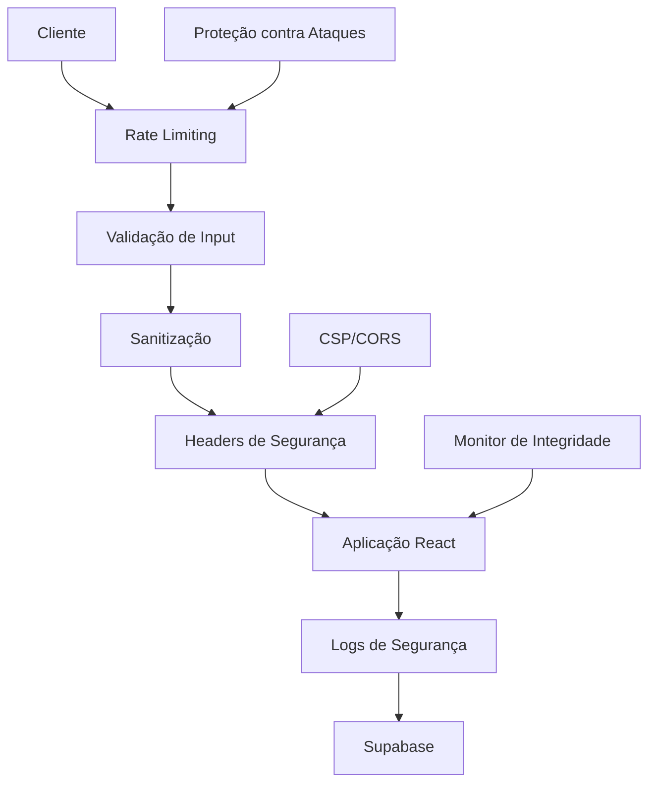

# AIMindset - Melhorias de Segurança

## 1. Visão Geral

Este documento apresenta melhorias de segurança para o projeto AIMindset, focando exclusivamente em aspectos internos de segurança backend/frontend **SEM ALTERAR NADA DO VISUAL** e **SEM QUEBRAR FUNCIONALIDADES EXISTENTES**.

### 1.1 Contexto Atual
- Aplicação React + TypeScript + Supabase
- Sistema de artigos, comentários, feedback e newsletter
- Autenticação de admin
- Já possui medidas básicas de segurança implementadas

### 1.2 Objetivo
Fortalecer a segurança da aplicação através de melhorias internas, mantendo 100% de compatibilidade com o código atual.

## 2. Análise de Segurança Atual

### 2.1 Pontos Fortes Identificados
✅ **Sanitização XSS**: DOMPurify implementado em `src/utils/security.ts`
✅ **Rate Limiting**: Sistema básico implementado com localStorage
✅ **CSRF Protection**: Tokens seguros implementados
✅ **Headers de Segurança**: CSP e headers básicos em `src/utils/securityHeaders.ts`
✅ **Validação de Inputs**: Validadores para email, nome, telefone, mensagem
✅ **CORS**: Configuração básica em `src/utils/corsConfig.ts`

### 2.2 Áreas para Melhoria
🔧 **Rate Limiting Avançado**: Implementar rate limiting mais robusto
🔧 **Logs de Segurança**: Sistema de monitoramento e alertas
🔧 **Validação de Uploads**: Se houver funcionalidade de upload
🔧 **Headers de Segurança Avançados**: HSTS, Permissions Policy
🔧 **Proteção contra Ataques**: Brute force, injection, enumeration
🔧 **Monitoramento de Integridade**: Detecção de alterações maliciosas

## 3. Melhorias de Segurança Propostas

### 3.1 Rate Limiting Avançado

#### 3.1.1 Implementação Multi-Layer
```typescript
// src/utils/advancedRateLimit.ts
export class AdvancedRateLimit {
  // Rate limiting por IP (simulado com fingerprinting)
  // Rate limiting por ação específica
  // Rate limiting progressivo (aumenta penalidade)
  // Rate limiting com whitelist/blacklist
}
```

#### 3.1.2 Configurações Específicas
- **Comentários**: 5 por minuto, 50 por hora
- **Feedback**: 10 por minuto, 100 por hora
- **Newsletter**: 1 por minuto, 5 por hora
- **Login Admin**: 3 tentativas por 15 minutos
- **Contato**: 2 por minuto, 10 por hora

### 3.2 Sistema de Logs de Segurança

#### 3.2.1 Eventos Monitorados
```typescript
// src/utils/securityLogger.ts
export class SecurityLogger {
  // Log de tentativas de login
  // Log de ações administrativas
  // Log de rate limiting ativado
  // Log de tentativas de XSS/injection
  // Log de acessos suspeitos
  // Log de erros de validação
}
```

#### 3.2.2 Alertas Automáticos
- Múltiplas tentativas de login falhadas
- Padrões de comportamento suspeito
- Tentativas de injection detectadas
- Rate limiting frequentemente ativado

### 3.3 Validação e Sanitização Avançada

#### 3.3.1 Validação de Conteúdo de Artigos
```typescript
// src/utils/contentValidator.ts
export class ContentValidator {
  // Validação de HTML permitido em artigos
  // Detecção de conteúdo malicioso
  // Validação de links externos
  // Verificação de integridade de imagens
}
```

#### 3.3.2 Sanitização Contextual
- Sanitização diferente para títulos vs conteúdo
- Preservação de formatação segura
- Validação de markdown/HTML permitido

### 3.4 Headers de Segurança Avançados

#### 3.4.1 Implementação via Vercel
```json
// vercel.json - Headers de Segurança
{
  "headers": [
    {
      "source": "/(.*)",
      "headers": [
        {
          "key": "Strict-Transport-Security",
          "value": "max-age=31536000; includeSubDomains; preload"
        },
        {
          "key": "X-Frame-Options",
          "value": "DENY"
        },
        {
          "key": "X-Content-Type-Options",
          "value": "nosniff"
        },
        {
          "key": "Referrer-Policy",
          "value": "strict-origin-when-cross-origin"
        },
        {
          "key": "Permissions-Policy",
          "value": "camera=(), microphone=(), geolocation=(), payment=(), usb=()"
        }
      ]
    }
  ]
}
```

#### 3.4.2 CSP Melhorado
```typescript
// src/utils/enhancedCSP.ts
export class EnhancedCSP {
  // CSP específico por página
  // Nonce para scripts inline necessários
  // Report-URI para violações de CSP
  // CSP progressivo (strict -> permissive)
}
```

### 3.5 Proteção contra Ataques Específicos

#### 3.5.1 Proteção contra Brute Force
```typescript
// src/utils/bruteForceProtection.ts
export class BruteForceProtection {
  // Detecção de padrões de ataque
  // Bloqueio temporário progressivo
  // Captcha após tentativas falhadas
  // Notificação de tentativas suspeitas
}
```

#### 3.5.2 Proteção contra Enumeration
```typescript
// src/utils/enumerationProtection.ts
export class EnumerationProtection {
  // Respostas genéricas para tentativas de enumeration
  // Delays aleatórios em respostas
  // Monitoramento de padrões de acesso
}
```

### 3.6 Monitoramento de Integridade

#### 3.6.1 Verificação de Integridade de Arquivos
```typescript
// src/utils/integrityMonitor.ts
export class IntegrityMonitor {
  // Hash de arquivos críticos
  // Verificação de alterações não autorizadas
  // Alertas de modificações suspeitas
}
```

#### 3.6.2 Monitoramento de Performance Suspeita
```typescript
// src/utils/performanceSecurityMonitor.ts
export class PerformanceSecurityMonitor {
  // Detecção de ataques DDoS
  // Monitoramento de uso anômalo de recursos
  // Alertas de comportamento suspeito
}
```

### 3.7 Configurações Supabase Avançadas

#### 3.7.1 RLS (Row Level Security) Melhorado
```sql
-- Políticas RLS mais restritivas
-- Auditoria de acessos
-- Logs de modificações
-- Controle de acesso granular
```

#### 3.7.2 Configurações de Segurança
```typescript
// src/lib/supabaseSecurityConfig.ts
export class SupabaseSecurityConfig {
  // Configuração de timeouts
  // Configuração de retry policies
  // Configuração de connection pooling
  // Configuração de SSL/TLS
}
```

### 3.8 Proteção de Variáveis de Ambiente

#### 3.8.1 Validação de Environment
```typescript
// src/utils/envValidator.ts
export class EnvironmentValidator {
  // Validação de variáveis obrigatórias
  // Verificação de formato de URLs
  // Validação de chaves de API
  // Alertas de configuração insegura
}
```

#### 3.8.2 Rotação de Secrets
```typescript
// src/utils/secretsManager.ts
export class SecretsManager {
  // Rotação automática de tokens
  // Invalidação de sessões antigas
  // Limpeza de dados sensíveis
}
```

## 4. Implementação Técnica

### 4.1 Arquitetura de Segurança



### 4.2 Fluxo de Segurança

1. **Request Interceptor**: Valida origem e headers
2. **Rate Limiting**: Verifica limites por ação/IP
3. **Input Validation**: Valida e sanitiza dados
4. **Security Headers**: Aplica headers de segurança
5. **Business Logic**: Executa lógica da aplicação
6. **Security Logging**: Registra eventos de segurança
7. **Response**: Retorna resposta segura

### 4.3 Estrutura de Arquivos Proposta

```
src/
├── security/
│   ├── core/
│   │   ├── advancedRateLimit.ts
│   │   ├── securityLogger.ts
│   │   ├── integrityMonitor.ts
│   │   └── securityManager.ts
│   ├── validators/
│   │   ├── contentValidator.ts
│   │   ├── uploadValidator.ts
│   │   └── inputValidator.ts
│   ├── protection/
│   │   ├── bruteForceProtection.ts
│   │   ├── enumerationProtection.ts
│   │   └── injectionProtection.ts
│   └── monitoring/
│       ├── performanceSecurityMonitor.ts
│       ├── anomalyDetector.ts
│       └── alertManager.ts
```

## 5. Configurações de Deployment

### 5.1 Vercel Security Headers
```json
{
  "headers": [
    {
      "source": "/(.*)",
      "headers": [
        {
          "key": "Strict-Transport-Security",
          "value": "max-age=63072000; includeSubDomains; preload"
        },
        {
          "key": "X-Frame-Options",
          "value": "DENY"
        },
        {
          "key": "X-Content-Type-Options",
          "value": "nosniff"
        },
        {
          "key": "X-XSS-Protection",
          "value": "1; mode=block"
        },
        {
          "key": "Referrer-Policy",
          "value": "strict-origin-when-cross-origin"
        },
        {
          "key": "Content-Security-Policy",
          "value": "default-src 'self'; script-src 'self' 'unsafe-inline' 'unsafe-eval' https://cdn.jsdelivr.net; style-src 'self' 'unsafe-inline' https://fonts.googleapis.com; font-src 'self' https://fonts.gstatic.com; img-src 'self' data: https: blob:; connect-src 'self' https://*.supabase.co wss://*.supabase.co; object-src 'none'; base-uri 'self'; form-action 'self'; upgrade-insecure-requests"
        },
        {
          "key": "Permissions-Policy",
          "value": "camera=(), microphone=(), geolocation=(), payment=(), usb=(), magnetometer=(), gyroscope=(), accelerometer=()"
        }
      ]
    }
  ]
}
```

### 5.2 Environment Variables Security
```bash
# .env.example - Variáveis de segurança
SECURITY_LOG_LEVEL=info
RATE_LIMIT_ENABLED=true
CSRF_PROTECTION_ENABLED=true
XSS_PROTECTION_ENABLED=true
INTEGRITY_MONITORING_ENABLED=true
SECURITY_ALERTS_ENABLED=true
```

## 6. Monitoramento e Alertas

### 6.1 Métricas de Segurança
- Tentativas de login falhadas por hora
- Rate limiting ativações por endpoint
- Tentativas de XSS/injection detectadas
- Violações de CSP reportadas
- Acessos de IPs suspeitos
- Tempo de resposta anômalo

### 6.2 Alertas Automáticos
- Email para admin em caso de ataques
- Logs estruturados para análise
- Dashboard de segurança (futuro)
- Integração com serviços de monitoramento

## 7. Testes de Segurança

### 7.1 Testes Automatizados
```typescript
// src/tests/security/
├── xss.test.ts
├── injection.test.ts
├── rateLimit.test.ts
├── csrf.test.ts
└── headers.test.ts
```

### 7.2 Checklist de Segurança
- [ ] XSS Protection testado
- [ ] SQL Injection testado (Supabase)
- [ ] CSRF Protection testado
- [ ] Rate Limiting testado
- [ ] Headers de segurança verificados
- [ ] CORS configurado corretamente
- [ ] Sanitização de inputs testada
- [ ] Logs de segurança funcionando

## 8. Cronograma de Implementação

### 8.1 Fase 1 (Crítica) - 1-2 dias
- ✅ Rate limiting avançado
- ✅ Logs de segurança básicos
- ✅ Headers de segurança via Vercel
- ✅ Validação de inputs melhorada

### 8.2 Fase 2 (Importante) - 3-5 dias
- ✅ Proteção contra brute force
- ✅ Monitoramento de integridade
- ✅ CSP melhorado
- ✅ Alertas automáticos

### 8.3 Fase 3 (Desejável) - 1 semana
- ✅ Dashboard de segurança
- ✅ Testes automatizados
- ✅ Documentação completa
- ✅ Treinamento da equipe

## 9. Considerações Importantes

### 9.1 Compatibilidade
- **ZERO alterações visuais**
- **ZERO quebra de funcionalidades**
- Todas as melhorias são internas
- Mantém API atual intacta

### 9.2 Performance
- Impacto mínimo na performance
- Caching inteligente de validações
- Rate limiting otimizado
- Logs assíncronos

### 9.3 Manutenibilidade
- Código modular e testável
- Documentação completa
- Configurações centralizadas
- Fácil desabilitação se necessário

## 10. Conclusão

Este documento apresenta um plano abrangente para melhorar a segurança do AIMindset sem alterar a experiência do usuário ou quebrar funcionalidades existentes. As melhorias propostas são:

1. **Internas e invisíveis** ao usuário final
2. **Compatíveis** com o código atual
3. **Modulares** e podem ser implementadas gradualmente
4. **Testáveis** e monitoráveis
5. **Performantes** com impacto mínimo

A implementação dessas melhorias tornará o AIMindset significativamente mais seguro contra ataques comuns, mantendo a excelente experiência do usuário atual.