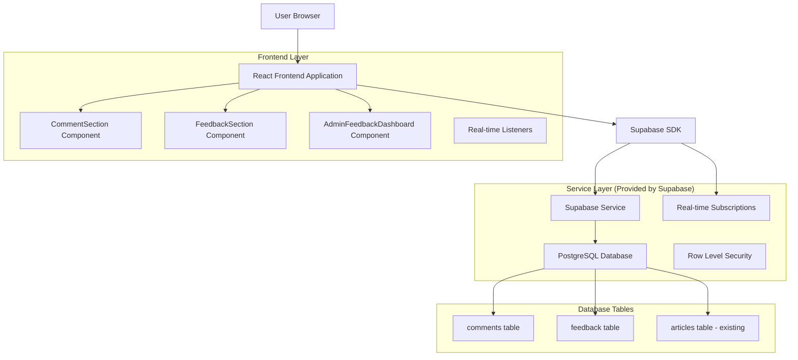
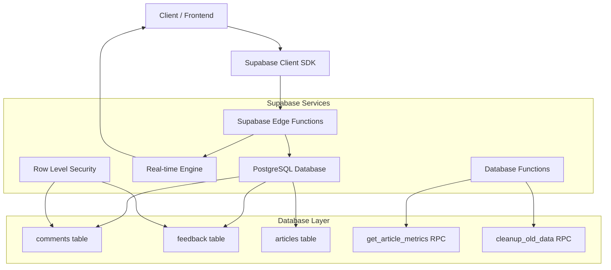
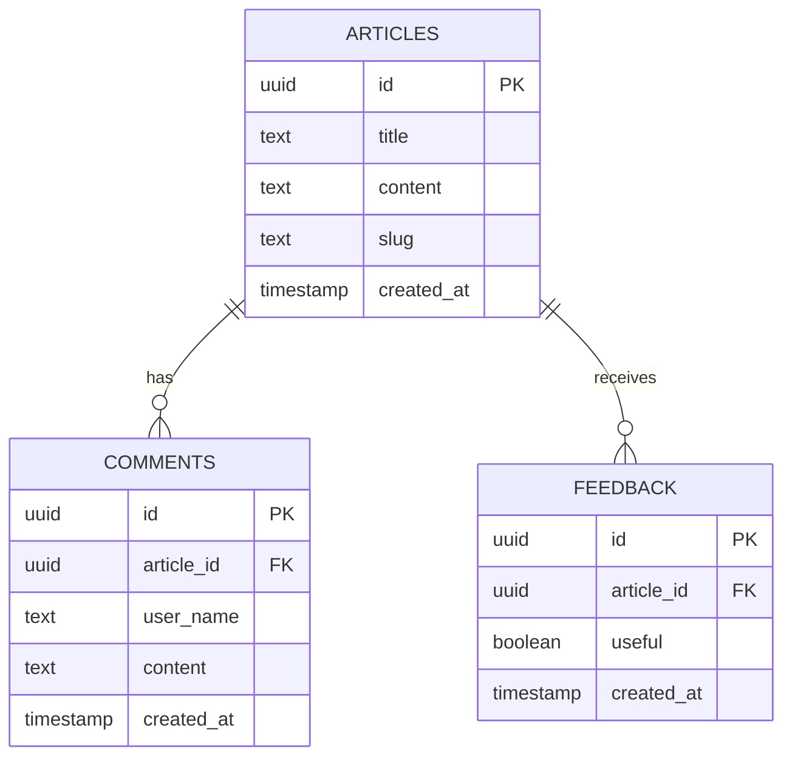

# Arquitetura Técnica - Sistema de Comentários e Feedback

## 1. Architecture design



## 2. Technology Description

- **Frontend:** React@18 + TypeScript + Tailwind CSS@3 + Vite
- **Backend:** Supabase (PostgreSQL + Real-time + Auth + RLS)
- **State Management:** React Hooks + Custom hooks para comentários e feedback
- **Validação:** Zod para validação de schemas
- **Sanitização:** DOMPurify para limpeza de conteúdo
- **Formatação:** date-fns para formatação de datas

## 3. Route definitions

| Route | Purpose |
|-------|---------|
| /article/:slug | Página do artigo individual com seções de comentários e feedback |
| /admin | Dashboard administrativo com nova seção de feedbacks e engajamento |

## 4. API definitions

### 4.1 Core API

**Comentários - Inserção**
```typescript
// Supabase Insert
supabase.from('comments').insert({
  article_id: string,
  user_name: string,
  content: string
})
```

**Comentários - Busca**
```typescript
// Supabase Select com paginação
supabase.from('comments')
  .select('*')
  .eq('article_id', articleId)
  .order('created_at', { ascending: false })
  .range(offset, offset + limit - 1)
```

**Feedback - Inserção**
```typescript
// Supabase Insert
supabase.from('feedback').insert({
  article_id: string,
  useful: boolean
})
```

**Métricas Admin - Agregação**
```typescript
// Supabase RPC para métricas agregadas
supabase.rpc('get_article_metrics', {
  article_id?: string
})
```

### 4.2 TypeScript Types

```typescript
// Tipos principais
interface Comment {
  id: string;
  article_id: string;
  user_name: string;
  content: string;
  created_at: string;
}

interface Feedback {
  id: string;
  article_id: string;
  useful: boolean;
  created_at: string;
}

interface ArticleMetrics {
  article_id: string;
  article_title: string;
  positive_feedback: number;
  negative_feedback: number;
  total_comments: number;
  approval_rate: number;
  last_updated: string;
}

// Schemas de validação
const CommentSchema = z.object({
  user_name: z.string().min(2).max(50).regex(/^[a-zA-ZÀ-ÿ\s]+$/),
  content: z.string().min(10).max(500)
});

const FeedbackSchema = z.object({
  useful: z.boolean()
});
```

## 5. Server architecture diagram



## 6. Data model

### 6.1 Data model definition



### 6.2 Data Definition Language

**Tabela Comments**
```sql
-- Criar tabela de comentários
CREATE TABLE public.comments (
    id UUID PRIMARY KEY DEFAULT gen_random_uuid(),
    article_id UUID REFERENCES public.articles(id) ON DELETE CASCADE,
    user_name TEXT NOT NULL CHECK (length(user_name) >= 2 AND length(user_name) <= 50),
    content TEXT NOT NULL CHECK (length(content) >= 10 AND length(content) <= 500),
    created_at TIMESTAMP WITH TIME ZONE DEFAULT NOW()
);

-- Índices para performance
CREATE INDEX idx_comments_article_id ON public.comments(article_id);
CREATE INDEX idx_comments_created_at ON public.comments(created_at DESC);

-- Políticas RLS
ALTER TABLE public.comments ENABLE ROW LEVEL SECURITY;

CREATE POLICY "Allow public read comments" ON public.comments 
    FOR SELECT USING (true);

CREATE POLICY "Allow public insert comments" ON public.comments 
    FOR INSERT WITH CHECK (true);
```

**Tabela Feedback**
```sql
-- Criar tabela de feedback
CREATE TABLE public.feedback (
    id UUID PRIMARY KEY DEFAULT gen_random_uuid(),
    article_id UUID REFERENCES public.articles(id) ON DELETE CASCADE,
    useful BOOLEAN NOT NULL,
    created_at TIMESTAMP WITH TIME ZONE DEFAULT NOW()
);

-- Índices para performance
CREATE INDEX idx_feedback_article_id ON public.feedback(article_id);
CREATE INDEX idx_feedback_created_at ON public.feedback(created_at DESC);
CREATE INDEX idx_feedback_useful ON public.feedback(useful);

-- Políticas RLS
ALTER TABLE public.feedback ENABLE ROW LEVEL SECURITY;

CREATE POLICY "Allow public read feedback" ON public.feedback 
    FOR SELECT USING (true);

CREATE POLICY "Allow public insert feedback" ON public.feedback 
    FOR INSERT WITH CHECK (true);
```

**Função para Métricas Agregadas**
```sql
-- Função RPC para buscar métricas de artigos
CREATE OR REPLACE FUNCTION get_article_metrics(target_article_id UUID DEFAULT NULL)
RETURNS TABLE (
    article_id UUID,
    article_title TEXT,
    positive_feedback BIGINT,
    negative_feedback BIGINT,
    total_comments BIGINT,
    approval_rate NUMERIC,
    last_updated TIMESTAMP WITH TIME ZONE
) 
LANGUAGE plpgsql
SECURITY DEFINER
AS $$
BEGIN
    RETURN QUERY
    SELECT 
        a.id as article_id,
        a.title as article_title,
        COALESCE(f_pos.count, 0) as positive_feedback,
        COALESCE(f_neg.count, 0) as negative_feedback,
        COALESCE(c.count, 0) as total_comments,
        CASE 
            WHEN COALESCE(f_pos.count, 0) + COALESCE(f_neg.count, 0) = 0 THEN 0
            ELSE ROUND((COALESCE(f_pos.count, 0)::NUMERIC / (COALESCE(f_pos.count, 0) + COALESCE(f_neg.count, 0))) * 100, 1)
        END as approval_rate,
        GREATEST(
            COALESCE(f_pos.last_updated, '1970-01-01'::timestamp),
            COALESCE(f_neg.last_updated, '1970-01-01'::timestamp),
            COALESCE(c.last_updated, '1970-01-01'::timestamp)
        ) as last_updated
    FROM public.articles a
    LEFT JOIN (
        SELECT article_id, COUNT(*) as count, MAX(created_at) as last_updated
        FROM public.feedback 
        WHERE useful = true
        GROUP BY article_id
    ) f_pos ON a.id = f_pos.article_id
    LEFT JOIN (
        SELECT article_id, COUNT(*) as count, MAX(created_at) as last_updated
        FROM public.feedback 
        WHERE useful = false
        GROUP BY article_id
    ) f_neg ON a.id = f_neg.article_id
    LEFT JOIN (
        SELECT article_id, COUNT(*) as count, MAX(created_at) as last_updated
        FROM public.comments
        GROUP BY article_id
    ) c ON a.id = c.article_id
    WHERE (target_article_id IS NULL OR a.id = target_article_id)
    ORDER BY last_updated DESC NULLS LAST;
END;
$$;
```

**Função de Limpeza (Opcional)**
```sql
-- Função para limpeza de dados antigos (executar mensalmente)
CREATE OR REPLACE FUNCTION cleanup_old_feedback()
RETURNS INTEGER
LANGUAGE plpgsql
SECURITY DEFINER
AS $$
DECLARE
    deleted_count INTEGER;
BEGIN
    -- Remove feedback mais antigo que 1 ano
    DELETE FROM public.feedback 
    WHERE created_at < NOW() - INTERVAL '1 year';
    
    GET DIAGNOSTICS deleted_count = ROW_COUNT;
    
    RETURN deleted_count;
END;
$$;
```

## 7. Component Architecture

### 7.1 Estrutura de Componentes

```
src/
├── components/
│   ├── Comments/
│   │   ├── CommentSection.tsx      # Componente principal de comentários
│   │   ├── CommentList.tsx         # Lista de comentários
│   │   ├── CommentForm.tsx         # Formulário de novo comentário
│   │   └── CommentItem.tsx         # Item individual de comentário
│   ├── Feedback/
│   │   ├── FeedbackSection.tsx     # Componente principal de feedback
│   │   └── FeedbackButtons.tsx     # Botões de feedback (👍/👎)
│   └── Admin/
│       ├── FeedbackDashboard.tsx   # Dashboard principal
│       ├── MetricsTable.tsx        # Tabela de métricas
│       └── ArticleDetailsModal.tsx # Modal com detalhes
├── hooks/
│   ├── useComments.ts              # Hook para gerenciar comentários
│   ├── useFeedback.ts              # Hook para gerenciar feedback
│   └── useArticleMetrics.ts        # Hook para métricas admin
└── utils/
    ├── commentValidation.ts        # Validações de comentários
    ├── feedbackValidation.ts       # Validações de feedback
    └── sanitization.ts             # Sanitização de conteúdo
```

### 7.2 Real-time Subscriptions

```typescript
// Listener para novos comentários
const commentsSubscription = supabase
  .channel('comments')
  .on('postgres_changes', 
    { event: 'INSERT', schema: 'public', table: 'comments' },
    (payload) => {
      // Atualizar estado local
      setComments(prev => [payload.new, ...prev]);
    }
  )
  .subscribe();

// Listener para novo feedback
const feedbackSubscription = supabase
  .channel('feedback')
  .on('postgres_changes',
    { event: 'INSERT', schema: 'public', table: 'feedback' },
    (payload) => {
      // Atualizar métricas em tempo real
      refreshMetrics();
    }
  )
  .subscribe();
```

## 8. Performance e Otimizações

### 8.1 Estratégias de Performance
- **Paginação:** Carregar comentários em lotes de 10
- **Debouncing:** Validação de formulário com delay de 300ms
- **Memoização:** React.memo para componentes de comentários
- **Lazy Loading:** Carregar dashboard admin apenas quando necessário

### 8.2 Caching Strategy
- **Local Storage:** Cache de feedback enviado por sessão
- **React Query:** Cache de comentários e métricas (5 minutos)
- **Supabase Cache:** Utilizar cache nativo do Supabase para queries repetidas

### 8.3 Rate Limiting
- **Frontend:** Máximo 1 feedback por artigo por sessão
- **Backend:** RLS policies para prevenir spam
- **IP Limiting:** Máximo 3 comentários por IP por hora (implementar via Edge Functions se necessário)