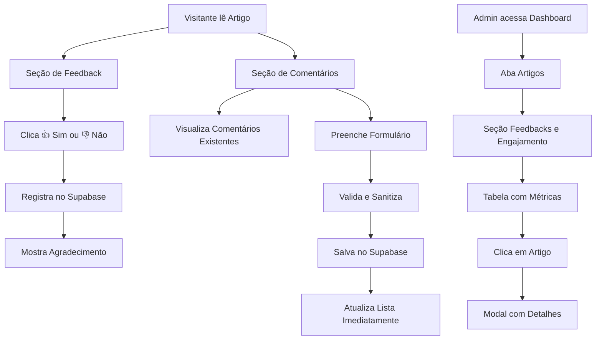

# Sistema de Comentários e Feedback - AIMindset

## 1. Product Overview

Sistema completo de **comentários e feedback interativo** para artigos do AIMindset, permitindo que visitantes avaliem a utilidade dos conteúdos e deixem comentários, com monitoramento em tempo real no painel administrativo.

- **Problema a resolver:** Falta de interação e feedback dos leitores sobre a qualidade e utilidade dos artigos publicados
- **Público-alvo:** Visitantes do site (leitores) e administradores do AIMindset
- **Valor do produto:** Aumentar engajamento, coletar feedback valioso e melhorar a qualidade do conteúdo baseado em dados reais

## 2. Core Features

### 2.1 User Roles

| Role | Registration Method | Core Permissions |
|------|---------------------|------------------|
| Visitante Anônimo | Nenhum registro necessário | Pode avaliar artigos (👍/👎), comentar e visualizar comentários |
| Administrador | Login existente do sistema | Acesso completo ao dashboard de feedbacks e métricas em tempo real |

### 2.2 Feature Module

Nosso sistema de comentários e feedback consiste nas seguintes funcionalidades principais:

1. **Seção de Feedback**: avaliação rápida de utilidade do artigo (Sim/Não)
2. **Seção de Comentários**: sistema completo de comentários com nome e conteúdo
3. **Dashboard Admin**: painel de monitoramento com métricas e dados em tempo real

### 2.3 Page Details

| Page Name | Module Name | Feature description |
|-----------|-------------|---------------------|
| Artigo Individual | Seção de Feedback | Exibir pergunta "Este artigo foi útil pra você?" com botões 👍 Sim / 👎 Não. Registrar feedback no Supabase, mostrar agradecimento, desativar botões após envio |
| Artigo Individual | Seção de Comentários | Exibir comentários existentes ordenados por data decrescente. Formulário com campos Nome e Comentário. Validação, sanitização e inserção via Supabase com atualização imediata |
| Dashboard Admin | Tabela de Feedbacks | Exibir tabela dinâmica com título do artigo, feedbacks positivos/negativos, total de comentários, taxa de aprovação e última atualização |
| Dashboard Admin | Painel de Detalhes | Modal/painel lateral ao clicar em artigo mostrando últimos comentários e feedbacks com data e resumo |

## 3. Core Process

**Fluxo do Visitante:**
1. Visitante lê um artigo completo
2. Ao final, encontra seção de feedback com pergunta sobre utilidade
3. Clica em 👍 Sim ou 👎 Não → sistema registra no banco e mostra agradecimento
4. Visualiza comentários existentes (se houver)
5. Preenche formulário de comentário (Nome + Conteúdo) → sistema valida e salva
6. Comentário aparece imediatamente na lista

**Fluxo do Administrador:**
1. Acessa painel admin → aba Artigos
2. Visualiza nova seção "Feedbacks e Engajamento"
3. Monitora métricas em tempo real (atualizações automáticas)
4. Clica em artigo específico → abre detalhes com comentários e feedbacks recentes
5. Analisa dados para melhorar conteúdo

## 4. User Interface Design

### 4.1 Design Style

- **Cores primárias:** Manter exatamente as cores atuais do AIMindset (azul #3B82F6, cinza #6B7280)
- **Cores secundárias:** Verde para feedback positivo (#10B981), vermelho suave para negativo (#EF4444)
- **Estilo de botões:** Seguir padrão atual - botões arredondados com hover effects
- **Fonte:** Manter tipografia atual (Inter/system fonts)
- **Layout:** Integração seamless com design existente, sem quebrar fluxo visual
- **Ícones:** Emojis nativos (👍👎) e ícones Lucide React consistentes com o sistema

### 4.2 Page Design Overview

| Page Name | Module Name | UI Elements |
|-----------|-------------|-------------|
| Artigo Individual | Seção de Feedback | Card com fundo cinza claro, pergunta centralizada, dois botões lado a lado com ícones emoji, mensagem de sucesso em verde suave |
| Artigo Individual | Seção de Comentários | Lista de comentários com avatar placeholder, nome em negrito, data em cinza, conteúdo em texto normal. Formulário com inputs estilizados e botão azul |
| Dashboard Admin | Tabela de Feedbacks | Tabela responsiva com headers em cinza escuro, linhas alternadas, badges coloridos para métricas, ícones de status |
| Dashboard Admin | Modal de Detalhes | Overlay escuro, modal centralizado, tabs para comentários/feedbacks, scroll interno, botão de fechar |

### 4.3 Responsiveness

- **Desktop-first** com adaptação completa para mobile
- **Touch-friendly** - botões de feedback com área de toque adequada (min 44px)
- **Breakpoints:** Seguir sistema atual do Tailwind (sm, md, lg, xl)
- **Layout móvel:** Stack vertical para seção de feedback, formulário de comentário simplificado

## 5. Validações e Regras de Negócio

### 5.1 Validações de Feedback
- Impedir envio duplicado por sessão (localStorage)
- Desativar botões após envio
- Timeout de 1 segundo entre cliques

### 5.2 Validações de Comentários
- Nome: obrigatório, 2-50 caracteres, apenas letras e espaços
- Conteúdo: obrigatório, 10-500 caracteres
- Sanitização: remover HTML, scripts, caracteres especiais
- Rate limiting: máximo 3 comentários por IP por hora

### 5.3 Paginação
- 10 comentários por página
- Carregamento sob demanda ("Carregar mais")
- Ordenação por data decrescente

## 6. Métricas e Analytics

### 6.1 Métricas de Feedback
- Taxa de aprovação por artigo (positivos/total × 100)
- Volume total de feedbacks
- Tendência temporal (gráfico de linha)

### 6.2 Métricas de Comentários
- Total de comentários por artigo
- Média de comentários por dia
- Artigos mais comentados

### 6.3 Dashboard em Tempo Real
- Atualização automática via Supabase listeners
- Indicadores visuais para novos feedbacks/comentários
- Exportação de dados em CSV (opcional)

## 7. Critérios de Aceitação

### 7.1 Funcionalidades Essenciais
- ✅ Sistema de feedback (👍/👎) funcional em todos os artigos
- ✅ Sistema de comentários com validação e sanitização
- ✅ Dashboard admin com dados reais do Supabase
- ✅ Atualização em tempo real via listeners
- ✅ Responsividade completa (desktop/mobile)

### 7.2 Qualidade Técnica
- ✅ Zero erros em `npm run dev` e `npm run build`
- ✅ Integração 100% funcional com Supabase
- ✅ Código limpo e bem documentado
- ✅ Testes de validação implementados

### 7.3 Design e UX
- ✅ Visual idêntico ao padrão atual do AIMindset
- ✅ Transições suaves e feedback visual adequado
- ✅ Mensagens de erro/sucesso amigáveis
- ✅ Acessibilidade básica (ARIA labels, contraste)