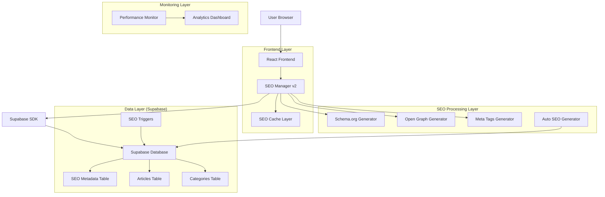
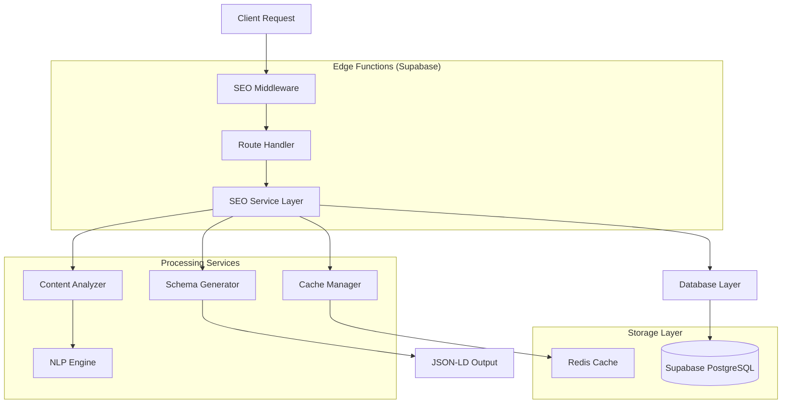
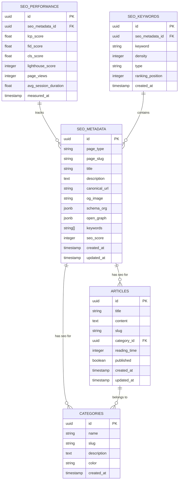

# Arquitetura Técnica SEO Profissional - AIMindset

## 1. Arquitetura do Sistema



## 2. Descrição das Tecnologias

- **Frontend**: React@18 + TypeScript + Tailwind CSS + Vite
- **Backend**: Supabase (PostgreSQL + Edge Functions)
- **SEO Engine**: Custom SEO Manager v2 + Schema.org + Open Graph
- **Cache**: React Query + Local Storage + Supabase Cache
- **Analytics**: Google Analytics 4 + Custom Dashboard
- **Performance**: Core Web Vitals + Lighthouse CI

## 3. Definições de Rotas

| Rota | Propósito | SEO Status |
|------|-----------|------------|
| / | Página inicial com hero e artigos em destaque | ✅ Otimizado |
| /article/:slug | Página individual do artigo com SEO automático | ✅ Otimizado |
| /category/:slug | Listagem de artigos por categoria | ✅ Otimizado |
| /categories | Listagem de todas as categorias | ✅ Otimizado |
| /about | Página sobre o projeto | ✅ Otimizado |
| /contact | Página de contato | ✅ Otimizado |
| /privacy | Política de privacidade | ✅ Otimizado |
| /newsletter | Página de inscrição na newsletter | 🔄 A otimizar |
| /articles | Listagem de todos os artigos | 🔄 A otimizar |
| /admin | Painel administrativo | 🚫 Noindex |
| /admin/login | Login do administrador | 🚫 Noindex |
| /admin/seo-dashboard | Dashboard de métricas SEO | 🆕 Novo |

## 4. Definições de API

### 4.1 APIs Core de SEO

**Buscar metadados SEO**
```
GET /api/seo/metadata
```

Parâmetros:
| Nome | Tipo | Obrigatório | Descrição |
|------|------|-------------|-----------|
| page_type | string | true | Tipo da página (home, article, category, etc.) |
| page_slug | string | false | Slug específico da página |
| force_refresh | boolean | false | Forçar regeneração do cache |

Resposta:
| Nome | Tipo | Descrição |
|------|------|-----------|
| title | string | Título otimizado da página |
| description | string | Meta description gerada |
| keywords | string[] | Keywords extraídas automaticamente |
| canonical_url | string | URL canônica |
| og_image | string | URL da imagem Open Graph |
| schema_org | object | Dados estruturados Schema.org |

**Gerar SEO automático para artigo**
```
POST /api/seo/generate-article
```

Parâmetros:
| Nome | Tipo | Obrigatório | Descrição |
|------|------|-------------|-----------|
| article_id | uuid | true | ID do artigo |
| content | string | true | Conteúdo do artigo |
| title | string | true | Título do artigo |
| category_id | uuid | true | ID da categoria |

Resposta:
| Nome | Tipo | Descrição |
|------|------|-----------|
| seo_data | object | Metadados SEO gerados |
| keywords | string[] | Keywords extraídas |
| reading_time | number | Tempo de leitura estimado |
| schema_article | object | Schema.org Article |

### 4.2 APIs de Monitoramento

**Métricas de performance SEO**
```
GET /api/seo/metrics
```

Resposta:
| Nome | Tipo | Descrição |
|------|------|-----------|
| core_web_vitals | object | Métricas CWV (LCP, FID, CLS) |
| seo_score | number | Score SEO geral (0-100) |
| pages_optimized | number | Páginas com SEO otimizado |
| avg_loading_time | number | Tempo médio de carregamento |

## 5. Arquitetura do Servidor



## 6. Modelo de Dados

### 6.1 Definição do Modelo de Dados



### 6.2 Linguagem de Definição de Dados

**Tabela SEO Metadata Avançada**
```sql
-- Criar tabela SEO metadata avançada
CREATE TABLE seo_metadata_advanced (
    id UUID PRIMARY KEY DEFAULT gen_random_uuid(),
    page_type VARCHAR(50) NOT NULL,
    page_slug VARCHAR(255),
    title VARCHAR(255) NOT NULL,
    description TEXT,
    canonical_url VARCHAR(500),
    og_image VARCHAR(500),
    og_type VARCHAR(50) DEFAULT 'website',
    schema_org JSONB,
    open_graph JSONB,
    twitter_card JSONB,
    keywords TEXT[],
    seo_score INTEGER DEFAULT 0 CHECK (seo_score >= 0 AND seo_score <= 100),
    meta_robots VARCHAR(100) DEFAULT 'index,follow',
    hreflang JSONB,
    breadcrumbs JSONB,
    auto_generated BOOLEAN DEFAULT false,
    last_optimized TIMESTAMP WITH TIME ZONE DEFAULT NOW(),
    created_at TIMESTAMP WITH TIME ZONE DEFAULT NOW(),
    updated_at TIMESTAMP WITH TIME ZONE DEFAULT NOW()
);

-- Criar índices para performance
CREATE UNIQUE INDEX idx_seo_metadata_page_unique ON seo_metadata_advanced(page_type, page_slug);
CREATE INDEX idx_seo_metadata_type ON seo_metadata_advanced(page_type);
CREATE INDEX idx_seo_metadata_score ON seo_metadata_advanced(seo_score DESC);
CREATE INDEX idx_seo_metadata_updated ON seo_metadata_advanced(updated_at DESC);

-- Tabela de performance SEO
CREATE TABLE seo_performance (
    id UUID PRIMARY KEY DEFAULT gen_random_uuid(),
    seo_metadata_id UUID REFERENCES seo_metadata_advanced(id) ON DELETE CASCADE,
    lcp_score FLOAT,
    fid_score FLOAT,
    cls_score FLOAT,
    lighthouse_score INTEGER,
    page_views INTEGER DEFAULT 0,
    avg_session_duration FLOAT,
    bounce_rate FLOAT,
    conversion_rate FLOAT,
    measured_at TIMESTAMP WITH TIME ZONE DEFAULT NOW()
);

-- Tabela de keywords SEO
CREATE TABLE seo_keywords (
    id UUID PRIMARY KEY DEFAULT gen_random_uuid(),
    seo_metadata_id UUID REFERENCES seo_metadata_advanced(id) ON DELETE CASCADE,
    keyword VARCHAR(255) NOT NULL,
    density FLOAT,
    type VARCHAR(50), -- primary, secondary, long-tail
    ranking_position INTEGER,
    search_volume INTEGER,
    difficulty_score INTEGER,
    created_at TIMESTAMP WITH TIME ZONE DEFAULT NOW()
);

-- Função para gerar SEO automático
CREATE OR REPLACE FUNCTION generate_automatic_seo()
RETURNS TRIGGER AS $$
DECLARE
    seo_title VARCHAR(255);
    seo_description TEXT;
    seo_keywords TEXT[];
    reading_time INTEGER;
BEGIN
    -- Gerar título SEO otimizado
    seo_title := NEW.title || ' | AIMindset - Inteligência Artificial e Produtividade';
    
    -- Gerar descrição baseada no conteúdo
    seo_description := LEFT(REGEXP_REPLACE(NEW.content, '<[^>]*>', '', 'g'), 155) || '...';
    
    -- Extrair keywords básicas (implementação simplificada)
    seo_keywords := string_to_array(
        LOWER(REGEXP_REPLACE(NEW.title, '[^a-zA-Z0-9\s]', '', 'g')), 
        ' '
    );
    
    -- Calcular tempo de leitura
    reading_time := CEIL(array_length(string_to_array(NEW.content, ' '), 1) / 200.0);
    
    -- Inserir/atualizar SEO metadata
    INSERT INTO seo_metadata_advanced (
        page_type, page_slug, title, description, keywords,
        canonical_url, auto_generated, schema_org
    ) VALUES (
        'article',
        NEW.slug,
        seo_title,
        seo_description,
        seo_keywords,
        'https://aimindset.vercel.app/article/' || NEW.slug,
        true,
        jsonb_build_object(
            '@context', 'https://schema.org',
            '@type', 'Article',
            'headline', NEW.title,
            'description', seo_description,
            'author', jsonb_build_object('@type', 'Organization', 'name', 'AIMindset'),
            'publisher', jsonb_build_object('@type', 'Organization', 'name', 'AIMindset'),
            'datePublished', NEW.created_at,
            'dateModified', NEW.updated_at
        )
    ) ON CONFLICT (page_type, page_slug) 
    DO UPDATE SET
        title = EXCLUDED.title,
        description = EXCLUDED.description,
        keywords = EXCLUDED.keywords,
        schema_org = EXCLUDED.schema_org,
        updated_at = NOW();
    
    -- Atualizar tempo de leitura no artigo
    NEW.reading_time := reading_time;
    
    RETURN NEW;
END;
$$ LANGUAGE plpgsql;

-- Trigger para gerar SEO automático
CREATE TRIGGER trigger_generate_seo_on_article
    BEFORE INSERT OR UPDATE ON articles
    FOR EACH ROW
    EXECUTE FUNCTION generate_automatic_seo();

-- Dados iniciais para páginas estáticas
INSERT INTO seo_metadata_advanced (page_type, title, description, canonical_url, schema_org) VALUES
('newsletter', 
 'Newsletter AIMindset - Receba as Melhores Dicas de IA', 
 'Inscreva-se na newsletter do AIMindset e receba semanalmente as melhores dicas, tutoriais e novidades sobre Inteligência Artificial e produtividade.',
 'https://aimindset.vercel.app/newsletter',
 '{"@context": "https://schema.org", "@type": "WebPage", "name": "Newsletter", "description": "Newsletter sobre IA e produtividade"}'),

('articles', 
 'Todos os Artigos - AIMindset | Inteligência Artificial e Produtividade', 
 'Explore todos os artigos do AIMindset sobre Inteligência Artificial, produtividade, ferramentas de IA e dicas práticas para otimizar seu trabalho.',
 'https://aimindset.vercel.app/articles',
 '{"@context": "https://schema.org", "@type": "CollectionPage", "name": "Todos os Artigos", "description": "Coleção completa de artigos sobre IA"}');

-- Políticas RLS
ALTER TABLE seo_metadata_advanced ENABLE ROW LEVEL SECURITY;
ALTER TABLE seo_performance ENABLE ROW LEVEL SECURITY;
ALTER TABLE seo_keywords ENABLE ROW LEVEL SECURITY;

-- Permitir leitura pública
CREATE POLICY "Allow public read seo_metadata_advanced" ON seo_metadata_advanced FOR SELECT USING (true);
CREATE POLICY "Allow public read seo_performance" ON seo_performance FOR SELECT USING (true);
CREATE POLICY "Allow public read seo_keywords" ON seo_keywords FOR SELECT USING (true);

-- Permitir escrita apenas para usuários autenticados
CREATE POLICY "Allow authenticated write seo_metadata_advanced" ON seo_metadata_advanced FOR ALL USING (auth.role() = 'authenticated');
CREATE POLICY "Allow authenticated write seo_performance" ON seo_performance FOR ALL USING (auth.role() = 'authenticated');
CREATE POLICY "Allow authenticated write seo_keywords" ON seo_keywords FOR ALL USING (auth.role() = 'authenticated');
```