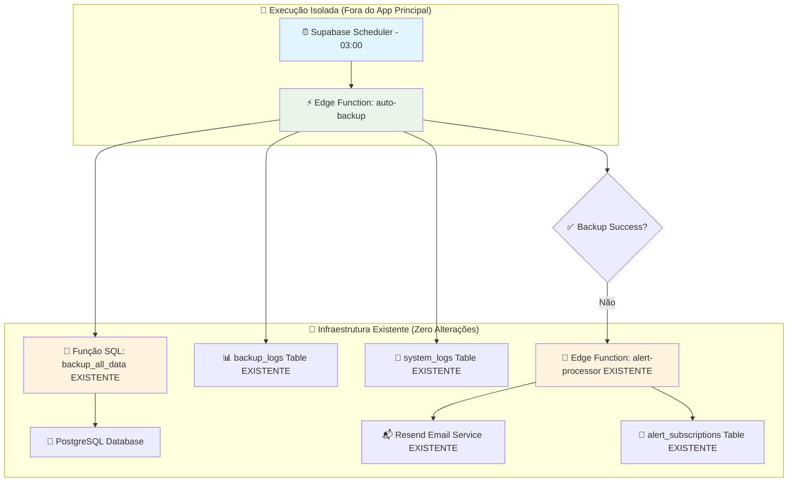
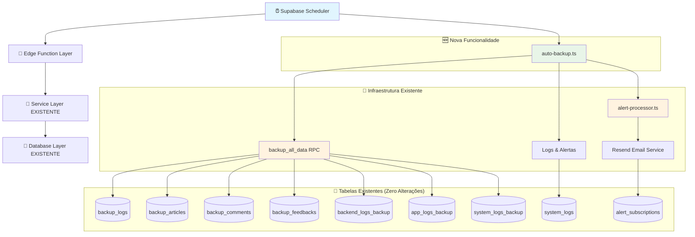
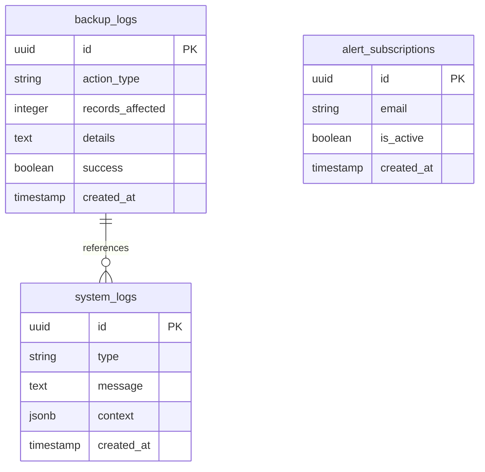

# 🏗️ Arquitetura Técnica - Sistema de Backup Automático Diário

## 1. Architecture design



## 2. Technology Description

- **🎯 Automação**: Supabase Scheduler (cron job nativo) - execução às 03:00
- **⚡ Processamento**: Supabase Edge Functions (Deno runtime) - execução isolada
- **🧱 Função SQL**: `backup_all_data()` **EXISTENTE** (zero modificações)
- **📧 Alertas**: `alert-processor` **EXISTENTE** (integração via invoke)
- **📊 Logs**: Sistema de logs **EXISTENTE** (`backup_logs` + `system_logs`)
- **🔒 Compatibilidade**: Total com cache TTL, triggers e funções atuais

## 3. Route definitions

| Route | Purpose | Status |
|-------|---------|--------|
| `/functions/v1/auto-backup` | 🆕 Edge Function para backup automático diário | **NOVA** |
| `/functions/v1/alert-processor` | 📧 Edge Function para alertas por e-mail | **EXISTENTE** |

## 4. API definitions

### 4.1 Core API

**🔄 Backup Automático (NOVA Edge Function)**
```
POST /functions/v1/auto-backup
```

**Execução**: Automaticamente via Supabase Scheduler às 03:00 (sem parâmetros)

**Fluxo Interno**:
1. ✅ Chama `supabase.rpc('backup_all_data')` - **função SQL existente**
2. 📊 Registra em `backup_logs` com `action_type: 'auto_backup'`
3. 📝 Registra em `system_logs` com `type: 'auto_backup'`
4. 🚨 Se erro: chama `alert-processor` existente

**Response (Sucesso)**:
```json
{
  "success": true,
  "backup_id": "550e8400-e29b-41d4-a716-446655440000",
  "total_records": 757,
  "message": "Backup automático concluído com sucesso"
}
```

**Response (Erro)**:
```json
{
  "success": false,
  "error": "Connection timeout to database",
  "message": "Falha no backup automático"
}
```

**📧 Integração com Alert Processor (EXISTENTE)**
```
POST /functions/v1/alert-processor
```

**Chamada em caso de falha**:
| Param Name | Param Type | isRequired | Description |
|------------|------------|------------|-------------|
| type | string | true | Sempre: `'critical'` |
| source | string | true | Sempre: `'auto_backup_system'` |
| message | string | true | Mensagem de erro do backup |
| details | object | false | Stack trace e timestamp |

## 5. Server architecture diagram



## 6. Data model

### 6.1 Data model definition



### 6.2 Data Definition Language

**🎯 Configuração do Supabase Scheduler**
```sql
-- ⚠️ IMPORTANTE: Usar Supabase Scheduler (não pg_cron diretamente)
-- Configuração via Dashboard do Supabase ou API

-- Exemplo de configuração via SQL (se necessário):
SELECT cron.schedule(
    'daily-auto-backup',           -- Nome do job
    '0 3 * * *',                  -- Cron expression: 03:00 diariamente
    $$
    SELECT net.http_post(
        url := 'https://[SEU_PROJETO].supabase.co/functions/v1/auto-backup',
        headers := jsonb_build_object(
            'Authorization', 'Bearer ' || current_setting('app.service_role_key'),
            'Content-Type', 'application/json'
        ),
        body := '{}'::jsonb
    );
    $$
);
```

**🔒 Configuração de Segurança**
```sql
-- Garantir permissões para o service_role
GRANT USAGE ON SCHEMA cron TO service_role;
GRANT ALL PRIVILEGES ON ALL TABLES IN SCHEMA cron TO service_role;

-- Verificar se o job foi criado
SELECT jobname, schedule, command, active 
FROM cron.job 
WHERE jobname = 'daily-auto-backup';
```

**Edge Function: auto-backup.ts**
```typescript
import { serve } from "https://deno.land/std@0.168.0/http/server.ts"
import { createClient } from 'https://esm.sh/@supabase/supabase-js@2'

const corsHeaders = {
  'Access-Control-Allow-Origin': '*',
  'Access-Control-Allow-Headers': 'authorization, x-client-info, apikey, content-type',
}

serve(async (req) => {
  if (req.method === 'OPTIONS') {
    return new Response('ok', { headers: corsHeaders })
  }

  try {
    const supabaseUrl = Deno.env.get('SUPABASE_URL')!
    const supabaseServiceKey = Deno.env.get('SUPABASE_SERVICE_ROLE_KEY')!
    
    const supabase = createClient(supabaseUrl, supabaseServiceKey)

    console.log('🔄 Iniciando backup automático diário...')

    // Executar backup usando função SQL existente
    const { data: backupResult, error: backupError } = await supabase
      .rpc('backup_all_data')

    if (backupError) {
      throw new Error(`Erro na função backup_all_data: ${backupError.message}`)
    }

    console.log('✅ Backup concluído:', backupResult)

    // Registrar sucesso em backup_logs (action_type específico para backup automático)
    const { error: backupLogError } = await supabase
      .from('backup_logs')
      .insert([{
        action_type: 'auto_backup',
        records_affected: backupResult.total_records || 0,
        details: `Backup automático ID: ${backupResult.backup_id} - Total: ${backupResult.total_records} registros`,
        success: true
      }])

    if (backupLogError) {
      console.error('⚠️ Erro ao registrar em backup_logs:', backupLogError)
    }

    // Registrar sucesso em system_logs
    const { error: systemLogError } = await supabase
      .from('system_logs')
      .insert([{
        type: 'auto_backup',
        message: 'Backup automático concluído com sucesso',
        context: {
          backup_id: backupResult.backup_id,
          total_records: backupResult.total_records,
          executed_at: new Date().toISOString(),
          articles_count: backupResult.articles_count,
          comments_count: backupResult.comments_count,
          feedbacks_count: backupResult.feedbacks_count,
          backend_logs_count: backupResult.backend_logs_count,
          app_logs_count: backupResult.app_logs_count,
          system_logs_count: backupResult.system_logs_count
        }
      }])

    if (systemLogError) {
      console.error('⚠️ Erro ao registrar em system_logs:', systemLogError)
    }

    return new Response(
      JSON.stringify({
        success: true,
        message: 'Backup automático concluído com sucesso',
        backup_id: backupResult.backup_id,
        total_records: backupResult.total_records
      }),
      { 
        status: 200, 
        headers: { ...corsHeaders, 'Content-Type': 'application/json' } 
      }
    )

  } catch (error) {
    console.error('❌ Erro no backup automático:', error)

    const supabaseUrl = Deno.env.get('SUPABASE_URL')!
    const supabaseServiceKey = Deno.env.get('SUPABASE_SERVICE_ROLE_KEY')!
    const supabase = createClient(supabaseUrl, supabaseServiceKey)

    // Registrar erro em system_logs
    await supabase
      .from('system_logs')
      .insert([{
        type: 'auto_backup_error',
        message: `Falha no backup automático: ${error.message}`,
        context: {
          error_stack: error.stack,
          executed_at: new Date().toISOString(),
          error_type: error.constructor.name
        }
      }])

    // Enviar alerta por e-mail usando alert-processor existente
    try {
      await supabase.functions.invoke('alert-processor', {
        body: {
          type: 'critical',
          source: 'auto_backup_system',
          message: `Falha no backup automático diário executado às ${new Date().toLocaleString('pt-BR', { timeZone: 'America/Sao_Paulo' })}`,
          details: {
            error_message: error.message,
            error_stack: error.stack,
            timestamp: new Date().toISOString(),
            backup_scheduled_time: '03:00 AM'
          }
        }
      })
      console.log('📧 Alerta de falha enviado por e-mail')
    } catch (alertError) {
      console.error('❌ Erro ao enviar alerta por e-mail:', alertError)
    }

    return new Response(
      JSON.stringify({
        success: false,
        message: 'Falha no backup automático',
        error: error.message
      }),
      { 
        status: 500, 
        headers: { ...corsHeaders, 'Content-Type': 'application/json' } 
      }
    )
  }
})
```

**Configuração de Permissões**
```sql
-- Garantir que o cron job tenha permissões para executar a Edge Function
GRANT USAGE ON SCHEMA cron TO service_role;
GRANT ALL PRIVILEGES ON ALL TABLES IN SCHEMA cron TO service_role;

-- Verificar se o cron job foi criado corretamente
SELECT * FROM cron.job WHERE jobname = 'daily-auto-backup';
```

**📊 Monitoramento e Logs**
```sql
-- Query para verificar logs de backup automático
SELECT 
    created_at,
    type,
    message,
    context
FROM system_logs 
WHERE type IN ('auto_backup', 'auto_backup_error')
ORDER BY created_at DESC
LIMIT 10;

-- Query para verificar backup_logs automáticos
SELECT 
    created_at,
    action_type,
    records_affected,
    details,
    success
FROM backup_logs 
WHERE action_type = 'auto_backup'
ORDER BY created_at DESC
LIMIT 10;

-- Query para verificar status do cron job
SELECT 
    jobname,
    schedule,
    active,
    last_run_start_time,
    last_run_status
FROM cron.job_run_details 
WHERE jobname = 'daily-auto-backup'
ORDER BY run_start_time DESC
LIMIT 5;
```

## 7. 🎯 Garantias de Implementação

### 7.1 ✅ Compatibilidade Total
- **Zero alterações** em funções SQL existentes (`backup_all_data`, `restore_from_backup`)
- **Zero alterações** em tabelas existentes (`backup_logs`, `system_logs`)
- **Zero alterações** no painel administrativo (visual ou funcional)
- **Zero impacto** na performance do site principal

### 7.2 🚀 Execução Isolada
- **Edge Function** executa fora do ciclo principal do aplicativo
- **Supabase Scheduler** gerencia execução sem afetar recursos do app
- **Processamento assíncrono** não bloqueia operações do usuário
- **Recursos dedicados** para backup automático

### 7.3 🔒 Segurança e Confiabilidade
- **Logs detalhados** para auditoria e troubleshooting
- **Alertas automáticos** por e-mail em caso de falha
- **Integração nativa** com sistema de alertas existente
- **Monitoramento contínuo** via dashboard do Supabase

### 7.4 📧 Sistema de Alertas
- **Reutiliza** `alert-processor` existente (zero desenvolvimento adicional)
- **Templates** de e-mail já testados e aprovados
- **Lista de assinantes** já configurada no sistema
- **Tratamento de erros** robusto com stack trace completo

### 7.5 🛠️ Facilidade de Manutenção
- **Código mínimo**: apenas uma Edge Function simples
- **Dependências zero**: usa apenas infraestrutura existente
- **Configuração única**: Supabase Scheduler via dashboard
- **Monitoramento visual**: logs aparecem no painel admin existente