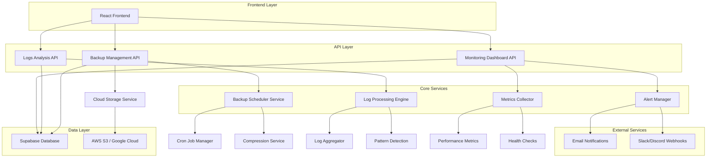
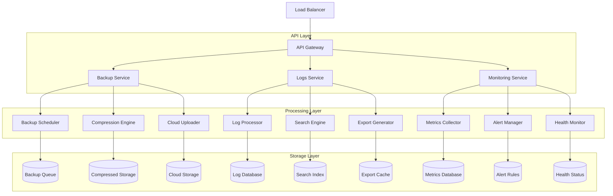
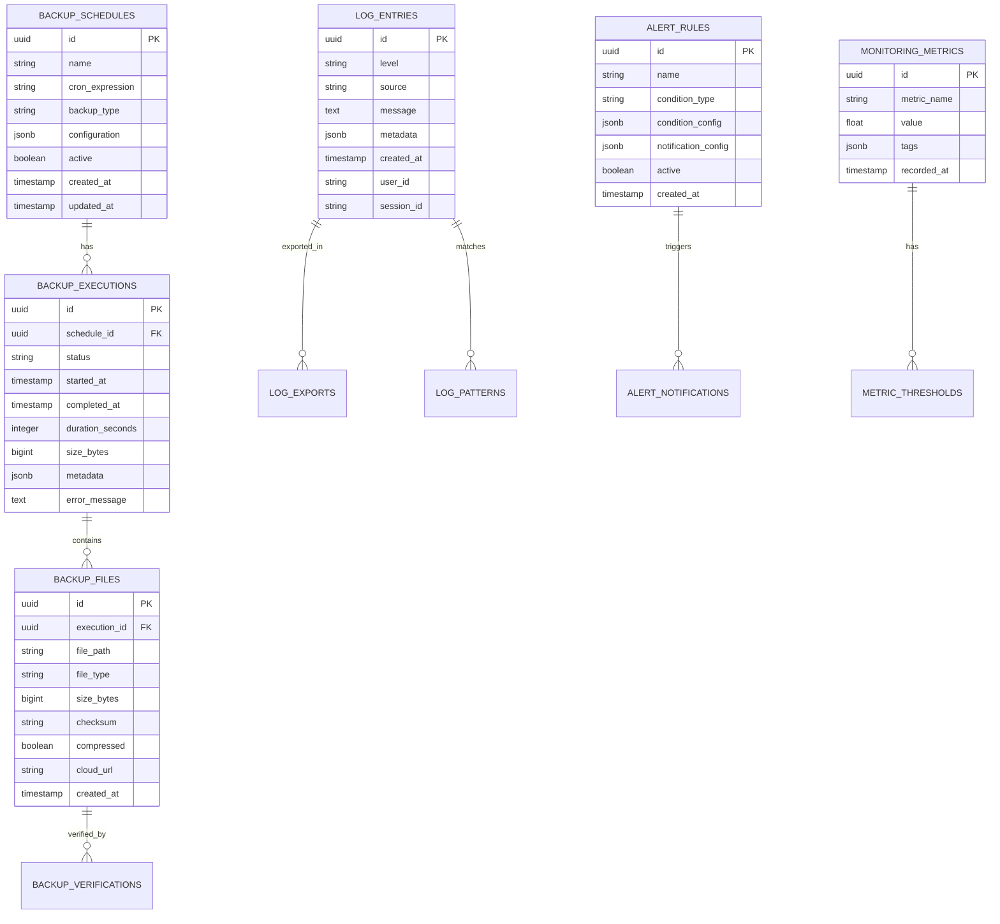

# Arquitetura Técnica - Sistema de Backup e Logs Avançado

## 1. Arquitetura do Sistema



## 2. Descrição das Tecnologias

- **Frontend**: React@18 + TypeScript + TailwindCSS + Vite
- **Backend**: Supabase (PostgreSQL) + Edge Functions
- **Agendamento**: Node.js Cron Jobs + Supabase Functions
- **Armazenamento**: Supabase Storage + AWS S3/Google Cloud (opcional)
- **Monitoramento**: Custom metrics + Supabase Realtime
- **Notificações**: Nodemailer + Webhook integrations

## 3. Definições de Rotas

| Rota | Propósito |
|------|-----------|
| /admin/backup | Dashboard principal de backup com métricas e status |
| /admin/backup/manage | Gerenciamento de backups, configurações e execução manual |
| /admin/backup/history | Histórico completo de backups com filtros e detalhes |
| /admin/logs | Sistema de logs avançado com filtros e busca |
| /admin/logs/export | Página de exportação de logs em diferentes formatos |
| /admin/monitoring | Dashboard de monitoramento e saúde do sistema |
| /admin/monitoring/alerts | Configuração e gerenciamento de alertas |
| /admin/settings/backup | Configurações de políticas de backup e retenção |
| /admin/settings/cloud | Configuração de integrações com serviços de cloud |

## 4. Definições de API

### 4.1 APIs Principais de Backup

**Backup Automático**
```
POST /api/backup/auto
```

Request:
| Parâmetro | Tipo | Obrigatório | Descrição |
|-----------|------|-------------|-----------|
| schedule | string | true | Expressão cron para agendamento |
| type | string | true | Tipo: 'full', 'incremental', 'differential' |
| compression | boolean | false | Habilitar compressão (padrão: true) |
| cloud_upload | boolean | false | Upload automático para cloud |

Response:
| Parâmetro | Tipo | Descrição |
|-----------|------|-----------|
| success | boolean | Status da operação |
| schedule_id | string | ID do agendamento criado |
| next_run | string | Próxima execução agendada |

**Execução Manual de Backup**
```
POST /api/backup/execute
```

Request:
| Parâmetro | Tipo | Obrigatório | Descrição |
|-----------|------|-------------|-----------|
| type | string | true | Tipo de backup a executar |
| tables | array | false | Tabelas específicas (opcional) |
| compress | boolean | false | Aplicar compressão |

Response:
| Parâmetro | Tipo | Descrição |
|-----------|------|-----------|
| success | boolean | Status da execução |
| backup_id | string | ID único do backup |
| size | number | Tamanho do backup em bytes |
| duration | number | Tempo de execução em segundos |

### 4.2 APIs de Logs Avançados

**Busca Avançada de Logs**
```
GET /api/logs/search
```

Request:
| Parâmetro | Tipo | Obrigatório | Descrição |
|-----------|------|-------------|-----------|
| level | string | false | Nível: 'error', 'warn', 'info', 'debug' |
| source | string | false | Fonte do log |
| start_date | string | false | Data inicial (ISO 8601) |
| end_date | string | false | Data final (ISO 8601) |
| search_term | string | false | Termo de busca no conteúdo |
| limit | number | false | Limite de resultados (padrão: 50) |

Response:
| Parâmetro | Tipo | Descrição |
|-----------|------|-----------|
| logs | array | Array de logs encontrados |
| total_count | number | Total de logs que atendem aos critérios |
| has_more | boolean | Indica se há mais resultados |

**Exportação de Logs**
```
POST /api/logs/export
```

Request:
| Parâmetro | Tipo | Obrigatório | Descrição |
|-----------|------|-------------|-----------|
| format | string | true | Formato: 'csv', 'json', 'pdf' |
| filters | object | false | Filtros aplicados |
| date_range | object | true | Período para exportação |

Response:
| Parâmetro | Tipo | Descrição |
|-----------|------|-----------|
| download_url | string | URL para download do arquivo |
| expires_at | string | Data de expiração do link |

### 4.3 APIs de Monitoramento

**Métricas do Sistema**
```
GET /api/monitoring/metrics
```

Response:
| Parâmetro | Tipo | Descrição |
|-----------|------|-----------|
| backup_success_rate | number | Taxa de sucesso dos backups (%) |
| average_backup_time | number | Tempo médio de backup (segundos) |
| storage_usage | object | Uso de armazenamento por tipo |
| system_health | string | Status geral: 'healthy', 'warning', 'critical' |

## 5. Arquitetura do Servidor



## 6. Modelo de Dados

### 6.1 Definição do Modelo de Dados



### 6.2 DDL (Data Definition Language)

**Tabela de Agendamentos de Backup**
```sql
-- Criar tabela de agendamentos
CREATE TABLE backup_schedules (
    id UUID PRIMARY KEY DEFAULT gen_random_uuid(),
    name VARCHAR(255) NOT NULL,
    cron_expression VARCHAR(100) NOT NULL,
    backup_type VARCHAR(50) NOT NULL CHECK (backup_type IN ('full', 'incremental', 'differential')),
    configuration JSONB DEFAULT '{}',
    active BOOLEAN DEFAULT true,
    created_at TIMESTAMP WITH TIME ZONE DEFAULT NOW(),
    updated_at TIMESTAMP WITH TIME ZONE DEFAULT NOW()
);

-- Criar índices
CREATE INDEX idx_backup_schedules_active ON backup_schedules(active);
CREATE INDEX idx_backup_schedules_type ON backup_schedules(backup_type);

-- Dados iniciais
INSERT INTO backup_schedules (name, cron_expression, backup_type, configuration) VALUES
('Backup Diário Completo', '0 2 * * *', 'full', '{"compression": true, "cloud_upload": true}'),
('Backup Incremental de 6h', '0 */6 * * *', 'incremental', '{"compression": true, "retention_days": 7}');
```

**Tabela de Execuções de Backup**
```sql
-- Criar tabela de execuções
CREATE TABLE backup_executions (
    id UUID PRIMARY KEY DEFAULT gen_random_uuid(),
    schedule_id UUID REFERENCES backup_schedules(id),
    status VARCHAR(50) NOT NULL DEFAULT 'pending' CHECK (status IN ('pending', 'running', 'completed', 'failed')),
    started_at TIMESTAMP WITH TIME ZONE DEFAULT NOW(),
    completed_at TIMESTAMP WITH TIME ZONE,
    duration_seconds INTEGER,
    size_bytes BIGINT,
    metadata JSONB DEFAULT '{}',
    error_message TEXT
);

-- Criar índices
CREATE INDEX idx_backup_executions_status ON backup_executions(status);
CREATE INDEX idx_backup_executions_started_at ON backup_executions(started_at DESC);
CREATE INDEX idx_backup_executions_schedule_id ON backup_executions(schedule_id);
```

**Tabela de Logs Avançados**
```sql
-- Criar tabela de logs avançados
CREATE TABLE advanced_logs (
    id UUID PRIMARY KEY DEFAULT gen_random_uuid(),
    level VARCHAR(20) NOT NULL CHECK (level IN ('debug', 'info', 'warn', 'error', 'critical')),
    source VARCHAR(100) NOT NULL,
    message TEXT NOT NULL,
    metadata JSONB DEFAULT '{}',
    created_at TIMESTAMP WITH TIME ZONE DEFAULT NOW(),
    user_id UUID,
    session_id VARCHAR(255)
);

-- Criar índices para busca otimizada
CREATE INDEX idx_advanced_logs_level ON advanced_logs(level);
CREATE INDEX idx_advanced_logs_source ON advanced_logs(source);
CREATE INDEX idx_advanced_logs_created_at ON advanced_logs(created_at DESC);
CREATE INDEX idx_advanced_logs_user_id ON advanced_logs(user_id);
CREATE INDEX idx_advanced_logs_message_gin ON advanced_logs USING gin(to_tsvector('portuguese', message));

-- Dados de exemplo
INSERT INTO advanced_logs (level, source, message, metadata) VALUES
('info', 'backup_system', 'Backup automático iniciado', '{"schedule_id": "uuid", "type": "incremental"}'),
('error', 'backup_system', 'Falha na compressão do backup', '{"error_code": "COMPRESSION_FAILED", "file_size": 1024000}');
```

**Tabela de Regras de Alerta**
```sql
-- Criar tabela de regras de alerta
CREATE TABLE alert_rules (
    id UUID PRIMARY KEY DEFAULT gen_random_uuid(),
    name VARCHAR(255) NOT NULL,
    condition_type VARCHAR(100) NOT NULL,
    condition_config JSONB NOT NULL,
    notification_config JSONB NOT NULL,
    active BOOLEAN DEFAULT true,
    created_at TIMESTAMP WITH TIME ZONE DEFAULT NOW(),
    updated_at TIMESTAMP WITH TIME ZONE DEFAULT NOW()
);

-- Dados iniciais de alertas
INSERT INTO alert_rules (name, condition_type, condition_config, notification_config) VALUES
('Falha de Backup Crítica', 'backup_failure', '{"consecutive_failures": 3}', '{"email": true, "slack": true, "priority": "high"}'),
('Uso de Armazenamento Alto', 'storage_usage', '{"threshold_percent": 85}', '{"email": true, "priority": "medium"}');
```

## 7. Especificações de Implementação

### 7.1 Funcionalidades Principais

1. **Sistema de Backup Inteligente**
   - Backup automático com cron jobs
   - Backup incremental baseado em timestamps
   - Compressão automática com gzip/brotli
   - Upload para múltiplos provedores cloud

2. **Logs Avançados**
   - Busca full-text em PostgreSQL
   - Filtros múltiplos e combinados
   - Exportação em tempo real
   - Análise de padrões com ML básico

3. **Monitoramento Proativo**
   - Métricas em tempo real via Supabase Realtime
   - Alertas configuráveis por threshold
   - Dashboard responsivo com gráficos
   - Notificações multi-canal

### 7.2 Considerações de Performance

- **Cache**: Redis para métricas frequentes
- **Indexação**: Índices otimizados para consultas de logs
- **Paginação**: Cursor-based para grandes datasets
- **Compressão**: Algoritmos adaptativos baseados no tipo de dados

### 7.3 Segurança e Compliance

- **Criptografia**: AES-256 para backups sensíveis
- **Auditoria**: Log de todas as operações administrativas
- **Controle de Acesso**: RBAC com permissões granulares
- **Retenção**: Políticas automáticas de limpeza de dados