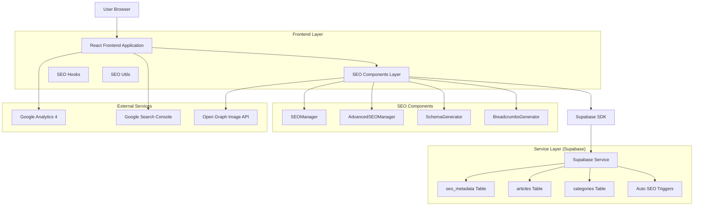
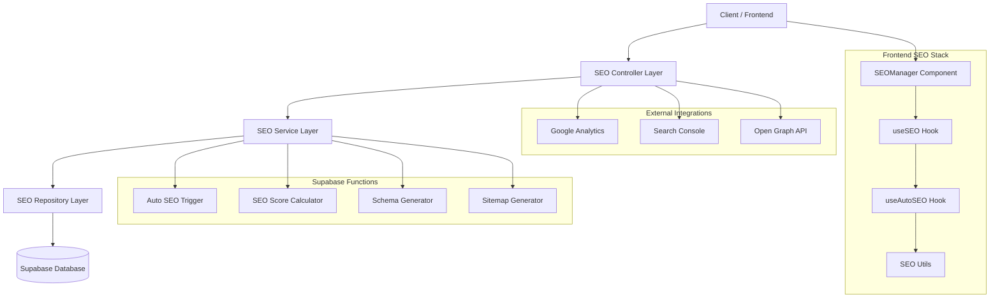
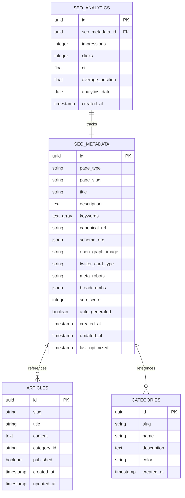

# Arquitetura Técnica - Sistema SEO Automático AIMindset

## 1. Arquitetura Design



## 2. Technology Description

- **Frontend**: React@18 + TypeScript + Tailwind CSS + Vite
- **Backend**: Supabase (PostgreSQL + Auth + Storage)
- **SEO Framework**: React Helmet Async + Custom Hooks
- **Analytics**: Google Analytics 4 + Google Search Console
- **Performance**: Web Vitals + Resource Optimization
- **Cache**: Browser Cache + Supabase Cache + Memory Cache

## 3. Route Definitions

| Route | Purpose | SEO Status | Page Type |
|-------|---------|------------|-----------|
| `/` | Home page, displays main content and navigation | ✅ Implementado | home |
| `/artigo/:slug` | Individual article page with full content | ✅ Implementado | article |
| `/categoria/:slug` | Category page showing filtered articles | ✅ Implementado | category |
| `/categoria` | All categories listing page | ✅ Implementado | categories |
| `/artigos` | All articles listing with search and filters | ❌ Precisa SEO | articles |
| `/newsletter` | Newsletter subscription landing page | ❌ Precisa SEO | newsletter |
| `/sobre` | About page with company information | ✅ Implementado | about |
| `/contato` | Contact page with form and information | ✅ Implementado | contact |
| `/politica-privacidade` | Privacy policy page | ✅ Implementado | privacy |
| `/admin` | Admin dashboard (protected route) | ❌ Precisa SEO | admin |
| `/admin/login` | Admin login page | ❌ Precisa SEO | admin_login |

## 4. API Definitions

### 4.1 Core SEO APIs

#### Buscar metadados SEO
```
GET /api/seo-metadata
```

Request:
| Param Name | Param Type | isRequired | Description |
|------------|------------|------------|-------------|
| page_type | string | true | Tipo da página (home, article, category, etc.) |
| page_slug | string | false | Slug da página (null para páginas sem slug) |

Response:
| Param Name | Param Type | Description |
|------------|------------|-------------|
| id | uuid | ID único do registro |
| page_type | string | Tipo da página |
| page_slug | string | Slug da página |
| title | string | Título SEO otimizado |
| description | string | Meta description |
| keywords | string[] | Array de palavras-chave |
| canonical_url | string | URL canônica |
| schema_org | object | Dados estruturados Schema.org |
| open_graph_image | string | URL da imagem Open Graph |
| meta_robots | string | Diretivas para robots |
| seo_score | number | Pontuação SEO (0-100) |
| auto_generated | boolean | Se foi gerado automaticamente |

Example Response:
```json
{
  "id": "123e4567-e89b-12d3-a456-426614174000",
  "page_type": "article",
  "page_slug": "machine-learning-iniciantes",
  "title": "Machine Learning para Iniciantes: Guia Completo 2024",
  "description": "Aprenda Machine Learning do zero com nosso guia completo para iniciantes. Inclui Python, algoritmos, projetos práticos e tudo que você precisa saber.",
  "keywords": ["machine learning", "iniciantes", "python", "algoritmos", "IA"],
  "canonical_url": "https://aimindset.com.br/artigo/machine-learning-iniciantes",
  "schema_org": {
    "@context": "https://schema.org",
    "@type": "Article",
    "headline": "Machine Learning para Iniciantes: Guia Completo 2024"
  },
  "open_graph_image": "https://aimindset.com.br/og-images/machine-learning-iniciantes.jpg",
  "meta_robots": "index, follow, max-snippet:-1",
  "seo_score": 95,
  "auto_generated": false
}
```

#### Gerar SEO automático
```
POST /api/auto-generate-seo
```

Request:
| Param Name | Param Type | isRequired | Description |
|------------|------------|------------|-------------|
| page_type | string | true | Tipo da página |
| page_slug | string | false | Slug da página |
| content | string | false | Conteúdo para análise |
| title | string | false | Título base |
| category | string | false | Categoria para contexto |

Response:
| Param Name | Param Type | Description |
|------------|------------|-------------|
| success | boolean | Status da operação |
| data | object | Dados SEO gerados |
| recommendations | string[] | Recomendações de melhoria |

### 4.2 Analytics APIs

#### Métricas SEO
```
GET /api/seo-analytics
```

Request:
| Param Name | Param Type | isRequired | Description |
|------------|------------|------------|-------------|
| date_range | string | false | Período (7d, 30d, 90d) |
| page_type | string | false | Filtrar por tipo de página |

Response:
| Param Name | Param Type | Description |
|------------|------------|-------------|
| total_pages | number | Total de páginas |
| pages_with_seo | number | Páginas com SEO |
| average_seo_score | number | Pontuação média |
| top_performing_pages | array | Páginas com melhor performance |

## 5. Server Architecture Diagram



## 6. Data Model

### 6.1 Data Model Definition



### 6.2 Data Definition Language

#### Tabela SEO Metadata (Melhorada)
```sql
-- Adicionar novas colunas à tabela existente
ALTER TABLE seo_metadata 
ADD COLUMN IF NOT EXISTS keywords TEXT[],
ADD COLUMN IF NOT EXISTS schema_org JSONB,
ADD COLUMN IF NOT EXISTS open_graph_image TEXT,
ADD COLUMN IF NOT EXISTS twitter_card_type TEXT DEFAULT 'summary_large_image',
ADD COLUMN IF NOT EXISTS meta_robots TEXT DEFAULT 'index, follow, max-snippet:-1',
ADD COLUMN IF NOT EXISTS breadcrumbs JSONB,
ADD COLUMN IF NOT EXISTS seo_score INTEGER DEFAULT 0,
ADD COLUMN IF NOT EXISTS auto_generated BOOLEAN DEFAULT false,
ADD COLUMN IF NOT EXISTS last_optimized TIMESTAMP WITH TIME ZONE;

-- Índices para performance
CREATE INDEX IF NOT EXISTS idx_seo_metadata_page_type_slug ON seo_metadata(page_type, page_slug);
CREATE INDEX IF NOT EXISTS idx_seo_metadata_seo_score ON seo_metadata(seo_score DESC);
CREATE INDEX IF NOT EXISTS idx_seo_metadata_auto_generated ON seo_metadata(auto_generated);
CREATE INDEX IF NOT EXISTS idx_seo_metadata_last_optimized ON seo_metadata(last_optimized DESC);

-- Constraint para garantir unicidade
ALTER TABLE seo_metadata 
ADD CONSTRAINT unique_page_type_slug 
UNIQUE (page_type, page_slug);
```

#### Tabela SEO Analytics
```sql
-- Criar tabela para métricas de SEO
CREATE TABLE IF NOT EXISTS seo_analytics (
    id UUID PRIMARY KEY DEFAULT gen_random_uuid(),
    seo_metadata_id UUID REFERENCES seo_metadata(id) ON DELETE CASCADE,
    impressions INTEGER DEFAULT 0,
    clicks INTEGER DEFAULT 0,
    ctr DECIMAL(5,4) DEFAULT 0,
    average_position DECIMAL(5,2) DEFAULT 0,
    analytics_date DATE NOT NULL,
    created_at TIMESTAMP WITH TIME ZONE DEFAULT NOW(),
    
    -- Constraint para evitar duplicatas por data
    UNIQUE(seo_metadata_id, analytics_date)
);

-- Índices para analytics
CREATE INDEX idx_seo_analytics_date ON seo_analytics(analytics_date DESC);
CREATE INDEX idx_seo_analytics_ctr ON seo_analytics(ctr DESC);
CREATE INDEX idx_seo_analytics_impressions ON seo_analytics(impressions DESC);
```

#### Função para Geração Automática de SEO
```sql
-- Função para calcular pontuação SEO
CREATE OR REPLACE FUNCTION calculate_seo_score(
    p_title TEXT,
    p_description TEXT,
    p_keywords TEXT[],
    p_schema_org JSONB
) RETURNS INTEGER AS $$
DECLARE
    score INTEGER := 0;
BEGIN
    -- Título (30 pontos máximo)
    IF p_title IS NOT NULL THEN
        IF LENGTH(p_title) BETWEEN 30 AND 60 THEN
            score := score + 30;
        ELSIF LENGTH(p_title) BETWEEN 20 AND 70 THEN
            score := score + 20;
        ELSE
            score := score + 10;
        END IF;
    END IF;
    
    -- Descrição (25 pontos máximo)
    IF p_description IS NOT NULL THEN
        IF LENGTH(p_description) BETWEEN 120 AND 155 THEN
            score := score + 25;
        ELSIF LENGTH(p_description) BETWEEN 100 AND 170 THEN
            score := score + 20;
        ELSE
            score := score + 10;
        END IF;
    END IF;
    
    -- Keywords (20 pontos máximo)
    IF p_keywords IS NOT NULL AND array_length(p_keywords, 1) > 0 THEN
        IF array_length(p_keywords, 1) BETWEEN 3 AND 8 THEN
            score := score + 20;
        ELSIF array_length(p_keywords, 1) BETWEEN 1 AND 10 THEN
            score := score + 15;
        ELSE
            score := score + 5;
        END IF;
    END IF;
    
    -- Schema.org (25 pontos máximo)
    IF p_schema_org IS NOT NULL AND p_schema_org != '{}'::jsonb THEN
        score := score + 25;
    END IF;
    
    RETURN LEAST(score, 100);
END;
$$ LANGUAGE plpgsql;

-- Trigger para atualização automática do SEO score
CREATE OR REPLACE FUNCTION update_seo_score()
RETURNS TRIGGER AS $$
BEGIN
    NEW.seo_score := calculate_seo_score(
        NEW.title,
        NEW.description,
        NEW.keywords,
        NEW.schema_org
    );
    
    NEW.last_optimized := NOW();
    
    RETURN NEW;
END;
$$ LANGUAGE plpgsql;

-- Aplicar trigger
DROP TRIGGER IF EXISTS trigger_update_seo_score ON seo_metadata;
CREATE TRIGGER trigger_update_seo_score
    BEFORE INSERT OR UPDATE ON seo_metadata
    FOR EACH ROW
    EXECUTE FUNCTION update_seo_score();
```

#### Função para Auto-geração de SEO
```sql
-- Função para gerar SEO automático para artigos
CREATE OR REPLACE FUNCTION auto_generate_article_seo()
RETURNS TRIGGER AS $$
DECLARE
    auto_title TEXT;
    auto_description TEXT;
    auto_keywords TEXT[];
    auto_schema JSONB;
BEGIN
    -- Gerar título otimizado
    auto_title := NEW.title || ' | AIMindset - Inteligência Artificial';
    
    -- Gerar descrição a partir do excerpt ou conteúdo
    IF NEW.excerpt IS NOT NULL AND LENGTH(NEW.excerpt) > 50 THEN
        auto_description := LEFT(NEW.excerpt, 150) || '...';
    ELSE
        auto_description := 'Aprenda sobre ' || NEW.title || ' no AIMindset. Conteúdo completo sobre Inteligência Artificial, Machine Learning e tecnologia.';
    END IF;
    
    -- Gerar keywords básicas
    auto_keywords := ARRAY[
        'inteligência artificial',
        'machine learning',
        'IA',
        'tecnologia',
        LOWER(REPLACE(NEW.title, ' ', '-'))
    ];
    
    -- Gerar Schema.org
    auto_schema := jsonb_build_object(
        '@context', 'https://schema.org',
        '@type', 'Article',
        'headline', NEW.title,
        'description', auto_description,
        'author', jsonb_build_object(
            '@type', 'Organization',
            'name', 'AIMindset',
            'url', 'https://aimindset.com.br'
        ),
        'publisher', jsonb_build_object(
            '@type', 'Organization',
            'name', 'AIMindset',
            'logo', jsonb_build_object(
                '@type', 'ImageObject',
                'url', 'https://aimindset.com.br/logo.png'
            )
        ),
        'datePublished', NEW.created_at,
        'dateModified', NEW.updated_at
    );
    
    -- Inserir ou atualizar SEO metadata
    INSERT INTO seo_metadata (
        page_type,
        page_slug,
        title,
        description,
        keywords,
        canonical_url,
        schema_org,
        auto_generated
    ) VALUES (
        'article',
        NEW.slug,
        auto_title,
        auto_description,
        auto_keywords,
        'https://aimindset.com.br/artigo/' || NEW.slug,
        auto_schema,
        true
    )
    ON CONFLICT (page_type, page_slug)
    DO UPDATE SET
        title = EXCLUDED.title,
        description = EXCLUDED.description,
        keywords = EXCLUDED.keywords,
        canonical_url = EXCLUDED.canonical_url,
        schema_org = EXCLUDED.schema_org,
        updated_at = NOW()
    WHERE seo_metadata.auto_generated = true;
    
    RETURN NEW;
END;
$$ LANGUAGE plpgsql;

-- Aplicar trigger nos artigos
DROP TRIGGER IF EXISTS trigger_auto_generate_article_seo ON articles;
CREATE TRIGGER trigger_auto_generate_article_seo
    AFTER INSERT OR UPDATE ON articles
    FOR EACH ROW
    WHEN (NEW.published = true)
    EXECUTE FUNCTION auto_generate_article_seo();
```

#### Dados Iniciais para Páginas sem SEO
```sql
-- Inserir SEO para Newsletter
INSERT INTO seo_metadata (
    page_type,
    page_slug,
    title,
    description,
    keywords,
    canonical_url,
    schema_org,
    meta_robots,
    auto_generated
) VALUES (
    'newsletter',
    null,
    'Newsletter AIMindset - Receba Conteúdo Exclusivo sobre IA',
    'Inscreva-se na newsletter da AIMindset e receba semanalmente conteúdo exclusivo sobre Inteligência Artificial, Machine Learning e tecnologia. Mais de 10.000 profissionais já fazem parte da nossa comunidade.',
    ARRAY['newsletter', 'inteligência artificial', 'machine learning', 'conteúdo exclusivo', 'IA', 'tecnologia'],
    'https://aimindset.com.br/newsletter',
    jsonb_build_object(
        '@context', 'https://schema.org',
        '@type', 'WebPage',
        'name', 'Newsletter AIMindset',
        'description', 'Newsletter exclusiva sobre Inteligência Artificial',
        'publisher', jsonb_build_object(
            '@type', 'Organization',
            'name', 'AIMindset',
            'url', 'https://aimindset.com.br'
        )
    ),
    'index, follow, max-snippet:-1',
    false
) ON CONFLICT (page_type, page_slug) DO NOTHING;

-- Inserir SEO para AllArticles
INSERT INTO seo_metadata (
    page_type,
    page_slug,
    title,
    description,
    keywords,
    canonical_url,
    schema_org,
    meta_robots,
    auto_generated
) VALUES (
    'articles',
    null,
    'Todos os Artigos sobre IA e Machine Learning | AIMindset',
    'Explore nossa biblioteca completa de artigos sobre Inteligência Artificial, Machine Learning, Deep Learning e tecnologia. Conteúdo atualizado regularmente por especialistas.',
    ARRAY['artigos IA', 'machine learning', 'deep learning', 'tutoriais', 'inteligência artificial', 'biblioteca'],
    'https://aimindset.com.br/artigos',
    jsonb_build_object(
        '@context', 'https://schema.org',
        '@type', 'CollectionPage',
        'name', 'Artigos AIMindset',
        'description', 'Biblioteca completa de artigos sobre IA',
        'publisher', jsonb_build_object(
            '@type', 'Organization',
            'name', 'AIMindset',
            'url', 'https://aimindset.com.br'
        )
    ),
    'index, follow, max-snippet:-1',
    false
) ON CONFLICT (page_type, page_slug) DO NOTHING;

-- Inserir SEO para Admin (noindex)
INSERT INTO seo_metadata (
    page_type,
    page_slug,
    title,
    description,
    keywords,
    canonical_url,
    schema_org,
    meta_robots,
    auto_generated
) VALUES (
    'admin',
    null,
    'Painel Administrativo - AIMindset',
    'Área restrita para administração do site AIMindset.',
    ARRAY['admin', 'painel', 'administrativo'],
    'https://aimindset.com.br/admin',
    jsonb_build_object(
        '@context', 'https://schema.org',
        '@type', 'WebPage',
        'name', 'Painel Admin'
    ),
    'noindex, nofollow',
    false
) ON CONFLICT (page_type, page_slug) DO NOTHING;

-- Inserir SEO para AdminLogin (noindex)
INSERT INTO seo_metadata (
    page_type,
    page_slug,
    title,
    description,
    keywords,
    canonical_url,
    schema_org,
    meta_robots,
    auto_generated
) VALUES (
    'admin_login',
    null,
    'Login Administrativo - AIMindset',
    'Página de login para administradores do AIMindset.',
    ARRAY['login', 'admin', 'administrativo'],
    'https://aimindset.com.br/admin/login',
    jsonb_build_object(
        '@context', 'https://schema.org',
        '@type', 'WebPage',
        'name', 'Login Admin'
    ),
    'noindex, nofollow',
    false
) ON CONFLICT (page_type, page_slug) DO NOTHING;
```

#### Configurações de Segurança RLS
```sql
-- Habilitar RLS na tabela seo_analytics
ALTER TABLE seo_analytics ENABLE ROW LEVEL SECURITY;

-- Política para leitura pública de SEO metadata
CREATE POLICY "Allow public read access to seo_metadata" ON seo_metadata
    FOR SELECT USING (true);

-- Política para admin gerenciar SEO analytics
CREATE POLICY "Allow authenticated users to read seo_analytics" ON seo_analytics
    FOR SELECT USING (auth.role() = 'authenticated');

CREATE POLICY "Allow admin to manage seo_analytics" ON seo_analytics
    FOR ALL USING (
        EXISTS (
            SELECT 1 FROM auth.users 
            WHERE auth.users.id = auth.uid() 
            AND auth.users.raw_user_meta_data->>'role' IN ('admin', 'super_admin')
        )
    );

-- Grants necessários
GRANT SELECT ON seo_metadata TO anon;
GRANT ALL PRIVILEGES ON seo_metadata TO authenticated;
GRANT ALL PRIVILEGES ON seo_analytics TO authenticated;
```