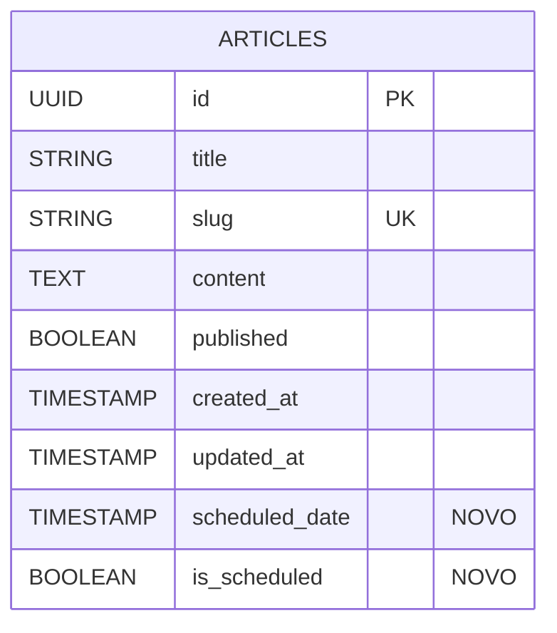

# 📅 Sistema de Agendamento de Artigos - Fase 2.0

## 1. Visão Geral

### Objetivo
Implementar um sistema completo de agendamento de artigos, totalmente integrado ao painel admin e à interface pública, permitindo que artigos sejam programados para publicação automática em uma data/hora definida, e exibindo dinamicamente um card otimizado na página inicial com o próximo artigo agendado.

### Escopo
- Sistema de agendamento com interface datetime-local no admin
- Publicação automática via cron/scheduler
- Card público "Próximo Artigo" na homepage
- Integração completa com SEOManager e ArticleManager existentes
- Performance otimizada com cache e lazy loading

## 2. Arquitetura Técnica

### Diagrama de Fluxo
```mermaid
graph TD
    A[Admin Panel] -->|Cria/Edita Artigo| B{Agendamento?}
    B -->|Sim| C[Salva com scheduled_date]
    B -->|Não| D[Publica Imediatamente]
    C --> E[Scheduler (15min)]
    E -->|scheduled_date <= now()| F[Atualiza published=true]
    F --> G[Invalida Cache]
    G --> H[Atualiza SEO]
    H --> I[Notifica Sistemas]
    J[Homepage] -->|GET /api/articles/next| K[Próximo Artigo]
    K -->|Existe| L[Renderiza Card]
    K -->|Não Existe| M[Oculta Card]
```

### Componentes Principais
- **ArticleScheduler**: Gerencia agendamento e publicação automática
- **NextArticleCard**: Componente React para exibição pública
- **ScheduleManager**: Hook para gerenciamento de estado
- **CronJob**: Script de publicação automática
- **CacheManager**: Otimização de performance

## 3. Banco de Dados

### Alterações no Schema
```sql
-- Adicionar campos de agendamento
ALTER TABLE articles 
ADD COLUMN scheduled_date TIMESTAMP NULL, 
ADD COLUMN is_scheduled BOOLEAN DEFAULT FALSE;

-- Índices para performance
CREATE INDEX idx_articles_scheduled_date ON articles(scheduled_date) 
WHERE is_scheduled = true;

CREATE INDEX idx_articles_scheduled_status ON articles(is_scheduled, scheduled_date) 
WHERE is_scheduled = true;
```

### Modelo de Dados Atualizado


## 4. API Endpoints

### GET /api/articles/next
**Descrição**: Retorna o próximo artigo agendado mais próximo da data atual

**Response**:
```json
{
  "success": true,
  "data": {
    "id": 52,
    "title": "O Futuro Ético da IA",
    "slug": "o-futuro-etico-da-ia",
    "scheduled_date": "2025-11-09T09:00:00Z",
    "formatted_date": "09 de Novembro, 2025"
  }
}
```

**Cache**: TTL 15 minutos (900s)

### POST /api/articles/schedule
**Descrição**: Agenda um artigo para publicação futura

**Request**:
```json
{
  "article_id": 52,
  "scheduled_date": "2025-11-09T09:00:00Z"
}
```

**Response**:
```json
{
  "success": true,
  "message": "Artigo agendado com sucesso",
  "data": {
    "id": 52,
    "scheduled_date": "2025-11-09T09:00:00Z",
    "is_scheduled": true
  }
}
```

## 5. Componentes React

### NextArticleCard Component
```tsx
interface NextArticleCardProps {
  article: {
    id: number;
    title: string;
    slug: string;
    scheduled_date: string;
    formatted_date: string;
  } | null;
  isLoading?: boolean;
}

const NextArticleCard: React.FC<NextArticleCardProps> = ({ 
  article, 
  isLoading = false 
}) => {
  if (isLoading) return <ShimmerPlaceholder />;
  if (!article) return null;

  return (
    <div className="next-article-card">
      <div className="card-header">
        <CalendarIcon />
        <span>Próxima Publicação</span>
      </div>
      <h3 className="article-title">{article.title}</h3>
      <p className="article-date">{article.formatted_date}</p>
    </div>
  );
};
```

### ScheduleManager Hook
```tsx
interface UseScheduleManagerReturn {
  scheduleArticle: (articleId: number, date: string) => Promise<void>;
  unscheduleArticle: (articleId: number) => Promise<void>;
  isScheduling: boolean;
  error: string | null;
}

export const useScheduleManager = (): UseScheduleManagerReturn => {
  const [isScheduling, setIsScheduling] = useState(false);
  const [error, setError] = useState<string | null>(null);

  const scheduleArticle = async (articleId: number, date: string) => {
    try {
      setIsScheduling(true);
      setError(null);
      
      await supabase
        .from('articles')
        .update({
          scheduled_date: date,
          is_scheduled: true,
          published: false
        })
        .eq('id', articleId);

      // Invalidar cache
      await invalidateArticleCache(articleId);
      
      // Registrar log
      await logSystemEvent('article_scheduled', {
        article_id: articleId,
        scheduled_date: date
      });

    } catch (err) {
      setError(err.message);
      throw err;
    } finally {
      setIsScheduling(false);
    }
  };

  return { scheduleArticle, isScheduling, error };
};
```

## 6. Scheduler/Cron

### Supabase Edge Function
```typescript
// supabase/functions/publish-scheduled-articles/index.ts

import { createClient } from '@supabase/supabase-js'

const supabase = createClient(
  Deno.env.get('SUPABASE_URL'),
  Deno.env.get('SUPABASE_SERVICE_ROLE_KEY')
)

Deno.serve(async (req) => {
  try {
    // Buscar artigos prontos para publicação
    const { data: articles } = await supabase
      .from('articles')
      .select('id, title, scheduled_date')
      .eq('is_scheduled', true)
      .lte('scheduled_date', new Date().toISOString())

    if (!articles?.length) {
      return new Response(JSON.stringify({ 
        success: true, 
        message: 'Nenhum artigo para publicar' 
      }))
    }

    // Publicar artigos
    const publishedIds = []
    for (const article of articles) {
      await supabase
        .from('articles')
        .update({
          published: true,
          is_scheduled: false,
          published_at: new Date().toISOString()
        })
        .eq('id', article.id)

      publishedIds.push(article.id)

      // Registrar log
      await supabase.from('system_logs').insert({
        event_type: 'article_auto_published',
        event_data: { article_id: article.id, title: article.title },
        created_at: new Date().toISOString()
      })
    }

    return new Response(JSON.stringify({
      success: true,
      message: `${publishedIds.length} artigos publicados`,
      published_ids: publishedIds
    }))

  } catch (error) {
    return new Response(JSON.stringify({ 
      success: false, 
      error: error.message 
    }), { status: 500 })
  }
})
```

### Cron Configuration
```json
{
  "cron": {
    "publish-scheduled-articles": {
      "schedule": "*/15 * * * *",
      "function": "publish-scheduled-articles"
    }
  }
}
```

## 7. Integração com Sistemas Existentes

### SEOManager Integration
```tsx
// Atualizar SEOManager para considerar artigos agendados
export const useSEO = (article: Article) => {
  const seoData = useMemo(() => {
    // Se agendado, usar meta tags específicas
    if (article.is_scheduled) {
      return {
        title: `${article.title} | Em Breve`,
        description: `Artigo agendado para ${formatDate(article.scheduled_date)}`,
        robots: 'noindex, follow',
        'article:published_time': article.scheduled_date
      }
    }
    
    // SEO normal para artigos publicados
    return standardSEOMeta(article)
  }, [article])

  return seoData
}
```

### ArticleManager Integration
```tsx
// Modificar queries para excluir artigos agendados da listagem pública
const getPublishedArticles = async () => {
  return supabase
    .from('articles')
    .select('*')
    .eq('published', true)
    .eq('is_scheduled', false) // Excluir agendados
    .order('published_at', { ascending: false })
}

const getScheduledArticles = async () => {
  return supabase
    .from('articles')
    .select('*')
    .eq('is_scheduled', true)
    .order('scheduled_date', { ascending: true })
}
```

## 8. Performance e Cache

### Cache Strategy
```typescript
interface CacheConfig {
  nextArticle: 900, // 15 minutos
  scheduledList: 300, // 5 minutos
  articleData: 600 // 10 minutos
}

export const cacheNextArticle = async (article: Article | null) => {
  const cacheKey = 'next_scheduled_article'
  const ttl = 900 // 15 minutos
  
  await setCache(cacheKey, article, ttl)
}

export const getCachedNextArticle = async (): Promise<Article | null> => {
  const cacheKey = 'next_scheduled_article'
  return await getCache(cacheKey)
}
```

### Lazy Loading
```tsx
const NextArticleSection = () => {
  const [nextArticle, setNextArticle] = useState<Article | null>(null)
  const [isLoading, setIsLoading] = useState(true)

  useEffect(() => {
    // Carregar após o conteúdo principal
    const timer = setTimeout(() => {
      fetchNextArticle()
    }, 1000)

    return () => clearTimeout(timer)
  }, [])

  const fetchNextArticle = async () => {
    try {
      // Verificar cache primeiro
      const cached = await getCachedNextArticle()
      if (cached) {
        setNextArticle(cached)
        setIsLoading(false)
        return
      }

      // Buscar da API se não houver cache
      const response = await fetch('/api/articles/next')
      const data = await response.json()
      
      setNextArticle(data.data)
      await cacheNextArticle(data.data)
    } catch (error) {
      console.error('Erro ao carregar próximo artigo:', error)
    } finally {
      setIsLoading(false)
    }
  }

  return <NextArticleCard article={nextArticle} isLoading={isLoading} />
}
```

## 9. Testes e Validação

### Casos de Teste
1. **Criação de Artigo Agendado**
   - Criar artigo com data futura
   - Verificar que não aparece na listagem pública
   - Confirmar que is_scheduled = true

2. **Publicação Automática**
   - Agendar artigo para 2 minutos no futuro
   - Aguardar execução do cron
   - Verificar publicação automática
   - Confirmar logs de sistema

3. **Card de Próximo Artigo**
   - Verificar renderização condicional
   - Testar cache de 15 minutos
   - Validar formato de data
   - Testar fallback quando não há agendados

4. **Performance**
   - Medir impacto no tempo de carregamento
   - Verificar cache funcionando
   - Testar lazy loading

### Checklist de QA
- [ ] Artigo agendado não aparece como publicado
- [ ] Artigo é publicado automaticamente na data configurada
- [ ] Card "Próximo Artigo" exibe corretamente o mais próximo
- [ ] Quando não houver agendamento → card some automaticamente
- [ ] SEOManager reconhece o novo artigo após publicação
- [ ] Logs e backups registrando corretamente os eventos
- [ ] Nenhum impacto visual no layout existente

## 10. Roadmap de Implementação

### Fase 1: Backend (2 dias)
1. Migration do banco de dados
2. Criar endpoints da API
3. Implementar Supabase Edge Function
4. Configurar cron job
5. Adicionar logs e monitoramento

### Fase 2: Admin Panel (1.5 dias)
1. Adicionar campos de agendamento no formulário
2. Criar hook useScheduleManager
3. Atualizar validações
4. Adicionar preview de agendamento

### Fase 3: Frontend Público (1.5 dias)
1. Criar componente NextArticleCard
2. Implementar lazy loading
3. Adicionar cache strategy
4. Criar shimmer placeholder
5. Integrar na homepage

### Fase 4: Integração e Testes (2 dias)
1. Integrar com SEOManager
2. Atualizar ArticleManager
3. Adicionar sistema de logs
4. Implementar backup
5. Testes completos de QA
6. Deploy e monitoramento

**Tempo Total Estimado: 7 dias**

## 🚀 Próximos Passos

1. Criar migration do banco de dados
2. Implementar Supabase Edge Function
3. Desenvolver componentes React
4. Configurar sistema de cache
5. Realizar testes de integração
6. Deploy para produção

---

**Status**: Documentação técnica completa ✅  
**Próxima Etapa**: Iniciar implementação do backend