# Fase 2.1: Auditoria e Aprimoramento do Sistema de Agendamento de Artigos

## 📋 Visão Geral da Auditoria

### Objetivos Principais
- **SEO 100% otimizado** com controle dinâmico de indexação
- **Sistema auditável** com logs e backups automáticos
- **Alertas inteligentes** para falhas e rollback automático
- **UX aprimorada** com validações e contador regressivo
- **Cache inteligente** com invalidação automática
- **Zero impacto visual** no layout existente

### Escopo de Auditoria
Esta fase foca em aprimorar o sistema de agendamento implementado na Fase 2.0, garantindo:
- Segurança na publicação automática
- Rastreabilidade completa de eventos
- Recuperação rápida em caso de falhas
- Performance otimizada com caching
- Experiência do usuário refinada

---

## 🔍 1. SEO Dinâmico Integrado

### 1.1 Controle de Indexação para Artigos Agendados

```typescript
// Hook useScheduledSEO.ts
export const useScheduledSEO = (article: Article) => {
  const isScheduled = article.is_scheduled && article.scheduled_date;
  const isPublished = !isScheduled && article.published;
  
  const metaRobots = isScheduled 
    ? 'noindex, nofollow' 
    : isPublished 
    ? 'index, follow' 
    : 'noindex, nofollow';
  
  return {
    metaRobots,
    isIndexable: isPublished,
    scheduledDate: article.scheduled_date
  };
};
```

### 1.2 Meta Tags Dinâmicas

```tsx
// Componente ScheduledArticleMeta.tsx
export const ScheduledArticleMeta: React.FC<{ article: Article }> = ({ article }) => {
  const { metaRobots, isIndexable } = useScheduledSEO(article);
  
  return (
    <>
      <meta name="robots" content={metaRobots} />
      {article.is_scheduled && (
        <meta name="scheduled-date" content={article.scheduled_date} />
      )}
      {isIndexable && (
        <>
          <meta property="og:type" content="article" />
          <meta property="article:published_time" content={article.created_at} />
        </>
      )}
    </>
  );
};
```

### 1.3 Cache de Meta-dados

```typescript
// Cache de meta-dados com TTL de 30 minutos
const metaCache = new Map<string, { data: any; timestamp: number }>();
const META_CACHE_TTL = 30 * 60 * 1000; // 30 minutos

export const getCachedMetaData = (articleId: string) => {
  const cached = metaCache.get(articleId);
  if (cached && Date.now() - cached.timestamp < META_CACHE_TTL) {
    return cached.data;
  }
  return null;
};

export const invalidateMetaCache = (articleId: string) => {
  metaCache.delete(articleId);
};
```

---

## 🧾 2. Sistema de Logs e Backup Automáticos

### 2.1 Eventos de Log Padronizados

```typescript
// Tipos de eventos de log
export enum LogEventType {
  ARTICLE_AUTO_PUBLISH_INIT = 'ARTICLE_AUTO_PUBLISH_INIT',
  ARTICLE_AUTO_PUBLISH_SUCCESS = 'ARTICLE_AUTO_PUBLISH_SUCCESS',
  ARTICLE_AUTO_PUBLISH_FAIL = 'ARTICLE_AUTO_PUBLISH_FAIL',
  BACKUP_AUTO_BEFORE_PUBLISH = 'BACKUP_AUTO_BEFORE_PUBLISH',
  BACKUP_AUTO_AFTER_PUBLISH = 'BACKUP_AUTO_AFTER_PUBLISH',
  SCHEDULED_SEO_CACHE_INVALIDATE = 'SCHEDULED_SEO_CACHE_INVALIDATE'
}

// Interface de log
export interface SystemLog {
  id: string;
  type: LogEventType;
  message: string;
  metadata: Record<string, any>;
  severity: 'info' | 'warning' | 'error';
  created_at: string;
}
```

### 2.2 Sistema de Backup Incremental

```typescript
// BackupService.ts
export class BackupService {
  async createSnapshot(tableName: string, recordId: string): Promise<string> {
    const record = await supabase
      .from(tableName)
      .select('*')
      .eq('id', recordId)
      .single();
    
    const snapshot = {
      table: tableName,
      recordId,
      data: record.data,
      timestamp: new Date().toISOString(),
      version: '1.0'
    };
    
    const { data } = await supabase
      .from('backups')
      .insert(snapshot)
      .select()
      .single();
    
    return data.id;
  }
  
  async restoreFromSnapshot(backupId: string): Promise<boolean> {
    const { data: backup } = await supabase
      .from('backups')
      .select('*')
      .eq('id', backupId)
      .single();
    
    if (!backup) return false;
    
    await supabase
      .from(backup.table)
      .update(backup.data)
      .eq('id', backup.recordId);
    
    return true;
  }
}
```

### 2.3 Fluxo de Publicação com Backup

```mermaid
graph TD
    A[Cron Executa] --> B[Busca Artigos Agendados]
    B --> C{Criar Backup?}
    C -->|Sim| D[Criar Snapshot]
    D --> E[Log: BACKUP_AUTO_BEFORE_PUBLISH]
    C -->|Não| F[Publicar Artigo]
    E --> F
    F --> G{Publicação OK?}
    G -->|Sim| H[Atualizar Status]
    H --> I[Log: ARTICLE_AUTO_PUBLISH_SUCCESS]
    I --> J[Criar Backup Pós-Publicação]
    J --> K[Log: BACKUP_AUTO_AFTER_PUBLISH]
    G -->|Falha| L[Log: ARTICLE_AUTO_PUBLISH_FAIL]
    L --> M{Restaurar Backup?}
    M -->|Sim| N[Restore Snapshot]
    M -->|Não| O[Alertar Admin]
```



---

## 📬 3. Sistema de Alertas e Notificações

### 3.1 Configuração de Alertas

```typescript
// AlertService.ts
export class AlertService {
  private failureCount = 0;
  private readonly MAX_FAILURES = 2;
  
  async notifyFailure(error: Error, context: any): Promise<void> {
    this.failureCount++;
    
    if (this.failureCount >= this.MAX_FAILURES) {
      await this.sendCriticalAlert({
        type: 'article_auto_publish_error',
        message: 'Falha ao publicar artigos agendados – verifique logs.',
        error: error.message,
        context,
        timestamp: new Date().toISOString()
      });
      
      // Resetar contador após notificação
      this.failureCount = 0;
    }
  }
  
  private async sendCriticalAlert(alert: Alert): Promise<void> {
    // Enviar email para admin
    await this.sendEmailAlert(alert);
    
    // Registrar no sistema de logs
    await this.logAlert(alert);
    
    // Notificar via webhook se configurado
    if (process.env.ALERT_WEBHOOK_URL) {
      await this.sendWebhookAlert(alert);
    }
  }
}
```

### 3.2 Template de Email de Alerta

```typescript
// Email template para alertas críticos
const alertEmailTemplate = (alert: Alert) => ({
  subject: '🚨 AIMindset - Falha Crítica no Agendamento',
  html: `
    <div style="font-family: Arial, sans-serif; max-width: 600px;">
      <h2 style="color: #e74c3c;">⚠️ Falha no Sistema de Agendamento</h2>
      <p><strong>Tipo:</strong> ${alert.type}</p>
      <p><strong>Mensagem:</strong> ${alert.message}</p>
      <p><strong>Erro:</strong> ${alert.error}</p>
      <p><strong>Horário:</strong> ${alert.timestamp}</p>
      <hr>
      <p style="color: #7f8c8d; font-size: 12px;">
        Verifique os logs do sistema para mais detalhes.
      </p>
    </div>
  `
});
```

---

## 🧠 4. UX Aprimorada no Painel Admin

### 4.1 Validação de Data/Hora

```typescript
// Validação de data futura
export const validateScheduledDate = (scheduledDate: string): ValidationResult => {
  const now = new Date();
  const scheduled = new Date(scheduledDate);
  
  if (scheduled <= now) {
    return {
      isValid: false,
      message: '⚠️ Data anterior detectada – artigo publicado imediatamente.',
      autoPublish: true
    };
  }
  
  return {
    isValid: true,
    message: 'Data válida para agendamento'
  };
};

// Hook para contador regressivo
export const useCountdown = (targetDate: string) => {
  const [countdown, setCountdown] = useState('');
  
  useEffect(() => {
    const interval = setInterval(() => {
      const now = new Date().getTime();
      const target = new Date(targetDate).getTime();
      const difference = target - now;
      
      if (difference > 0) {
        const days = Math.floor(difference / (1000 * 60 * 60 * 24));
        const hours = Math.floor((difference % (1000 * 60 * 60 * 24)) / (1000 * 60 * 60));
        const minutes = Math.floor((difference % (1000 * 60 * 60)) / (1000 * 60));
        
        setCountdown(`em ${days} dias, ${hours}h ${minutes}min`);
      } else {
        setCountdown('Publicação iminente');
      }
    }, 60000); // Atualizar a cada minuto
    
    return () => clearInterval(interval);
  }, [targetDate]);
  
  return countdown;
};
```

### 4.2 Componente de Preview de Agendamento

```tsx
// ScheduledArticlePreview.tsx
export const ScheduledArticlePreview: React.FC<{ scheduledDate: string }> = ({ scheduledDate }) => {
  const countdown = useCountdown(scheduledDate);
  const formattedDate = new Date(scheduledDate).toLocaleString('pt-BR');
  
  return (
    <div className="bg-blue-50 border border-blue-200 rounded-lg p-4 mt-4">
      <div className="flex items-center space-x-2">
        <Clock className="h-5 w-5 text-blue-600" />
        <div>
          <p className="text-sm font-medium text-blue-900">
            Publicação agendada para: {formattedDate}
          </p>
          <p className="text-xs text-blue-700">
            {countdown}
          </p>
        </div>
      </div>
    </div>
  );
};
```

---

## ⚡ 5. Cache Inteligente no Frontend

### 5.1 Configuração de Cache Global

```typescript
// CacheService.ts
export class CacheService {
  private cache = new Map<string, CacheEntry>();
  private readonly DEFAULT_TTL = 15 * 60 * 1000; // 15 minutos
  
  set(key: string, data: any, ttl = this.DEFAULT_TTL): void {
    this.cache.set(key, {
      data,
      timestamp: Date.now(),
      ttl
    });
  }
  
  get(key: string): any | null {
    const entry = this.cache.get(key);
    if (!entry) return null;
    
    if (Date.now() - entry.timestamp > entry.ttl) {
      this.cache.delete(key);
      return null;
    }
    
    return entry.data;
  }
  
  invalidate(key: string): void {
    this.cache.delete(key);
  }
  
  invalidatePattern(pattern: string): void {
    const regex = new RegExp(pattern);
    for (const key of this.cache.keys()) {
      if (regex.test(key)) {
        this.cache.delete(key);
      }
    }
  }
}
```

### 5.2 Hook de Cache para Próximo Artigo

```typescript
// useCachedNextArticle.ts
export const useCachedNextArticle = () => {
  const cacheKey = 'next-scheduled-article';
  const cached = cacheService.get(cacheKey);
  
  const { data, loading, error } = useQuery(
    ['next-scheduled-article'],
    fetchNextScheduledArticle,
    {
      initialData: cached,
      staleTime: 15 * 60 * 1000, // 15 minutos
      cacheTime: 15 * 60 * 1000,
      refetchOnWindowFocus: false
    }
  );
  
  useEffect(() => {
    if (data && !cached) {
      cacheService.set(cacheKey, data);
    }
  }, [data, cached]);
  
  return { data, loading, error };
};
```

### 5.3 Invalidação Automática

```typescript
// Invalidação de cache quando artigo é publicado
export const invalidateScheduledCaches = (articleId: string) => {
  // Invalidar cache do próximo artigo
  cacheService.invalidate('next-scheduled-article');
  
  // Invalidar cache de meta-dados
  cacheService.invalidatePattern(`article-meta-${articleId}.*`);
  
  // Invalidar cache de lista de artigos
  cacheService.invalidatePattern('articles-list.*');
  
  // Invalidar via API se estiver usando Edge Functions
  fetch('/api/cache/invalidate', {
    method: 'POST',
    headers: { 'Content-Type': 'application/json' },
    body: JSON.stringify({ 
      patterns: ['scheduled-articles', 'next-article'] 
    })
  });
};
```

---

## 🧪 6. Testes e Validação de Auditoria

### 6.1 Casos de Teste Obrigatórios

| Teste | Descrição | Resultado Esperado |
|-------|-----------|-------------------|
| **SEO Dinâmico** | Artigo agendado deve ter `noindex,nofollow` | Meta tag robots bloqueia indexação |
| **Publicação Automática** | Cron executa na hora agendada | Artigo publicado e SEO liberado |
| **Backup Pré/Pós** | Sistema cria snapshots | Backups gerados antes e depois |
| **Alertas de Falha** | 2 falhas consecutivas disparam alerta | Email enviado para admin |
| **Validação de Data** | Tentativa de agendar no passado | Publicação imediata com aviso |
| **Contador Regressivo** | Preview mostra tempo restante | Display correto de dias/horas |
| **Cache Frontend** | Card carrega com cache de 15min | Performance otimizada |
| **Invalidação de Cache** | Publicação automática invalida cache | Cache limpo e novo dados carregados |
| **Rollback Seguro** | Falha na publicação restaura backup | Estado anterior recuperado |
| **Flag de Desativação** | ENABLE_SCHEDULER=false | Sistema desabilitado sem erros |

### 6.2 Script de Teste Automatizado

```typescript
// scheduled-system.test.ts
describe('Sistema de Agendamento - Auditoria', () => {
  test('SEO dinâmico para artigos agendados', async () => {
    const scheduledArticle = createMockArticle({ 
      is_scheduled: true,
      scheduled_date: futureDate()
    });
    
    const { metaRobots } = useScheduledSEO(scheduledArticle);
    expect(metaRobots).toBe('noindex, nofollow');
  });
  
  test('Criação de backup antes da publicação', async () => {
    const backupService = new BackupService();
    const articleId = 'test-123';
    
    const backupId = await backupService.createSnapshot('articles', articleId);
    expect(backupId).toBeDefined();
    
    const restored = await backupService.restoreFromSnapshot(backupId);
    expect(restored).toBe(true);
  });
  
  test('Validação de data futura', () => {
    const pastDate = new Date(Date.now() - 86400000).toISOString();
    const result = validateScheduledDate(pastDate);
    
    expect(result.isValid).toBe(false);
    expect(result.autoPublish).toBe(true);
  });
  
  test('Invalidação de cache após publicação', () => {
    const cacheService = new CacheService();
    cacheService.set('test-key', 'test-data');
    
    invalidateScheduledCaches('article-123');
    
    expect(cacheService.get('test-key')).toBeNull();
  });
});
```

---

## 🛡️ 7. Sistema de Rollback Seguro

### 7.1 Configuração de Rollback Automático

```typescript
// RollbackService.ts
export class RollbackService {
  async performRollback(articleId: string, backupId: string): Promise<boolean> {
    try {
      // 1. Criar backup do estado atual (para rollback do rollback)
      const currentBackup = await this.backupService.createSnapshot('articles', articleId);
      
      // 2. Restaurar backup anterior
      const restored = await this.backupService.restoreFromSnapshot(backupId);
      
      if (restored) {
        // 3. Registrar log de rollback
        await this.logRollback(articleId, backupId, currentBackup);
        
        // 4. Invalidar caches relacionados
        invalidateScheduledCaches(articleId);
        
        return true;
      }
      
      return false;
    } catch (error) {
      await this.logRollbackError(articleId, error);
      return false;
    }
  }
  
  private async logRollback(articleId: string, backupId: string, currentBackup: string): Promise<void> {
    await supabase.from('system_logs').insert({
      type: 'ROLLBACK_PERFORMED',
      message: `Rollback executado para artigo ${articleId}`,
      metadata: {
        articleId,
        restoredBackupId: backupId,
        currentBackupId: currentBackup,
        timestamp: new Date().toISOString()
      },
      severity: 'warning'
    });
  }
}
```

### 7.2 Flag de Controle Global

```typescript
// Configuração de flags
export const SCHEDULER_CONFIG = {
  ENABLE_SCHEDULER: process.env.ENABLE_SCHEDULER === 'true',
  MAX_RETRY_ATTEMPTS: parseInt(process.env.MAX_RETRY_ATTEMPTS || '3'),
  BACKUP_ENABLED: process.env.BACKUP_ENABLED !== 'false',
  ALERT_ENABLED: process.env.ALERT_ENABLED !== 'false',
  CACHE_TTL_MINUTES: parseInt(process.env.CACHE_TTL_MINUTES || '15')
};

// Verificação de flags antes da execução
export const isSchedulerEnabled = (): boolean => {
  return SCHEDULER_CONFIG.ENABLE_SCHEDULER;
};

// Middleware de verificação
export const schedulerMiddleware = (handler: Function) => {
  return async (...args: any[]) => {
    if (!isSchedulerEnabled()) {
      console.log('Scheduler desabilitado via flag ENABLE_SCHEDULER');
      return { success: false, message: 'Scheduler desabilitado' };
    }
    
    return await handler(...args);
  };
};
```

---

## 📊 8. Métricas de Performance e KPIs

### 8.1 Métricas Principais

| KPI | Meta | Monitoramento |
|-----|------|---------------|
| **Tempo de Publicação Automática** | < 2 segundos | Prometheus/Grafana |
| **Taxa de Sucesso do Cron** | > 99% | Dashboard Admin |
| **Tempo de Backup** | < 500ms | Logs de Performance |
| **Cache Hit Rate** | > 80% | Analytics Interno |
| **Tempo de Rollback** | < 1 segundo | Logs de Sistema |
| **Disponibilidade do Scheduler** | 99.9% | Health Check |

### 8.2 Dashboard de Monitoramento

```typescript
// Dashboard de métricas do sistema de agendamento
export const ScheduledMetricsDashboard = () => {
  const [metrics, setMetrics] = useState<SchedulerMetrics>({
    successRate: 0,
    avgPublishTime: 0,
    cacheHitRate: 0,
    totalScheduled: 0,
    totalPublished: 0
  });
  
  return (
    <div className="grid grid-cols-1 md:grid-cols-3 gap-4">
      <MetricCard
        title="Taxa de Sucesso"
        value={`${metrics.successRate}%`}
        trend={metrics.successRate > 95 ? 'up' : 'down'}
      />
      <MetricCard
        title="Tempo Médio"
        value={`${metrics.avgPublishTime}ms`}
        trend={metrics.avgPublishTime < 2000 ? 'up' : 'down'}
      />
      <MetricCard
        title="Cache Hit Rate"
        value={`${metrics.cacheHitRate}%`}
        trend={metrics.cacheHitRate > 80 ? 'up' : 'down'}
      />
    </div>
  );
};
```

---

## 🔧 9. Implementação e Deployment

### 9.1 Checklist de Deployment

- [ ] Configurar variáveis de ambiente
- [ ] Executar migrations do banco de dados
- [ ] Configurar Supabase Edge Functions
- [ ] Ativar cron jobs no Vercel
- [ ] Configurar alertas de email
- [ ] Testar rollback em staging
- [ ] Validar SEO dinâmico
- [ ] Monitorar métricas iniciais

### 9.2 Variáveis de Ambiente Necessárias

```bash
# Sistema de Agendamento
ENABLE_SCHEDULER=true
MAX_RETRY_ATTEMPTS=3
CACHE_TTL_MINUTES=15

# Backup
BACKUP_ENABLED=true
BACKUP_RETENTION_DAYS=30

# Alertas
ALERT_ENABLED=true
ALERT_WEBHOOK_URL=https://hooks.slack.com/services/...
ADMIN_EMAIL=admin@aimindset.com

# SEO
SEO_CACHE_TTL_MINUTES=30
META_ROBOTS_SCHEDULED=noindex,nofollow
```

---

## 📋 Conclusão

Este documento técnico define os padrões para uma implementação auditável e segura do sistema de agendamento de artigos do AIMindset. A Fase 2.1 garante:

- ✅ **SEO dinâmico** com controle total de indexação
- ✅ **Sistema auditável** com logs e backups automáticos
- ✅ **Recuperação segura** via rollback automático
- ✅ **Performance otimizada** com cache inteligente
- ✅ **UX aprimorada** com validações e feedback visual
- ✅ **Monitoramento completo** com métricas e alertas

O sistema está pronto para implementação com total segurança e rastreabilidade.