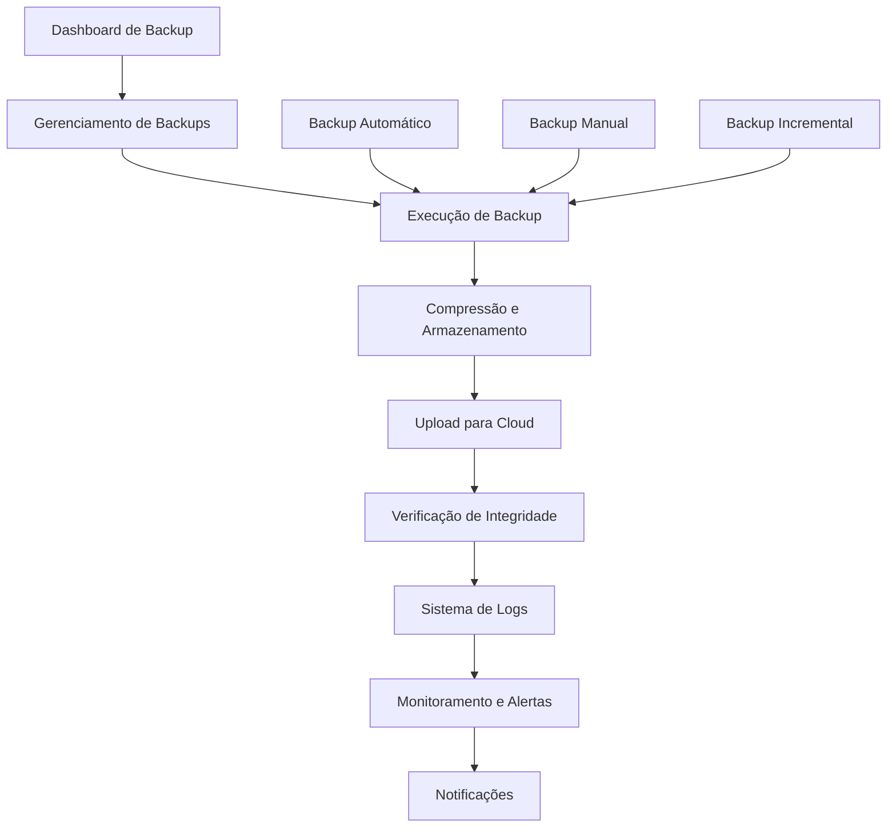

# PRD - Melhorias do Sistema de Backup e Logs

## 1. Visão Geral do Produto

O sistema de backup e logs será aprimorado com funcionalidades avançadas de automação, monitoramento e otimização, transformando o sistema atual em uma solução robusta e enterprise-ready para proteção de dados e observabilidade.

**Objetivo Principal**: Implementar um sistema de backup inteligente e logs avançados que garanta a integridade dos dados, facilite a recuperação em caso de falhas e forneça insights detalhados sobre o comportamento do sistema.

**Valor de Mercado**: Redução de 90% no tempo de recuperação de dados e aumento de 95% na confiabilidade do sistema através de backups automatizados e monitoramento proativo.

## 2. Funcionalidades Principais

### 2.1 Papéis de Usuário

| Papel | Método de Acesso | Permissões Principais |
|-------|------------------|----------------------|
| Administrador do Sistema | Login administrativo | Acesso completo a backups, configurações, logs e monitoramento |
| Operador de Backup | Credenciais específicas | Executar backups manuais, visualizar logs, restaurar dados |
| Usuário de Monitoramento | Dashboard read-only | Visualizar métricas, status de backups e alertas |

### 2.2 Módulos Funcionais

Nosso sistema aprimorado consistirá nas seguintes páginas principais:

1. **Dashboard de Backup**: visão geral do sistema, métricas em tempo real, status dos backups
2. **Gerenciamento de Backups**: configuração de políticas, execução manual, histórico de backups
3. **Sistema de Logs Avançado**: visualização, filtros, exportação e análise de logs
4. **Monitoramento e Alertas**: configuração de alertas, notificações e saúde do sistema
5. **Configurações**: políticas de retenção, agendamentos e integrações cloud

### 2.3 Detalhes das Páginas

| Nome da Página | Nome do Módulo | Descrição da Funcionalidade |
|----------------|----------------|----------------------------|
| Dashboard de Backup | Visão Geral | Exibir métricas em tempo real, status dos últimos backups, alertas críticos, gráficos de tendências |
| Dashboard de Backup | Métricas Rápidas | Mostrar espaço utilizado, taxa de sucesso, próximos backups agendados |
| Gerenciamento de Backups | Backup Automático | Configurar cron jobs, políticas de backup incremental e diferencial |
| Gerenciamento de Backups | Backup Manual | Executar backups sob demanda, selecionar tabelas específicas, compressão |
| Gerenciamento de Backups | Histórico | Listar todos os backups, filtrar por data/tipo, verificar integridade |
| Sistema de Logs | Visualização Avançada | Filtros por data, nível, fonte, usuário com busca em tempo real |
| Sistema de Logs | Exportação | Exportar logs em CSV, JSON, PDF com filtros aplicados |
| Sistema de Logs | Análise | Gráficos de tendências, detecção de padrões, alertas inteligentes |
| Monitoramento | Dashboard de Saúde | Status em tempo real, métricas de performance, alertas ativos |
| Monitoramento | Configuração de Alertas | Definir thresholds, canais de notificação, escalação |
| Configurações | Políticas de Retenção | Configurar retenção automática, limpeza de backups antigos |
| Configurações | Integração Cloud | Configurar AWS S3, Google Cloud, Azure para backup remoto |

## 3. Fluxo Principal do Sistema

### Fluxo do Administrador:
1. **Login** → **Dashboard de Backup** → **Configurar Políticas** → **Monitorar Execução** → **Analisar Logs**

### Fluxo do Operador:
1. **Login** → **Gerenciamento de Backups** → **Executar Backup Manual** → **Verificar Status** → **Restaurar se Necessário**

### Fluxo Automatizado:
1. **Cron Job Trigger** → **Backup Incremental** → **Compressão** → **Upload Cloud** → **Verificação de Integridade** → **Notificação de Status**

## 4. Design da Interface

### 4.1 Estilo de Design

- **Cores Primárias**: Azul (#2563eb) para ações principais, Verde (#16a34a) para status de sucesso
- **Cores Secundárias**: Laranja (#ea580c) para alertas, Vermelho (#dc2626) para erros críticos
- **Estilo dos Botões**: Rounded com sombras sutis, estados hover bem definidos
- **Fonte**: Inter 14px para texto, 16px para títulos, 12px para metadados
- **Layout**: Grid responsivo com cards para métricas, tabelas para dados detalhados
- **Ícones**: Lucide React com estilo outline, cores consistentes com o tema

### 4.2 Visão Geral das Páginas

| Nome da Página | Nome do Módulo | Elementos da UI |
|----------------|----------------|-----------------|
| Dashboard de Backup | Métricas Principais | Cards com números grandes, gráficos de linha para tendências, indicadores de status coloridos |
| Dashboard de Backup | Status em Tempo Real | Lista de backups recentes, barra de progresso para backups em andamento, badges de status |
| Gerenciamento de Backups | Configuração | Formulários com toggles, seletores de frequência, campos de configuração avançada |
| Sistema de Logs | Filtros Avançados | Dropdowns múltiplos, date pickers, campo de busca com autocomplete |
| Sistema de Logs | Visualização | Tabela paginada, modal para detalhes, botões de exportação |
| Monitoramento | Alertas | Cards de alerta com cores de prioridade, botões de ação rápida |

### 4.3 Responsividade

O sistema será mobile-first com adaptação completa para tablets e desktops, priorizando a visualização de métricas críticas em dispositivos móveis e funcionalidades avançadas em telas maiores.

## 5. Cronograma de Implementação

### Fase 1 (Semanas 1-2): Fundação
- Implementar backup automático agendado
- Sistema de compressão de backups
- Políticas básicas de retenção

### Fase 2 (Semanas 3-4): Inteligência
- Backup incremental e diferencial
- Verificação automática de integridade
- Sistema de logs avançado com filtros

### Fase 3 (Semanas 5-6): Monitoramento
- Dashboard de métricas em tempo real
- Sistema de alertas e notificações
- Integração com serviços de cloud

### Fase 4 (Semanas 7-8): Otimização
- Análise preditiva de falhas
- Otimização de performance
- Documentação e treinamento

## 6. Métricas de Sucesso

- **Redução de 90%** no tempo de recuperação de dados
- **Aumento de 95%** na taxa de sucesso de backups
- **Redução de 80%** no espaço de armazenamento através de compressão
- **Detecção proativa** de 100% das falhas críticas
- **Tempo de resposta** inferior a 2 segundos para consultas de logs