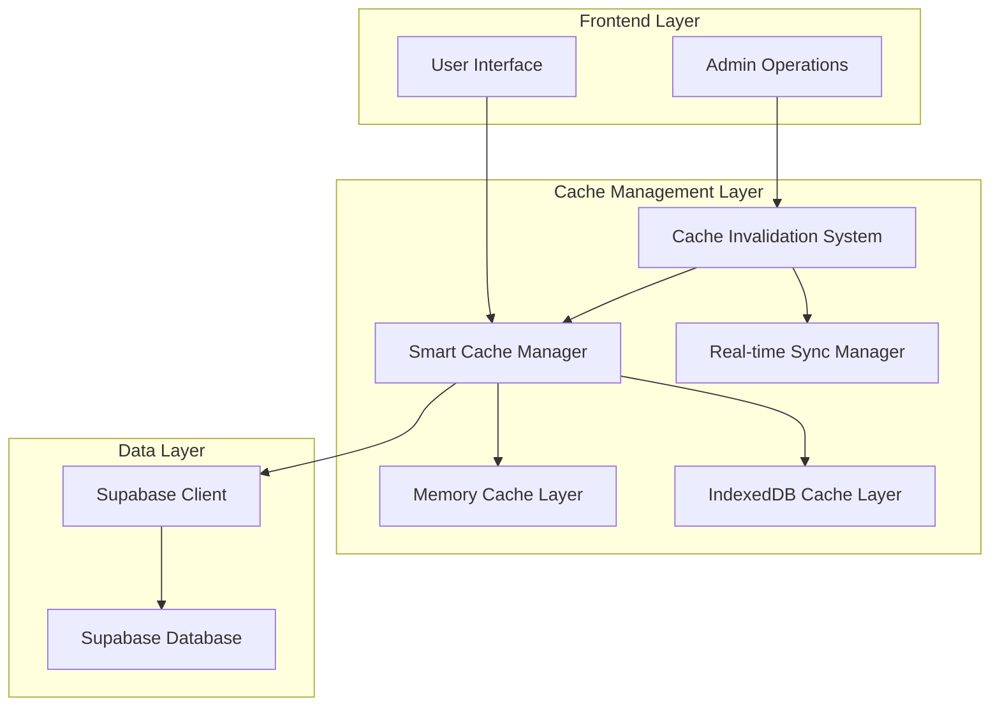
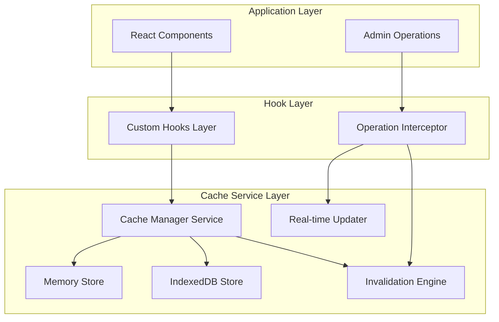
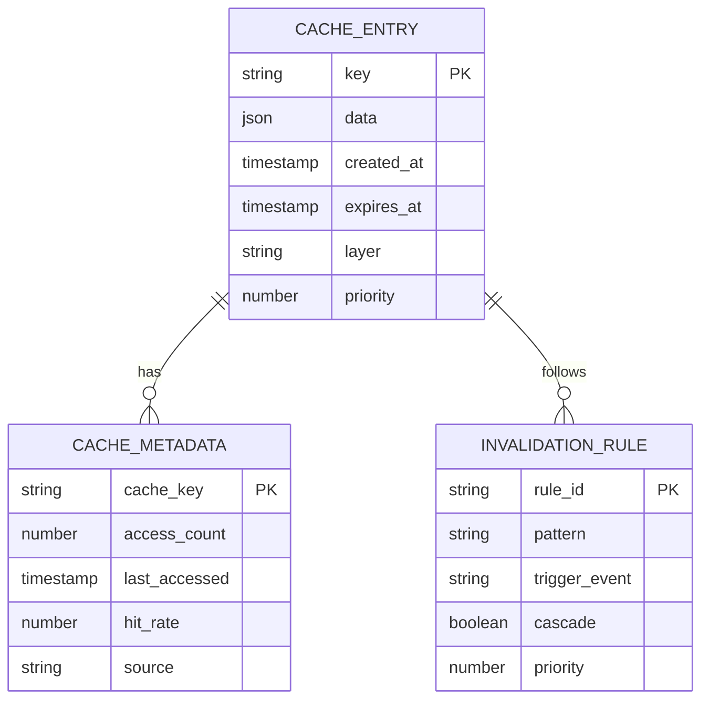

# Arquitetura Técnica - Otimização de Performance Inteligente

## 1. Arquitetura de Design



## 2. Descrição de Tecnologias

- **Frontend**: React@18 + TypeScript + Vite
- **Cache Layer**: Memory Cache + IndexedDB + React Query
- **State Management**: React Context + Custom Hooks
- **Database**: Supabase (PostgreSQL)
- **Performance**: Service Worker + Prefetch Strategy

## 3. Definições de Rotas

| Rota | Propósito | Cache Strategy |
|------|-----------|----------------|
| /home | Página inicial com artigos em destaque | Smart Cache + Prefetch |
| /articles | Lista completa de artigos | Infinite Scroll + Cache |
| /article/:id | Detalhes do artigo | Individual Cache + Prefetch |
| /admin | Painel administrativo | Real-time + No Cache |
| /admin/edit/:id | Editor de artigos | Real-time + Auto-save |

## 4. Sistema de Cache Inteligente

### 4.1 Estratégias de Cache

**Cache Híbrido Multi-Layer:**
```typescript
interface CacheStrategy {
  memoryCache: {
    ttl: number;
    maxSize: number;
    priority: 'high' | 'medium' | 'low';
  };
  indexedDBCache: {
    ttl: number;
    compression: boolean;
    encryption: boolean;
  };
  invalidationRules: {
    onCRUD: boolean;
    onPublish: boolean;
    selective: boolean;
  };
}
```

**Níveis de Cache:**
1. **L1 - Memory Cache**: Dados mais acessados (artigos em destaque)
2. **L2 - IndexedDB Cache**: Dados persistentes (lista de artigos)
3. **L3 - Service Worker Cache**: Assets estáticos e API responses

### 4.2 Sistema de Invalidação Inteligente

```typescript
interface InvalidationSystem {
  // Invalidação seletiva por operação
  onArticleCreate: () => void;
  onArticleUpdate: (articleId: string) => void;
  onArticlePublish: (articleId: string) => void;
  onArticleDelete: (articleId: string) => void;
  
  // Invalidação em cascata
  invalidateRelated: (articleId: string) => void;
  invalidateCategories: () => void;
  invalidateStats: () => void;
}
```

## 5. Definições de API Otimizadas

### 5.1 APIs de Cache

**Cache Management API**
```typescript
// Gerenciamento de cache
interface CacheAPI {
  get: <T>(key: string) => Promise<T | null>;
  set: <T>(key: string, data: T, ttl?: number) => Promise<void>;
  invalidate: (pattern: string) => Promise<void>;
  prefetch: (keys: string[]) => Promise<void>;
}
```

**Smart Fetch API**
```typescript
// Busca inteligente com cache
interface SmartFetchAPI {
  fetchArticles: (options: FetchOptions) => Promise<Article[]>;
  fetchArticle: (id: string, useCache?: boolean) => Promise<Article>;
  fetchCategories: (useCache?: boolean) => Promise<Category[]>;
  fetchStats: (useCache?: boolean) => Promise<Stats>;
}
```

### 5.2 APIs de Operações Admin

**Article Management API**
```typescript
// Operações que invalidam cache automaticamente
interface AdminAPI {
  createArticle: (data: ArticleData) => Promise<Article>;
  updateArticle: (id: string, data: Partial<ArticleData>) => Promise<Article>;
  publishArticle: (id: string, published: boolean) => Promise<boolean>;
  deleteArticle: (id: string) => Promise<boolean>;
}
```

## 6. Arquitetura do Servidor de Cache



## 7. Modelo de Dados de Cache

### 7.1 Definição do Modelo de Cache



### 7.2 Estruturas de Dados de Cache

**Cache Entry Structure**
```typescript
interface CacheEntry<T> {
  key: string;
  data: T;
  metadata: {
    createdAt: number;
    expiresAt: number;
    accessCount: number;
    lastAccessed: number;
    source: 'memory' | 'indexeddb' | 'network';
    priority: number;
  };
  invalidationRules: string[];
}
```

**Cache Configuration**
```typescript
interface CacheConfig {
  // Configuração de TTL por tipo de dados
  ttl: {
    articles: 300000; // 5 minutos
    categories: 600000; // 10 minutos
    stats: 60000; // 1 minuto
    user_data: 900000; // 15 minutos
  };
  
  // Limites de cache
  limits: {
    memoryMaxEntries: 100;
    memoryMaxSize: '50MB';
    indexedDBMaxSize: '200MB';
  };
  
  // Estratégias de invalidação
  invalidation: {
    onCRUD: true;
    onPublish: true;
    selective: true;
    cascade: true;
  };
}
```

## 8. Hooks Otimizados

### 8.1 Hook Principal de Artigos

```typescript
interface UseArticlesOptimized {
  // Dados com cache inteligente
  articles: Article[];
  loading: boolean;
  error: string | null;
  
  // Operações que invalidam cache
  createArticle: (data: ArticleData) => Promise<Article>;
  updateArticle: (id: string, data: Partial<ArticleData>) => Promise<Article>;
  publishArticle: (id: string, published: boolean) => Promise<boolean>;
  deleteArticle: (id: string) => Promise<boolean>;
  
  // Controle de cache
  refreshCache: () => Promise<void>;
  prefetchArticle: (id: string) => Promise<void>;
  invalidateCache: (pattern?: string) => Promise<void>;
}
```

### 8.2 Hook de Cache Manager

```typescript
interface UseCacheManager {
  // Status do cache
  cacheStats: CacheStats;
  isOnline: boolean;
  
  // Controles manuais
  clearCache: () => Promise<void>;
  optimizeCache: () => Promise<void>;
  exportCache: () => Promise<CacheExport>;
  importCache: (data: CacheExport) => Promise<void>;
}
```

## 9. Estratégias de Performance

### 9.1 Prefetch Inteligente

```typescript
interface PrefetchStrategy {
  // Prefetch baseado em comportamento do usuário
  onHover: boolean; // Prefetch ao passar mouse sobre link
  onVisible: boolean; // Prefetch quando elemento fica visível
  onIdle: boolean; // Prefetch durante idle time
  
  // Prefetch baseado em padrões
  relatedArticles: boolean; // Artigos relacionados
  nextPage: boolean; // Próxima página de listagem
  popularContent: boolean; // Conteúdo popular
}
```

### 9.2 Otimizações de Rede

```typescript
interface NetworkOptimization {
  // Batching de requisições
  batchRequests: boolean;
  batchDelay: number;
  
  // Compressão de dados
  compression: boolean;
  compressionLevel: number;
  
  // Retry inteligente
  retryStrategy: {
    maxRetries: number;
    backoffMultiplier: number;
    jitter: boolean;
  };
}
```

## 10. Monitoramento e Métricas

### 10.1 Métricas de Performance

```typescript
interface PerformanceMetrics {
  // Cache metrics
  cacheHitRate: number;
  cacheMissRate: number;
  cacheSize: number;
  
  // Network metrics
  networkRequests: number;
  averageResponseTime: number;
  errorRate: number;
  
  // User experience metrics
  pageLoadTime: number;
  timeToInteractive: number;
  cumulativeLayoutShift: number;
}
```

### 10.2 Sistema de Alertas

```typescript
interface AlertSystem {
  // Alertas de performance
  slowQueries: boolean;
  highErrorRate: boolean;
  cacheOverflow: boolean;
  
  // Alertas de funcionalidade
  adminOperationsFailed: boolean;
  cacheInconsistency: boolean;
  dataCorruption: boolean;
}
```

## 11. Implementação Gradual

### 11.1 Fase 1 - Cache Básico (Semana 1)
- Implementar cache em memória para artigos
- Sistema básico de invalidação
- Hooks otimizados para listagem

### 11.2 Fase 2 - Cache Persistente (Semana 2)
- Adicionar IndexedDB cache
- Implementar prefetch inteligente
- Otimizar operações admin

### 11.3 Fase 3 - Otimizações Avançadas (Semana 3)
- Service Worker cache
- Métricas e monitoramento
- Ajustes finos de performance

## 12. Garantias de Funcionalidade

### 12.1 Testes de Integridade

```typescript
interface IntegrityTests {
  // Testes de funcionalidade admin
  testCreateArticle: () => Promise<boolean>;
  testUpdateArticle: () => Promise<boolean>;
  testPublishArticle: () => Promise<boolean>;
  testDeleteArticle: () => Promise<boolean>;
  
  // Testes de cache
  testCacheInvalidation: () => Promise<boolean>;
  testCacheConsistency: () => Promise<boolean>;
  testCacheFallback: () => Promise<boolean>;
}
```

### 12.2 Fallback Strategies

```typescript
interface FallbackStrategies {
  // Fallback para falhas de cache
  onCacheFailure: 'network' | 'stale' | 'error';
  
  // Fallback para operações admin
  onAdminFailure: 'retry' | 'queue' | 'error';
  
  // Fallback para rede offline
  onOffline: 'cache' | 'queue' | 'error';
}
```

## 13. Conclusão

Esta arquitetura garante:

✅ **Performance Otimizada**: Cache inteligente multi-layer  
✅ **Funcionalidades Preservadas**: Todas as operações admin funcionam  
✅ **Sincronização Automática**: Cache se atualiza automaticamente  
✅ **Experiência Fluida**: Sem recarregamentos desnecessários  
✅ **Robustez**: Fallbacks e recuperação de erros  
✅ **Monitoramento**: Métricas e alertas em tempo real  

O sistema é projetado para ser implementado gradualmente, mantendo a estabilidade atual enquanto adiciona melhorias de performance incrementais.