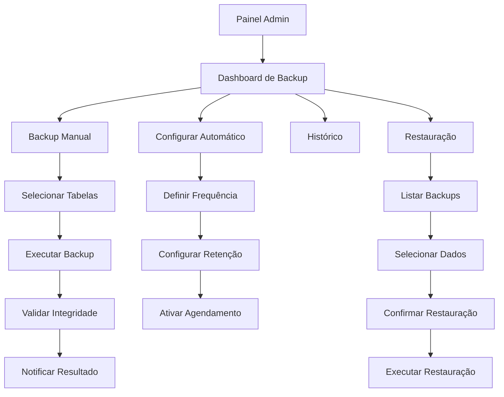
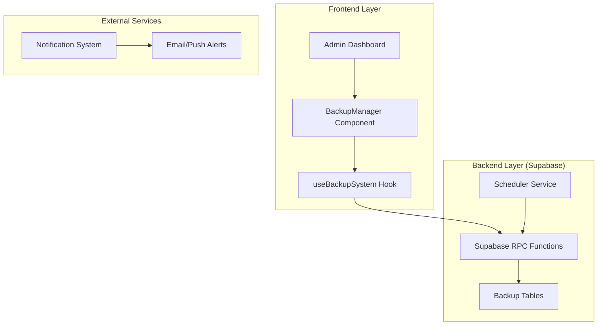
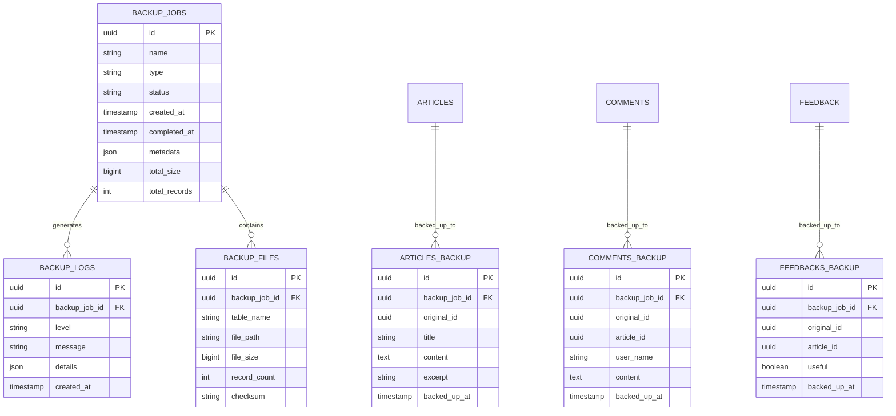

# 💾 Sistema de Backup Completo - AIMindset
## Documentação Técnica

---

## 1. Visão Geral do Projeto

O Sistema de Backup do AIMindset é uma solução completa de backup e restauração automática integrada ao Supabase, projetada para garantir a segurança total dos dados críticos da plataforma (artigos, comentários e feedbacks). O sistema oferece funcionalidades de backup automático programado, backup manual sob demanda, restauração seletiva e monitoramento em tempo real, tudo acessível através do painel administrativo.

**Objetivo Principal**: Proteger contra perda de dados, falhas de sistema e erros humanos, garantindo continuidade operacional e recuperação rápida em cenários de emergência.

**Valor de Mercado**: Essencial para plataformas de conteúdo que precisam garantir alta disponibilidade e confiabilidade dos dados, atendendo requisitos de compliance e segurança empresarial.

---

## 2. Funcionalidades Principais

### 2.1 Roles de Usuário

| Role | Método de Acesso | Permissões Principais |
|------|------------------|----------------------|
| Administrador | Login com credenciais admin | Acesso completo ao sistema de backup: criar, restaurar, configurar, monitorar |
| Editor | Login padrão (sem acesso) | Sem acesso ao sistema de backup |
| Usuário Comum | Navegação pública | Sem acesso ao sistema de backup |

### 2.2 Módulos Funcionais

O sistema de backup consiste nos seguintes módulos essenciais:

1. **Dashboard de Backup**: Painel principal com estatísticas, status e controles
2. **Gerenciador de Backup Automático**: Configuração e agendamento de backups
3. **Backup Manual**: Interface para execução imediata de backups
4. **Restauração Seletiva**: Ferramenta para restaurar dados específicos
5. **Histórico e Auditoria**: Logs detalhados de todas as operações
6. **Monitoramento em Tempo Real**: Acompanhamento de progresso e status

### 2.3 Detalhamento das Funcionalidades

| Módulo | Funcionalidade | Descrição |
|--------|----------------|-----------|
| Dashboard de Backup | Visão Geral | Exibe estatísticas gerais, último backup, próximo agendado, espaço utilizado |
| Dashboard de Backup | Indicadores de Status | Mostra status em tempo real: sucesso, falha, em progresso |
| Dashboard de Backup | Alertas e Notificações | Sistema de alertas para falhas, sucessos e lembretes |
| Backup Automático | Agendamento | Configurar frequência: diário, semanal, mensal |
| Backup Automático | Backup Incremental | Salvar apenas dados modificados desde o último backup |
| Backup Automático | Validação Automática | Verificar integridade dos backups criados |
| Backup Manual | Execução Imediata | Botão para criar backup instantâneo de todas as tabelas |
| Backup Manual | Backup Seletivo | Escolher quais tabelas incluir no backup manual |
| Backup Manual | Progresso em Tempo Real | Barra de progresso e logs durante a execução |
| Restauração | Seleção de Backup | Lista de backups disponíveis com data e tamanho |
| Restauração | Restauração Seletiva | Escolher quais dados restaurar (artigos, comentários, feedbacks) |
| Restauração | Confirmação Dupla | Modal de confirmação com detalhes da operação |
| Restauração | Preview de Dados | Visualizar dados antes da restauração |
| Histórico | Lista de Backups | Histórico completo com filtros por data, status, tipo |
| Histórico | Logs Detalhados | Registros de todas as operações com timestamps |
| Histórico | Métricas de Performance | Tempo de execução, tamanho dos backups, taxa de sucesso |
| Monitoramento | Status em Tempo Real | Indicadores visuais do status atual do sistema |
| Monitoramento | Notificações Push | Alertas instantâneos para administradores |
| Monitoramento | Relatórios Automáticos | Relatórios semanais/mensais por email |

---

## 3. Fluxo Principal de Operações

### Fluxo do Administrador

**Configuração Inicial**: Admin acessa painel → Configura agendamento automático → Define políticas de retenção → Ativa notificações

**Backup Manual**: Admin acessa dashboard → Clica em "Backup Agora" → Seleciona tabelas → Confirma operação → Acompanha progresso → Recebe confirmação

**Restauração de Emergência**: Admin identifica problema → Acessa histórico de backups → Seleciona backup apropriado → Escolhe dados para restaurar → Confirma com dupla verificação → Monitora processo de restauração

### Fluxo Automático do Sistema

**Backup Programado**: Sistema verifica agendamento → Inicia backup automático → Executa backup incremental → Valida integridade → Envia notificação de status → Atualiza logs



---

## 4. Design da Interface

### 4.1 Estilo Visual

**Cores Principais**:
- Primária: #3B82F6 (Azul confiável para ações principais)
- Secundária: #10B981 (Verde para status de sucesso)
- Alerta: #F59E0B (Amarelo para avisos)
- Erro: #EF4444 (Vermelho para falhas)
- Neutro: #6B7280 (Cinza para textos secundários)

**Estilo dos Componentes**:
- Botões: Arredondados (8px), com sombras sutis e efeitos hover
- Cards: Bordas arredondadas (12px), sombra suave, fundo branco
- Tipografia: Inter/System UI, tamanhos 14px-24px
- Layout: Grid responsivo com espaçamento consistente (16px/24px)

**Ícones e Elementos**:
- Ícones: Lucide React (outline style)
- Animações: Transições suaves (300ms)
- Estados: Loading spinners, progress bars, status badges

### 4.2 Layout das Páginas

| Página | Módulo | Elementos da Interface |
|--------|--------|------------------------|
| Dashboard Principal | Visão Geral | Cards de estatísticas, gráfico de linha temporal, botões de ação rápida, lista de backups recentes |
| Dashboard Principal | Status em Tempo Real | Indicadores coloridos, badges de status, alertas flutuantes, barra de progresso global |
| Configuração | Agendamento | Toggle switches, seletores de frequência, campos de horário, preview das configurações |
| Configuração | Políticas de Retenção | Sliders para definir períodos, calculadora de espaço, confirmações visuais |
| Backup Manual | Seleção de Dados | Checkboxes para tabelas, preview de quantidade de registros, estimativa de tempo |
| Backup Manual | Execução | Barra de progresso detalhada, logs em tempo real, botão de cancelamento |
| Histórico | Lista de Backups | Tabela responsiva, filtros avançados, ações por linha (restaurar, download, deletar) |
| Histórico | Detalhes | Modal com informações completas, logs expandidos, métricas de performance |
| Restauração | Seleção de Backup | Cards de backup com preview, informações de compatibilidade, warnings de idade |
| Restauração | Confirmação | Modal de confirmação com detalhes da operação, checkboxes de confirmação dupla |

### 4.3 Responsividade

**Desktop-First**: Interface otimizada para telas grandes (1200px+) com layout em grid
**Adaptação Mobile**: Colapso de sidebar, cards empilhados, botões touch-friendly
**Breakpoints**: 1200px (desktop), 768px (tablet), 480px (mobile)
**Touch Optimization**: Botões com 44px mínimo, gestos de swipe para navegação

---

## 5. Arquitetura Técnica

### 5.1 Diagrama de Arquitetura



### 5.2 Stack Tecnológico

**Frontend**: React 18 + TypeScript + Tailwind CSS + Vite
**Backend**: Supabase (PostgreSQL + Edge Functions)
**Estado**: Zustand para gerenciamento de estado global
**UI Components**: Headless UI + Lucide React
**Notificações**: React Hot Toast + Supabase Realtime

### 5.3 Rotas da Aplicação

| Rota | Propósito |
|------|-----------|
| /admin/backup | Dashboard principal do sistema de backup |
| /admin/backup/configure | Configurações de backup automático |
| /admin/backup/manual | Interface para backup manual |
| /admin/backup/history | Histórico completo de backups |
| /admin/backup/restore | Interface de restauração |
| /admin/backup/logs | Logs detalhados do sistema |

---

## 6. APIs e Funções RPC

### 6.1 Funções RPC Principais

**Backup Operations**
```typescript
// Criar backup completo
create_full_backup()
```

Parâmetros:
| Nome | Tipo | Obrigatório | Descrição |
|------|------|-------------|-----------|
| backup_name | string | false | Nome personalizado para o backup |
| include_tables | string[] | false | Lista de tabelas a incluir (padrão: todas) |

Resposta:
| Campo | Tipo | Descrição |
|-------|------|-----------|
| backup_id | uuid | ID único do backup criado |
| status | string | Status da operação (success/error) |
| message | string | Mensagem descritiva |
| created_at | timestamp | Data/hora de criação |

**Restore Operations**
```typescript
// Restaurar dados seletivos
restore_selective_data(backup_id: uuid, tables: string[])
```

Parâmetros:
| Nome | Tipo | Obrigatório | Descrição |
|------|------|-------------|-----------|
| backup_id | uuid | true | ID do backup a ser restaurado |
| tables | string[] | true | Lista de tabelas para restaurar |
| confirm_restore | boolean | true | Confirmação dupla obrigatória |

Resposta:
| Campo | Tipo | Descrição |
|-------|------|-----------|
| restore_id | uuid | ID da operação de restauração |
| status | string | Status da operação |
| affected_rows | number | Número de registros restaurados |

### 6.2 Endpoints de Monitoramento

**Status do Sistema**
```
GET /api/backup/status
```

**Histórico de Backups**
```
GET /api/backup/history?limit=50&offset=0
```

**Métricas de Performance**
```
GET /api/backup/metrics?period=30d
```

---

## 7. Modelo de Dados

### 7.1 Diagrama Entidade-Relacionamento



### 7.2 DDL - Criação das Tabelas

**Tabela de Jobs de Backup**
```sql
-- Tabela principal de controle de backups
CREATE TABLE backup_jobs (
    id UUID PRIMARY KEY DEFAULT gen_random_uuid(),
    name VARCHAR(255) NOT NULL,
    type VARCHAR(50) NOT NULL CHECK (type IN ('manual', 'scheduled', 'incremental')),
    status VARCHAR(50) NOT NULL DEFAULT 'pending' CHECK (status IN ('pending', 'running', 'completed', 'failed', 'cancelled')),
    created_at TIMESTAMP WITH TIME ZONE DEFAULT NOW(),
    started_at TIMESTAMP WITH TIME ZONE,
    completed_at TIMESTAMP WITH TIME ZONE,
    metadata JSONB DEFAULT '{}',
    total_size BIGINT DEFAULT 0,
    total_records INTEGER DEFAULT 0,
    error_message TEXT,
    created_by UUID REFERENCES auth.users(id)
);

-- Índices para performance
CREATE INDEX idx_backup_jobs_status ON backup_jobs(status);
CREATE INDEX idx_backup_jobs_created_at ON backup_jobs(created_at DESC);
CREATE INDEX idx_backup_jobs_type ON backup_jobs(type);

-- Tabela de logs detalhados
CREATE TABLE backup_logs (
    id UUID PRIMARY KEY DEFAULT gen_random_uuid(),
    backup_job_id UUID REFERENCES backup_jobs(id) ON DELETE CASCADE,
    level VARCHAR(20) NOT NULL CHECK (level IN ('info', 'warning', 'error', 'debug')),
    message TEXT NOT NULL,
    details JSONB DEFAULT '{}',
    created_at TIMESTAMP WITH TIME ZONE DEFAULT NOW()
);

CREATE INDEX idx_backup_logs_job_id ON backup_logs(backup_job_id);
CREATE INDEX idx_backup_logs_level ON backup_logs(level);

-- Tabela de arquivos de backup
CREATE TABLE backup_files (
    id UUID PRIMARY KEY DEFAULT gen_random_uuid(),
    backup_job_id UUID REFERENCES backup_jobs(id) ON DELETE CASCADE,
    table_name VARCHAR(100) NOT NULL,
    file_path TEXT,
    file_size BIGINT DEFAULT 0,
    record_count INTEGER DEFAULT 0,
    checksum VARCHAR(64),
    created_at TIMESTAMP WITH TIME ZONE DEFAULT NOW()
);

CREATE INDEX idx_backup_files_job_id ON backup_files(backup_job_id);
CREATE INDEX idx_backup_files_table ON backup_files(table_name);
```

**Tabelas de Backup de Dados**
```sql
-- Backup da tabela articles
CREATE TABLE articles_backup (
    id UUID PRIMARY KEY DEFAULT gen_random_uuid(),
    backup_job_id UUID REFERENCES backup_jobs(id) ON DELETE CASCADE,
    original_id UUID NOT NULL,
    title TEXT NOT NULL,
    content TEXT NOT NULL,
    excerpt TEXT NOT NULL,
    image_url TEXT,
    slug VARCHAR(255) NOT NULL,
    published BOOLEAN DEFAULT false,
    is_featured_manual BOOLEAN,
    category_id UUID,
    author_id UUID,
    tags JSONB,
    original_created_at TIMESTAMP WITH TIME ZONE,
    original_updated_at TIMESTAMP WITH TIME ZONE,
    backed_up_at TIMESTAMP WITH TIME ZONE DEFAULT NOW()
);

-- Backup da tabela comments
CREATE TABLE comments_backup (
    id UUID PRIMARY KEY DEFAULT gen_random_uuid(),
    backup_job_id UUID REFERENCES backup_jobs(id) ON DELETE CASCADE,
    original_id UUID NOT NULL,
    article_id UUID,
    user_name TEXT NOT NULL,
    content TEXT NOT NULL,
    original_created_at TIMESTAMP WITH TIME ZONE,
    backed_up_at TIMESTAMP WITH TIME ZONE DEFAULT NOW()
);

-- Backup da tabela feedback
CREATE TABLE feedbacks_backup (
    id UUID PRIMARY KEY DEFAULT gen_random_uuid(),
    backup_job_id UUID REFERENCES backup_jobs(id) ON DELETE CASCADE,
    original_id UUID NOT NULL,
    article_id UUID,
    useful BOOLEAN NOT NULL,
    original_created_at TIMESTAMP WITH TIME ZONE,
    backed_up_at TIMESTAMP WITH TIME ZONE DEFAULT NOW()
);

-- Índices para as tabelas de backup
CREATE INDEX idx_articles_backup_job_id ON articles_backup(backup_job_id);
CREATE INDEX idx_articles_backup_original_id ON articles_backup(original_id);
CREATE INDEX idx_comments_backup_job_id ON comments_backup(backup_job_id);
CREATE INDEX idx_comments_backup_original_id ON comments_backup(original_id);
CREATE INDEX idx_feedbacks_backup_job_id ON feedbacks_backup(backup_job_id);
CREATE INDEX idx_feedbacks_backup_original_id ON feedbacks_backup(original_id);
```

**Configurações de Segurança RLS**
```sql
-- Habilitar RLS em todas as tabelas de backup
ALTER TABLE backup_jobs ENABLE ROW LEVEL SECURITY;
ALTER TABLE backup_logs ENABLE ROW LEVEL SECURITY;
ALTER TABLE backup_files ENABLE ROW LEVEL SECURITY;
ALTER TABLE articles_backup ENABLE ROW LEVEL SECURITY;
ALTER TABLE comments_backup ENABLE ROW LEVEL SECURITY;
ALTER TABLE feedbacks_backup ENABLE ROW LEVEL SECURITY;

-- Políticas de acesso apenas para usuários autenticados (admins)
CREATE POLICY "Admin access to backup_jobs" ON backup_jobs
    FOR ALL USING (auth.role() = 'authenticated');

CREATE POLICY "Admin access to backup_logs" ON backup_logs
    FOR ALL USING (auth.role() = 'authenticated');

CREATE POLICY "Admin access to backup_files" ON backup_files
    FOR ALL USING (auth.role() = 'authenticated');

CREATE POLICY "Admin access to articles_backup" ON articles_backup
    FOR ALL USING (auth.role() = 'authenticated');

CREATE POLICY "Admin access to comments_backup" ON comments_backup
    FOR ALL USING (auth.role() = 'authenticated');

CREATE POLICY "Admin access to feedbacks_backup" ON feedbacks_backup
    FOR ALL USING (auth.role() = 'authenticated');

-- Conceder permissões para role authenticated
GRANT ALL PRIVILEGES ON backup_jobs TO authenticated;
GRANT ALL PRIVILEGES ON backup_logs TO authenticated;
GRANT ALL PRIVILEGES ON backup_files TO authenticated;
GRANT ALL PRIVILEGES ON articles_backup TO authenticated;
GRANT ALL PRIVILEGES ON comments_backup TO authenticated;
GRANT ALL PRIVILEGES ON feedbacks_backup TO authenticated;
```

**Dados Iniciais e Configurações**
```sql
-- Inserir configuração padrão de backup automático
INSERT INTO backup_jobs (name, type, status, metadata) VALUES 
('Sistema Inicializado', 'manual', 'completed', '{"description": "Configuração inicial do sistema de backup", "version": "1.0.0"}');

-- Função para limpeza automática de backups antigos (opcional)
CREATE OR REPLACE FUNCTION cleanup_old_backups()
RETURNS INTEGER
LANGUAGE plpgsql
SECURITY DEFINER
AS $$
DECLARE
    deleted_count INTEGER;
BEGIN
    -- Remove backups mais antigos que 90 dias
    DELETE FROM backup_jobs 
    WHERE created_at < NOW() - INTERVAL '90 days'
    AND status = 'completed';
    
    GET DIAGNOSTICS deleted_count = ROW_COUNT;
    
    RETURN deleted_count;
END;
$$;

-- Conceder permissão para executar a função de limpeza
GRANT EXECUTE ON FUNCTION cleanup_old_backups() TO authenticated;
```

---

## 8. Segurança e Compliance

### 8.1 Controle de Acesso

**Autenticação**: Apenas usuários autenticados com role de administrador
**Autorização**: Políticas RLS restritivas no Supabase
**Auditoria**: Log completo de todas as operações com timestamp e usuário
**Confirmação Dupla**: Operações críticas requerem confirmação em duas etapas

### 8.2 Proteção de Dados

**Criptografia**: Dados em trânsito (HTTPS) e em repouso (Supabase encryption)
**Backup Incremental**: Otimização de espaço e redução de tempo de backup
**Validação de Integridade**: Checksums para verificar integridade dos backups
**Retenção Configurável**: Políticas automáticas de limpeza de backups antigos

### 8.3 Monitoramento e Alertas

**Logs Estruturados**: Registros detalhados em formato JSON
**Alertas em Tempo Real**: Notificações push para falhas críticas
**Métricas de Performance**: Monitoramento de tempo de execução e taxa de sucesso
**Relatórios Automáticos**: Resumos semanais/mensais por email

---

## 9. Implementação e Deploy

### 9.1 Fases de Desenvolvimento

**Fase 1**: Estrutura de dados e funções RPC básicas
**Fase 2**: Interface administrativa e backup manual
**Fase 3**: Sistema de agendamento automático
**Fase 4**: Restauração seletiva e validação
**Fase 5**: Monitoramento avançado e notificações

### 9.2 Testes e Validação

**Testes Unitários**: Cobertura de 90%+ das funções críticas
**Testes de Integração**: Validação completa do fluxo de backup/restore
**Testes de Performance**: Benchmarks com volumes reais de dados
**Testes de Recuperação**: Simulação de cenários de falha

### 9.3 Monitoramento Pós-Deploy

**Métricas de Sucesso**: Taxa de sucesso de backups > 99%
**Performance**: Tempo médio de backup < 5 minutos
**Disponibilidade**: Sistema operacional 24/7
**Alertas**: Notificação imediata de falhas críticas

---

**Documento criado em**: Janeiro 2025  
**Versão**: 1.0  
**Autor**: Sistema SOLO Document  
**Status**: Pronto para Implementação