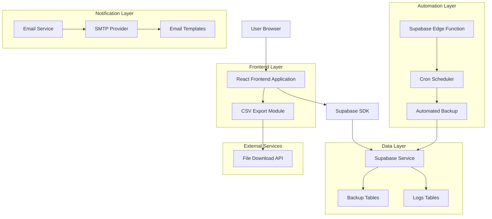

# Sistema de Backup AIMindset - Arquitetura das Funcionalidades Futuras
## Documentação Técnica Detalhada

## 1. Arquitetura Geral Expandida



## 2. Stack Tecnológico Expandido

### 2.1 Frontend
- **React@18** + **TypeScript** + **Tailwind CSS** + **Vite**
- **Bibliotecas Adicionais**:
  - `file-saver`: Download de arquivos CSV/ZIP
  - `jszip`: Compactação de múltiplos CSVs
  - `papaparse`: Geração de CSV otimizada
  - `react-hook-form`: Formulários de configuração

### 2.2 Backend/Serverless
- **Supabase Edge Functions** (Deno runtime)
- **Supabase Cron** para agendamento automático
- **Supabase RPC** para operações de backup

### 2.3 Serviços Externos
- **Resend** ou **SendGrid** para envio de emails
- **Supabase Storage** (opcional) para arquivos temporários

## 3. Rotas e Endpoints Expandidos

### 3.1 Frontend Routes
| Route | Purpose | New Features |
|-------|---------|-------------|
| `/admin/backup` | Painel de backup principal | Configuração automática, download CSV, alertas |
| `/admin/backup/settings` | Configurações avançadas | Agendamento, emails, templates |
| `/admin/backup/history` | Histórico expandido | Logs automáticos, downloads anteriores |

### 3.2 API Endpoints

#### 3.2.1 Backup Automático
```typescript
// Edge Function: automated-backup
POST /functions/v1/automated-backup
```

**Configuração:**
```typescript
// RPC: configure_automated_backup
POST /rest/v1/rpc/configure_automated_backup
```

Request:
| Param | Type | Required | Description |
|-------|------|----------|-------------|
| enabled | boolean | true | Ativar/desativar backup automático |
| frequency | string | true | 'daily', 'weekly', 'monthly' |
| time | string | true | Horário no formato 'HH:MM' |
| timezone | string | false | Timezone (default: 'America/Sao_Paulo') |

Response:
```json
{
  "success": true,
  "message": "Backup automático configurado",
  "next_execution": "2024-01-15T02:00:00Z"
}
```

#### 3.2.2 Exportação CSV
```typescript
// RPC: export_backup_csv
POST /rest/v1/rpc/export_backup_csv
```

Request:
| Param | Type | Required | Description |
|-------|------|----------|-------------|
| backup_id | uuid | false | ID específico do backup (default: mais recente) |
| format | string | false | 'csv' ou 'zip' (default: 'zip') |

Response:
```json
{
  "success": true,
  "download_url": "blob:http://localhost:5173/...",
  "filename": "backup_2024-01-15_02-00-00.zip",
  "size_bytes": 15420,
  "tables_count": 3,
  "records_count": 150
}
```

#### 3.2.3 Alertas por Email
```typescript
// RPC: configure_email_alerts
POST /rest/v1/rpc/configure_email_alerts
```

Request:
| Param | Type | Required | Description |
|-------|------|----------|-------------|
| enabled | boolean | true | Ativar/desativar alertas |
| recipients | string[] | true | Lista de emails destinatários |
| on_success | boolean | false | Enviar em caso de sucesso (default: true) |
| on_failure | boolean | false | Enviar em caso de falha (default: true) |

```typescript
// RPC: send_test_email
POST /rest/v1/rpc/send_test_email
```

## 4. Estrutura de Dados Expandida

### 4.1 Novas Tabelas

#### 4.1.1 Configurações de Backup Automático
```sql
CREATE TABLE backup_automation_config (
    id UUID PRIMARY KEY DEFAULT gen_random_uuid(),
    enabled BOOLEAN DEFAULT false,
    frequency VARCHAR(20) CHECK (frequency IN ('daily', 'weekly', 'monthly')),
    execution_time TIME NOT NULL DEFAULT '02:00:00',
    timezone VARCHAR(50) DEFAULT 'America/Sao_Paulo',
    last_execution TIMESTAMP WITH TIME ZONE,
    next_execution TIMESTAMP WITH TIME ZONE,
    created_at TIMESTAMP WITH TIME ZONE DEFAULT NOW(),
    updated_at TIMESTAMP WITH TIME ZONE DEFAULT NOW()
);
```

#### 4.1.2 Configurações de Email
```sql
CREATE TABLE email_alert_config (
    id UUID PRIMARY KEY DEFAULT gen_random_uuid(),
    enabled BOOLEAN DEFAULT false,
    recipients TEXT[] NOT NULL DEFAULT '{}',
    on_success BOOLEAN DEFAULT true,
    on_failure BOOLEAN DEFAULT true,
    smtp_provider VARCHAR(20) DEFAULT 'resend',
    created_at TIMESTAMP WITH TIME ZONE DEFAULT NOW(),
    updated_at TIMESTAMP WITH TIME ZONE DEFAULT NOW()
);
```

#### 4.1.3 Logs de Email
```sql
CREATE TABLE email_logs (
    id UUID PRIMARY KEY DEFAULT gen_random_uuid(),
    backup_log_id UUID REFERENCES backup_logs(id),
    recipient_email VARCHAR(255) NOT NULL,
    email_type VARCHAR(20) CHECK (email_type IN ('success', 'failure')),
    sent_at TIMESTAMP WITH TIME ZONE DEFAULT NOW(),
    status VARCHAR(20) DEFAULT 'sent',
    error_message TEXT,
    created_at TIMESTAMP WITH TIME ZONE DEFAULT NOW()
);
```

### 4.2 Expansão da Tabela backup_logs
```sql
-- Adicionar colunas para automação
ALTER TABLE backup_logs ADD COLUMN IF NOT EXISTS is_automated BOOLEAN DEFAULT false;
ALTER TABLE backup_logs ADD COLUMN IF NOT EXISTS execution_duration INTEGER; -- em segundos
ALTER TABLE backup_logs ADD COLUMN IF NOT EXISTS csv_exported BOOLEAN DEFAULT false;
ALTER TABLE backup_logs ADD COLUMN IF NOT EXISTS email_sent BOOLEAN DEFAULT false;
```

## 5. Edge Functions Detalhadas

### 5.1 Função de Backup Automático
```typescript
// supabase/functions/automated-backup/index.ts
import { serve } from "https://deno.land/std@0.168.0/http/server.ts"
import { createClient } from 'https://esm.sh/@supabase/supabase-js@2'

interface BackupConfig {
  enabled: boolean
  frequency: string
  execution_time: string
  timezone: string
}

serve(async (req) => {
  try {
    const supabase = createClient(
      Deno.env.get('SUPABASE_URL') ?? '',
      Deno.env.get('SUPABASE_SERVICE_ROLE_KEY') ?? ''
    )

    // 1. Verificar se backup automático está habilitado
    const { data: config } = await supabase
      .from('backup_automation_config')
      .select('*')
      .single()

    if (!config?.enabled) {
      return new Response(JSON.stringify({ 
        success: false, 
        message: 'Backup automático desabilitado' 
      }))
    }

    // 2. Executar backup
    const startTime = Date.now()
    const { data: backupResult, error } = await supabase
      .rpc('create_backup_data')

    const duration = Math.round((Date.now() - startTime) / 1000)

    if (error) {
      // 3. Registrar falha e enviar email
      await logBackupFailure(supabase, error.message, duration)
      await sendFailureEmail(supabase, error.message)
      
      return new Response(JSON.stringify({ 
        success: false, 
        error: error.message 
      }))
    }

    // 4. Registrar sucesso e enviar email
    await logBackupSuccess(supabase, backupResult, duration)
    await sendSuccessEmail(supabase, backupResult)

    // 5. Atualizar próxima execução
    await updateNextExecution(supabase, config)

    return new Response(JSON.stringify({ 
      success: true, 
      backup_id: backupResult.backup_id,
      records_saved: backupResult.total_records,
      duration_seconds: duration
    }))

  } catch (error) {
    return new Response(JSON.stringify({ 
      success: false, 
      error: error.message 
    }), { status: 500 })
  }
})
```

### 5.2 Configuração do Cron Job
```sql
-- Configurar cron job no Supabase
SELECT cron.schedule(
  'automated-backup-daily',
  '0 2 * * *', -- Todo dia às 2:00 AM
  $$
  SELECT net.http_post(
    url := 'https://your-project.supabase.co/functions/v1/automated-backup',
    headers := '{"Authorization": "Bearer ' || current_setting('app.service_role_key') || '", "Content-Type": "application/json"}'::jsonb
  );
  $$
);
```

## 6. Módulos Frontend Detalhados

### 6.1 Hook useAutomatedBackup
```typescript
// hooks/useAutomatedBackup.ts
export interface AutomatedBackupConfig {
  enabled: boolean
  frequency: 'daily' | 'weekly' | 'monthly'
  execution_time: string
  timezone: string
  next_execution?: string
}

export const useAutomatedBackup = () => {
  const [config, setConfig] = useState<AutomatedBackupConfig | null>(null)
  const [loading, setLoading] = useState(false)

  const updateConfig = async (newConfig: Partial<AutomatedBackupConfig>) => {
    setLoading(true)
    try {
      const { data, error } = await supabase
        .rpc('configure_automated_backup', newConfig)
      
      if (error) throw error
      
      setConfig(data)
      toast.success('Configuração atualizada com sucesso!')
    } catch (error) {
      toast.error('Erro ao atualizar configuração')
    } finally {
      setLoading(false)
    }
  }

  return { config, updateConfig, loading }
}
```

### 6.2 Hook useCSVExport
```typescript
// hooks/useCSVExport.ts
export const useCSVExport = () => {
  const [exporting, setExporting] = useState(false)

  const exportBackupCSV = async (backupId?: string) => {
    setExporting(true)
    try {
      const { data, error } = await supabase
        .rpc('export_backup_csv', { backup_id: backupId })
      
      if (error) throw error

      // Criar e baixar arquivo
      const link = document.createElement('a')
      link.href = data.download_url
      link.download = data.filename
      document.body.appendChild(link)
      link.click()
      document.body.removeChild(link)

      toast.success(`Backup exportado: ${data.filename}`)
    } catch (error) {
      toast.error('Erro ao exportar backup')
    } finally {
      setExporting(false)
    }
  }

  return { exportBackupCSV, exporting }
}
```

### 6.3 Hook useEmailAlerts
```typescript
// hooks/useEmailAlerts.ts
export interface EmailConfig {
  enabled: boolean
  recipients: string[]
  on_success: boolean
  on_failure: boolean
}

export const useEmailAlerts = () => {
  const [config, setConfig] = useState<EmailConfig | null>(null)
  const [testing, setTesting] = useState(false)

  const updateEmailConfig = async (newConfig: Partial<EmailConfig>) => {
    try {
      const { data, error } = await supabase
        .rpc('configure_email_alerts', newConfig)
      
      if (error) throw error
      
      setConfig(data)
      toast.success('Configuração de email atualizada!')
    } catch (error) {
      toast.error('Erro ao atualizar configuração de email')
    }
  }

  const sendTestEmail = async () => {
    setTesting(true)
    try {
      const { error } = await supabase.rpc('send_test_email')
      
      if (error) throw error
      
      toast.success('Email de teste enviado com sucesso!')
    } catch (error) {
      toast.error('Erro ao enviar email de teste')
    } finally {
      setTesting(false)
    }
  }

  return { config, updateEmailConfig, sendTestEmail, testing }
}
```

## 7. Componentes de Interface

### 7.1 AutomatedBackupSettings
```typescript
// components/AutomatedBackupSettings.tsx
export const AutomatedBackupSettings: React.FC = () => {
  const { config, updateConfig, loading } = useAutomatedBackup()
  
  return (
    <div className="bg-white rounded-lg shadow-sm border p-6">
      <div className="flex items-center justify-between mb-4">
        <h3 className="text-lg font-semibold text-gray-900">
          🔄 Backup Automático
        </h3>
        <Toggle 
          enabled={config?.enabled || false}
          onChange={(enabled) => updateConfig({ enabled })}
        />
      </div>
      
      {config?.enabled && (
        <div className="space-y-4">
          <FrequencySelector 
            value={config.frequency}
            onChange={(frequency) => updateConfig({ frequency })}
          />
          <TimeSelector 
            value={config.execution_time}
            onChange={(execution_time) => updateConfig({ execution_time })}
          />
          <NextExecutionDisplay next={config.next_execution} />
        </div>
      )}
    </div>
  )
}
```

### 7.2 CSVExportSection
```typescript
// components/CSVExportSection.tsx
export const CSVExportSection: React.FC = () => {
  const { exportBackupCSV, exporting } = useCSVExport()
  
  return (
    <div className="bg-white rounded-lg shadow-sm border p-6">
      <h3 className="text-lg font-semibold text-gray-900 mb-4">
        📥 Exportar Backup
      </h3>
      
      <div className="space-y-4">
        <p className="text-sm text-gray-600">
          Baixe o backup mais recente em formato CSV compactado
        </p>
        
        <button
          onClick={() => exportBackupCSV()}
          disabled={exporting}
          className="flex items-center gap-2 px-4 py-2 bg-blue-600 text-white rounded-lg hover:bg-blue-700 disabled:opacity-50"
        >
          {exporting ? (
            <>
              <Loader2 className="w-4 h-4 animate-spin" />
              Gerando...
            </>
          ) : (
            <>
              <Download className="w-4 h-4" />
              Baixar Backup CSV
            </>
          )}
        </button>
      </div>
    </div>
  )
}
```

### 7.3 EmailAlertsConfig
```typescript
// components/EmailAlertsConfig.tsx
export const EmailAlertsConfig: React.FC = () => {
  const { config, updateEmailConfig, sendTestEmail, testing } = useEmailAlerts()
  
  return (
    <div className="bg-white rounded-lg shadow-sm border p-6">
      <div className="flex items-center justify-between mb-4">
        <h3 className="text-lg font-semibold text-gray-900">
          📧 Alertas por Email
        </h3>
        <Toggle 
          enabled={config?.enabled || false}
          onChange={(enabled) => updateEmailConfig({ enabled })}
        />
      </div>
      
      {config?.enabled && (
        <div className="space-y-4">
          <EmailRecipientsInput 
            recipients={config.recipients}
            onChange={(recipients) => updateEmailConfig({ recipients })}
          />
          <EmailOptionsCheckboxes 
            onSuccess={config.on_success}
            onFailure={config.on_failure}
            onChange={(options) => updateEmailConfig(options)}
          />
          <button
            onClick={sendTestEmail}
            disabled={testing}
            className="flex items-center gap-2 px-3 py-2 text-sm bg-gray-100 text-gray-700 rounded-lg hover:bg-gray-200"
          >
            {testing ? (
              <>
                <Loader2 className="w-4 h-4 animate-spin" />
                Enviando...
              </>
            ) : (
              <>
                <Mail className="w-4 h-4" />
                Testar Email
              </>
            )}
          </button>
        </div>
      )}
    </div>
  )
}
```

## 8. Segurança e Permissões

### 8.1 Row Level Security (RLS)
```sql
-- Configurações de automação (apenas admin)
ALTER TABLE backup_automation_config ENABLE ROW LEVEL SECURITY;
CREATE POLICY "Admin only access" ON backup_automation_config
  FOR ALL USING (auth.jwt() ->> 'role' = 'admin');

-- Configurações de email (apenas admin)  
ALTER TABLE email_alert_config ENABLE ROW LEVEL SECURITY;
CREATE POLICY "Admin only access" ON email_alert_config
  FOR ALL USING (auth.jwt() ->> 'role' = 'admin');

-- Logs de email (apenas admin)
ALTER TABLE email_logs ENABLE ROW LEVEL SECURITY;
CREATE POLICY "Admin only access" ON email_logs
  FOR ALL USING (auth.jwt() ->> 'role' = 'admin');
```

### 8.2 Validações de Segurança
- **Rate limiting** nas Edge Functions
- **Validação de emails** antes do envio
- **Sanitização** de dados de entrada
- **Logs de auditoria** para todas as operações

## 9. Monitoramento e Logs

### 9.1 Métricas de Performance
- **Tempo de execução** de backups automáticos
- **Taxa de sucesso** de backups (target: 99%+)
- **Taxa de entrega** de emails (target: 95%+)
- **Tamanho médio** dos arquivos CSV exportados

### 9.2 Alertas de Sistema
- **Falha consecutiva** de backups automáticos (>2 falhas)
- **Erro de envio** de emails críticos
- **Uso excessivo** de storage ou bandwidth

## 10. Deployment e Configuração

### 10.1 Variáveis de Ambiente
```env
# Email Service
RESEND_API_KEY=re_xxxxxxxxxx
SMTP_FROM_EMAIL=backup@aimindset.com
SMTP_FROM_NAME=AIMindset Backup System

# Backup Settings
BACKUP_RETENTION_DAYS=30
MAX_BACKUP_SIZE_MB=100
```

### 10.2 Scripts de Deploy
```bash
# Deploy Edge Functions
supabase functions deploy automated-backup
supabase functions deploy email-sender

# Configurar Cron Jobs
supabase db push --include-cron

# Aplicar Migrations
supabase db push
```

**Tempo Estimado de Implementação**: 2-3 dias
**Complexidade**: Média-Alta
**Dependências**: Supabase Edge Functions, Serviço de Email (Resend/SendGrid)