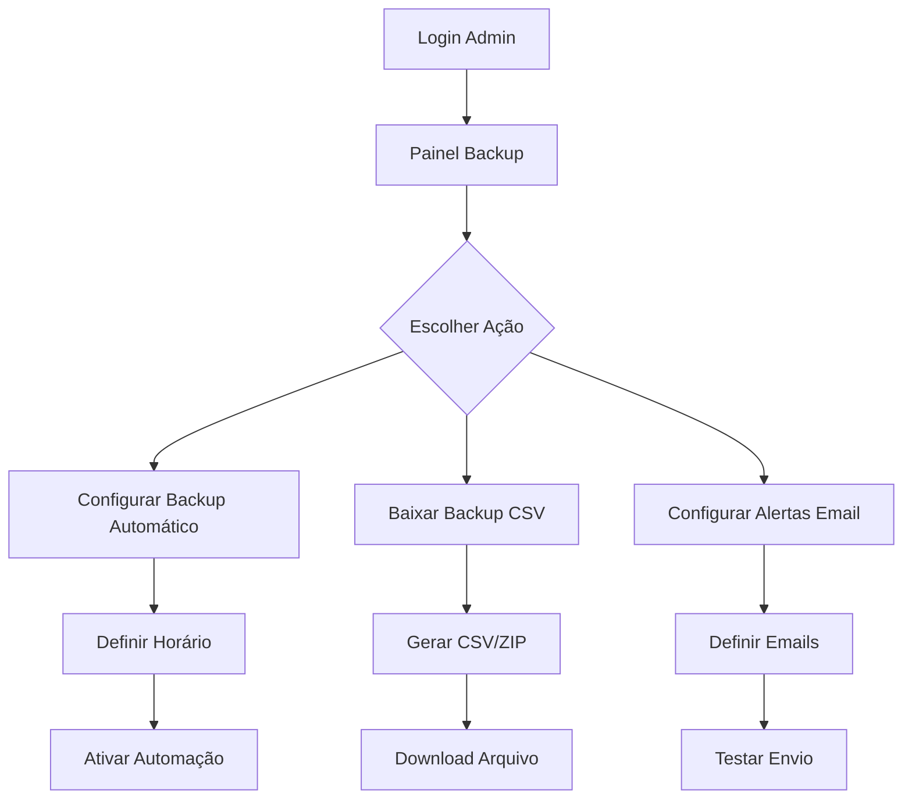
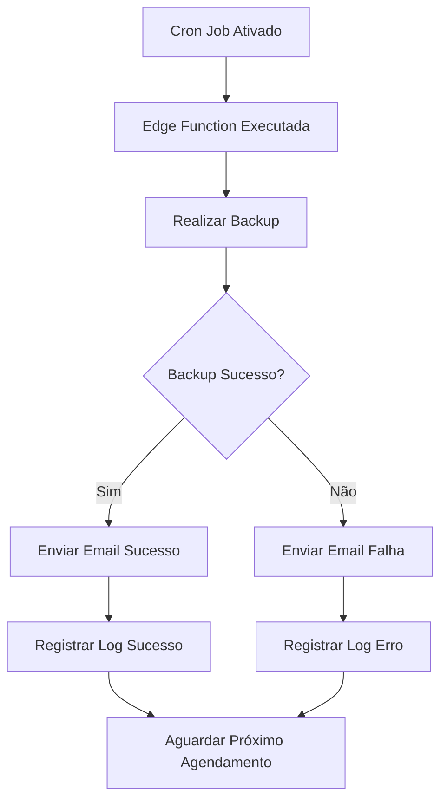

# Sistema de Backup AIMindset - Funcionalidades Futuras
## PRD - Expansões Avançadas

## 1. Visão Geral do Projeto

Este documento detalha as **3 funcionalidades futuras** que expandem o sistema de backup básico já implementado no AIMindset, transformando-o em uma solução profissional e automatizada de backup e recuperação de dados.

**Objetivo:** Adicionar automação, exportação e notificações ao sistema de backup existente, proporcionando uma experiência completa de gerenciamento de dados.

## 2. Funcionalidades Principais

### 2.1 Roles de Usuário
| Role | Método de Acesso | Permissões Principais |
|------|------------------|----------------------|
| Administrador | Login admin existente | Acesso completo a todas as funcionalidades de backup |
| Sistema Automático | Cron jobs/Edge Functions | Execução automática de backups programados |

### 2.2 Módulos Funcionais

**Expansões do Sistema de Backup:**

1. **🔄 Backup Automático Diário**: Agendamento e execução automática de backups
2. **📥 Exportação CSV**: Download de backups em formato CSV/ZIP  
3. **📧 Alertas por Email**: Notificações automáticas de status de backup

### 2.3 Detalhes das Funcionalidades

| Funcionalidade | Módulo | Descrição da Feature |
|----------------|--------|---------------------|
| **Backup Automático** | Configuração de Agendamento | Definir horários (diário, semanal, mensal), ativar/desativar automação |
| **Backup Automático** | Edge Function Cron | Execução automática via Supabase Edge Function com cron job |
| **Backup Automático** | Logs de Execução | Registro automático de sucessos/falhas com timestamps |
| **Exportação CSV** | Botão Download | Gerar e baixar backup completo em formato CSV/ZIP |
| **Exportação CSV** | Geração de Arquivos | Criar CSVs separados para articles, comments, feedbacks |
| **Exportação CSV** | Metadados | Incluir informações de data, quantidade de registros, integridade |
| **Alertas Email** | Configuração de Destinatários | Definir emails para receber notificações |
| **Alertas Email** | Templates Personalizados | Emails formatados para sucesso/falha de backup |
| **Alertas Email** | Integração SMTP | Conexão com Resend/SendGrid para envio |

## 3. Fluxo Principal de Operações

### 3.1 Fluxo do Administrador

### 3.2 Fluxo Automático do Sistema

## 4. Design da Interface

### 4.1 Estilo Visual
- **Cores Primárias**: Azul (#3B82F6) para ações principais, Verde (#10B981) para sucesso
- **Cores Secundárias**: Laranja (#F59E0B) para automação, Vermelho (#EF4444) para alertas
- **Botões**: Estilo rounded com ícones, efeitos hover suaves
- **Fontes**: Inter, tamanhos 14px (texto), 16px (botões), 18px (títulos)
- **Layout**: Cards organizados, navegação por abas, design responsivo
- **Ícones**: Lucide React (clock, download, mail, settings)

### 4.2 Expansões da Interface

| Seção | Módulo | Elementos UI |
|-------|--------|-------------|
| **Backup Automático** | Configuração | Toggle ativar/desativar, seletor de frequência, input de horário |
| **Backup Automático** | Status | Indicador visual (ativo/inativo), próxima execução, último backup |
| **Exportação CSV** | Download | Botão "Baixar CSV", progress bar, informações do arquivo |
| **Exportação CSV** | Histórico | Lista de downloads anteriores com links |
| **Alertas Email** | Configuração | Input de emails, toggle ativar/desativar, botão testar |
| **Alertas Email** | Templates | Preview dos emails, personalização de mensagens |

### 4.3 Responsividade
- **Desktop-first** com adaptação mobile
- **Touch-friendly** para botões e controles
- **Breakpoints**: sm (640px), md (768px), lg (1024px)

## 5. Requisitos Técnicos

### 5.1 Backup Automático
- **Supabase Edge Function** com cron job configurável
- **Agendamento flexível**: diário (horário específico), semanal, mensal
- **Logs detalhados** de execução automática
- **Interface de configuração** integrada ao painel admin

### 5.2 Exportação CSV
- **Geração dinâmica** de CSVs para cada tabela
- **Compactação ZIP** com múltiplos arquivos
- **Metadados inclusos**: data, registros, checksum
- **Download seguro** via blob/URL temporária

### 5.3 Alertas por Email
- **Integração SMTP** (Resend ou SendGrid)
- **Templates HTML** responsivos
- **Configuração múltipla** de destinatários
- **Logs de envio** para auditoria

## 6. Critérios de Sucesso

### 6.1 Backup Automático
- ✅ Execução automática sem falhas por 7 dias consecutivos
- ✅ Interface de configuração intuitiva e funcional
- ✅ Logs detalhados de todas as execuções

### 6.2 Exportação CSV
- ✅ Download de backup completo em menos de 30 segundos
- ✅ Arquivos CSV válidos e íntegros
- ✅ Metadados precisos e informativos

### 6.3 Alertas por Email
- ✅ Emails enviados em menos de 2 minutos após backup
- ✅ Templates profissionais e informativos
- ✅ Taxa de entrega de 99%+

## 7. Roadmap de Implementação

### Fase 1: Backup Automático (Prioridade Alta)
- Criar Edge Function com cron
- Implementar interface de configuração
- Testar execução automática

### Fase 2: Exportação CSV (Prioridade Alta)  
- Desenvolver geração de CSV
- Implementar compactação ZIP
- Criar interface de download

### Fase 3: Alertas Email (Prioridade Média)
- Integrar serviço de email
- Criar templates HTML
- Implementar configuração de destinatários

**Tempo Estimado Total**: 2-3 dias de desenvolvimento