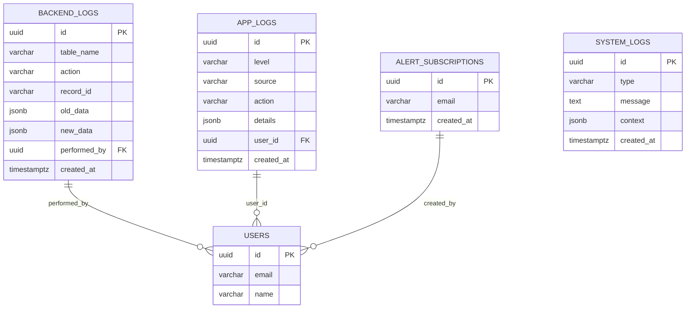

# Sistema de Logs Completo + Alertas - Arquitetura Técnica

## 1. Architecture Design

```mermaid
graph TD
    A[User Browser] --> B[React Frontend Application]
    B --> C[Supabase SDK]
    C --> D[Supabase Database]
    
    D --> E[Backend Logs Table]
    D --> F[App Logs Table]
    D --> G[System Logs Table]
    D --> H[Alert Subscriptions Table]
    
    I[SQL Triggers] --> E
    J[JavaScript logEvent()] --> F
    K[JavaScript logSystem()] --> G
    
    L[Edge Function - Alert Monitor] --> M[Email Service]
    F --> L
    G --> L
    
    N[Cleanup Job] --> D
    
    subgraph "Frontend Layer"
        B
        O[Logs & Monitoramento Tab]
        P[Backend Logs Component]
        Q[App Logs Component]
        R[System Logs Component]
        S[Alert Config Component]
    end
    
    subgraph "Database Layer"
        D
        E
        F
        G
        H
    end
    
    subgraph "Automation Layer"
        I
        J
        K
        L
        N
    end
    
    subgraph "External Services"
        M
    end
```

## 2. Technology Description

- **Frontend**: React@18 + TypeScript + Tailwind CSS + Vite
- **Backend**: Supabase (PostgreSQL + Edge Functions)
- **Email Service**: Resend ou Mailgun
- **Logging**: Custom JavaScript functions + SQL triggers
- **Monitoring**: Real-time subscriptions via Supabase
- **Cleanup**: Supabase cron jobs

## 3. Route Definitions

| Route | Purpose |
|-------|---------|
| /admin | Painel administrativo principal |
| /admin#logs | Nova aba "Logs & Monitoramento" |
| /admin#logs/backend | Visualização de logs de backend |
| /admin#logs/app | Visualização de logs de aplicação |
| /admin#logs/system | Visualização de logs de sistema |
| /admin#logs/alerts | Configuração de alertas por e-mail |

## 4. API Definitions

### 4.1 Core Logging APIs

**Função JavaScript Global - App Logs**
```typescript
logEvent(level: 'info' | 'warn' | 'error', source: string, action: string, details?: any): Promise<void>
```

Parâmetros:
| Param Name | Param Type | isRequired | Description |
|------------|------------|------------|-------------|
| level | string | true | Nível do log (info, warn, error) |
| source | string | true | Origem do evento (admin_panel, homepage, etc.) |
| action | string | true | Ação realizada |
| details | object | false | Detalhes adicionais em JSON |

**Função JavaScript Global - System Logs**
```typescript
logSystem(type: string, message: string, context?: any): Promise<void>
```

Parâmetros:
| Param Name | Param Type | isRequired | Description |
|------------|------------|------------|-------------|
| type | string | true | Tipo do evento (deploy, api_error, integration) |
| message | string | true | Mensagem descritiva |
| context | object | false | Contexto adicional em JSON |

### 4.2 Supabase RPC Functions

**Buscar Logs com Filtros**
```sql
SELECT * FROM get_filtered_logs(
  log_type TEXT,
  start_date TIMESTAMPTZ,
  end_date TIMESTAMPTZ,
  level_filter TEXT,
  limit_count INTEGER
);
```

**Configurar Alertas por E-mail**
```sql
SELECT * FROM manage_alert_subscription(
  email_address TEXT,
  action TEXT -- 'add' or 'remove'
);
```

### 4.3 Edge Function - Alert Monitor

**Endpoint**: `/functions/v1/alert-monitor`

**Trigger**: Database webhook em app_logs e system_logs

**Payload**:
```json
{
  "type": "INSERT",
  "table": "app_logs",
  "record": {
    "id": "uuid",
    "level": "error",
    "source": "admin_panel",
    "action": "article_save_failed",
    "details": {...},
    "created_at": "2024-01-15T10:30:00Z"
  }
}
```

**Response**:
```json
{
  "status": "success",
  "emails_sent": 3,
  "message": "Alert sent to all subscribers"
}
```

## 5. Server Architecture Diagram

```mermaid
graph TD
    A[Client / Frontend] --> B[React Components Layer]
    B --> C[Custom Hooks Layer]
    C --> D[Supabase Client Layer]
    D --> E[Database Layer]
    
    F[SQL Triggers] --> E
    G[Edge Functions] --> H[Email Service]
    E --> I[Database Webhooks]
    I --> G
    
    J[Cleanup Jobs] --> E
    
    subgraph "Frontend Architecture"
        B
        C
        K[useBackendLogs]
        L[useAppLogs]
        M[useSystemLogs]
        N[useAlertConfig]
    end
    
    subgraph "Database Architecture"
        E
        O[backend_logs]
        P[app_logs]
        Q[system_logs]
        R[alert_subscriptions]
    end
    
    subgraph "Automation Architecture"
        F
        G
        J
        S[log_backend_changes()]
        T[alert_monitor()]
        U[cleanup_old_logs()]
    end
```

## 6. Data Model

### 6.1 Data Model Definition



### 6.2 Data Definition Language

**Backend Logs Table**
```sql
-- Tabela para logs de mudanças no banco de dados
CREATE TABLE backend_logs (
    id UUID PRIMARY KEY DEFAULT gen_random_uuid(),
    table_name VARCHAR(50) NOT NULL,
    action VARCHAR(10) NOT NULL CHECK (action IN ('INSERT', 'UPDATE', 'DELETE')),
    record_id VARCHAR(255) NOT NULL,
    old_data JSONB,
    new_data JSONB,
    performed_by UUID REFERENCES auth.users(id),
    created_at TIMESTAMPTZ DEFAULT NOW()
);

-- Índices para performance
CREATE INDEX idx_backend_logs_table_name ON backend_logs(table_name);
CREATE INDEX idx_backend_logs_created_at ON backend_logs(created_at DESC);
CREATE INDEX idx_backend_logs_performed_by ON backend_logs(performed_by);
CREATE INDEX idx_backend_logs_action ON backend_logs(action);

-- RLS Policies
ALTER TABLE backend_logs ENABLE ROW LEVEL SECURITY;
CREATE POLICY "Admin can view all backend logs" ON backend_logs FOR SELECT TO authenticated USING (
    EXISTS (SELECT 1 FROM auth.users WHERE auth.users.id = auth.uid() AND auth.users.email = 'admin@aimindset.com')
);
```

**App Logs Table**
```sql
-- Tabela para logs de eventos da aplicação
CREATE TABLE app_logs (
    id UUID PRIMARY KEY DEFAULT gen_random_uuid(),
    level VARCHAR(10) NOT NULL CHECK (level IN ('info', 'warn', 'error')),
    source VARCHAR(100) NOT NULL,
    action VARCHAR(200) NOT NULL,
    details JSONB,
    user_id UUID REFERENCES auth.users(id),
    created_at TIMESTAMPTZ DEFAULT NOW()
);

-- Índices para performance
CREATE INDEX idx_app_logs_level ON app_logs(level);
CREATE INDEX idx_app_logs_source ON app_logs(source);
CREATE INDEX idx_app_logs_created_at ON app_logs(created_at DESC);
CREATE INDEX idx_app_logs_user_id ON app_logs(user_id);

-- RLS Policies
ALTER TABLE app_logs ENABLE ROW LEVEL SECURITY;
CREATE POLICY "Admin can view all app logs" ON app_logs FOR SELECT TO authenticated USING (
    EXISTS (SELECT 1 FROM auth.users WHERE auth.users.id = auth.uid() AND auth.users.email = 'admin@aimindset.com')
);
CREATE POLICY "Users can insert app logs" ON app_logs FOR INSERT TO authenticated WITH CHECK (true);
```

**System Logs Table**
```sql
-- Tabela para logs de eventos do sistema
CREATE TABLE system_logs (
    id UUID PRIMARY KEY DEFAULT gen_random_uuid(),
    type VARCHAR(50) NOT NULL,
    message TEXT NOT NULL,
    context JSONB,
    created_at TIMESTAMPTZ DEFAULT NOW()
);

-- Índices para performance
CREATE INDEX idx_system_logs_type ON system_logs(type);
CREATE INDEX idx_system_logs_created_at ON system_logs(created_at DESC);

-- RLS Policies
ALTER TABLE system_logs ENABLE ROW LEVEL SECURITY;
CREATE POLICY "Admin can view all system logs" ON system_logs FOR SELECT TO authenticated USING (
    EXISTS (SELECT 1 FROM auth.users WHERE auth.users.id = auth.uid() AND auth.users.email = 'admin@aimindset.com')
);
CREATE POLICY "System can insert system logs" ON system_logs FOR INSERT TO anon WITH CHECK (true);
```

**Alert Subscriptions Table**
```sql
-- Tabela para gerenciar assinantes de alertas
CREATE TABLE alert_subscriptions (
    id UUID PRIMARY KEY DEFAULT gen_random_uuid(),
    email VARCHAR(255) UNIQUE NOT NULL,
    created_at TIMESTAMPTZ DEFAULT NOW()
);

-- Índices para performance
CREATE INDEX idx_alert_subscriptions_email ON alert_subscriptions(email);

-- RLS Policies
ALTER TABLE alert_subscriptions ENABLE ROW LEVEL SECURITY;
CREATE POLICY "Admin can manage alert subscriptions" ON alert_subscriptions FOR ALL TO authenticated USING (
    EXISTS (SELECT 1 FROM auth.users WHERE auth.users.id = auth.uid() AND auth.users.email = 'admin@aimindset.com')
);
```

**Função SQL para Logs de Backend**
```sql
-- Função para registrar mudanças automaticamente
CREATE OR REPLACE FUNCTION log_backend_changes()
RETURNS TRIGGER AS $$
BEGIN
    IF TG_OP = 'DELETE' THEN
        INSERT INTO backend_logs (table_name, action, record_id, old_data, performed_by)
        VALUES (TG_TABLE_NAME, TG_OP, OLD.id::text, row_to_json(OLD), auth.uid());
        RETURN OLD;
    ELSIF TG_OP = 'UPDATE' THEN
        INSERT INTO backend_logs (table_name, action, record_id, old_data, new_data, performed_by)
        VALUES (TG_TABLE_NAME, TG_OP, NEW.id::text, row_to_json(OLD), row_to_json(NEW), auth.uid());
        RETURN NEW;
    ELSIF TG_OP = 'INSERT' THEN
        INSERT INTO backend_logs (table_name, action, record_id, new_data, performed_by)
        VALUES (TG_TABLE_NAME, TG_OP, NEW.id::text, row_to_json(NEW), auth.uid());
        RETURN NEW;
    END IF;
    RETURN NULL;
END;
$$ LANGUAGE plpgsql;
```

**Triggers para Tabelas Monitoradas**
```sql
-- Trigger para tabela articles
CREATE TRIGGER articles_log_trigger
    AFTER INSERT OR UPDATE OR DELETE ON articles
    FOR EACH ROW EXECUTE FUNCTION log_backend_changes();

-- Trigger para tabela comments
CREATE TRIGGER comments_log_trigger
    AFTER INSERT OR UPDATE OR DELETE ON comments
    FOR EACH ROW EXECUTE FUNCTION log_backend_changes();

-- Trigger para tabela feedbacks
CREATE TRIGGER feedbacks_log_trigger
    AFTER INSERT OR UPDATE OR DELETE ON feedbacks
    FOR EACH ROW EXECUTE FUNCTION log_backend_changes();

-- Trigger para tabela users (se existir)
CREATE TRIGGER users_log_trigger
    AFTER INSERT OR UPDATE OR DELETE ON auth.users
    FOR EACH ROW EXECUTE FUNCTION log_backend_changes();
```

**Função RPC para Busca de Logs**
```sql
-- Função para buscar logs com filtros
CREATE OR REPLACE FUNCTION get_filtered_logs(
    log_type TEXT DEFAULT 'app',
    start_date TIMESTAMPTZ DEFAULT NOW() - INTERVAL '7 days',
    end_date TIMESTAMPTZ DEFAULT NOW(),
    level_filter TEXT DEFAULT NULL,
    limit_count INTEGER DEFAULT 50
)
RETURNS TABLE (
    id UUID,
    created_at TIMESTAMPTZ,
    data JSONB
) AS $$
BEGIN
    IF log_type = 'backend' THEN
        RETURN QUERY
        SELECT bl.id, bl.created_at, 
               jsonb_build_object(
                   'table_name', bl.table_name,
                   'action', bl.action,
                   'record_id', bl.record_id,
                   'old_data', bl.old_data,
                   'new_data', bl.new_data,
                   'performed_by', bl.performed_by
               ) as data
        FROM backend_logs bl
        WHERE bl.created_at BETWEEN start_date AND end_date
        ORDER BY bl.created_at DESC
        LIMIT limit_count;
    
    ELSIF log_type = 'app' THEN
        RETURN QUERY
        SELECT al.id, al.created_at,
               jsonb_build_object(
                   'level', al.level,
                   'source', al.source,
                   'action', al.action,
                   'details', al.details,
                   'user_id', al.user_id
               ) as data
        FROM app_logs al
        WHERE al.created_at BETWEEN start_date AND end_date
        AND (level_filter IS NULL OR al.level = level_filter)
        ORDER BY al.created_at DESC
        LIMIT limit_count;
    
    ELSIF log_type = 'system' THEN
        RETURN QUERY
        SELECT sl.id, sl.created_at,
               jsonb_build_object(
                   'type', sl.type,
                   'message', sl.message,
                   'context', sl.context
               ) as data
        FROM system_logs sl
        WHERE sl.created_at BETWEEN start_date AND end_date
        ORDER BY sl.created_at DESC
        LIMIT limit_count;
    END IF;
END;
$$ LANGUAGE plpgsql;
```

**Função de Limpeza Automática**
```sql
-- Função para limpar logs antigos (90 dias)
CREATE OR REPLACE FUNCTION cleanup_old_logs()
RETURNS INTEGER AS $$
DECLARE
    deleted_count INTEGER := 0;
    temp_count INTEGER;
BEGIN
    -- Limpar backend_logs
    DELETE FROM backend_logs WHERE created_at < NOW() - INTERVAL '90 days';
    GET DIAGNOSTICS temp_count = ROW_COUNT;
    deleted_count := deleted_count + temp_count;
    
    -- Limpar app_logs
    DELETE FROM app_logs WHERE created_at < NOW() - INTERVAL '90 days';
    GET DIAGNOSTICS temp_count = ROW_COUNT;
    deleted_count := deleted_count + temp_count;
    
    -- Limpar system_logs
    DELETE FROM system_logs WHERE created_at < NOW() - INTERVAL '90 days';
    GET DIAGNOSTICS temp_count = ROW_COUNT;
    deleted_count := deleted_count + temp_count;
    
    -- Log da limpeza
    INSERT INTO system_logs (type, message, context)
    VALUES ('cleanup', 'Automatic log cleanup completed', 
            jsonb_build_object('deleted_count', deleted_count));
    
    RETURN deleted_count;
END;
$$ LANGUAGE plpgsql;
```

**Dados Iniciais**
```sql
-- Inserir admin como primeiro assinante de alertas
INSERT INTO alert_subscriptions (email) 
VALUES ('admin@aimindset.com')
ON CONFLICT (email) DO NOTHING;

-- Log inicial do sistema
INSERT INTO system_logs (type, message, context)
VALUES ('system', 'Logging system initialized', 
        jsonb_build_object('version', '1.0', 'timestamp', NOW()));
```

## 7. Integration Points

### 7.1 Existing System Integration

**Cache TTL Compatibility**
- Logs não utilizam cache para garantir dados em tempo real
- Integração com sistema de cache existente para otimização de consultas

**Backup System Integration**
- Tabelas de logs incluídas automaticamente no sistema de backup existente
- Função `create_backup_data()` expandida para incluir logs

**Admin Panel Integration**
- Nova aba integrada ao painel existente sem alterações visuais
- Reutilização de componentes UI existentes (botões, filtros, tabelas)

### 7.2 Performance Considerations

**Async Logging**
- Logs de aplicação executados de forma assíncrona
- Não bloqueiam operações principais do usuário

**Database Optimization**
- Índices estratégicos para consultas frequentes
- Particionamento por data para tabelas grandes
- Compressão automática de dados antigos

**Real-time Updates**
- Subscriptions do Supabase para atualizações em tempo real
- Throttling para evitar sobrecarga da interface

---

Esta arquitetura garante um sistema de logs robusto, escalável e totalmente integrado ao AIMindset existente, proporcionando visibilidade completa e alertas proativos.