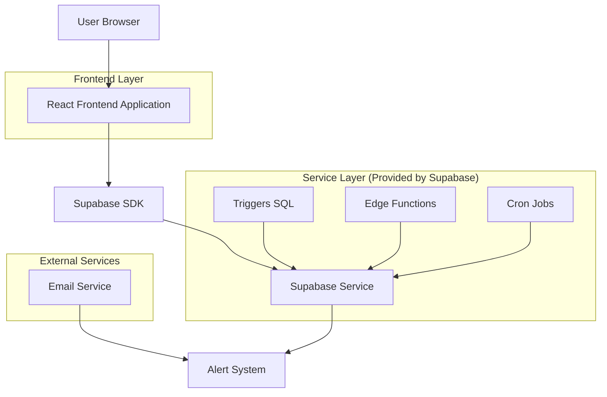
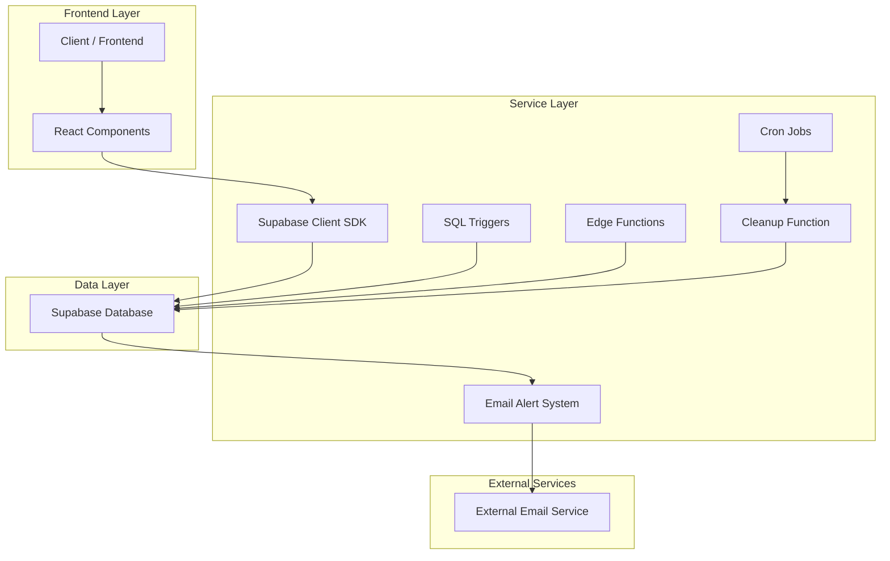
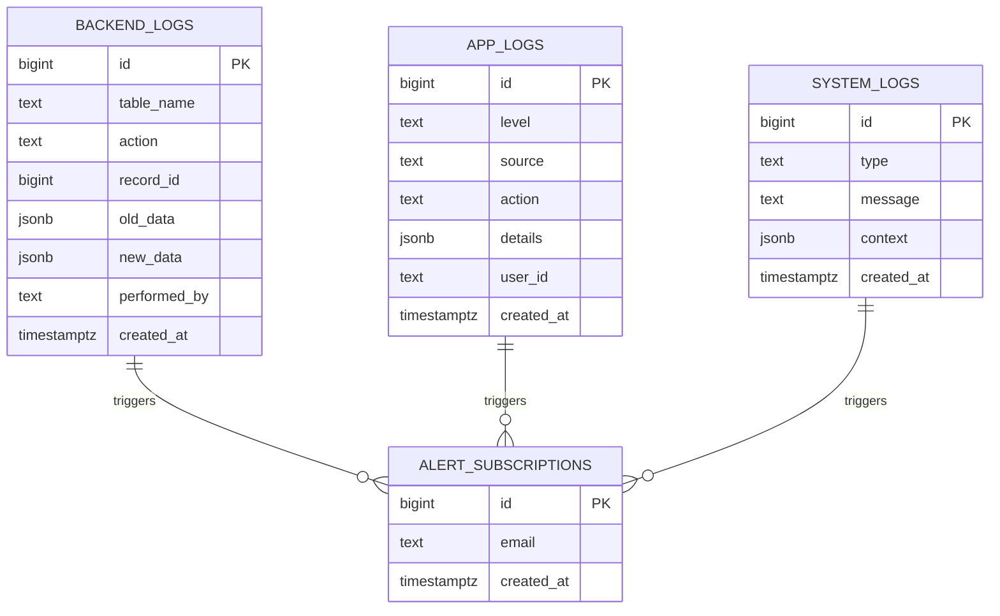

# 🧠 Documentação Técnica — Sistema de Logs Completo + Alertas Automáticos do AIMindset

## 1. Architecture Design



## 2. Technology Description

- **Frontend**: React@18 + tailwindcss@3 + vite
- **Backend**: Supabase (PostgreSQL + Edge Functions)
- **Email Service**: Resend/Mailgun (integração existente)
- **Monitoring**: Supabase RPC + Real-time subscriptions

## 3. Route Definitions

| Route | Purpose |
|-------|---------|
| /admin/logs | Nova aba "Logs & Monitoramento" no painel admin |
| /admin/logs/backend | Subaba Backend Logs (mudanças no banco) |
| /admin/logs/app | Subaba App Logs (eventos da aplicação) |
| /admin/logs/system | Subaba System Logs (eventos do sistema) |

## 4. API Definitions

### 4.1 Core API

**Função Global JavaScript `logEvent()`**
```typescript
function logEvent(level: 'info' | 'warn' | 'error', source: string, action: string, details: object): Promise<void>
```

Parâmetros:
| Param Name | Param Type | isRequired | Description |
|------------|------------|------------|-------------|
| level | string | true | Nível do log ('info', 'warn', 'error') |
| source | string | true | Origem do evento (ex: 'admin_panel', 'homepage') |
| action | string | true | Ação executada (ex: 'publish_article', 'login') |
| details | object | false | Dados adicionais em formato JSON |

**Função Global JavaScript `logSystem()`**
```typescript
function logSystem(type: string, message: string, context: object): Promise<void>
```

Parâmetros:
| Param Name | Param Type | isRequired | Description |
|------------|------------|------------|-------------|
| type | string | true | Tipo do log (deploy, api_error, build, integration) |
| message | string | true | Mensagem principal do evento |
| context | object | false | Contexto adicional em formato JSON |

### 4.2 Supabase RPC Functions

**Buscar Logs com Filtros**
```sql
SELECT * FROM rpc('get_logs_filtered', {
  log_type: 'backend' | 'app' | 'system',
  level_filter: string,
  date_from: timestamp,
  date_to: timestamp,
  limit_count: integer
});
```

**Exportar Logs para CSV**
```sql
SELECT * FROM rpc('export_logs_csv', {
  log_type: 'backend' | 'app' | 'system',
  filters: jsonb
});
```

**Limpeza Automática de Logs**
```sql
SELECT * FROM rpc('cleanup_old_logs', {
  days_to_keep: integer DEFAULT 90
});
```

## 5. Server Architecture Diagram



## 6. Data Model

### 6.1 Data Model Definition



### 6.2 Data Definition Language

**Tabela Backend Logs**
```sql
-- Criar tabela backend_logs
CREATE TABLE backend_logs (
    id BIGSERIAL PRIMARY KEY,
    table_name TEXT NOT NULL,
    action TEXT NOT NULL CHECK (action IN ('INSERT', 'UPDATE', 'DELETE')),
    record_id BIGINT,
    old_data JSONB,
    new_data JSONB,
    performed_by TEXT,
    created_at TIMESTAMPTZ DEFAULT NOW()
);

-- Índices para performance
CREATE INDEX idx_backend_logs_table_name ON backend_logs(table_name);
CREATE INDEX idx_backend_logs_created_at ON backend_logs(created_at DESC);
CREATE INDEX idx_backend_logs_action ON backend_logs(action);

-- Permissões Supabase
GRANT SELECT ON backend_logs TO anon;
GRANT ALL PRIVILEGES ON backend_logs TO authenticated;
```

**Tabela App Logs**
```sql
-- Criar tabela app_logs
CREATE TABLE app_logs (
    id BIGSERIAL PRIMARY KEY,
    level TEXT NOT NULL CHECK (level IN ('info', 'warn', 'error')),
    source TEXT NOT NULL,
    action TEXT NOT NULL,
    details JSONB,
    user_id TEXT,
    created_at TIMESTAMPTZ DEFAULT NOW()
);

-- Índices para performance
CREATE INDEX idx_app_logs_level ON app_logs(level);
CREATE INDEX idx_app_logs_source ON app_logs(source);
CREATE INDEX idx_app_logs_created_at ON app_logs(created_at DESC);
CREATE INDEX idx_app_logs_user_id ON app_logs(user_id);

-- Permissões Supabase
GRANT SELECT ON app_logs TO anon;
GRANT ALL PRIVILEGES ON app_logs TO authenticated;
```

**Tabela System Logs**
```sql
-- Criar tabela system_logs
CREATE TABLE system_logs (
    id BIGSERIAL PRIMARY KEY,
    type TEXT NOT NULL,
    message TEXT NOT NULL,
    context JSONB,
    created_at TIMESTAMPTZ DEFAULT NOW()
);

-- Índices para performance
CREATE INDEX idx_system_logs_type ON system_logs(type);
CREATE INDEX idx_system_logs_created_at ON system_logs(created_at DESC);

-- Permissões Supabase
GRANT SELECT ON system_logs TO anon;
GRANT ALL PRIVILEGES ON system_logs TO authenticated;
```

**Tabela Alert Subscriptions**
```sql
-- Criar tabela alert_subscriptions
CREATE TABLE alert_subscriptions (
    id BIGSERIAL PRIMARY KEY,
    email TEXT UNIQUE NOT NULL,
    created_at TIMESTAMPTZ DEFAULT NOW()
);

-- Índices
CREATE INDEX idx_alert_subscriptions_email ON alert_subscriptions(email);

-- Permissões Supabase
GRANT SELECT ON alert_subscriptions TO anon;
GRANT ALL PRIVILEGES ON alert_subscriptions TO authenticated;
```

**Triggers para Backend Logs**
```sql
-- Função genérica para triggers
CREATE OR REPLACE FUNCTION log_backend_changes()
RETURNS TRIGGER AS $$
BEGIN
    IF TG_OP = 'DELETE' THEN
        INSERT INTO backend_logs (table_name, action, record_id, old_data, performed_by)
        VALUES (TG_TABLE_NAME, TG_OP, OLD.id, row_to_json(OLD), current_user);
        RETURN OLD;
    ELSIF TG_OP = 'UPDATE' THEN
        INSERT INTO backend_logs (table_name, action, record_id, old_data, new_data, performed_by)
        VALUES (TG_TABLE_NAME, TG_OP, NEW.id, row_to_json(OLD), row_to_json(NEW), current_user);
        RETURN NEW;
    ELSIF TG_OP = 'INSERT' THEN
        INSERT INTO backend_logs (table_name, action, record_id, new_data, performed_by)
        VALUES (TG_TABLE_NAME, TG_OP, NEW.id, row_to_json(NEW), current_user);
        RETURN NEW;
    END IF;
    RETURN NULL;
END;
$$ LANGUAGE plpgsql;

-- Aplicar triggers nas tabelas
CREATE TRIGGER articles_log_trigger
    AFTER INSERT OR UPDATE OR DELETE ON articles
    FOR EACH ROW EXECUTE FUNCTION log_backend_changes();

CREATE TRIGGER comments_log_trigger
    AFTER INSERT OR UPDATE OR DELETE ON comments
    FOR EACH ROW EXECUTE FUNCTION log_backend_changes();

CREATE TRIGGER feedbacks_log_trigger
    AFTER INSERT OR UPDATE OR DELETE ON feedbacks
    FOR EACH ROW EXECUTE FUNCTION log_backend_changes();

CREATE TRIGGER users_log_trigger
    AFTER INSERT OR UPDATE OR DELETE ON users
    FOR EACH ROW EXECUTE FUNCTION log_backend_changes();
```

**Funções RPC para Logs**
```sql
-- Função para buscar logs com filtros
CREATE OR REPLACE FUNCTION get_logs_filtered(
    log_type TEXT,
    level_filter TEXT DEFAULT NULL,
    date_from TIMESTAMPTZ DEFAULT NULL,
    date_to TIMESTAMPTZ DEFAULT NULL,
    limit_count INTEGER DEFAULT 50
)
RETURNS TABLE(
    id BIGINT,
    data JSONB,
    created_at TIMESTAMPTZ
) AS $$
BEGIN
    IF log_type = 'backend' THEN
        RETURN QUERY
        SELECT bl.id, 
               jsonb_build_object(
                   'table_name', bl.table_name,
                   'action', bl.action,
                   'record_id', bl.record_id,
                   'old_data', bl.old_data,
                   'new_data', bl.new_data,
                   'performed_by', bl.performed_by
               ) as data,
               bl.created_at
        FROM backend_logs bl
        WHERE (date_from IS NULL OR bl.created_at >= date_from)
          AND (date_to IS NULL OR bl.created_at <= date_to)
        ORDER BY bl.created_at DESC
        LIMIT limit_count;
        
    ELSIF log_type = 'app' THEN
        RETURN QUERY
        SELECT al.id,
               jsonb_build_object(
                   'level', al.level,
                   'source', al.source,
                   'action', al.action,
                   'details', al.details,
                   'user_id', al.user_id
               ) as data,
               al.created_at
        FROM app_logs al
        WHERE (level_filter IS NULL OR al.level = level_filter)
          AND (date_from IS NULL OR al.created_at >= date_from)
          AND (date_to IS NULL OR al.created_at <= date_to)
        ORDER BY al.created_at DESC
        LIMIT limit_count;
        
    ELSIF log_type = 'system' THEN
        RETURN QUERY
        SELECT sl.id,
               jsonb_build_object(
                   'type', sl.type,
                   'message', sl.message,
                   'context', sl.context
               ) as data,
               sl.created_at
        FROM system_logs sl
        WHERE (date_from IS NULL OR sl.created_at >= date_from)
          AND (date_to IS NULL OR sl.created_at <= date_to)
        ORDER BY sl.created_at DESC
        LIMIT limit_count;
    END IF;
END;
$$ LANGUAGE plpgsql;

-- Função para limpeza automática
CREATE OR REPLACE FUNCTION cleanup_old_logs(days_to_keep INTEGER DEFAULT 90)
RETURNS INTEGER AS $$
DECLARE
    deleted_count INTEGER := 0;
    cutoff_date TIMESTAMPTZ;
BEGIN
    cutoff_date := NOW() - INTERVAL '1 day' * days_to_keep;
    
    DELETE FROM backend_logs WHERE created_at < cutoff_date;
    GET DIAGNOSTICS deleted_count = ROW_COUNT;
    
    DELETE FROM app_logs WHERE created_at < cutoff_date;
    GET DIAGNOSTICS deleted_count = deleted_count + ROW_COUNT;
    
    DELETE FROM system_logs WHERE created_at < cutoff_date;
    GET DIAGNOSTICS deleted_count = deleted_count + ROW_COUNT;
    
    RETURN deleted_count;
END;
$$ LANGUAGE plpgsql;
```

**Edge Function para Alertas por E-mail**
```typescript
// supabase/functions/email-alerts/index.ts
import { serve } from "https://deno.land/std@0.168.0/http/server.ts"
import { createClient } from 'https://esm.sh/@supabase/supabase-js@2'

serve(async (req) => {
  try {
    const supabase = createClient(
      Deno.env.get('SUPABASE_URL') ?? '',
      Deno.env.get('SUPABASE_SERVICE_ROLE_KEY') ?? ''
    )

    // Buscar logs de erro recentes (últimos 5 minutos)
    const fiveMinutesAgo = new Date(Date.now() - 5 * 60 * 1000).toISOString()
    
    const { data: errorLogs } = await supabase
      .from('app_logs')
      .select('*')
      .eq('level', 'error')
      .gte('created_at', fiveMinutesAgo)

    const { data: systemErrors } = await supabase
      .from('system_logs')
      .select('*')
      .ilike('type', '%error%')
      .gte('created_at', fiveMinutesAgo)

    const allErrors = [...(errorLogs || []), ...(systemErrors || [])]

    if (allErrors.length > 0) {
      // Buscar e-mails cadastrados
      const { data: subscribers } = await supabase
        .from('alert_subscriptions')
        .select('email')

      // Enviar alertas por e-mail
      for (const error of allErrors) {
        for (const subscriber of subscribers || []) {
          await sendEmailAlert(subscriber.email, error)
        }
      }
    }

    return new Response(JSON.stringify({ success: true, errors_processed: allErrors.length }), {
      headers: { 'Content-Type': 'application/json' },
    })
  } catch (error) {
    return new Response(JSON.stringify({ error: error.message }), {
      status: 500,
      headers: { 'Content-Type': 'application/json' },
    })
  }
})

async function sendEmailAlert(email: string, errorLog: any) {
  // Implementar envio de e-mail usando serviço existente
  // Template: "[AIMindset Alerta] Erro detectado no sistema"
}
```