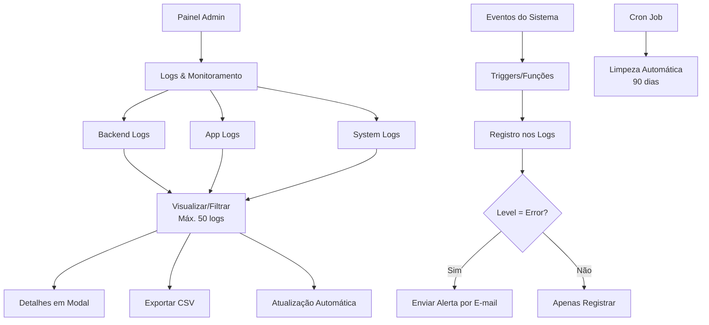

# 🧠 PRD — Sistema de Logs Completo + Alertas Automáticos do AIMindset

## 🎯 Objetivo

Desenvolver um sistema completo de logs e monitoramento integrado ao AIMindset, com alertas automáticos por e-mail, garantindo rastreabilidade total sem afetar performance ou o layout existente.

O sistema deve registrar todas as ações da aplicação (banco de dados, painel admin e infraestrutura), armazenar logs no Supabase e emitir alertas automáticos quando houver erros críticos.

## 🔒 Requisitos Gerais e de Compatibilidade

1. **Nenhum componente visual existente pode ser modificado.**
2. **O código deve ser 100% compatível com:**
   - Supabase (atual versão)
   - Sistema de cache TTL
   - Triggers e funções SQL já existentes
3. **O sistema deve ser idempotente** — permitir múltiplas execuções sem duplicar dados.
4. **Logs antigos devem ser apagados automaticamente após 90 dias.**
5. **Alertas automáticos por e-mail só devem ser disparados em eventos com `level = 'error'`.**
6. **Todo o código novo deve respeitar a arquitetura modular e boas práticas do projeto AIMindset.**
7. **A integração com o sistema de backup já existente deve ser garantida** (os logs também devem ser salvos no backup).

## 🧱 Estrutura de Banco de Dados (Supabase)

### 1️⃣ Tabela `backend_logs`

| Campo | Tipo | Descrição |
|--------|------|-----------||
| id | bigint (PK) | Identificador do log |
| table_name | text | Nome da tabela alterada |
| action | text | Tipo de ação (INSERT, UPDATE, DELETE) |
| record_id | bigint | ID do registro alterado |
| old_data | jsonb | Dados anteriores |
| new_data | jsonb | Dados novos |
| performed_by | text | Usuário que realizou a ação |
| created_at | timestamptz | Data/hora da ação |

📌 **Triggers devem ser aplicadas nas tabelas:**
- `articles`
- `comments`
- `feedbacks`
- `users`

### 2️⃣ Tabela `app_logs`

| Campo | Tipo | Descrição |
|--------|------|-----------||
| id | bigint (PK) | Identificador |
| level | text ('info','warn','error') | Nível do log |
| source | text | Origem (ex: admin_panel, homepage) |
| action | text | Ação executada |
| details | jsonb | Dados adicionais |
| user_id | text | ID opcional do usuário admin |
| created_at | timestamptz | Data/hora |

📌 **Função JS/TS global `logEvent(level, source, action, details)`**
Usada para registrar ações como:
- Publicar/editar/excluir artigo
- Enviar comentário/feedback
- Login/logout do admin
- Erros de upload, API, Supabase, etc.

### 3️⃣ Tabela `system_logs`

| Campo | Tipo | Descrição |
|--------|------|-----------||
| id | bigint (PK) | Identificador |
| type | text | Tipo de log (deploy, api_error, build, integration, etc.) |
| message | text | Mensagem principal |
| context | jsonb | Dados extras |
| created_at | timestamptz | Data/hora |

📌 **Função JS `logSystem(type, message, context)`**
Usada para registrar:
- Erros de API
- Falhas de integração Supabase
- Builds e deploys da aplicação

### 4️⃣ Tabela `alert_subscriptions`

| Campo | Tipo | Descrição |
|--------|------|-----------||
| id | bigint (PK) | Identificador |
| email | text | E-mail cadastrado para receber alertas |
| created_at | timestamptz | Data/hora do cadastro |

## 🧭 Painel Admin — Nova Aba "Logs & Monitoramento"

Adicionar **uma nova aba** no painel admin com 3 subabas internas:

1. **Backend Logs**
2. **App Logs**
3. **System Logs**

### Funcionalidades de Cada Subaba:

- **Exibir logs mais recentes (máx. 50 por exibição)**
- **Permitir filtros (por tipo, nível, data e usuário)**
- **Ter botão "Exportar CSV"**
- **Exibir detalhes do log em modal (quando clicado)**
- **Atualizar automaticamente em tempo real**
- **Seguir o mesmo padrão visual atual do AIMindset**

💡 **Nenhum componente existente deve ser modificado.**
A nova aba deve apenas se integrar ao layout atual.

## 📧 Sistema de Alertas Automáticos por E-mail

### Funcionamento:
- Criar função edge (ou API route) que monitora `app_logs` e `system_logs`
- Quando detectar registro com `level = 'error'`, enviar e-mail automático
- E-mails enviados com o serviço já integrado (Resend, Mailgun, ou outro compatível)

### Modelo do e-mail:
**Assunto:** `[AIMindset Alerta] Erro detectado no sistema`
**Corpo:** inclui data, tipo, mensagem e contexto do erro.

## ⚙️ Requisitos Técnicos

- **Todos os logs devem ser registrados via Supabase RPC** (sem dependências externas)
- **Build e dev (`npm build` e `npm run dev`) devem funcionar sem erro**
- **Integração com o sistema de backup existente**
- **Logs antigos devem ser excluídos automaticamente a cada 90 dias** (função cron ou edge function)
- **Código modular e reutilizável** (seguindo estrutura atual)
- **Nenhuma quebra de cache TTL, triggers ou funções SQL já implementadas**

## 3. Core Process

### Fluxo Principal do Administrador:

1. **Acesso ao Painel**: Login no painel administrativo do AIMindset
2. **Navegação para Logs**: Clicar na nova aba "Logs & Monitoramento"
3. **Seleção do Tipo**: Escolher entre Backend Logs, App Logs ou System Logs
4. **Visualização**: Ver lista de logs (máx. 50 por página) com filtros
5. **Análise**: Clicar em um log para ver detalhes completos em modal
6. **Exportação**: Usar botão "Exportar CSV" para relatórios
7. **Atualização Automática**: Interface atualiza em tempo real

### Fluxo Automático do Sistema:

1. **Registro de Eventos**: Triggers e funções registram automaticamente todas as ações
2. **Detecção de Erros**: Sistema monitora logs com level = 'error'
3. **Envio de Alertas**: E-mails automáticos são enviados para administradores cadastrados
4. **Limpeza Automática**: Logs antigos são removidos após 90 dias

## ✅ Critérios de Aceite

| Critério | Descrição | Deve funcionar |
|-----------|-----------|----------------|
| **Logs de backend** | Registrar ações no banco (inserção, edição, exclusão) nas tabelas articles, comments, feedbacks, users | ✅ |
| **Logs de app** | Registrar ações do painel e erros no front via função `logEvent()` | ✅ |
| **Logs de sistema** | Registrar eventos de API, build e integração via função `logSystem()` | ✅ |
| **Painel integrado** | Nova aba "Logs & Monitoramento" sem quebrar layout existente | ✅ |
| **Subabas funcionais** | 3 subabas (Backend, App, System) com máx. 50 logs cada | ✅ |
| **Filtros avançados** | Filtrar por tipo, nível, data, usuário em cada subaba | ✅ |
| **Exportação CSV** | Botão "Exportar CSV" funcional em todas as subabas | ✅ |
| **Modal de detalhes** | Clicar no log abre modal com informações completas | ✅ |
| **Atualização automática** | Interface atualiza em tempo real sem recarregar página | ✅ |
| **Alertas por e-mail** | E-mails automáticos enviados apenas para level = 'error' | ✅ |
| **Template de e-mail** | Assunto "[AIMindset Alerta]" com data, tipo, mensagem e contexto | ✅ |
| **Limpeza automática** | Logs antigos excluídos automaticamente após 90 dias | ✅ |
| **Compatibilidade total** | Sem quebra de cache TTL, triggers ou funções SQL existentes | ✅ |
| **Performance mantida** | Build e dev funcionando sem erro, sem impacto na performance | ✅ |
| **Integração backup** | Logs incluídos no sistema de backup existente | ✅ |
| **Código modular** | Seguir estrutura atual do AIMindset, código reutilizável | ✅ |
| **Supabase RPC** | Todos os logs registrados via Supabase RPC (sem dependências externas) | ✅ |

## 4. User Interface Design

### 4.1 Design Style

O sistema de logs seguirá **exatamente o padrão visual já estabelecido no AIMindset**:

- **Cores Primárias**: Manter a paleta de cores atual do painel admin
- **Estilo de Botões**: Seguir o padrão existente (rounded corners, hover effects)
- **Tipografia**: Usar as mesmas fontes e tamanhos já definidos
- **Layout**: Integração harmoniosa com a estrutura de abas atual
- **Ícones**: Utilizar ícones consistentes com o design system existente

💡 **IMPORTANTE**: Nenhum componente visual existente pode ser modificado.

### 4.2 Page Design Overview

| Page Name | Module Name | UI Elements |
|-----------|-------------|-------------|
| Logs & Monitoramento | Nova Aba Principal | Aba integrada ao menu existente, ícone de logs, sem modificar layout atual |
| Backend Logs | Subaba 1 | Tabela responsiva, filtros dropdown, máx. 50 logs, botão "Exportar CSV" |
| App Logs | Subaba 2 | Cards com níveis coloridos (info=azul, warn=amarelo, error=vermelho), filtros por nível/fonte |
| System Logs | Subaba 3 | Lista com badges de tipo, filtros por tipo/data, contexto expandível |
| Modal de Detalhes | Overlay | Modal com dados completos do log, botão fechar, scroll interno |

### 4.3 Responsiveness

- **Desktop-first**: Otimizado para uso em desktop no painel administrativo
- **Adaptação Mobile**: Interface responsiva para tablets e smartphones
- **Touch-friendly**: Botões e elementos interativos adequados para toque
- **Performance**: Carregamento otimizado com paginação (máx. 50 logs) e atualização automática

## 5. Technical Requirements

### 5.1 Database Schema

**Backend Logs**
- Registro automático via triggers SQL
- Armazenamento de dados antigos e novos em JSONB
- Índices otimizados para consultas por tabela e data

**App Logs**
- Inserção via RPC do Supabase
- Estrutura flexível com details em JSON
- Classificação por níveis de severidade

**System Logs**
- Captura de eventos críticos do sistema
- Contexto detalhado para debugging
- Integração com monitoramento de APIs

**Alert Subscriptions**
- Gerenciamento de e-mails para alertas
- Validação de formato e duplicatas
- Soft delete para histórico

### 5.2 Performance & Security

- **Cache TTL**: Integração com sistema existente para otimização
- **RLS (Row Level Security)**: Políticas restritivas para acesso admin apenas
- **Rate Limiting**: Proteção contra spam de logs
- **Data Retention**: Limpeza automática após 90 dias
- **Backup Integration**: Inclusão automática no sistema de backup existente

### 5.3 Email Alerts

- **Trigger Automático**: Monitoramento em tempo real de erros críticos
- **Template HTML**: E-mail profissional com detalhes do erro
- **Rate Limiting**: Evitar spam de alertas (máximo 1 por minuto por tipo)
- **Fallback**: Log local em caso de falha no envio

## 6. Success Criteria

### 6.1 Functional Requirements

✅ **Registro Automático**: 100% das mudanças no BD capturadas via triggers
✅ **Interface Integrada**: Nova aba no painel admin sem alterações visuais
✅ **Tempo Real**: Logs atualizados automaticamente sem reload
✅ **Filtros Avançados**: Busca por data, tipo, nível e usuário
✅ **Exportação**: Download de logs em formato CSV
✅ **Alertas**: E-mails automáticos para erros críticos em < 1 minuto

### 6.2 Performance Requirements

✅ **Compatibilidade**: 100% compatível com código e cache existente
✅ **Performance**: Logs não impactam velocidade da aplicação
✅ **Escalabilidade**: Suporte a milhares de logs por dia
✅ **Retenção**: Limpeza automática após 90 dias
✅ **Backup**: Integração com sistema de backup existente

### 6.3 Security Requirements

✅ **Acesso Restrito**: Apenas administradores visualizam logs
✅ **Dados Sensíveis**: Não registrar senhas ou tokens
✅ **Auditoria**: Trilha completa de ações administrativas
✅ **Integridade**: Logs imutáveis após criação

## 7. Implementation Roadmap

### Fase 1 - Fundação (1-2 dias)
- Criação das tabelas no Supabase
- Implementação dos triggers SQL
- Funções JavaScript globais de logging

### Fase 2 - Interface (1-2 dias)
- Nova aba no painel admin
- Componentes de visualização de logs
- Filtros e sistema de busca

### Fase 3 - Alertas (1 dia)
- Sistema de alertas por e-mail
- Configuração de destinatários
- Templates de e-mail

### Fase 4 - Otimização (1 dia)
- Testes de performance
- Integração com backup
- Limpeza automática de dados

**Total Estimado**: 4-6 dias de desenvolvimento

---

Este sistema transformará o AIMindset em uma plataforma com visibilidade total, permitindo monitoramento proativo e resposta rápida a incidentes críticos.