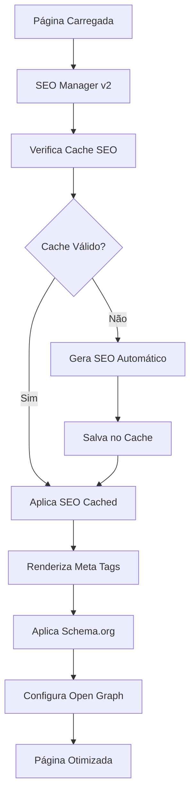

# Sistema SEO Profissional Completo - AIMindset

## 1. Visão Geral do Projeto

Este documento define a implementação de um sistema de SEO profissional completo para o projeto AIMindset, garantindo otimização avançada em 100% das páginas e automação total para futuros conteúdos. O sistema será construído sobre a infraestrutura existente, aprimorando significativamente a visibilidade nos mecanismos de busca e a experiência do usuário.

**Objetivos Principais:**
- SEO profissional em todas as páginas (existentes e futuras)
- Automação completa para novos artigos e conteúdos
- Performance otimizada e Core Web Vitals excelentes
- Monitoramento e analytics avançados

## 2. Funcionalidades Principais

### 2.1 Papéis de Usuário
| Papel | Método de Acesso | Permissões SEO |
|-------|------------------|----------------|
| Visitante | Acesso direto | Visualiza conteúdo otimizado |
| Administrador | Login admin | Gerencia SEO, visualiza métricas, configura automações |

### 2.2 Módulos Funcionais

O sistema SEO profissional consiste nas seguintes páginas e funcionalidades:

1. **SEO Manager v2**: componente central de gerenciamento de metadados avançados
2. **Dashboard SEO**: painel de métricas e monitoramento no admin
3. **Gerador Automático**: sistema de criação automática de SEO para artigos
4. **Otimizador Universal**: aplicação de SEO em todas as páginas
5. **Monitor de Performance**: tracking de Core Web Vitals e métricas

### 2.3 Detalhes das Páginas

| Nome da Página | Módulo | Descrição da Funcionalidade |
|----------------|--------|----------------------------|
| Home | SEO Avançado | Meta tags completas, Schema.org WebSite, breadcrumbs, Open Graph otimizado |
| Article | SEO Automático | Geração automática de meta description, keywords, Schema.org Article, tempo de leitura |
| Category | SEO Dinâmico | Meta tags baseadas na categoria, Schema.org CollectionPage, paginação SEO |
| About | SEO Estático | Meta tags otimizadas, Schema.org AboutPage, informações estruturadas |
| Contact | SEO Local | Schema.org ContactPage, informações de contato estruturadas |
| Privacy | SEO Legal | Meta tags específicas, Schema.org WebPage |
| Categories | SEO Listagem | Schema.org ItemList, meta tags para listagem de categorias |
| Newsletter | SEO Novo | Implementar meta tags, Schema.org WebPage, otimização para conversão |
| AllArticles | SEO Novo | Schema.org ItemList, paginação SEO, filtros otimizados |
| Admin | SEO Restrito | Meta robots noindex, proteção contra indexação |
| AdminLogin | SEO Restrito | Meta robots noindex, nofollow, proteção total |
| Dashboard SEO | SEO Novo | Painel de métricas, monitoramento, configurações avançadas |

## 3. Fluxo Principal

### Fluxo do Usuário Regular
1. Acessa qualquer página → SEO otimizado automaticamente aplicado
2. Navega entre páginas → Breadcrumbs e navegação SEO estruturada
3. Lê artigos → Schema.org Article, tempo de leitura, meta tags automáticas

### Fluxo do Administrador
1. Login no admin → Acesso ao Dashboard SEO
2. Publica novo artigo → SEO gerado automaticamente
3. Monitora métricas → Dashboard com analytics e performance
4. Configura SEO → Ajustes e otimizações avançadas

## 4. Design da Interface

### 4.1 Estilo de Design
- **Cores Primárias**: #1a365d (azul escuro), #2d3748 (cinza escuro)
- **Cores Secundárias**: #4299e1 (azul claro), #68d391 (verde sucesso)
- **Estilo de Botões**: Rounded, gradientes sutis, hover effects
- **Fontes**: Inter (títulos), System UI (corpo), tamanhos 14px-32px
- **Layout**: Card-based, navegação top, sidebar admin
- **Ícones**: Lucide React, estilo outline, cores consistentes

### 4.2 Visão Geral do Design das Páginas

| Nome da Página | Módulo | Elementos UI |
|----------------|--------|--------------|
| Dashboard SEO | Métricas | Cards de estatísticas, gráficos interativos, tabelas de dados, cores #4299e1 |
| SEO Manager | Configuração | Formulários estruturados, toggles, inputs validados, preview em tempo real |
| Gerador Automático | Automação | Progress bars, status indicators, logs de atividade, cores de sucesso |
| Monitor Performance | Analytics | Gráficos de linha, métricas Core Web Vitals, alertas coloridos |

### 4.3 Responsividade
- **Desktop-first** com adaptação mobile completa
- **Touch optimization** para dispositivos móveis
- **Progressive enhancement** para diferentes tamanhos de tela
- **Lazy loading** para componentes pesados de SEO