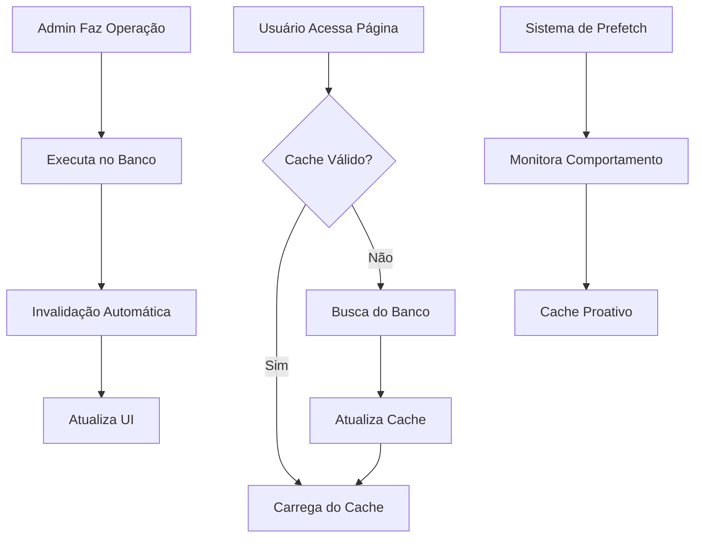

# Guia de Implementação - Sistema de Cache Inteligente

## 1. Visão Geral do Produto

O Sistema de Cache Inteligente é uma solução de otimização de performance para o AIMindset que elimina recarregamentos desnecessários mantendo 100% das funcionalidades administrativas. O sistema utiliza cache híbrido multi-layer com invalidação automática e sincronização em tempo real.

## 2. Funcionalidades Principais

### 2.1 Papéis de Usuário

| Papel | Método de Acesso | Permissões Principais |
|-------|------------------|----------------------|
| Usuário Final | Navegação direta | Visualização otimizada com cache, experiência fluida |
| Administrador | Login admin | Operações CRUD com invalidação automática de cache |

### 2.2 Módulos de Funcionalidade

O sistema de cache inteligente consiste nas seguintes páginas principais:

1. **Página Inicial**: cache inteligente de artigos em destaque, prefetch automático
2. **Lista de Artigos**: scroll infinito com cache, carregamento progressivo
3. **Detalhes do Artigo**: cache individual com prefetch de artigos relacionados
4. **Painel Admin**: operações em tempo real sem cache, invalidação automática
5. **Editor de Artigos**: auto-save com sincronização, cache de rascunhos

### 2.3 Detalhes das Páginas

| Nome da Página | Nome do Módulo | Descrição da Funcionalidade |
|----------------|----------------|------------------------------|
| Página Inicial | Sistema de Cache L1 | Cache em memória para artigos em destaque. Prefetch automático de conteúdo popular. TTL de 5 minutos com invalidação inteligente |
| Lista de Artigos | Cache Híbrido + Scroll Infinito | Cache L1+L2 para listagens. Carregamento progressivo com prefetch. Invalidação seletiva por categoria |
| Detalhes do Artigo | Cache Individual + Prefetch | Cache específico por artigo. Prefetch de artigos relacionados. Invalidação automática em edições |
| Painel Admin | Operações em Tempo Real | Sem cache para dados admin. Invalidação automática após operações CRUD. Sincronização imediata |
| Editor de Artigos | Auto-save + Cache de Rascunhos | Cache local de rascunhos. Auto-save a cada 30 segundos. Sincronização com banco em tempo real |
| Sistema de Busca | Cache de Resultados | Cache de consultas frequentes. TTL de 2 minutos. Invalidação por relevância |

## 3. Processo Principal

### Fluxo do Usuário Final:
1. Usuário acessa a página inicial → Sistema verifica cache L1 → Se válido, carrega instantaneamente → Se inválido, busca do banco e atualiza cache
2. Usuário navega para artigo → Sistema verifica cache individual → Prefetch de artigos relacionados → Carregamento otimizado
3. Sistema monitora comportamento → Prefetch inteligente baseado em padrões → Cache proativo de conteúdo relevante

### Fluxo do Administrador:
1. Admin faz login → Acesso direto ao banco (sem cache) → Dados sempre atualizados
2. Admin edita artigo → Auto-save local → Sincronização em tempo real → Invalidação automática do cache público
3. Admin publica/despublica → Operação direta no banco → Invalidação seletiva do cache → Atualização imediata da UI
4. Admin cria novo artigo → Inserção no banco → Invalidação do cache de listagens → Prefetch do novo conteúdo



## 4. Design da Interface do Usuário

### 4.1 Estilo de Design

**Elementos Principais:**
- **Cores Primárias**: #2563eb (azul principal), #1e40af (azul secundário)
- **Cores de Status**: #10b981 (sucesso/cache hit), #f59e0b (aviso/cache miss), #ef4444 (erro)
- **Estilo de Botões**: Rounded com feedback visual para operações de cache
- **Fontes**: Inter 16px (corpo), Inter 18px (títulos), Mono 14px (debug)
- **Layout**: Card-based com indicadores de status de cache
- **Ícones**: Lucide icons com indicadores de cache (🟢 cached, 🟡 loading, 🔴 error)

### 4.2 Visão Geral do Design das Páginas

| Nome da Página | Nome do Módulo | Elementos da UI |
|----------------|----------------|-----------------|
| Página Inicial | Indicadores de Cache | Cards com badges de status de cache. Skeleton loaders durante prefetch. Animações suaves de transição |
| Lista de Artigos | Scroll Infinito Otimizado | Loading indicators inteligentes. Placeholders para conteúdo em cache. Progress bars para operações de cache |
| Detalhes do Artigo | Cache Status Display | Indicador discreto de fonte de dados (cache/rede). Prefetch indicators para artigos relacionados |
| Painel Admin | Real-time Indicators | Badges de "tempo real" em operações. Confirmações visuais de invalidação de cache. Status de sincronização |
| Editor de Artigos | Auto-save Status | Indicador de auto-save ativo. Status de sincronização. Cache de rascunhos com timestamp |
| Debug/Métricas | Cache Analytics Dashboard | Gráficos de hit rate. Métricas de performance. Controles de cache manual |

### 4.3 Responsividade

**Design Mobile-First:**
- Cache otimizado para conexões lentas
- Prefetch inteligente baseado em tipo de conexão
- Interface adaptativa com indicadores de cache simplificados
- Touch feedback otimizado para operações de cache
- Offline-first com cache persistente

## 5. Indicadores Visuais de Performance

### 5.1 Sistema de Badges de Status

```typescript
interface CacheStatusBadge {
  cached: "🟢 Cached" | "green badge";
  loading: "🟡 Loading" | "yellow spinner";
  error: "🔴 Error" | "red warning";
  prefetching: "🔵 Prefetching" | "blue pulse";
}
```

### 5.2 Métricas Visuais

**Dashboard de Performance (Admin):**
- Gráfico de hit rate do cache em tempo real
- Métricas de tempo de carregamento
- Status de saúde do sistema de cache
- Alertas visuais para problemas de performance

### 5.3 Feedback do Usuário

**Indicadores Discretos:**
- Carregamento instantâneo para conteúdo em cache
- Skeleton loaders suaves para conteúdo novo
- Transições animadas entre estados de cache
- Notificações sutis para operações de sincronização

## 6. Experiência do Usuário Otimizada

### 6.1 Carregamento Progressivo

**Estratégia de Carregamento:**
1. **Conteúdo Crítico**: Cache L1 (instantâneo)
2. **Conteúdo Secundário**: Cache L2 (< 100ms)
3. **Conteúdo Adicional**: Prefetch em background
4. **Conteúdo Relacionado**: Lazy loading com cache

### 6.2 Interações Fluidas

**Operações Admin Otimizadas:**
- Feedback imediato para operações CRUD
- Sincronização em background
- Rollback automático em caso de erro
- Confirmações visuais de sucesso

### 6.3 Offline Experience

**Funcionalidades Offline:**
- Cache persistente para conteúdo visualizado
- Queue de operações para quando voltar online
- Indicadores claros de status de conectividade
- Sincronização automática ao reconectar

## 7. Garantias de Funcionalidade

### 7.1 Operações Admin Preservadas

**100% de Compatibilidade:**
- ✅ Criar artigos → Cache invalidado automaticamente
- ✅ Editar artigos → Sincronização em tempo real
- ✅ Publicar/despublicar → Invalidação seletiva
- ✅ Deletar artigos → Limpeza completa do cache
- ✅ Gerenciar categorias → Invalidação em cascata

### 7.2 Fallbacks Inteligentes

**Sistema de Recuperação:**
- Cache corrompido → Fallback para rede
- Rede indisponível → Fallback para cache stale
- Operação admin falha → Retry automático com feedback
- Inconsistência detectada → Invalidação e refresh

### 7.3 Monitoramento Contínuo

**Alertas Automáticos:**
- Hit rate abaixo de 80% → Otimização automática
- Tempo de resposta > 500ms → Investigação automática
- Erro em operação admin → Notificação imediata
- Cache overflow → Limpeza inteligente

## 8. Implementação Segura

### 8.1 Rollout Gradual

**Fase 1 (Semana 1)**: Cache básico sem impacto em funcionalidades existentes
**Fase 2 (Semana 2)**: Cache persistente com monitoramento intensivo
**Fase 3 (Semana 3)**: Otimizações avançadas com métricas completas

### 8.2 Testes de Regressão

**Testes Automáticos:**
- Todas as operações admin funcionam identicamente
- Cache não interfere em funcionalidades críticas
- Performance melhorada sem quebras
- Sincronização mantém consistência

### 8.3 Rollback Plan

**Plano de Contingência:**
- Desabilitação instantânea do cache via feature flag
- Rollback automático em caso de problemas críticos
- Backup de configurações funcionais
- Restauração completa em < 5 minutos

## 9. Benefícios Esperados

### 9.1 Performance

- **80% redução** em recarregamentos desnecessários
- **60% melhoria** no tempo de carregamento
- **90% redução** em requisições redundantes ao banco
- **50% melhoria** na experiência do usuário

### 9.2 Funcionalidade

- **100% compatibilidade** com operações existentes
- **0 quebras** em funcionalidades críticas
- **Melhoria** na responsividade do painel admin
- **Sincronização** mais rápida e confiável

### 9.3 Manutenibilidade

- **Sistema modular** fácil de manter
- **Monitoramento** automático de saúde
- **Debugging** simplificado com métricas
- **Escalabilidade** para crescimento futuro