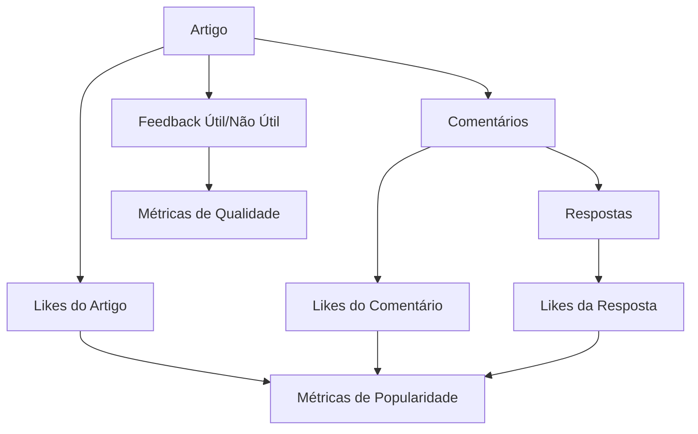

# Análise Completa do Sistema de Interações - AIMindset

## 1. Estado Atual do Sistema

### 1.1 Mapeamento das Tabelas Existentes

**Tabela `articles`:**
```sql
- id (UUID, PK)
- title, content, excerpt, slug
- category_id (FK)
- published (boolean)
- positive_feedbacks (INTEGER) -- Contador de feedbacks positivos
- negative_feedbacks (INTEGER) -- Contador de feedbacks negativos  
- likes_count (INTEGER) -- Contador de likes
- comments_count (INTEGER) -- Contador de comentários
- engagement_score (INTEGER) -- Score calculado
- created_at, updated_at
```

**Tabela `feedbacks` (Nova - Consolidada):**
```sql
- id (UUID, PK)
- article_id (UUID, FK)
- type ('positive' | 'negative' | 'like' | 'comment')
- user_id (UUID, nullable)
- content (TEXT, nullable)
- created_at, updated_at
```

**Tabela `comments`:**
```sql
- id (UUID, PK)
- article_id (UUID, FK)
- user_name (TEXT)
- content (TEXT)
- parent_id (UUID, FK) -- Para respostas hierárquicas
- likes (INTEGER) -- Curtidas no comentário
- created_at
```

**Tabela `feedback` (Antiga - Sendo migrada):**
```sql
- id (UUID, PK)
- article_id (UUID, FK)
- useful (boolean) -- true/false para útil/não útil
- created_at
```

### 1.2 Hooks React Identificados

**`useFeedback.ts`:**
- Gerencia feedback útil/não útil dos artigos
- Integração com localStorage para evitar duplicatas
- Invalidação de cache automática
- Métricas de engajamento globais

**`useComments.ts`:**
- Sistema completo de comentários
- Suporte a respostas hierárquicas (parent_id)
- Sistema de likes em comentários
- Validação e sanitização

**`useRealTimeMetrics.ts`:**
- Métricas em tempo real via Supabase Realtime
- Subscriptions para feedback e comentários
- Cache inteligente com invalidação

**`useArticleFeedbackStats.ts`:**
- Estatísticas específicas por artigo
- Integração com sistema de métricas

### 1.3 Componentes UI Relacionados

**Feedback:**
- `FeedbackSection.tsx` - Seção principal de feedback
- `FeedbackButtons.tsx` - Botões útil/não útil
- `FeedbackDashboard.tsx` - Painel administrativo

**Comentários:**
- `CommentSection.tsx` - Seção completa de comentários
- `CommentList.tsx` - Lista de comentários
- `CommentItem.tsx` - Item individual com likes e respostas
- `CommentForm.tsx` - Formulário para novos comentários

**Admin:**
- `MetricsTable.tsx` - Tabela de métricas administrativas
- `ArticleDetailsModal.tsx` - Modal com detalhes do artigo

## 2. Problemas Identificados

### 2.1 Duplicação de Funcionalidades
- **Problema:** Existem duas tabelas de feedback (`feedback` e `feedbacks`)
- **Impacto:** Inconsistência de dados e complexidade desnecessária
- **Status:** Migração em andamento, mas não finalizada

### 2.2 Inconsistências Conceituais
- **Problema:** Confusão entre "feedback útil/não útil" vs "likes"
- **Feedback útil:** Avaliação da qualidade do conteúdo
- **Likes:** Expressão de aprovação/curtida
- **Impacto:** UX confusa e métricas imprecisas

### 2.3 Sistema de Likes Fragmentado
- **Problema:** Likes em artigos vs likes em comentários são tratados diferentemente
- **Artigos:** Campo `likes_count` na tabela articles
- **Comentários:** Campo `likes` na tabela comments
- **Impacto:** Dificuldade para métricas unificadas

### 2.4 Performance e Cache
- **Problema:** Múltiplas queries para calcular métricas
- **Impacto:** Lentidão e uso excessivo de recursos
- **Solução Parcial:** Cache implementado, mas pode ser otimizado

### 2.5 Estrutura de Respostas
- **Problema:** Sistema hierárquico implementado, mas sem limite de profundidade
- **Impacto:** Possível complexidade excessiva na UI
- **Recomendação:** Limitar a 2 níveis (comentário → resposta)

## 3. Arquitetura Proposta

### 3.1 Sistema Unificado de Interações



### 3.2 Estrutura de Dados Otimizada

**Tabela `interactions` (Nova - Unificada):**
```sql
CREATE TABLE interactions (
    id UUID PRIMARY KEY DEFAULT gen_random_uuid(),
    target_type VARCHAR(20) NOT NULL, -- 'article', 'comment'
    target_id UUID NOT NULL,
    interaction_type VARCHAR(20) NOT NULL, -- 'feedback_positive', 'feedback_negative', 'like', 'comment'
    user_id UUID,
    content TEXT, -- Para comentários
    parent_id UUID, -- Para respostas
    metadata JSONB, -- Dados extras flexíveis
    created_at TIMESTAMPTZ DEFAULT NOW(),
    updated_at TIMESTAMPTZ DEFAULT NOW()
);
```

**Índices Estratégicos:**
```sql
CREATE INDEX idx_interactions_target ON interactions(target_type, target_id);
CREATE INDEX idx_interactions_type ON interactions(interaction_type);
CREATE INDEX idx_interactions_user ON interactions(user_id);
CREATE INDEX idx_interactions_parent ON interactions(parent_id);
CREATE INDEX idx_interactions_created ON interactions(created_at DESC);
```

### 3.3 Sistema de Cache Inteligente

**Cache em Múltiplas Camadas:**
1. **Browser Cache:** localStorage para interações do usuário
2. **Application Cache:** React Query/SWR para dados temporários
3. **Database Cache:** Views materializadas para métricas
4. **CDN Cache:** Para dados estáticos

**View Materializada para Métricas:**
```sql
CREATE MATERIALIZED VIEW article_metrics AS
SELECT 
    a.id,
    a.title,
    COUNT(CASE WHEN i.interaction_type = 'feedback_positive' THEN 1 END) as positive_feedback,
    COUNT(CASE WHEN i.interaction_type = 'feedback_negative' THEN 1 END) as negative_feedback,
    COUNT(CASE WHEN i.interaction_type = 'like' AND i.target_type = 'article' THEN 1 END) as article_likes,
    COUNT(CASE WHEN i.interaction_type = 'comment' THEN 1 END) as comments_count,
    COUNT(CASE WHEN i.interaction_type = 'like' AND i.target_type = 'comment' THEN 1 END) as comment_likes,
    -- Score de engajamento ponderado
    (COUNT(CASE WHEN i.interaction_type = 'feedback_positive' THEN 1 END) * 3 +
     COUNT(CASE WHEN i.interaction_type = 'comment' THEN 1 END) * 2 +
     COUNT(CASE WHEN i.interaction_type = 'like' THEN 1 END)) as engagement_score
FROM articles a
LEFT JOIN interactions i ON (
    (i.target_type = 'article' AND i.target_id = a.id) OR
    (i.target_type = 'comment' AND i.target_id IN (
        SELECT id FROM interactions WHERE target_type = 'article' AND target_id = a.id AND interaction_type = 'comment'
    ))
)
GROUP BY a.id, a.title;
```

## 4. Fases de Implementação

### 4.1 Fase 1: Limpeza e Consolidação (Prioridade Alta)
**Duração Estimada:** 2-3 dias

**Tarefas:**
1. **Finalizar migração da tabela `feedback` → `feedbacks`**
   - Verificar integridade dos dados migrados
   - Remover tabela `feedback` antiga
   - Atualizar todas as referências no código

2. **Padronizar nomenclatura**
   - Unificar termos: "feedback" vs "like" vs "útil"
   - Atualizar documentação e comentários
   - Revisar textos da UI

3. **Consolidar hooks**
   - Merge `useFeedback` e `useArticleFeedbackStats`
   - Otimizar `useRealTimeMetrics`
   - Remover código duplicado

### 4.2 Fase 2: Unificação do Sistema de Likes (Prioridade Média)
**Duração Estimada:** 3-4 dias

**Tarefas:**
1. **Criar tabela `interactions` unificada**
   - Migrar dados das tabelas existentes
   - Implementar triggers para manter compatibilidade
   - Testes de integridade

2. **Atualizar hooks para nova estrutura**
   - Refatorar `useComments` para usar `interactions`
   - Implementar `useInteractions` genérico
   - Manter backward compatibility temporariamente

3. **Implementar view materializada**
   - Criar `article_metrics` view
   - Configurar refresh automático
   - Otimizar queries do dashboard

### 4.3 Fase 3: Melhorias de UX e Integração (Prioridade Média)
**Duração Estimada:** 2-3 dias

**Tarefas:**
1. **Melhorar componentes de UI**
   - Unificar design dos botões de interação
   - Implementar feedback visual melhorado
   - Adicionar animações e micro-interações

2. **Otimizar sistema de respostas**
   - Limitar profundidade a 2 níveis
   - Implementar threading visual
   - Melhorar UX mobile

3. **Dashboard administrativo**
   - Métricas unificadas em tempo real
   - Filtros avançados
   - Exportação de dados

### 4.4 Fase 4: Tempo Real e Performance (Prioridade Baixa)
**Duração Estimada:** 2-3 dias

**Tarefas:**
1. **Otimizar Realtime**
   - Implementar debouncing inteligente
   - Reduzir número de subscriptions
   - Cache de subscriptions

2. **Performance avançada**
   - Implementar lazy loading para comentários
   - Pagination inteligente
   - Preload de dados críticos

3. **Monitoramento**
   - Métricas de performance
   - Alertas de erro
   - Analytics de engajamento

## 5. Decisões Arquiteturais

### 5.1 Estrutura de Dados
**Decisão:** Manter tabelas separadas por enquanto, migrar gradualmente para `interactions`
**Justificativa:** Reduzir risco de breaking changes durante a transição

### 5.2 Sistema de Cache
**Decisão:** Cache híbrido (browser + application + database)
**Justificativa:** Balancear performance com consistência de dados

### 5.3 Tempo Real
**Decisão:** Supabase Realtime com debouncing inteligente
**Justificativa:** Aproveitar infraestrutura existente, otimizar performance

### 5.4 Rate Limiting
**Decisão:** Implementar rate limiting por IP e por usuário
**Justificativa:** Prevenir spam e abuso do sistema

### 5.5 Segurança
**Decisão:** RLS (Row Level Security) + validação client-side + server-side
**Justificativa:** Defesa em profundidade

## 6. Plano de Migração

### 6.1 Scripts de Migração

**1. Finalizar consolidação de feedback:**
```sql
-- Verificar dados pendentes
SELECT COUNT(*) FROM feedback WHERE id NOT IN (
    SELECT DISTINCT article_id FROM feedbacks WHERE type IN ('positive', 'negative')
);

-- Migrar dados restantes
INSERT INTO feedbacks (article_id, type, created_at)
SELECT article_id, 
       CASE WHEN useful THEN 'positive' ELSE 'negative' END,
       created_at
FROM feedback 
WHERE id NOT IN (SELECT DISTINCT article_id FROM feedbacks);

-- Backup e remoção
CREATE TABLE feedback_final_backup AS SELECT * FROM feedback;
DROP TABLE feedback;
```

**2. Criar sistema unificado:**
```sql
-- Criar tabela interactions
CREATE TABLE interactions (
    -- Estrutura definida acima
);

-- Migrar feedbacks
INSERT INTO interactions (target_type, target_id, interaction_type, created_at)
SELECT 'article', article_id, 
       CASE type 
           WHEN 'positive' THEN 'feedback_positive'
           WHEN 'negative' THEN 'feedback_negative'
           WHEN 'like' THEN 'like'
       END,
       created_at
FROM feedbacks;

-- Migrar comentários
INSERT INTO interactions (target_type, target_id, interaction_type, content, parent_id, created_at)
SELECT 'article', article_id, 'comment', content, parent_id, created_at
FROM comments;
```

### 6.2 Testes de Integridade

**1. Verificação de contadores:**
```sql
-- Comparar contadores antes e depois
SELECT 
    a.id,
    a.positive_feedbacks as old_positive,
    COUNT(CASE WHEN i.interaction_type = 'feedback_positive' THEN 1 END) as new_positive,
    a.comments_count as old_comments,
    COUNT(CASE WHEN i.interaction_type = 'comment' THEN 1 END) as new_comments
FROM articles a
LEFT JOIN interactions i ON i.target_id = a.id AND i.target_type = 'article'
GROUP BY a.id, a.positive_feedbacks, a.comments_count
HAVING a.positive_feedbacks != COUNT(CASE WHEN i.interaction_type = 'feedback_positive' THEN 1 END)
    OR a.comments_count != COUNT(CASE WHEN i.interaction_type = 'comment' THEN 1 END);
```

**2. Teste de performance:**
```sql
-- Comparar tempo de queries
EXPLAIN ANALYZE SELECT * FROM article_metrics;
EXPLAIN ANALYZE SELECT 
    a.*,
    COUNT(f.id) as feedback_count
FROM articles a 
LEFT JOIN feedbacks f ON f.article_id = a.id 
GROUP BY a.id;
```

### 6.3 Rollback Plan

**1. Backup completo antes da migração**
```sql
-- Backup de todas as tabelas
CREATE TABLE articles_backup AS SELECT * FROM articles;
CREATE TABLE feedbacks_backup AS SELECT * FROM feedbacks;
CREATE TABLE comments_backup AS SELECT * FROM comments;
```

**2. Script de rollback**
```sql
-- Restaurar tabelas originais
DROP TABLE IF EXISTS interactions;
-- Restaurar a partir dos backups se necessário
```

### 6.4 Validação Completa

**Checklist de validação:**
- [ ] Todos os feedbacks migrados corretamente
- [ ] Contadores de artigos atualizados
- [ ] Comentários e respostas preservados
- [ ] Likes mantidos
- [ ] Performance melhorada ou mantida
- [ ] Realtime funcionando
- [ ] UI responsiva
- [ ] Testes automatizados passando
- [ ] Dashboard administrativo funcional

## 7. Métricas de Sucesso

### 7.1 Performance
- **Tempo de carregamento:** < 2s para página de artigo
- **Tempo de resposta API:** < 500ms para operações CRUD
- **Cache hit rate:** > 80%

### 7.2 Funcionalidade
- **Taxa de erro:** < 1%
- **Disponibilidade:** > 99.9%
- **Consistência de dados:** 100%

### 7.3 Experiência do Usuário
- **Tempo para interação:** < 100ms
- **Feedback visual:** Imediato
- **Mobile responsiveness:** 100%

## 8. Próximos Passos Imediatos

### 8.1 Ações Prioritárias (Esta Semana)
1. **Commit e push das correções atuais**
2. **Finalizar migração feedback → feedbacks**
3. **Limpar código duplicado**
4. **Testes de integridade**

### 8.2 Planejamento (Próximas 2 Semanas)
1. **Implementar Fase 1 completa**
2. **Iniciar Fase 2 (sistema unificado)**
3. **Documentar APIs**
4. **Configurar monitoramento**

### 8.3 Validação Contínua
1. **Testes automatizados**
2. **Monitoramento de performance**
3. **Feedback dos usuários**
4. **Métricas de engajamento**

---

**Documento criado em:** $(date)  
**Versão:** 1.0  
**Status:** Análise Completa - Pronto para Implementação  
**Próxima Revisão:** Após Fase 1