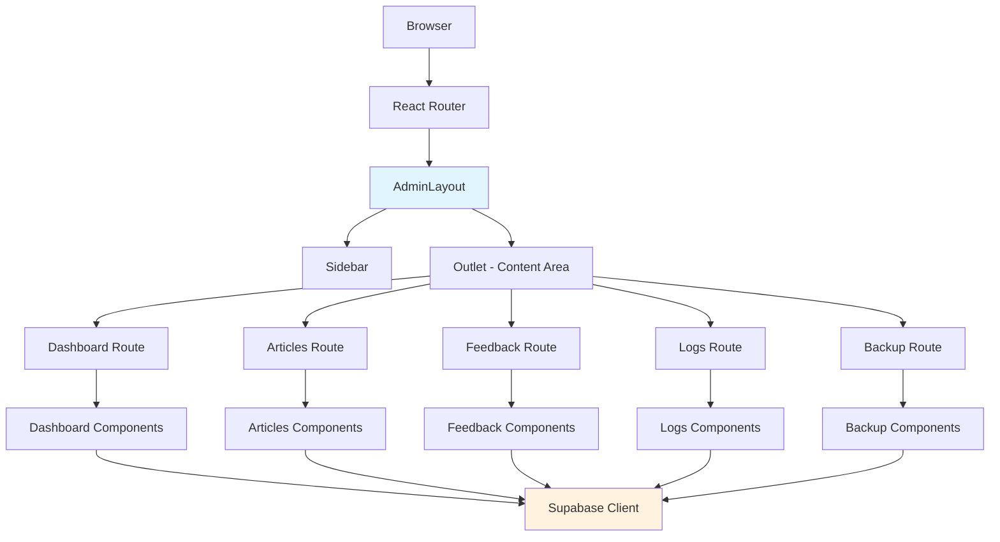

# 🏗️ Arquitetura Técnica - Admin Modular

## 📊 Diagrama de Arquitetura



---

## 🗂️ Estrutura de Arquivos Detalhada

```
src/
├── pages/
│   └── admin/
│       ├── index.tsx          # Dashboard principal
│       ├── articles.tsx       # Lista de artigos
│       ├── new-article.tsx    # Criar novo artigo
│       ├── feedback.tsx       # Gerenciar feedbacks
│       ├── logs.tsx          # Logs e monitoramento
│       ├── backup.tsx        # Backup e segurança
│       ├── newsletter.tsx    # Newsletter
│       ├── users.tsx         # Gerenciar usuários
│       ├── categories.tsx    # Categorias
│       └── seo.tsx           # SEO tools
├── components/
│   └── Admin/
│       ├── AdminLayout.tsx    # Layout base compartilhado
│       ├── Sidebar.tsx        # Navegação lateral
│       ├── Dashboard/         # Componentes Dashboard
│       │   ├── StatsCards.tsx
│       │   ├── RecentActivity.tsx
│       │   └── QuickActions.tsx
│       ├── Articles/          # Componentes Artigos
│       │   ├── ArticleList.tsx
│       │   ├── ArticleForm.tsx
│       │   └── ArticleFilters.tsx
│       ├── Feedback/         # Componentes Feedback
│       │   ├── FeedbackList.tsx
│       │   ├── FeedbackStats.tsx
│       │   └── FeedbackFilters.tsx
│       ├── Logs/             # Componentes Logs
│       │   ├── LogViewer.tsx
│       │   ├── LogFilters.tsx
│       │   └── LogCharts.tsx
│       └── Backup/           # Componentes Backup
│           ├── BackupStatus.tsx
│           ├── BackupHistory.tsx
│           └── BackupActions.tsx
├── contexts/
│   └── AdminContext.tsx      # Contexto compartilhado
├── hooks/
│   ├── useAdminNavigation.ts # Hook navegação
│   └── useAdminPermissions.ts # Hook permissões
└── utils/
    └── adminRoutes.ts        # Configuração rotas
```

---

## ⚙️ Implementação do AdminLayout

### AdminLayout.tsx
```tsx
import { Outlet, useLocation, useNavigate } from 'react-router-dom';
import { useState, useEffect, useCallback } from 'react';
import { cn } from '@/utils/cn';

interface SidebarItem {
  id: string;
  label: string;
  icon: string;
  path: string;
  badge?: number;
  requiredPermission?: string;
}

const sidebarItems: SidebarItem[] = [
  { id: 'dashboard', label: 'Dashboard', icon: '📊', path: '/admin' },
  { id: 'articles', label: 'Artigos', icon: '📝', path: '/admin/articles' },
  { id: 'new-article', label: 'Novo Artigo', icon: '➕', path: '/admin/new-article' },
  { id: 'feedback', label: 'Feedbacks', icon: '💬', path: '/admin/feedback' },
  { id: 'newsletter', label: 'Newsletter', icon: '📧', path: '/admin/newsletter' },
  { id: 'users', label: 'Usuários', icon: '👥', path: '/admin/users' },
  { id: 'categories', label: 'Categorias', icon: '🏷️', path: '/admin/categories' },
  { id: 'seo', label: 'SEO', icon: '🔍', path: '/admin/seo' },
  { id: 'logs', label: 'Logs', icon: '📋', path: '/admin/logs' },
  { id: 'backup', label: 'Backup', icon: '💾', path: '/admin/backup' },
];

export default function AdminLayout() {
  const location = useLocation();
  const navigate = useNavigate();
  const [activeTab, setActiveTab] = useState('dashboard');
  const [sidebarCollapsed, setSidebarCollapsed] = useState(false);
  const [isMobile, setIsMobile] = useState(false);

  // Detectar aba ativa baseada na URL
  useEffect(() => {
    const path = location.pathname;
    const currentItem = sidebarItems.find(item => item.path === path);
    setActiveTab(currentItem?.id || 'dashboard');
  }, [location]);

  // Detectar mobile
  useEffect(() => {
    const checkMobile = () => {
      setIsMobile(window.innerWidth < 768);
      if (window.innerWidth < 768) {
        setSidebarCollapsed(true);
      }
    };
    
    checkMobile();
    window.addEventListener('resize', checkMobile);
    return () => window.removeEventListener('resize', checkMobile);
  }, []);

  const handleNavigation = useCallback((path: string) => {
    navigate(path);
    if (isMobile) {
      setSidebarCollapsed(true);
    }
  }, [navigate, isMobile]);

  return (
    <div className="admin-layout flex h-screen bg-gray-50 overflow-hidden">
      {/* Overlay para mobile */}
      {isMobile && !sidebarCollapsed && (
        <div 
          className="fixed inset-0 bg-black bg-opacity-50 z-40"
          onClick={() => setSidebarCollapsed(true)}
        />
      )}

      {/* Sidebar */}
      <aside className={cn(
        'admin-sidebar bg-white shadow-lg transition-all duration-300 z-50',
        'flex flex-col border-r border-gray-200',
        sidebarCollapsed ? 'w-16' : 'w-64',
        isMobile ? 'fixed inset-y-0 left-0' : 'relative'
      )}>
        {/* Header da Sidebar */}
        <div className="p-4 border-b border-gray-200">
          <div className="flex items-center justify-between">
            {!sidebarCollapsed && (
              <div className="flex items-center space-x-2">
                <div className="w-8 h-8 bg-blue-600 rounded-lg flex items-center justify-center">
                  <span className="text-white text-sm font-bold">A</span>
                </div>
                <h2 className="text-lg font-semibold text-gray-800">Admin</h2>
              </div>
            )}
            <button
              onClick={() => setSidebarCollapsed(!sidebarCollapsed)}
              className="p-2 rounded-md hover:bg-gray-100 transition-colors"
              title={sidebarCollapsed ? 'Expandir' : 'Recolher'}
            >
              <span className="text-gray-600">
                {sidebarCollapsed ? '→' : '←'}
              </span>
            </button>
          </div>
        </div>

        {/* Navegação */}
        <nav className="flex-1 p-4 space-y-1 overflow-y-auto">
          {sidebarItems.map((item) => (
            <button
              key={item.id}
              onClick={() => handleNavigation(item.path)}
              className={cn(
                'w-full flex items-center p-3 rounded-lg transition-all duration-200 text-left',
                'hover:bg-gray-100 focus:outline-none focus:ring-2 focus:ring-blue-500',
                activeTab === item.id
                  ? 'bg-blue-50 text-blue-700 border-r-2 border-blue-500 font-medium'
                  : 'text-gray-600 hover:text-gray-800'
              )}
              title={sidebarCollapsed ? item.label : ''}
            >
              <span className="text-lg flex-shrink-0">{item.icon}</span>
              {!sidebarCollapsed && (
                <div className="ml-3 flex-1 flex items-center justify-between">
                  <span>{item.label}</span>
                  {item.badge && (
                    <span className="bg-red-500 text-white text-xs rounded-full px-2 py-1 min-w-[20px] text-center">
                      {item.badge}
                    </span>
                  )}
                </div>
              )}
            </button>
          ))}
        </nav>

        {/* Footer da Sidebar */}
        <div className="p-4 border-t border-gray-200">
          <div className={cn(
            'flex items-center space-x-3',
            sidebarCollapsed && 'justify-center'
          )}>
            <div className="w-8 h-8 bg-gray-300 rounded-full flex-shrink-0" />
            {!sidebarCollapsed && (
              <div className="flex-1 min-w-0">
                <p className="text-sm font-medium text-gray-900 truncate">
                  Admin User
                </p>
                <p className="text-xs text-gray-500 truncate">
                  admin@aimindset.com
                </p>
              </div>
            )}
          </div>
        </div>
      </aside>

      {/* Main Content */}
      <main className="admin-content flex-1 overflow-auto">
        <div className="p-6">
          <Outlet />
        </div>
      </main>
    </div>
  );
}
```

---

## 🛣️ Configuração de Rotas

### adminRoutes.ts
```typescript
export interface AdminRoute {
  path: string;
  component: React.ComponentType;
  label: string;
  icon: string;
  requiredPermission?: string;
  children?: AdminRoute[];
}

export const adminRoutes: AdminRoute[] = [
  {
    path: '/admin',
    component: () => import('@/pages/admin/index'),
    label: 'Dashboard',
    icon: '📊'
  },
  {
    path: '/admin/articles',
    component: () => import('@/pages/admin/articles'),
    label: 'Artigos',
    icon: '📝'
  },
  {
    path: '/admin/new-article',
    component: () => import('@/pages/admin/new-article'),
    label: 'Novo Artigo',
    icon: '➕'
  },
  {
    path: '/admin/feedback',
    component: () => import('@/pages/admin/feedback'),
    label: 'Feedbacks',
    icon: '💬'
  },
  {
    path: '/admin/logs',
    component: () => import('@/pages/admin/logs'),
    label: 'Logs',
    icon: '📋'
  },
  {
    path: '/admin/backup',
    component: () => import('@/pages/admin/backup'),
    label: 'Backup',
    icon: '💾'
  }
];
```

### Atualização App.tsx
```tsx
import { BrowserRouter, Routes, Route, Navigate } from 'react-router-dom';
import { lazy, Suspense } from 'react';
import AdminLayout from '@/components/Admin/AdminLayout';

// Lazy loading das páginas admin
const AdminDashboard = lazy(() => import('@/pages/admin/index'));
const AdminArticles = lazy(() => import('@/pages/admin/articles'));
const AdminNewArticle = lazy(() => import('@/pages/admin/new-article'));
const AdminFeedback = lazy(() => import('@/pages/admin/feedback'));
const AdminLogs = lazy(() => import('@/pages/admin/logs'));
const AdminBackup = lazy(() => import('@/pages/admin/backup'));

// Loading component
const AdminLoading = () => (
  <div className="flex items-center justify-center h-64">
    <div className="animate-spin rounded-full h-8 w-8 border-b-2 border-blue-600"></div>
  </div>
);

function App() {
  return (
    <BrowserRouter>
      <Routes>
        {/* Rotas públicas existentes */}
        <Route path="/" element={<Home />} />
        <Route path="/about" element={<About />} />
        <Route path="/contact" element={<Contact />} />
        <Route path="/articles" element={<Articles />} />
        <Route path="/article/:slug" element={<Article />} />
        
        {/* Rota admin antiga - redirect para nova estrutura */}
        <Route path="/admin-old" element={<Navigate to="/admin" replace />} />
        
        {/* Novas rotas admin modulares */}
        <Route 
          path="/admin" 
          element={
            <AdminLayout>
              <Suspense fallback={<AdminLoading />}>
                <Outlet />
              </Suspense>
            </AdminLayout>
          }
        >
          <Route index element={<AdminDashboard />} />
          <Route path="articles" element={<AdminArticles />} />
          <Route path="new-article" element={<AdminNewArticle />} />
          <Route path="feedback" element={<AdminFeedback />} />
          <Route path="logs" element={<AdminLogs />} />
          <Route path="backup" element={<AdminBackup />} />
        </Route>
        
        {/* 404 */}
        <Route path="*" element={<NotFound />} />
      </Routes>
    </BrowserRouter>
  );
}
```

---

## 🧩 Exemplo de Página Modular

### feedback.tsx
```tsx
import { useEffect, useState } from 'react';
import { useFeedback } from '@/hooks/useFeedback';
import FeedbackList from '@/components/Admin/Feedback/FeedbackList';
import FeedbackStats from '@/components/Admin/Feedback/FeedbackStats';
import FeedbackFilters from '@/components/Admin/Feedback/FeedbackFilters';
import FeedbackActions from '@/components/Admin/Feedback/FeedbackActions';

export default function AdminFeedback() {
  const [filters, setFilters] = useState({
    status: 'all',
    dateRange: '7d',
    search: ''
  });
  
  const { feedbacks, loading, error, refetch } = useFeedback(filters);

  useEffect(() => {
    // Scroll para topo na navegação
    window.scrollTo(0, 0);
    
    // Set document title
    document.title = 'Feedbacks - Admin AIMindset';
    
    // Cleanup
    return () => {
      document.title = 'AIMindset';
    };
  }, []);

  const handleFilterChange = (newFilters: typeof filters) => {
    setFilters(newFilters);
    refetch(newFilters);
  };

  if (error) {
    return (
      <div className="p-6">
        <div className="bg-red-50 border border-red-200 rounded-lg p-4">
          <h3 className="text-red-800 font-medium">Erro ao carregar feedbacks</h3>
          <p className="text-red-600 mt-1">{error.message}</p>
          <button 
            onClick={() => refetch()}
            className="mt-3 bg-red-600 text-white px-4 py-2 rounded-md hover:bg-red-700"
          >
            Tentar Novamente
          </button>
        </div>
      </div>
    );
  }

  return (
    <div className="space-y-6">
      {/* Header */}
      <div className="flex items-center justify-between">
        <div>
          <h1 className="text-2xl font-bold text-gray-900">Feedbacks</h1>
          <p className="text-gray-600 mt-1">Gerencie os feedbacks dos usuários</p>
        </div>
        <FeedbackActions />
      </div>

      {/* Stats */}
      <FeedbackStats feedbacks={feedbacks} loading={loading} />

      {/* Filters */}
      <FeedbackFilters 
        filters={filters} 
        onFilterChange={handleFilterChange}
        loading={loading}
      />

      {/* List */}
      <FeedbackList 
        feedbacks={feedbacks} 
        loading={loading}
        onRefresh={refetch}
      />
    </div>
  );
}
```

---

## 🔄 Hook de Navegação Compartilhada

### useAdminNavigation.ts
```typescript
import { useState, useEffect, useCallback } from 'react';
import { useLocation, useNavigate } from 'react-router-dom';

interface NavigationState {
  currentPath: string;
  previousPath: string;
  breadcrumbs: Breadcrumb[];
  isLoading: boolean;
}

interface Breadcrumb {
  label: string;
  path: string;
  icon?: string;
}

export function useAdminNavigation() {
  const location = useLocation();
  const navigate = useNavigate();
  const [navigationState, setNavigationState] = useState<NavigationState>({
    currentPath: location.pathname,
    previousPath: '',
    breadcrumbs: [],
    isLoading: false
  });

  // Atualizar estado de navegação
  useEffect(() => {
    setNavigationState(prev => ({
      ...prev,
      previousPath: prev.currentPath,
      currentPath: location.pathname,
      breadcrumbs: generateBreadcrumbs(location.pathname)
    }));
  }, [location]);

  const generateBreadcrumbs = (path: string): Breadcrumb[] => {
    const segments = path.split('/').filter(Boolean);
    const breadcrumbs: Breadcrumb[] = [
      { label: 'Admin', path: '/admin', icon: '🏠' }
    ];

    // Mapear segmentos para labels
    const segmentLabels: Record<string, string> = {
      'articles': 'Artigos',
      'feedback': 'Feedbacks',
      'logs': 'Logs',
      'backup': 'Backup',
      'new-article': 'Novo Artigo',
      'users': 'Usuários',
      'categories': 'Categorias',
      'seo': 'SEO',
      'newsletter': 'Newsletter'
    };

    segments.forEach(segment => {
      if (segment !== 'admin' && segmentLabels[segment]) {
        const path = `/admin/${segment}`;
        breadcrumbs.push({
          label: segmentLabels[segment],
          path: path
        });
      }
    });

    return breadcrumbs;
  };

  const navigateTo = useCallback(async (path: string, options?: { 
    replace?: boolean; 
    state?: any;
    showLoading?: boolean;
  }) => {
    if (options?.showLoading) {
      setNavigationState(prev => ({ ...prev, isLoading: true }));
    }

    try {
      if (options?.replace) {
        navigate(path, { replace: true, state: options.state });
      } else {
        navigate(path, { state: options.state });
      }
    } finally {
      if (options?.showLoading) {
        setNavigationState(prev => ({ ...prev, isLoading: false }));
      }
    }
  }, [navigate]);

  const goBack = useCallback(() => {
    if (navigationState.previousPath) {
      navigate(-1);
    } else {
      navigate('/admin');
    }
  }, [navigate, navigationState.previousPath]);

  return {
    ...navigationState,
    navigateTo,
    goBack,
    isDashboard: location.pathname === '/admin'
  };
}
```

---

## 🧪 Testes Unitários

### AdminLayout.test.tsx
```tsx
import { render, screen } from '@testing-library/react';
import { MemoryRouter, Routes, Route } from 'react-router-dom';
import AdminLayout from '@/components/Admin/AdminLayout';

describe('AdminLayout', () => {
  const TestComponent = () => <div>Test Content</div>;
  
  const renderWithRouter = (initialRoute = '/admin') => {
    return render(
      <MemoryRouter initialEntries={[initialRoute]}>
        <Routes>
          <Route path="/admin" element={<AdminLayout />}>
            <Route index element={<TestComponent />} />
            <Route path="feedback" element={<div>Feedback Page</div>} />
          </Route>
        </Routes>
      </MemoryRouter>
    );
  };

  it('renders sidebar with navigation items', () => {
    renderWithRouter();
    
    expect(screen.getByText('Dashboard')).toBeInTheDocument();
    expect(screen.getByText('Artigos')).toBeInTheDocument();
    expect(screen.getByText('Feedbacks')).toBeInTheDocument();
  });

  it('highlights active navigation item', () => {
    renderWithRouter('/admin/feedback');
    
    const feedbackLink = screen.getByText('Feedbacks').closest('button');
    expect(feedbackLink).toHaveClass('bg-blue-50', 'text-blue-700');
  });

  it('renders content area with Outlet', () => {
    renderWithRouter();
    
    expect(screen.getByText('Test Content')).toBeInTheDocument();
  });

  it('toggles sidebar collapse', () => {
    renderWithRouter();
    
    const toggleButton = screen.getByTitle('Recolher');
    expect(screen.getByText('Dashboard')).toBeVisible();
    
    toggleButton.click();
    expect(screen.getByText('Dashboard')).not.toBeVisible();
  });
});
```

---

## 📈 Performance Otimizações

### Lazy Loading por Rota
```tsx
// Implementado no App.tsx com React.lazy
const AdminFeedback = lazy(() => import('@/pages/admin/feedback'));
```

### Memoização de Componentes
```tsx
import { memo } from 'react';

const Sidebar = memo(function Sidebar({ items, activeTab, onNavigate }) {
  // Componente memoizado para evitar re-renders desnecessários
  return (
    // ... conteúdo do sidebar
  );
}, (prevProps, nextProps) => {
  return prevProps.activeTab === nextProps.activeTab &&
         prevProps.items === nextProps.items;
});
```

### Cache de Dados por Rota
```typescript
// useFeedback.ts com cache TTL
const FEEDBACK_CACHE_TTL = 5 * 60 * 1000; // 5 minutos

export function useFeedback(filters) {
  const cacheKey = `feedback-${JSON.stringify(filters)}`;
  const cached = sessionStorage.getItem(cacheKey);
  
  if (cached) {
    const { data, timestamp } = JSON.parse(cached);
    if (Date.now() - timestamp < FEEDBACK_CACHE_TTL) {
      return { data, loading: false, error: null };
    }
  }
  
  // Fetch novo se cache expirado
  // ... lógica de fetch
}
```

---

## 🛡️ Segurança e Permissões

### Hook de Permissões
```typescript
// useAdminPermissions.ts
export function useAdminPermissions() {
  const { user } = useAuth();
  
  const hasPermission = useCallback((permission: string) => {
    if (!user) return false;
    return user.permissions?.includes(permission) || user.role === 'admin';
  }, [user]);
  
  const canAccessRoute = useCallback((route: string) => {
    const routePermissions: Record<string, string[]> = {
      '/admin/users': ['manage_users'],
      '/admin/backup': ['manage_backup'],
      '/admin/logs': ['view_logs'],
      '/admin/seo': ['manage_seo']
    };
    
    const requiredPerms = routePermissions[route] || [];
    return requiredPerms.every(perm => hasPermission(perm));
  }, [hasPermission]);
  
  return { hasPermission, canAccessRoute };
}
```

### Proteção de Rotas
```tsx
// ProtectedRoute.tsx
import { Navigate } from 'react-router-dom';
import { useAdminPermissions } from '@/hooks/useAdminPermissions';

export function ProtectedRoute({ children, requiredPermission }: {
  children: React.ReactNode;
  requiredPermission?: string;
}) {
  const { hasPermission, loading } = useAdminPermissions();
  
  if (loading) {
    return <div>Verificando permissões...</div>;
  }
  
  if (requiredPermission && !hasPermission(requiredPermission)) {
    return <Navigate to="/admin" replace />;
  }
  
  return <>{children}</>;
}
```

---

## 🚀 Deploy e Rollback

### Script de Migração
```bash
#!/bin/bash
# migrate-admin.sh

echo "🚀 Iniciando migração do painel admin..."

# Criar backup
echo "📦 Criando backup..."
git checkout -b backup/admin-$(date +%Y%m%d-%H%M%S)
git add .
git commit -m "Backup antes da migração admin"

# Criar branch de feature
echo "🔧 Criando branch de feature..."
git checkout -b feature/admin-modular

# Executar testes
echo "🧪 Executando testes..."
npm test -- --testPathPattern="Admin"

# Build de validação
echo "🏗️ Validando build..."
npm run build

if [ $? -eq 0 ]; then
  echo "✅ Migração concluída com sucesso!"
  echo "📋 Próximos passos:"
  echo "  1. Testar em staging"
  echo "  2. Fazer merge para main"
  echo "  3. Deploy em produção"
else
  echo "❌ Erro na migração. Restaurando..."
  git checkout main
  echo "✅ Restaurado para branch main"
fi
```

### Rollback Rápido
```bash
# Rollback imediato se necessário
git checkout main
git branch -D feature/admin-modular
git checkout backup/admin-$(date +%Y%m%d-%H%M%S)
```

---

## 📊 Métricas de Sucesso

### Performance
- **Tempo de carregamento por rota**: < 2s
- **Tamanho do bundle**: Reduzido em ~40% com lazy loading
- **Tempo de navegação**: < 500ms entre rotas
- **Memory usage**: Reduzido com code splitting

### Desenvolvimento
- **Tempo de build**: Mantido ou melhorado
- **Hot reload**: Funcionando por rota
- **TypeScript**: 100% tipado
- **Test coverage**: > 80% por módulo

### UX
- **Navegação direta**: Funcionando por URL
- **Refresh preservado**: Estado mantido
- **Mobile responsive**: Sidebar adaptável
- **Acessibilidade**: ARIA labels implementados

---

## 🎯 Conclusão

Esta arquitetura fornece:
- ✅ **Modularização completa** do painel admin
- ✅ **Manutenção simplificada** por funcionalidade
- ✅ **Performance otimizada** com lazy loading
- ✅ **Escalabilidade** para novas funcionalidades
- ✅ **Segurança reforçada** com permissões granulares
- ✅ **Rollback seguro** com backups automatizados

A implementação pode ser feita gradualmente, módulo por módulo, garantindo estabilidade total durante a transição.