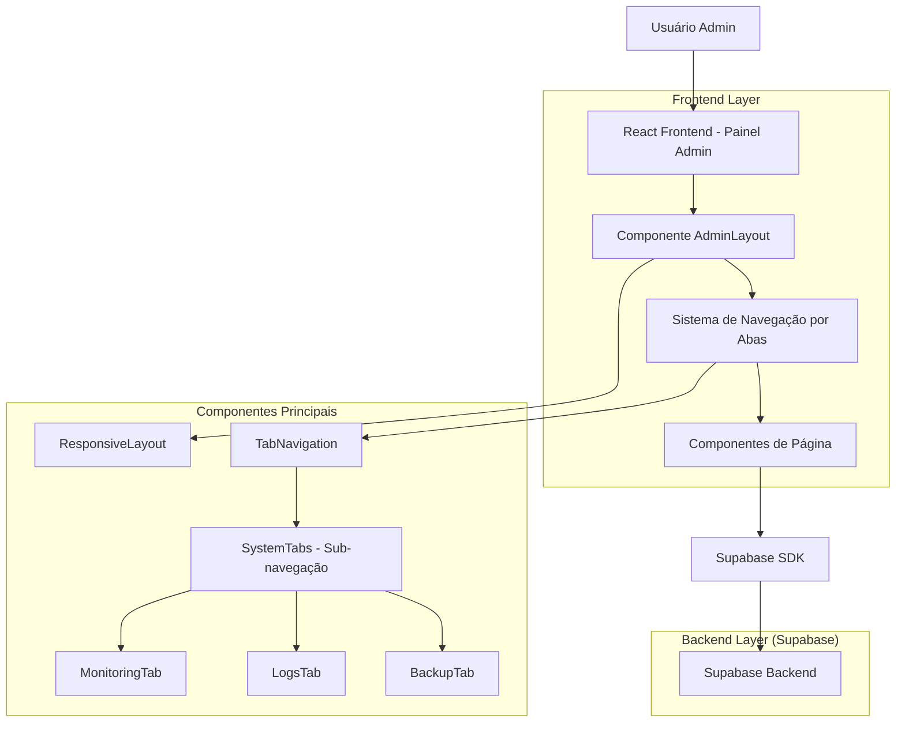
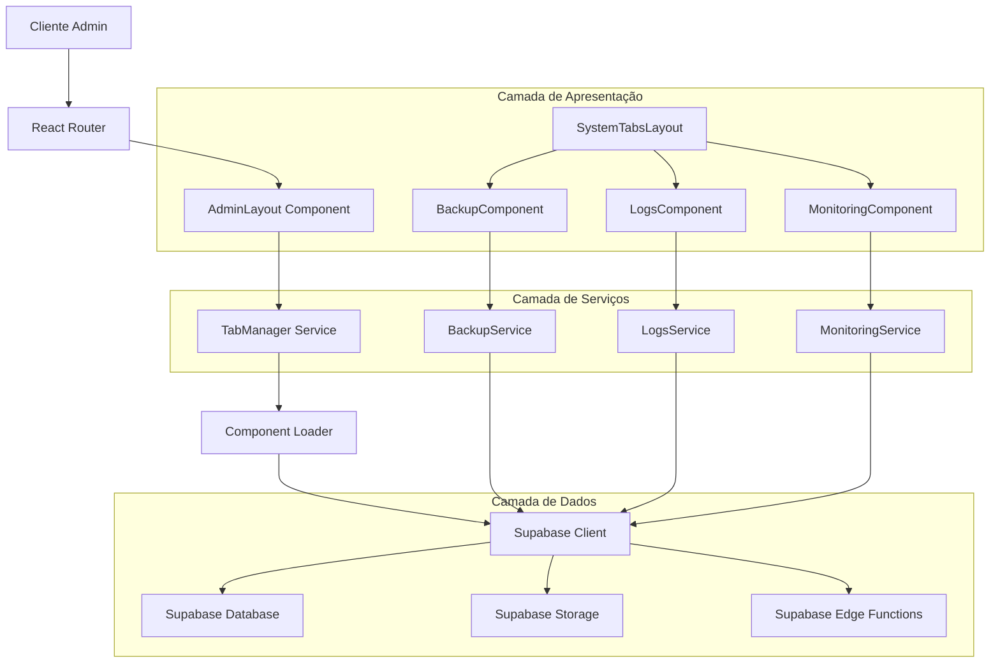
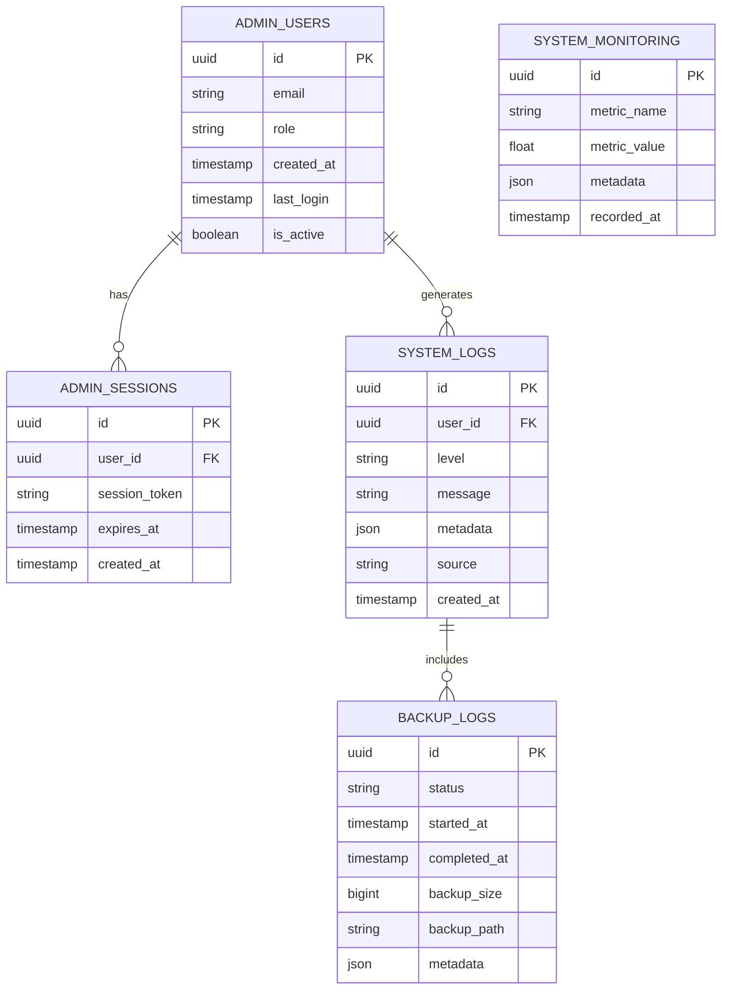

# Arquitetura Técnica - Reorganização do Painel Administrativo

## 1. Arquitetura de Design



## 2. Descrição da Tecnologia

- **Frontend**: React@18 + TypeScript + Tailwind CSS@3 + Vite
- **Backend**: Supabase (PostgreSQL + Auth + Storage + Edge Functions)
- **UI Components**: Lucide React (ícones) + Recharts (gráficos) + Custom Components
- **Estado**: React Hooks + Context API para gerenciamento de estado
- **Roteamento**: React Router DOM para navegação
- **Estilização**: Tailwind CSS com classes customizadas para tema futurístico

## 3. Definições de Rotas

| Rota | Propósito |
|------|-----------|
| /admin | Página principal do painel administrativo (Dashboard) |
| /admin/login | Página de login para administradores |
| /admin?tab=dashboard | Dashboard com métricas gerais |
| /admin?tab=articles | Gerenciamento de artigos |
| /admin?tab=editor | Editor de artigos |
| /admin?tab=newsletter | Gerenciamento de newsletter |
| /admin?tab=users | Gerenciamento de usuários |
| /admin?tab=categories | Gerenciamento de categorias |
| /admin?tab=feedback | Análise de feedback |
| /admin?tab=seo | Configurações e análise SEO |
| /admin?tab=system | Sistema (com sub-abas) |
| /admin?tab=system&subtab=backup | Sub-aba de Backup |
| /admin?tab=system&subtab=logs | Sub-aba de Logs |
| /admin?tab=system&subtab=monitoring | Sub-aba de Monitoramento |
| /admin?tab=editorial | Editorial Inteligente (futura implementação) |

## 4. Definições de API

### 4.1 APIs Principais do Sistema

**Gerenciamento de Abas e Estado**
```typescript
// Hook para gerenciar estado das abas
interface TabState {
  activeTab: string;
  activeSubTab?: string;
  setActiveTab: (tab: string) => void;
  setActiveSubTab: (subTab: string) => void;
}

// Configuração das abas
interface TabConfig {
  id: string;
  label: string;
  icon: React.ComponentType;
  hasSubTabs?: boolean;
  subTabs?: SubTabConfig[];
}

interface SubTabConfig {
  id: string;
  label: string;
  icon: React.ComponentType;
  component: React.ComponentType;
}
```

**API de Backup (Sistema)**
```
GET /api/backup/status
```

Request: Nenhum parâmetro necessário

Response:
| Nome do Parâmetro | Tipo do Parâmetro | Descrição |
|-------------------|-------------------|-----------|
| status | string | Status do último backup |
| lastBackup | string | Data/hora do último backup |
| nextBackup | string | Data/hora do próximo backup agendado |
| backupSize | number | Tamanho do último backup em bytes |

**API de Logs (Sistema)**
```
GET /api/logs/system
```

Request:
| Nome do Parâmetro | Tipo do Parâmetro | Obrigatório | Descrição |
|-------------------|-------------------|-------------|-----------|
| level | string | false | Nível do log (info, warning, error) |
| startDate | string | false | Data de início para filtro |
| endDate | string | false | Data de fim para filtro |
| limit | number | false | Número máximo de logs a retornar |

Response:
| Nome do Parâmetro | Tipo do Parâmetro | Descrição |
|-------------------|-------------------|-----------|
| logs | array | Array de objetos de log |
| totalCount | number | Total de logs disponíveis |
| hasMore | boolean | Indica se há mais logs disponíveis |

**API de Monitoramento (Sistema)**
```
GET /api/monitoring/health
```

Response:
| Nome do Parâmetro | Tipo do Parâmetro | Descrição |
|-------------------|-------------------|-----------|
| systemHealth | string | Status geral do sistema |
| uptime | number | Tempo de atividade em segundos |
| memoryUsage | number | Uso de memória em percentual |
| responseTime | number | Tempo de resposta médio em ms |

## 5. Arquitetura do Servidor



## 6. Modelo de Dados

### 6.1 Definição do Modelo de Dados



### 6.2 Linguagem de Definição de Dados

**Tabela de Configuração de Abas (admin_tab_config)**
```sql
-- Criar tabela para configuração de abas
CREATE TABLE admin_tab_config (
    id UUID PRIMARY KEY DEFAULT gen_random_uuid(),
    tab_id VARCHAR(50) UNIQUE NOT NULL,
    label VARCHAR(100) NOT NULL,
    icon VARCHAR(50) NOT NULL,
    position INTEGER NOT NULL,
    is_active BOOLEAN DEFAULT true,
    has_sub_tabs BOOLEAN DEFAULT false,
    parent_tab_id VARCHAR(50) REFERENCES admin_tab_config(tab_id),
    permissions JSONB DEFAULT '[]',
    created_at TIMESTAMP WITH TIME ZONE DEFAULT NOW(),
    updated_at TIMESTAMP WITH TIME ZONE DEFAULT NOW()
);

-- Criar índices
CREATE INDEX idx_admin_tab_config_position ON admin_tab_config(position);
CREATE INDEX idx_admin_tab_config_parent ON admin_tab_config(parent_tab_id);
CREATE INDEX idx_admin_tab_config_active ON admin_tab_config(is_active);

-- Inserir dados iniciais das abas
INSERT INTO admin_tab_config (tab_id, label, icon, position, has_sub_tabs) VALUES
('dashboard', 'Dashboard', 'BarChart3', 1, false),
('articles', 'Artigos', 'FileText', 2, false),
('editor', 'Editor', 'PlusCircle', 3, false),
('newsletter', 'Newsletter', 'Mail', 4, false),
('users', 'Usuários', 'Users', 5, false),
('categories', 'Categorias', 'TrendingUp', 6, false),
('feedback', 'Feedback', 'MessageSquare', 7, false),
('seo', 'SEO', 'Search', 8, false),
('system', 'Sistema', 'Settings', 9, true),
('editorial', 'Editorial', 'Calendar', 10, false);

-- Inserir sub-abas do Sistema
INSERT INTO admin_tab_config (tab_id, label, icon, position, parent_tab_id) VALUES
('backup', 'Backup', 'Shield', 1, 'system'),
('logs', 'Logs', 'Monitor', 2, 'system'),
('monitoring', 'Monitoramento', 'Activity', 3, 'system');
```

**Tabela de Logs do Sistema Reorganizado (system_logs_enhanced)**
```sql
-- Criar tabela aprimorada de logs do sistema
CREATE TABLE system_logs_enhanced (
    id UUID PRIMARY KEY DEFAULT gen_random_uuid(),
    user_id UUID REFERENCES auth.users(id),
    tab_context VARCHAR(50), -- Qual aba gerou o log
    action_type VARCHAR(100) NOT NULL,
    level VARCHAR(20) DEFAULT 'info' CHECK (level IN ('debug', 'info', 'warning', 'error', 'critical')),
    message TEXT NOT NULL,
    metadata JSONB DEFAULT '{}',
    ip_address INET,
    user_agent TEXT,
    created_at TIMESTAMP WITH TIME ZONE DEFAULT NOW()
);

-- Criar índices para performance
CREATE INDEX idx_system_logs_enhanced_user_id ON system_logs_enhanced(user_id);
CREATE INDEX idx_system_logs_enhanced_level ON system_logs_enhanced(level);
CREATE INDEX idx_system_logs_enhanced_tab_context ON system_logs_enhanced(tab_context);
CREATE INDEX idx_system_logs_enhanced_created_at ON system_logs_enhanced(created_at DESC);
CREATE INDEX idx_system_logs_enhanced_action_type ON system_logs_enhanced(action_type);

-- Política RLS para logs
ALTER TABLE system_logs_enhanced ENABLE ROW LEVEL SECURITY;

-- Permitir leitura para usuários autenticados (admins)
CREATE POLICY "Admins can read system logs" ON system_logs_enhanced
    FOR SELECT USING (
        EXISTS (
            SELECT 1 FROM auth.users 
            WHERE auth.users.id = auth.uid() 
            AND auth.users.raw_user_meta_data->>'role' IN ('admin', 'super_admin')
        )
    );

-- Permitir inserção para usuários autenticados
CREATE POLICY "Authenticated users can insert logs" ON system_logs_enhanced
    FOR INSERT WITH CHECK (auth.uid() IS NOT NULL);
```

**Função para Limpeza Automática de Logs**
```sql
-- Função para limpeza automática de logs antigos
CREATE OR REPLACE FUNCTION cleanup_old_system_logs()
RETURNS void AS $$
BEGIN
    -- Manter apenas logs dos últimos 90 dias
    DELETE FROM system_logs_enhanced 
    WHERE created_at < NOW() - INTERVAL '90 days';
    
    -- Log da operação de limpeza
    INSERT INTO system_logs_enhanced (action_type, level, message, metadata)
    VALUES (
        'system_maintenance',
        'info',
        'Limpeza automática de logs executada',
        json_build_object(
            'retention_days', 90,
            'cleanup_timestamp', NOW()
        )
    );
END;
$$ LANGUAGE plpgsql SECURITY DEFINER;
```