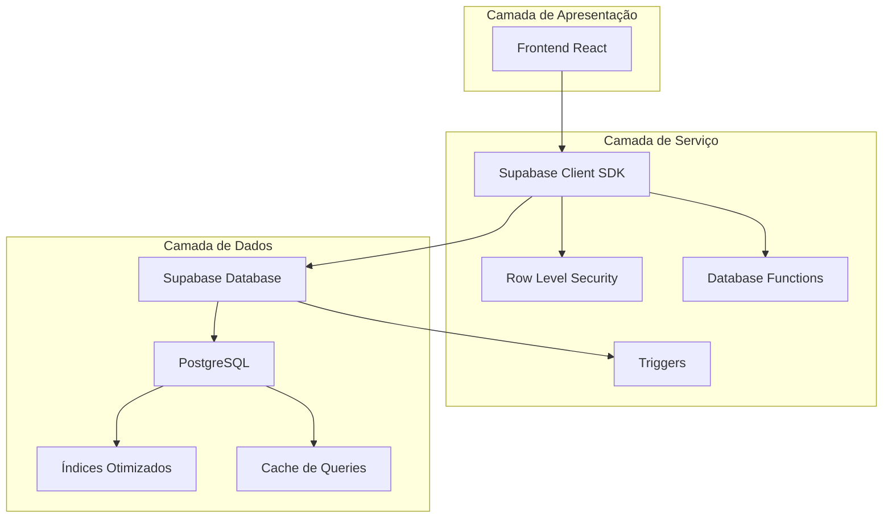
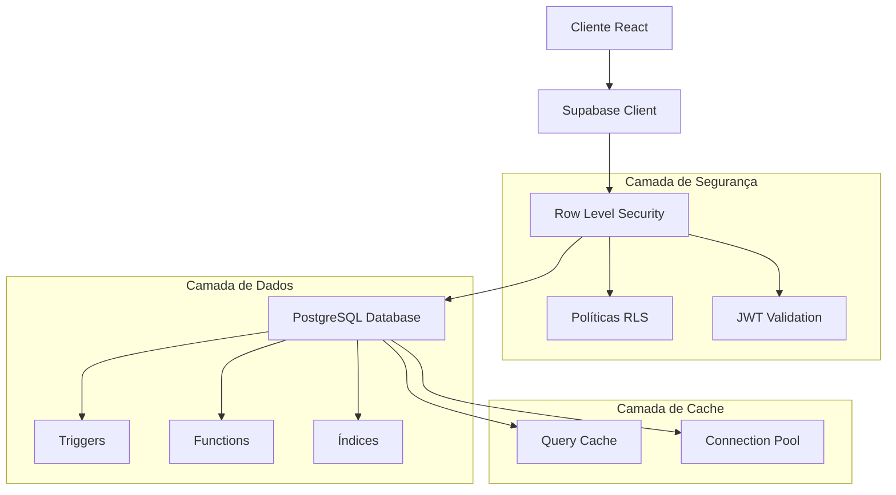
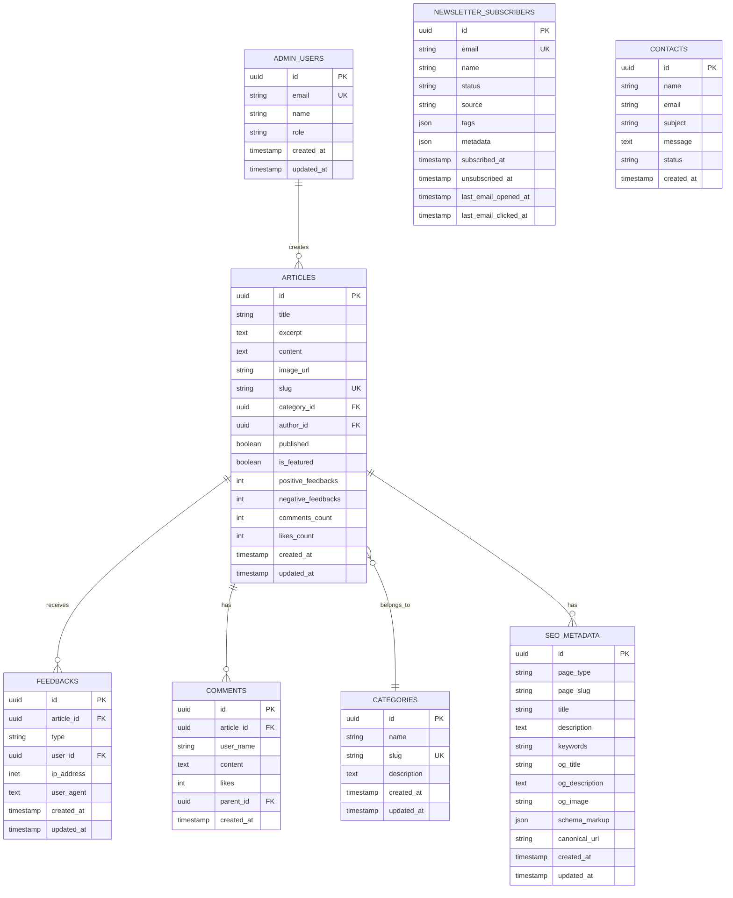

# Arquitetura Técnica - Sistema de Banco de Dados AIMindset

## 1. Arquitetura de Dados



## 2. Descrição Tecnológica

- **Frontend**: React@18 + TypeScript + Tailwind CSS + Vite
- **Backend**: Supabase (PostgreSQL + Auth + Storage + Edge Functions)
- **Cache**: Hybrid Cache (IndexedDB + Memory)
- **ORM**: Supabase Client SDK
- **Validação**: Zod + TypeScript

## 3. Definições de Rotas

| Rota | Propósito |
|------|-----------|
| `/` | Página inicial com artigos em destaque |
| `/artigos` | Lista completa de artigos |
| `/artigos/:slug` | Visualização de artigo individual |
| `/categoria/:slug` | Artigos por categoria |
| `/admin` | Painel administrativo |
| `/admin/artigos` | Gerenciamento de artigos |
| `/admin/feedback` | Dashboard de feedback |
| `/admin/newsletter` | Gerenciamento de newsletter |
| `/contato` | Formulário de contato |

## 4. Definições de API

### 4.1 APIs Core do Supabase

**Artigos**
```typescript
// Buscar artigos publicados
const { data: articles } = await supabase
  .from('articles')
  .select(`
    *,
    categories(name, slug),
    seo_metadata(*)
  `)
  .eq('published', true)
  .order('created_at', { ascending: false });
```

**Feedback**
```typescript
// Submeter feedback
const { data } = await supabase
  .from('feedbacks')
  .insert({
    article_id: articleId,
    type: 'positive', // 'positive' | 'negative' | 'like'
    ip_address: userIP,
    user_agent: navigator.userAgent
  });
```

**Métricas de Artigo**
```typescript
// Função RPC para métricas
const { data } = await supabase
  .rpc('get_article_metrics', { 
    target_article_id: articleId 
  });
```

### 4.2 Tipos TypeScript

```typescript
interface Article {
  id: string;
  title: string;
  excerpt: string;
  content: string;
  image_url?: string;
  slug: string;
  category_id: string;
  author_id: string;
  published: boolean;
  is_featured: boolean;
  positive_feedbacks: number;
  negative_feedbacks: number;
  comments_count: number;
  likes_count: number;
  created_at: string;
  updated_at: string;
  categories?: Category;
  seo_metadata?: SEOMetadata;
}

interface Feedback {
  id: string;
  article_id: string;
  type: 'positive' | 'negative' | 'like';
  user_id?: string;
  ip_address?: string;
  user_agent?: string;
  created_at: string;
  updated_at: string;
}

interface Category {
  id: string;
  name: string;
  slug: string;
  description?: string;
  created_at: string;
  updated_at: string;
}

interface Comment {
  id: string;
  article_id: string;
  user_name: string;
  content: string;
  likes: number;
  parent_id?: string;
  created_at: string;
}

interface NewsletterSubscriber {
  id: string;
  email: string;
  name?: string;
  status: 'active' | 'unsubscribed' | 'bounced';
  source?: string;
  tags?: string[];
  metadata?: Record<string, any>;
  subscribed_at: string;
  unsubscribed_at?: string;
  last_email_opened_at?: string;
  last_email_clicked_at?: string;
}
```

## 5. Arquitetura do Servidor



## 6. Modelo de Dados

### 6.1 Diagrama Entidade-Relacionamento



### 6.2 Scripts DDL Otimizados

**Tabela de Feedbacks Unificada**
```sql
-- Tabela principal de feedbacks
CREATE TABLE feedbacks (
    id UUID PRIMARY KEY DEFAULT gen_random_uuid(),
    article_id UUID NOT NULL REFERENCES articles(id) ON DELETE CASCADE,
    type VARCHAR(20) NOT NULL CHECK (type IN ('positive', 'negative', 'like')),
    user_id UUID NULL, -- Para futura implementação
    ip_address INET NULL,
    user_agent TEXT NULL,
    created_at TIMESTAMP WITH TIME ZONE DEFAULT NOW(),
    updated_at TIMESTAMP WITH TIME ZONE DEFAULT NOW()
);

-- Índices otimizados
CREATE INDEX idx_feedbacks_article_id ON feedbacks(article_id);
CREATE INDEX idx_feedbacks_article_type ON feedbacks(article_id, type);
CREATE INDEX idx_feedbacks_created_at ON feedbacks(created_at DESC);
CREATE INDEX idx_feedbacks_ip_date ON feedbacks(ip_address, created_at);

-- Trigger para atualizar updated_at
CREATE TRIGGER update_feedbacks_updated_at
    BEFORE UPDATE ON feedbacks
    FOR EACH ROW
    EXECUTE FUNCTION update_updated_at_column();
```

**Políticas RLS**
```sql
-- Habilitar RLS
ALTER TABLE feedbacks ENABLE ROW LEVEL SECURITY;

-- Política para leitura pública
CREATE POLICY "Feedbacks são visíveis publicamente" ON feedbacks
    FOR SELECT USING (true);

-- Política para inserção pública (com rate limiting via IP)
CREATE POLICY "Qualquer um pode dar feedback" ON feedbacks
    FOR INSERT WITH CHECK (true);

-- Política para admin
CREATE POLICY "Admin pode gerenciar feedbacks" ON feedbacks
    FOR ALL USING (
        EXISTS (
            SELECT 1 FROM admin_users 
            WHERE id = auth.uid() 
            AND role IN ('admin', 'editor')
        )
    );
```

**Função para Métricas de Artigo**
```sql
CREATE OR REPLACE FUNCTION get_article_metrics(target_article_id UUID)
RETURNS TABLE (
    article_id UUID,
    positive_feedback BIGINT,
    negative_feedback BIGINT,
    total_likes BIGINT,
    total_comments BIGINT,
    approval_rate NUMERIC,
    engagement_score NUMERIC
) 
LANGUAGE plpgsql
SECURITY DEFINER
AS $$
BEGIN
    RETURN QUERY
    WITH feedback_stats AS (
        SELECT 
            f.article_id,
            COUNT(*) FILTER (WHERE f.type = 'positive') as pos_count,
            COUNT(*) FILTER (WHERE f.type = 'negative') as neg_count,
            COUNT(*) FILTER (WHERE f.type = 'like') as like_count
        FROM feedbacks f
        WHERE f.article_id = target_article_id
        GROUP BY f.article_id
    ),
    comment_stats AS (
        SELECT 
            c.article_id,
            COUNT(*) as comment_count
        FROM comments c
        WHERE c.article_id = target_article_id
        GROUP BY c.article_id
    )
    SELECT 
        target_article_id,
        COALESCE(fs.pos_count, 0),
        COALESCE(fs.neg_count, 0),
        COALESCE(fs.like_count, 0),
        COALESCE(cs.comment_count, 0),
        CASE 
            WHEN COALESCE(fs.pos_count, 0) + COALESCE(fs.neg_count, 0) = 0 THEN 0
            ELSE ROUND(
                (COALESCE(fs.pos_count, 0)::NUMERIC / 
                (COALESCE(fs.pos_count, 0) + COALESCE(fs.neg_count, 0))) * 100, 
                1
            )
        END,
        -- Score de engajamento: likes * 1 + comments * 2 + positive * 1.5 - negative * 0.5
        ROUND(
            COALESCE(fs.like_count, 0) * 1.0 +
            COALESCE(cs.comment_count, 0) * 2.0 +
            COALESCE(fs.pos_count, 0) * 1.5 -
            COALESCE(fs.neg_count, 0) * 0.5,
            2
        )
    FROM feedback_stats fs
    FULL OUTER JOIN comment_stats cs ON fs.article_id = cs.article_id;
END;
$$;
```

**Trigger para Atualizar Contadores**
```sql
CREATE OR REPLACE FUNCTION update_article_feedback_counts()
RETURNS TRIGGER
LANGUAGE plpgsql
AS $$
BEGIN
    IF TG_OP = 'INSERT' THEN
        UPDATE articles SET
            positive_feedbacks = positive_feedbacks + CASE WHEN NEW.type = 'positive' THEN 1 ELSE 0 END,
            negative_feedbacks = negative_feedbacks + CASE WHEN NEW.type = 'negative' THEN 1 ELSE 0 END,
            likes_count = likes_count + CASE WHEN NEW.type = 'like' THEN 1 ELSE 0 END,
            updated_at = NOW()
        WHERE id = NEW.article_id;
        RETURN NEW;
    ELSIF TG_OP = 'DELETE' THEN
        UPDATE articles SET
            positive_feedbacks = positive_feedbacks - CASE WHEN OLD.type = 'positive' THEN 1 ELSE 0 END,
            negative_feedbacks = negative_feedbacks - CASE WHEN OLD.type = 'negative' THEN 1 ELSE 0 END,
            likes_count = likes_count - CASE WHEN OLD.type = 'like' THEN 1 ELSE 0 END,
            updated_at = NOW()
        WHERE id = OLD.article_id;
        RETURN OLD;
    END IF;
    RETURN NULL;
END;
$$;

-- Criar trigger
CREATE TRIGGER trigger_update_article_feedback_counts
    AFTER INSERT OR DELETE ON feedbacks
    FOR EACH ROW
    EXECUTE FUNCTION update_article_feedback_counts();
```

**Índices de Performance**
```sql
-- Índices para queries mais comuns
CREATE INDEX CONCURRENTLY idx_articles_published_featured 
    ON articles(published, is_featured) 
    WHERE published = true;

CREATE INDEX CONCURRENTLY idx_articles_category_published 
    ON articles(category_id, published, created_at DESC) 
    WHERE published = true;

CREATE INDEX CONCURRENTLY idx_articles_slug_published 
    ON articles(slug) 
    WHERE published = true;

CREATE INDEX CONCURRENTLY idx_comments_article_date 
    ON comments(article_id, created_at DESC);

CREATE INDEX CONCURRENTLY idx_seo_metadata_page 
    ON seo_metadata(page_type, page_slug);

-- Índice para busca de texto
CREATE INDEX CONCURRENTLY idx_articles_search 
    ON articles USING gin(to_tsvector('portuguese', title || ' ' || excerpt || ' ' || content))
    WHERE published = true;
```

## 7. Otimizações de Performance

### 7.1 Cache Strategy
```typescript
// Configuração do cache híbrido
const cacheConfig = {
  // Cache em memória para dados frequentes
  memory: {
    maxSize: 100, // máximo 100 itens
    ttl: 5 * 60 * 1000, // 5 minutos
  },
  // Cache no IndexedDB para persistência
  indexedDB: {
    dbName: 'aimindset_cache',
    version: 1,
    ttl: 24 * 60 * 60 * 1000, // 24 horas
  }
};
```

### 7.2 Query Optimization
```sql
-- View materializada para artigos populares
CREATE MATERIALIZED VIEW popular_articles AS
SELECT 
    a.*,
    c.name as category_name,
    c.slug as category_slug,
    (a.positive_feedbacks + a.likes_count + a.comments_count * 2) as popularity_score
FROM articles a
JOIN categories c ON a.category_id = c.id
WHERE a.published = true
ORDER BY popularity_score DESC, a.created_at DESC;

-- Refresh automático da view
CREATE OR REPLACE FUNCTION refresh_popular_articles()
RETURNS void
LANGUAGE plpgsql
AS $$
BEGIN
    REFRESH MATERIALIZED VIEW CONCURRENTLY popular_articles;
END;
$$;

-- Agendar refresh a cada hora
SELECT cron.schedule('refresh-popular-articles', '0 * * * *', 'SELECT refresh_popular_articles();');
```

## 8. Monitoramento e Analytics

### 8.1 Métricas de Sistema
```sql
-- View para métricas do dashboard
CREATE VIEW dashboard_metrics AS
SELECT 
    (SELECT COUNT(*) FROM articles WHERE published = true) as total_articles,
    (SELECT COUNT(*) FROM feedbacks) as total_feedbacks,
    (SELECT COUNT(*) FROM comments) as total_comments,
    (SELECT COUNT(*) FROM newsletter_subscribers WHERE status = 'active') as active_subscribers,
    (SELECT COUNT(*) FROM contacts WHERE created_at >= CURRENT_DATE - INTERVAL '30 days') as recent_contacts,
    (SELECT AVG(positive_feedbacks::numeric / NULLIF(positive_feedbacks + negative_feedbacks, 0)) * 100 
     FROM articles WHERE published = true) as avg_approval_rate;
```

### 8.2 Logs de Performance
```sql
-- Tabela para logs de performance
CREATE TABLE performance_logs (
    id UUID PRIMARY KEY DEFAULT gen_random_uuid(),
    query_type VARCHAR(50),
    execution_time_ms INTEGER,
    query_hash VARCHAR(64),
    created_at TIMESTAMP WITH TIME ZONE DEFAULT NOW()
);

-- Índice para análise temporal
CREATE INDEX idx_performance_logs_date_type 
    ON performance_logs(created_at DESC, query_type);
```

## 9. Backup e Recuperação

### 9.1 Estratégia de Backup
```bash
# Backup diário automático
pg_dump -h db.supabase.co -U postgres -d aimindset \
    --no-owner --no-privileges --clean --if-exists \
    -f "backup_$(date +%Y%m%d_%H%M%S).sql"
```

### 9.2 Plano de Recuperação
```sql
-- Script de verificação de integridade
DO $$
DECLARE
    table_name TEXT;
    row_count INTEGER;
BEGIN
    FOR table_name IN 
        SELECT tablename FROM pg_tables 
        WHERE schemaname = 'public' 
        AND tablename NOT LIKE '%_backup'
    LOOP
        EXECUTE format('SELECT COUNT(*) FROM %I', table_name) INTO row_count;
        RAISE NOTICE 'Tabela %: % registros', table_name, row_count;
    END LOOP;
END $$;
```

---

**Documento técnico criado para suporte à reestruturação do banco de dados AIMindset**  
**Versão**: 1.0  
**Data**: $(date)  
**Status**: Documentação técnica completa