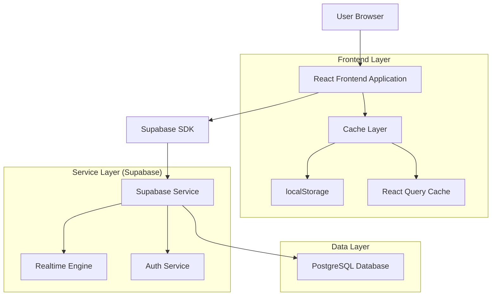
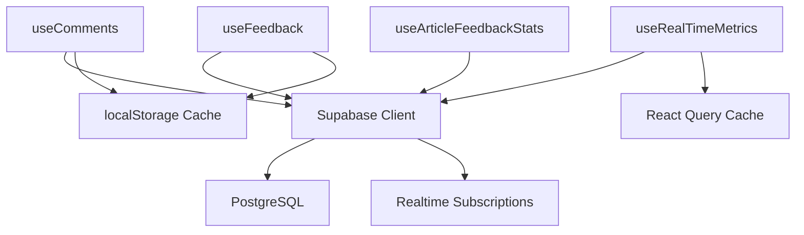
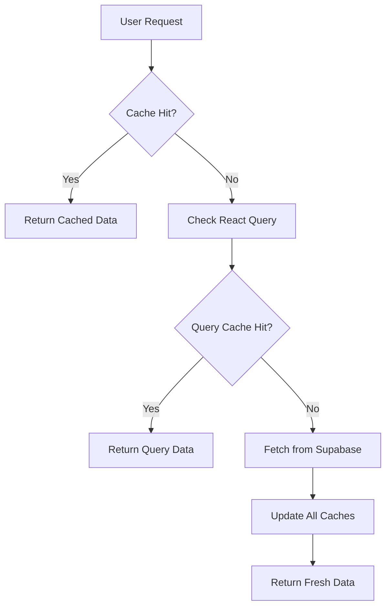

# Arquitetura Técnica - Sistema de Interações AIMindset

## 1. Arquitetura Geral



## 2. Tecnologias Utilizadas

### 2.1 Frontend
- **React@18** - Framework principal
- **TypeScript** - Tipagem estática
- **Tailwind CSS@3** - Estilização
- **Vite** - Build tool e dev server
- **React Query** - Cache e sincronização de dados
- **Sonner** - Sistema de notificações
- **Lucide React** - Ícones

### 2.2 Backend/Serviços
- **Supabase** - Backend-as-a-Service
  - PostgreSQL Database
  - Realtime subscriptions
  - Row Level Security (RLS)
  - Authentication
- **Vercel** - Hospedagem e deploy

### 2.3 Ferramentas de Desenvolvimento
- **ESLint** - Linting
- **PostCSS** - Processamento CSS
- **Git** - Controle de versão

## 3. Definições de Rotas

| Rota | Propósito | Componente Principal |
|------|-----------|---------------------|
| `/` | Página inicial com lista de artigos | `Home.tsx` |
| `/artigo/:slug` | Página individual do artigo com comentários | `ArticlePage.tsx` |
| `/categoria/:slug` | Artigos filtrados por categoria | `CategoryPage.tsx` |
| `/admin` | Painel administrativo | `Admin.tsx` |
| `/admin/feedback` | Dashboard de feedback e métricas | `FeedbackDashboard.tsx` |

## 4. APIs e Estrutura de Dados

### 4.1 Estrutura Atual das Tabelas

**Tabela `articles`:**
```sql
CREATE TABLE articles (
    id UUID PRIMARY KEY DEFAULT gen_random_uuid(),
    title VARCHAR(255) NOT NULL,
    content TEXT NOT NULL,
    excerpt TEXT,
    slug VARCHAR(255) UNIQUE NOT NULL,
    category_id UUID REFERENCES categories(id),
    published BOOLEAN DEFAULT false,
    positive_feedbacks INTEGER DEFAULT 0,
    negative_feedbacks INTEGER DEFAULT 0,
    likes_count INTEGER DEFAULT 0,
    comments_count INTEGER DEFAULT 0,
    engagement_score INTEGER DEFAULT 0,
    created_at TIMESTAMPTZ DEFAULT NOW(),
    updated_at TIMESTAMPTZ DEFAULT NOW()
);
```

**Tabela `feedbacks` (Consolidada):**
```sql
CREATE TABLE feedbacks (
    id UUID PRIMARY KEY DEFAULT gen_random_uuid(),
    article_id UUID REFERENCES articles(id) ON DELETE CASCADE,
    type VARCHAR(20) NOT NULL CHECK (type IN ('positive', 'negative', 'like', 'comment')),
    user_id UUID,
    content TEXT,
    created_at TIMESTAMPTZ DEFAULT NOW(),
    updated_at TIMESTAMPTZ DEFAULT NOW()
);
```

**Tabela `comments`:**
```sql
CREATE TABLE comments (
    id UUID PRIMARY KEY DEFAULT gen_random_uuid(),
    article_id UUID REFERENCES articles(id) ON DELETE CASCADE,
    user_name VARCHAR(50) NOT NULL,
    content TEXT NOT NULL,
    parent_id UUID REFERENCES comments(id) ON DELETE CASCADE,
    likes INTEGER DEFAULT 0,
    created_at TIMESTAMPTZ DEFAULT NOW()
);
```

### 4.2 APIs Principais

#### 4.2.1 Feedback API

**Criar Feedback:**
```typescript
POST /rest/v1/feedbacks
```

Request:
| Param | Type | Required | Description |
|-------|------|----------|-------------|
| article_id | UUID | true | ID do artigo |
| type | string | true | 'positive' ou 'negative' |
| user_id | UUID | false | ID do usuário (null para anônimo) |

Response:
```json
{
  "id": "uuid",
  "article_id": "uuid",
  "type": "positive",
  "created_at": "2025-01-27T10:00:00Z"
}
```

#### 4.2.2 Comments API

**Listar Comentários:**
```typescript
GET /rest/v1/comments?article_id=eq.{id}&order=created_at.desc
```

**Criar Comentário:**
```typescript
POST /rest/v1/comments
```

Request:
| Param | Type | Required | Description |
|-------|------|----------|-------------|
| article_id | UUID | true | ID do artigo |
| user_name | string | true | Nome do usuário |
| content | string | true | Conteúdo do comentário |
| parent_id | UUID | false | ID do comentário pai (para respostas) |

#### 4.2.3 Métricas API

**Buscar Métricas de Artigo:**
```typescript
GET /rest/v1/rpc/get_article_metrics
```

Request:
| Param | Type | Required | Description |
|-------|------|----------|-------------|
| article_ids | UUID[] | true | Array de IDs dos artigos |

Response:
```json
{
  "article_id": "uuid",
  "positive_feedback": 15,
  "negative_feedback": 2,
  "total_comments": 8,
  "comment_likes": 23,
  "engagement_score": 67
}
```

## 5. Arquitetura de Componentes

### 5.1 Estrutura de Hooks



### 5.2 Hooks Principais

**`useComments.ts`:**
```typescript
interface UseCommentsReturn {
  comments: Comment[];
  loading: boolean;
  error: string | null;
  submitComment: (data: CommentFormData) => Promise<boolean>;
  likeComment: (commentId: string) => Promise<boolean>;
  refreshComments: () => Promise<void>;
}
```

**`useFeedback.ts`:**
```typescript
interface UseFeedbackReturn {
  submitting: boolean;
  hasSubmitted: boolean;
  error: string | null;
  submitFeedback: (useful: boolean) => Promise<boolean>;
  checkSubmissionStatus: () => boolean;
  getEngagementMetrics: () => Promise<EngagementMetrics>;
}
```

**`useRealTimeMetrics.ts`:**
```typescript
interface UseRealTimeMetricsReturn {
  metrics: Record<string, ArticleMetrics>;
  loading: boolean;
  error: string | null;
  lastUpdate: number;
  forceRefresh: () => Promise<void>;
  cacheSize: number;
}
```

## 6. Sistema de Cache

### 6.1 Estratégia de Cache Multi-Layer



### 6.2 Configuração de Cache

**localStorage Cache:**
```typescript
// Feedback submissions (prevent duplicates)
const FEEDBACK_CACHE_KEY = 'aimindset_feedback_submitted';
const CACHE_DURATION = 24 * 60 * 60 * 1000; // 24 hours
```

**React Query Cache:**
```typescript
const queryClient = new QueryClient({
  defaultOptions: {
    queries: {
      staleTime: 5 * 60 * 1000, // 5 minutes
      cacheTime: 10 * 60 * 1000, // 10 minutes
      refetchOnWindowFocus: false,
    },
  },
});
```

## 7. Sistema Realtime

### 7.1 Subscriptions Configuradas

**Feedback Realtime:**
```typescript
const feedbackChannel = supabase
  .channel('feedback-changes')
  .on(
    'postgres_changes',
    {
      event: '*',
      schema: 'public',
      table: 'feedbacks',
      filter: `article_id=in.(${articleIds.join(',')})`
    },
    (payload) => {
      updateMetricsForArticle(payload.new?.article_id);
    }
  )
  .subscribe();
```

**Comments Realtime:**
```typescript
const commentsChannel = supabase
  .channel('comments-changes')
  .on(
    'postgres_changes',
    {
      event: '*',
      schema: 'public',
      table: 'comments',
      filter: `article_id=in.(${articleIds.join(',')})`
    },
    (payload) => {
      refreshCommentsForArticle(payload.new?.article_id);
    }
  )
  .subscribe();
```

### 7.2 Otimizações Realtime

**Debouncing:**
```typescript
const debouncedUpdate = useCallback(
  debounce((articleId: string) => {
    updateMetricsForArticle(articleId);
  }, 1000),
  []
);
```

**Connection Management:**
```typescript
useEffect(() => {
  return () => {
    // Cleanup subscriptions on unmount
    feedbackChannel?.unsubscribe();
    commentsChannel?.unsubscribe();
  };
}, []);
```

## 8. Segurança e Validação

### 8.1 Row Level Security (RLS)

**Feedbacks Table:**
```sql
-- Leitura pública
CREATE POLICY "Feedbacks são visíveis publicamente" ON feedbacks
    FOR SELECT USING (true);

-- Inserção permitida para todos
CREATE POLICY "Usuários podem criar feedbacks" ON feedbacks
    FOR INSERT WITH CHECK (true);

-- Atualização apenas próprios feedbacks
CREATE POLICY "Usuários podem atualizar próprios feedbacks" ON feedbacks
    FOR UPDATE USING (
        user_id IS NULL OR 
        user_id = auth.uid()
    );
```

**Comments Table:**
```sql
-- Leitura pública
CREATE POLICY "Allow public read comments" ON comments 
    FOR SELECT USING (true);

-- Inserção com validação
CREATE POLICY "Allow public insert comments" ON comments 
    FOR INSERT WITH CHECK (
        length(user_name) >= 2 AND 
        length(user_name) <= 50 AND
        length(content) >= 10 AND 
        length(content) <= 500
    );
```

### 8.2 Validação Client-Side

**Feedback Validation:**
```typescript
const validateFeedback = (data: { useful: boolean }) => {
  return z.object({
    useful: z.boolean()
  }).safeParse(data);
};
```

**Comment Validation:**
```typescript
const validateComment = (data: CommentFormData) => {
  return z.object({
    user_name: z.string().min(2).max(50),
    content: z.string().min(10).max(500),
    parent_id: z.string().uuid().optional()
  }).safeParse(data);
};
```

### 8.3 Rate Limiting

**Client-Side Rate Limiting:**
```typescript
const RATE_LIMIT = {
  FEEDBACK: 1, // 1 feedback per article per user
  COMMENT: 5,  // 5 comments per hour per user
  LIKE: 10     // 10 likes per minute per user
};
```

## 9. Performance e Otimizações

### 9.1 Database Indexes

```sql
-- Índices para performance
CREATE INDEX idx_feedbacks_article_id ON feedbacks(article_id);
CREATE INDEX idx_feedbacks_type ON feedbacks(type);
CREATE INDEX idx_feedbacks_created_at ON feedbacks(created_at);

CREATE INDEX idx_comments_article_id ON comments(article_id);
CREATE INDEX idx_comments_parent_id ON comments(parent_id);
CREATE INDEX idx_comments_likes ON comments(likes DESC);
CREATE INDEX idx_comments_created_at ON comments(created_at DESC);

-- Índice composto para queries complexas
CREATE INDEX idx_articles_published_engagement ON articles(published, engagement_score DESC)
WHERE published = true;
```

### 9.2 Query Optimization

**Função RPC para Métricas:**
```sql
CREATE OR REPLACE FUNCTION get_article_metrics(article_ids UUID[])
RETURNS TABLE(
    article_id UUID,
    positive_feedback BIGINT,
    negative_feedback BIGINT,
    total_comments BIGINT,
    comment_likes BIGINT,
    engagement_score INTEGER
) AS $$
BEGIN
    RETURN QUERY
    SELECT 
        a.id,
        COALESCE(f_pos.count, 0) as positive_feedback,
        COALESCE(f_neg.count, 0) as negative_feedback,
        COALESCE(c.count, 0) as total_comments,
        COALESCE(c.total_likes, 0) as comment_likes,
        (COALESCE(f_pos.count, 0) * 3 + 
         COALESCE(c.count, 0) * 2 + 
         COALESCE(c.total_likes, 0))::INTEGER as engagement_score
    FROM unnest(article_ids) as a(id)
    LEFT JOIN (
        SELECT article_id, COUNT(*) as count
        FROM feedbacks 
        WHERE type = 'positive' AND article_id = ANY(article_ids)
        GROUP BY article_id
    ) f_pos ON a.id = f_pos.article_id
    LEFT JOIN (
        SELECT article_id, COUNT(*) as count
        FROM feedbacks 
        WHERE type = 'negative' AND article_id = ANY(article_ids)
        GROUP BY article_id
    ) f_neg ON a.id = f_neg.article_id
    LEFT JOIN (
        SELECT article_id, COUNT(*) as count, SUM(likes) as total_likes
        FROM comments 
        WHERE article_id = ANY(article_ids)
        GROUP BY article_id
    ) c ON a.id = c.article_id;
END;
$$ LANGUAGE plpgsql;
```

### 9.3 Frontend Optimizations

**Lazy Loading:**
```typescript
const CommentSection = lazy(() => import('./CommentSection'));
const FeedbackDashboard = lazy(() => import('./FeedbackDashboard'));
```

**Memoization:**
```typescript
const memoizedMetrics = useMemo(() => {
  return formatMetricsData(metrics);
}, [metrics]);

const memoizedComments = useMemo(() => {
  return buildCommentTree(comments);
}, [comments]);
```

## 10. Monitoramento e Debugging

### 10.1 Logging Strategy

**Frontend Logging:**
```typescript
const logger = {
  info: (message: string, data?: any) => {
    console.log(`ℹ️ [${new Date().toISOString()}] ${message}`, data);
  },
  error: (message: string, error?: any) => {
    console.error(`❌ [${new Date().toISOString()}] ${message}`, error);
  },
  debug: (message: string, data?: any) => {
    if (process.env.NODE_ENV === 'development') {
      console.debug(`🐛 [${new Date().toISOString()}] ${message}`, data);
    }
  }
};
```

### 10.2 Error Boundaries

```typescript
class InteractionErrorBoundary extends React.Component {
  componentDidCatch(error: Error, errorInfo: ErrorInfo) {
    logger.error('Interaction component error:', { error, errorInfo });
    // Send to monitoring service
  }
  
  render() {
    if (this.state.hasError) {
      return <FallbackComponent />;
    }
    return this.props.children;
  }
}
```

### 10.3 Performance Monitoring

```typescript
const usePerformanceMonitor = () => {
  useEffect(() => {
    // Monitor Core Web Vitals
    getCLS(console.log);
    getFID(console.log);
    getFCP(console.log);
    getLCP(console.log);
    getTTFB(console.log);
  }, []);
};
```

## 11. Deploy e CI/CD

### 11.1 Build Configuration

**Vite Config:**
```typescript
export default defineConfig({
  plugins: [react()],
  build: {
    rollupOptions: {
      output: {
        manualChunks: {
          vendor: ['react', 'react-dom'],
          supabase: ['@supabase/supabase-js'],
          ui: ['lucide-react', 'sonner']
        }
      }
    }
  }
});
```

### 11.2 Environment Variables

```bash
# Production
VITE_SUPABASE_URL=https://your-project.supabase.co
VITE_SUPABASE_ANON_KEY=your-anon-key

# Development
VITE_SUPABASE_URL=http://localhost:54321
VITE_SUPABASE_ANON_KEY=your-local-anon-key
```

### 11.3 Deployment Strategy

**Vercel Configuration:**
```json
{
  "builds": [
    {
      "src": "package.json",
      "use": "@vercel/static-build",
      "config": {
        "distDir": "dist"
      }
    }
  ],
  "routes": [
    {
      "src": "/(.*)",
      "dest": "/index.html"
    }
  ]
}
```

---

**Documento criado em:** $(date)  
**Versão:** 1.0  
**Status:** Arquitetura Técnica Completa  
**Compatibilidade:** React 18, Supabase, TypeScript