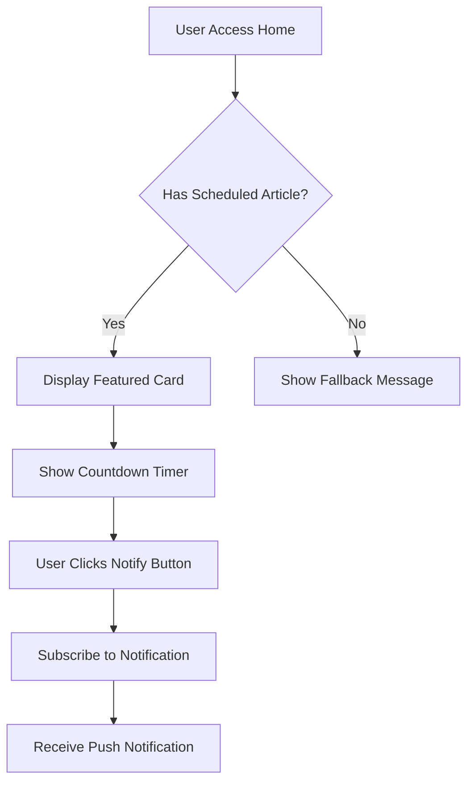

## 1. Product Overview
Card de destaque para exibir o próximo artigo agendado na homepage. Componente visual que aumenta o engajamento e antecipa o interesse do usuário pelo conteúdo programado.
- Problema: Usuários não têm visibilidade dos artigos agendados, perdendo oportunidades de engajamento
- Solução: Card destacado com contador regressivo e preview do próximo artigo
- Valor: Aumenta tempo de permanência, gera expectativa e melhora UX

## 2. Core Features

### 2.1 User Roles
| Role | Registration Method | Core Permissions |
|------|---------------------|------------------|
| All Users | Automatic access | Visualizar card de artigo agendado |

### 2.2 Feature Module
Componente consiste nos seguintes módulos principais:
1. **Featured Scheduled Card**: Card destacado na home com preview do artigo
2. **Countdown Timer**: Contador regressivo animado até a publicação
3. **Notification System**: Botão para notificar quando publicar
4. **Loading States**: Skeleton loading e estados de erro

### 2.3 Page Details
| Page Name | Module Name | Feature description |
|-----------|-------------|---------------------|
| Home page | Featured Scheduled Card | Buscar próximo artigo agendado via API, exibir card com imagem, título, descrição e data. Atualizar automaticamente a cada 5 minutos. Mostrar contador regressivo animado (dias/horas/minutos). Incluir botão "Ser notificado" com ícone de sino. Fallback elegante quando não há agendados |
| Home page | Countdown Animation | Animação suave de números mudando, transição de cor quando próximo (vermelho < 1h), atualização em tempo real a cada segundo |
| Home page | Card Interactions | Hover effect com scale 1.02 e shadow, click para artigo completo, tooltip informativo, micro-interações no botão |
| Home page | Performance Optimization | Lazy loading de imagens, React.memo para evitar re-renders, cache de 5 minutos, skeleton loading durante fetch |

## 3. Core Process
**User Flow**: Usuário entra na home → Vê card destacado → Lê preview → Clica em "Ser notificado" → Recebe notificação quando publicar

## 4. User Interface Design

### 4.1 Design Style
- **Cores**: Gradient de roxo (#7C3AED) para azul (#3B82F6), acentos em amarelo (#F59E0B) para urgência
- **Botões**: Rounded (12px), hover scale 1.05, sombra suave
- **Fontes**: Inter para títulos (bold, 24px), descrição (regular, 16px), contador (mono, 20px)
- **Layout**: Card com border-radius 16px, padding 24px, max-width 600px
- **Animações**: Fade-in 0.3s, slide-up no load, pulse no contador

### 4.2 Page Design Overview
| Page Name | Module Name | UI Elements |
|-----------|-------------|-------------|
| Home page | Featured Card | Card com gradient border animado, imagem 16:9 com lazy loading, título em bold 24px, descrição 16px cinza-600, badge "Em Breve" amarela, contador com números grandes e separadores |
| Home page | Countdown Display | Grid 4x1 para dias/horas/minutos/segundos, fonte monospace, cores dinâmicas (verde >24h, laranja 1-24h, vermelho <1h), transição suave entre mudanças |
| Home page | Notification Button | Botão outline com ícone de sino, texto "Me avise quando publicar", estado loading com spinner, confirmação com check verde, posicionado abaixo do contador |
| Home page | Responsive Design | Mobile: card full-width, contador em 2x2 grid. Tablet: 80% width centralizado. Desktop: max-width 600px, posicionado abaixo do hero |

### 4.3 Responsiveness
Desktop-first com breakpoints:
- Desktop: 1024px+ (card 600px, lado a lado com conteúdo)
- Tablet: 768-1023px (card 80% width, centralizado)
- Mobile: <768px (full-width, contador 2x2 grid)
Touch otimizado com áreas de click mínimas 44x44px