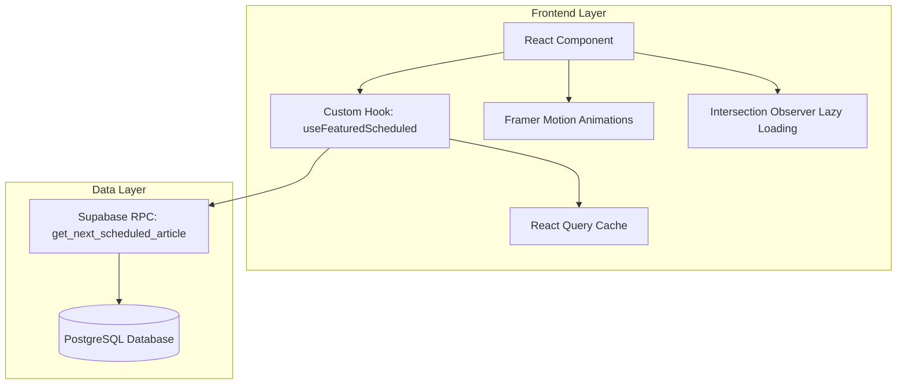
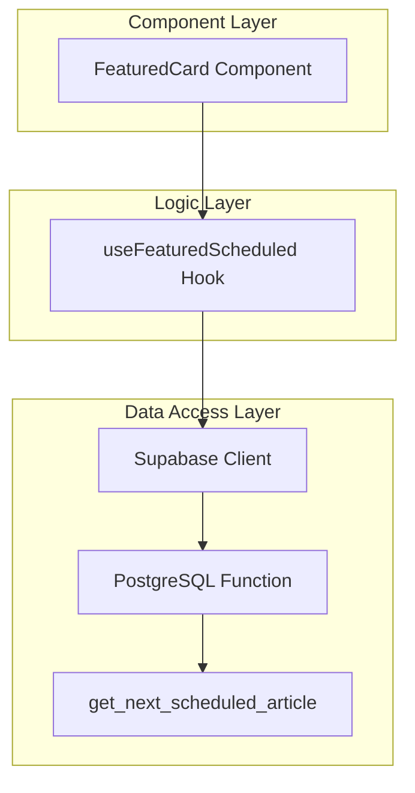
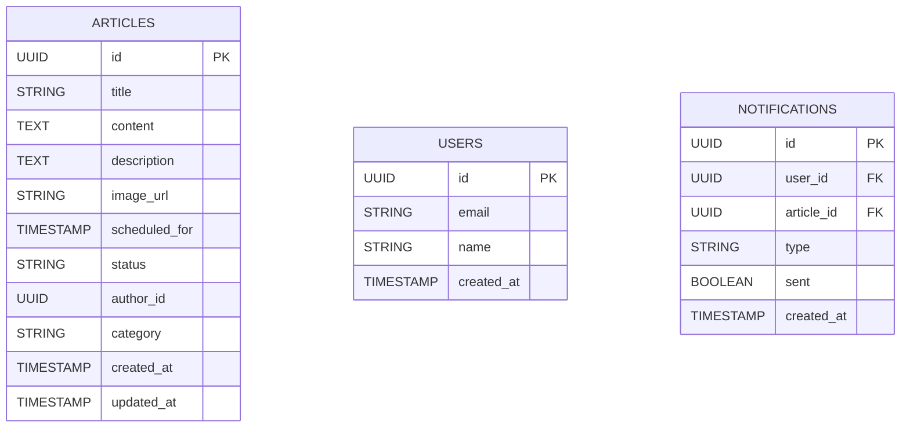

## 1. Architecture design



## 2. Technology Description
- Frontend: React@18 + TypeScript + TailwindCSS@3
- Animation: Framer Motion@10
- Data Fetching: React Query@4 (TanStack Query)
- Icons: Lucide React
- Performance: Intersection Observer API
- Build Tool: Vite

## 3. Route definitions
| Route | Purpose |
|-------|---------|
| / | Home page com Featured Scheduled Card component |
| /api/schedule/next | API route para buscar próximo artigo agendado |

## 4. API definitions

### 4.1 Core API

Buscar próximo artigo agendado
```
POST /api/schedule/next
```

Response:
| Param Name| Param Type  | Description |
|-----------|-------------|-------------|
| id        | string      | Article ID |
| title     | string      | Article title |
| description| string     | Article excerpt |
| image_url | string      | Cover image URL |
| scheduled_for| string   | ISO date string |
| category  | string      | Article category |

Example
```json
{
  "id": "123e4567-e89b-12d3-a456-426614174000",
  "title": "Como dominar TypeScript em 2024",
  "description": "Guia completo para se tornar expert na linguagem",
  "image_url": "https://example.com/image.jpg",
  "scheduled_for": "2024-01-15T10:00:00Z",
  "category": "Desenvolvimento"
}
```

## 5. Server architecture diagram



## 6. Data model

### 6.1 Data model definition


### 6.2 Data Definition Language

Função PostgreSQL para buscar próximo artigo agendado
```sql
-- Create function to get next scheduled article
CREATE OR REPLACE FUNCTION get_next_scheduled_article()
RETURNS TABLE (
    id UUID,
    title VARCHAR,
    description TEXT,
    image_url VARCHAR,
    scheduled_for TIMESTAMP WITH TIME ZONE,
    category VARCHAR
) AS $$
BEGIN
    RETURN QUERY
    SELECT 
        a.id,
        a.title,
        a.description,
        a.image_url,
        a.scheduled_for,
        a.category
    FROM articles a
    WHERE a.status = 'scheduled' 
        AND a.scheduled_for > NOW()
    ORDER BY a.scheduled_for ASC
    LIMIT 1;
END;
$$ LANGUAGE plpgsql SECURITY DEFINER;

-- Grant permissions
GRANT EXECUTE ON FUNCTION get_next_scheduled_article() TO anon;
GRANT EXECUTE ON FUNCTION get_next_scheduled_article() TO authenticated;

-- Index for performance
CREATE INDEX idx_articles_scheduled_for_status 
ON articles(scheduled_for ASC) 
WHERE status = 'scheduled' AND scheduled_for > NOW();
```

## 7. Component Structure

### 7.1 FeaturedScheduledCard Component
```typescript
interface FeaturedScheduledCardProps {
  className?: string;
  onNotify?: (articleId: string) => Promise<void>;
}

interface ScheduledArticle {
  id: string;
  title: string;
  description: string;
  image_url: string;
  scheduled_for: string;
  category: string;
}
```

### 7.2 Custom Hook
```typescript
interface UseFeaturedScheduledReturn {
  article: ScheduledArticle | null;
  isLoading: boolean;
  error: Error | null;
  timeRemaining: TimeRemaining;
  isSubscribed: boolean;
  subscribe: () => Promise<void>;
}

interface TimeRemaining {
  days: number;
  hours: number;
  minutes: number;
  seconds: number;
}
```

## 8. Performance Optimizations

- **React.memo**: Evita re-renders desnecessários
- **Intersection Observer**: Lazy loading de imagens
- **React Query**: Cache de 5 minutos com stale-while-revalidate
- **Framer Motion**: Animações GPU-aceleradas
- **Code Splitting**: Componente lazy-loaded na home
- **Image Optimization**: WebP com fallback, lazy loading nativo