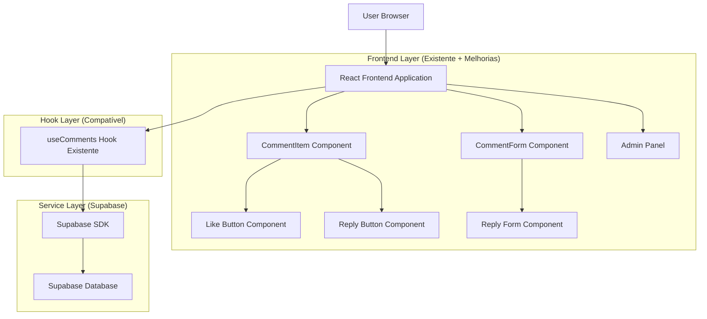
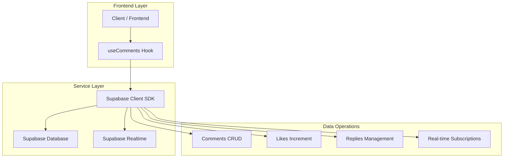
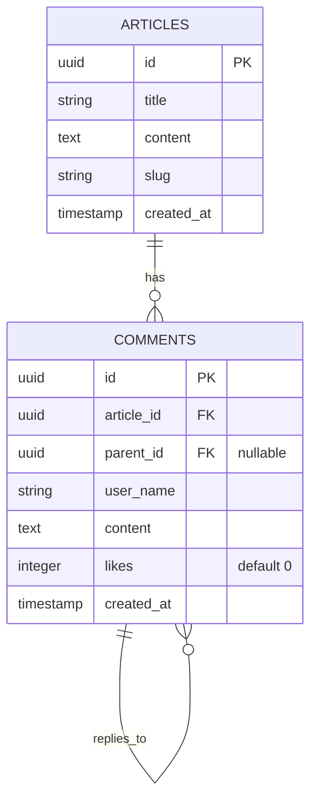

# 🏗️ Arquitetura Técnica - Melhoria do Sistema de Comentários

## 1. Architecture Design



## 2. Technology Description

- **Frontend**: React@18 + TypeScript + Tailwind CSS + Vite (mantido)
- **Backend**: Supabase (PostgreSQL + Real-time + Auth)
- **State Management**: Hooks existentes (useComments, useFeedback)
- **Cache**: Sistema híbrido existente (hybridCache + SWR)
- **UI Components**: Lucide React (ícones) + componentes existentes

## 3. Route Definitions

*Nenhuma nova rota necessária - funcionalidades integradas às rotas existentes*

| Route | Melhorias |
|-------|-----------|
| `/artigos/[slug]` | Sistema de curtidas e respostas integrado aos comentários |
| `/admin` | Aba "Feedback" com estatísticas de curtidas e respostas |

## 4. API Definitions

### 4.1 Core API Extensions

**Curtidas de Comentários**
```typescript
// Extensão do hook useComments existente
const likeComment = async (commentId: string): Promise<boolean>

// Supabase RPC Function
CREATE OR REPLACE FUNCTION increment_comment_likes(comment_id UUID)
RETURNS INTEGER AS $$
BEGIN
  UPDATE comments 
  SET likes = likes + 1 
  WHERE id = comment_id;
  
  RETURN (SELECT likes FROM comments WHERE id = comment_id);
END;
$$ LANGUAGE plpgsql;
```

**Sistema de Respostas**
```typescript
// Extensão da interface Comment existente
interface Comment {
  id: string;
  article_id: string;
  user_name: string;
  content: string;
  created_at: string;
  parent_id?: string | null;  // NOVO
  likes: number;              // NOVO
  replies?: Comment[];        // NOVO (computed)
}

// Extensão do CommentFormData
interface CommentFormData {
  user_name: string;
  content: string;
  parent_id?: string | null;  // NOVO
}
```

**Queries Supabase Atualizadas**
```sql
-- Query principal (substituir a existente)
SELECT 
  c.*,
  COALESCE(c.likes, 0) as likes,
  (
    SELECT json_agg(
      json_build_object(
        'id', r.id,
        'user_name', r.user_name,
        'content', r.content,
        'created_at', r.created_at,
        'likes', COALESCE(r.likes, 0)
      ) ORDER BY r.created_at ASC
    )
    FROM comments r 
    WHERE r.parent_id = c.id
  ) as replies
FROM comments c 
WHERE c.article_id = $1 AND c.parent_id IS NULL
ORDER BY c.created_at DESC;
```

## 5. Server Architecture Diagram



## 6. Data Model

### 6.1 Data Model Definition



### 6.2 Data Definition Language

**Alteração da Tabela Comments Existente**
```sql
-- Adicionar novas colunas à tabela comments existente
ALTER TABLE public.comments 
ADD COLUMN parent_id UUID REFERENCES public.comments(id) ON DELETE CASCADE,
ADD COLUMN likes INTEGER DEFAULT 0 NOT NULL;

-- Índices para performance
CREATE INDEX idx_comments_parent_id ON public.comments(parent_id);
CREATE INDEX idx_comments_likes ON public.comments(likes DESC);

-- Constraint para evitar auto-referência
ALTER TABLE public.comments 
ADD CONSTRAINT check_no_self_reference 
CHECK (id != parent_id);

-- Constraint para limitar profundidade (apenas 1 nível por enquanto)
ALTER TABLE public.comments 
ADD CONSTRAINT check_reply_depth 
CHECK (
  parent_id IS NULL OR 
  (SELECT parent_id FROM comments WHERE id = parent_id) IS NULL
);

-- Função para incrementar curtidas (evita race conditions)
CREATE OR REPLACE FUNCTION increment_comment_likes(comment_id UUID)
RETURNS INTEGER AS $$
DECLARE
  new_likes INTEGER;
BEGIN
  UPDATE comments 
  SET likes = likes + 1 
  WHERE id = comment_id
  RETURNING likes INTO new_likes;
  
  RETURN COALESCE(new_likes, 0);
END;
$$ LANGUAGE plpgsql;

-- Políticas RLS (manter as existentes + novas)
CREATE POLICY "Allow public read comment likes" ON public.comments 
    FOR SELECT USING (true);

CREATE POLICY "Allow public increment likes" ON public.comments 
    FOR UPDATE USING (true);

-- Trigger para atualizar updated_at (se necessário)
CREATE OR REPLACE FUNCTION update_comment_updated_at()
RETURNS TRIGGER AS $$
BEGIN
  NEW.updated_at = NOW();
  RETURN NEW;
END;
$$ LANGUAGE plpgsql;

-- Dados de exemplo para teste
INSERT INTO comments (article_id, user_name, content, parent_id, likes) VALUES
('existing-article-id', 'João Silva', 'Ótimo artigo!', NULL, 5),
('existing-article-id', 'Maria Santos', 'Concordo totalmente!', 'comment-id-1', 2),
('existing-article-id', 'Pedro Costa', 'Muito esclarecedor', NULL, 8);
```

**Configuração de Real-time (se não existir)**
```sql
-- Habilitar real-time para a tabela comments
ALTER PUBLICATION supabase_realtime ADD TABLE public.comments;
```

**Verificação de Compatibilidade**
```sql
-- Query para verificar estrutura atual
SELECT column_name, data_type, is_nullable, column_default 
FROM information_schema.columns 
WHERE table_name = 'comments' AND table_schema = 'public'
ORDER BY ordinal_position;

-- Query para testar a nova estrutura
SELECT 
  c.id,
  c.user_name,
  c.content,
  c.likes,
  c.parent_id,
  COUNT(r.id) as reply_count
FROM comments c
LEFT JOIN comments r ON r.parent_id = c.id
WHERE c.article_id = 'test-article-id'
GROUP BY c.id, c.user_name, c.content, c.likes, c.parent_id
ORDER BY c.created_at DESC;
```