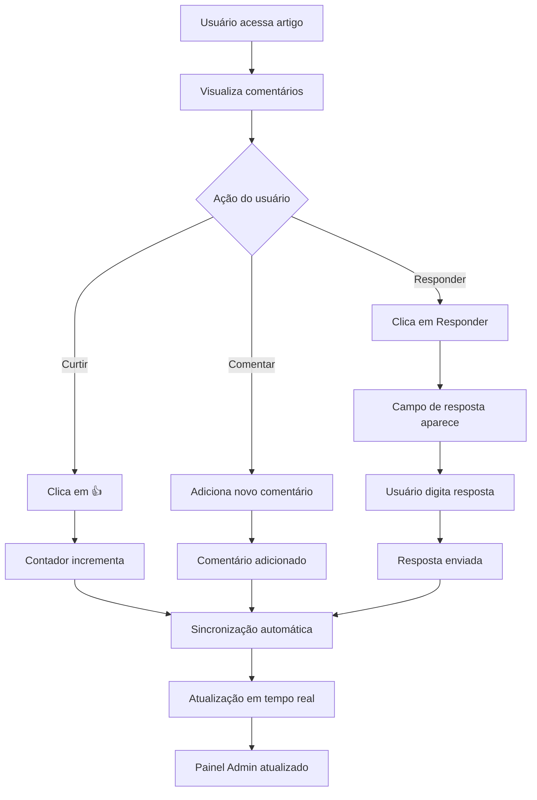

# 📋 PRD - Melhoria do Sistema de Comentários AIMindset

## 1. Product Overview

Implementação de funcionalidades avançadas no sistema de comentários existente do AIMindset, adicionando curtidas e respostas (1 nível) com sincronização automática em tempo real. O objetivo é enriquecer a experiência de interação dos usuários mantendo 100% de compatibilidade com a arquitetura atual, sem impactos visuais ou de performance.

- **Problema a resolver:** Sistema de comentários atual limitado apenas a comentários simples, sem interação social
- **Usuários:** Visitantes do blog AIMindset que desejam interagir com conteúdo e outros usuários
- **Valor:** Aumentar engajamento, tempo de permanência e construir comunidade ativa

## 2. Core Features

### 2.1 User Roles
*Não aplicável - sistema mantém anonimato atual*

### 2.2 Feature Module

O sistema de comentários aprimorado consiste nas seguintes funcionalidades principais:

1. **Sistema de Curtidas**: botão de curtir com contador e controle de spam
2. **Sistema de Respostas**: respostas diretas (1 nível visível) com estrutura escalável
3. **Sincronização Automática**: atualizações em tempo real sem reload
4. **Painel Administrativo**: integração com aba "Feedback" existente

### 2.3 Page Details

| Página | Módulo | Descrição da Funcionalidade |
|--------|--------|----------------------------|
| Artigo Individual | Sistema de Curtidas | Adicionar botão "👍" ao lado de cada comentário com contador de curtidas. Implementar controle de spam via localStorage. Atualização automática do contador sem reload. |
| Artigo Individual | Sistema de Respostas | Adicionar botão "Responder" em cada comentário. Campo de resposta aparece apenas ao clicar. Respostas exibidas com indentação visual (1 nível). Estrutura preparada para múltiplos níveis futuros. |
| Artigo Individual | Sincronização Automática | Todas as ações (curtir, responder, comentar) refletem automaticamente na UI. Usar revalidação de cache existente (mutate/invalidateQueries). Manter compatibilidade com TTL, ISR, SSR. |
| Painel Admin | Aba Feedback | Exibir total de curtidas e respostas por comentário. Atualização em tempo real dos dados. Manter layout visual existente, apenas integração lógica. |

## 3. Core Process

**Fluxo Principal do Usuário:**

1. **Visualização de Comentários**: Usuário acessa artigo e vê comentários existentes com botões de curtir e responder
2. **Curtir Comentário**: Usuário clica em "👍", contador incrementa automaticamente, ação salva no Supabase
3. **Responder Comentário**: Usuário clica em "Responder", campo de resposta aparece, usuário digita e envia
4. **Sincronização**: Todas as ações são sincronizadas em tempo real para outros usuários visualizando a página

**Fluxo Administrativo:**

1. **Monitoramento**: Admin acessa painel → aba "Feedback" → visualiza estatísticas de curtidas e respostas
2. **Moderação**: Admin pode visualizar e gerenciar comentários com suas respectivas curtidas e respostas

## 4. User Interface Design

### 4.1 Design Style

- **Cores primárias**: Manter paleta existente (neon-purple, lime-green, futuristic-gray)
- **Estilo de botões**: Seguir padrão atual com gradientes e efeitos hover
- **Fonte**: Manter Orbitron para títulos e Montserrat para textos
- **Layout**: Integração sutil sem alterar estrutura visual existente
- **Ícones**: Usar Lucide React (👍 para curtidas, 💬 para respostas)

### 4.2 Page Design Overview

| Página | Módulo | Elementos UI |
|--------|--------|-------------|
| Artigo Individual | Botão Curtir | Ícone 👍 + contador, estilo: `text-futuristic-gray hover:text-neon-purple`, posicionado à direita do timestamp |
| Artigo Individual | Botão Responder | Texto "Responder", estilo: `text-futuristic-gray hover:text-lime-green`, posicionado ao lado do botão curtir |
| Artigo Individual | Campo Resposta | Formulário compacto similar ao CommentForm existente, com `margin-left: 2rem` para indentação |
| Artigo Individual | Respostas | Layout similar ao CommentItem com `margin-left: 2rem`, borda esquerda sutil para hierarquia visual |
| Painel Admin | Estatísticas | Colunas adicionais na tabela: "Curtidas" e "Respostas", estilo consistente com tabela existente |

### 4.3 Responsiveness

- **Mobile-first**: Botões com touch targets adequados (min 44px)
- **Adaptativo**: Layout de respostas se ajusta em telas pequenas
- **Touch optimization**: Feedback visual em toques, compatível com useMobileUsability existente