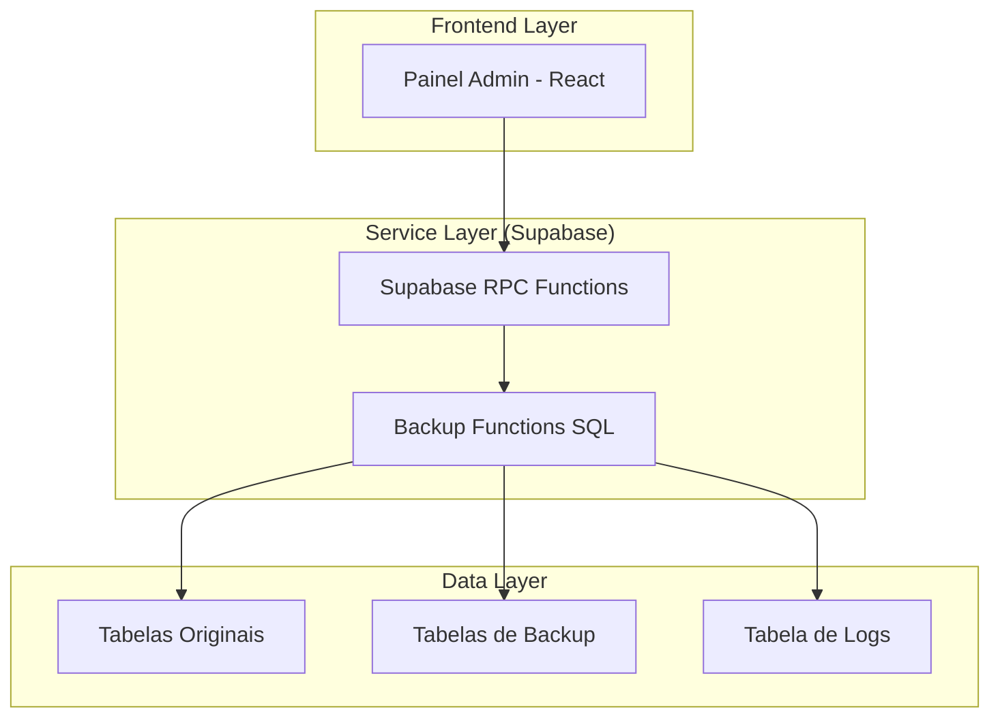
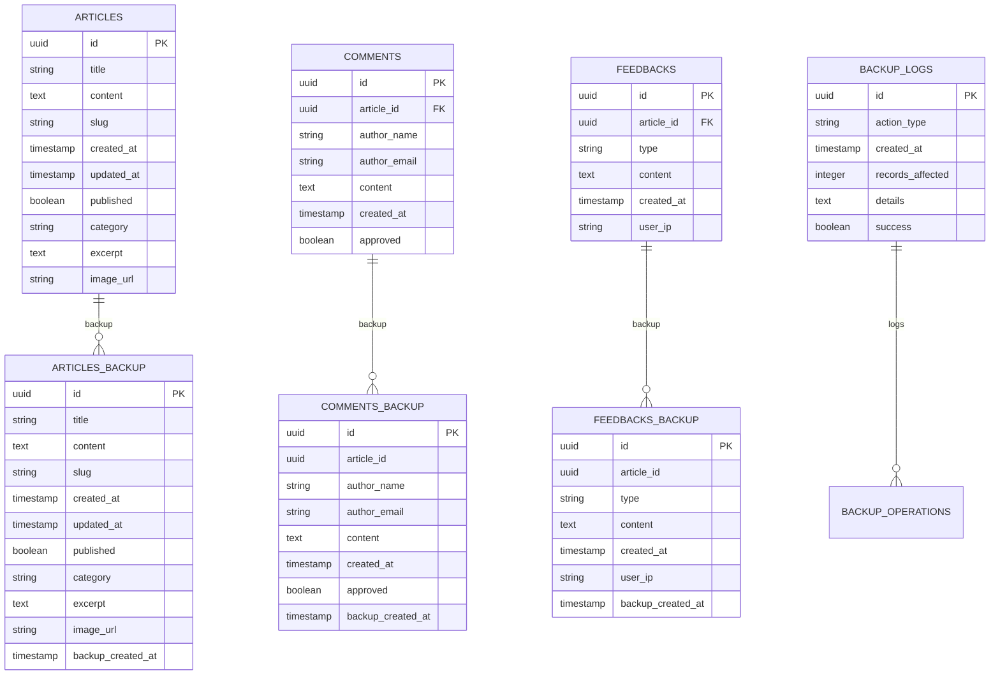

# 🏗️ Arquitetura Técnica — Sistema de Backup AIMindset

## 1. Arquitetura de Sistema



## 2. Tecnologias Utilizadas

- **Frontend:** React@18 + TypeScript + Tailwind CSS
- **Backend:** Supabase (PostgreSQL + RPC Functions)
- **Integração:** Supabase SDK
- **UI:** Componentes existentes do painel admin

## 3. Estrutura de Dados

### 3.1 Modelo de Dados



### 3.2 DDL (Data Definition Language)

#### Tabela de Logs de Backup
```sql
-- Criar tabela de logs de backup
CREATE TABLE backup_logs (
    id UUID PRIMARY KEY DEFAULT gen_random_uuid(),
    action_type VARCHAR(20) NOT NULL CHECK (action_type IN ('backup', 'restore')),
    created_at TIMESTAMP WITH TIME ZONE DEFAULT NOW(),
    records_affected INTEGER DEFAULT 0,
    details TEXT,
    success BOOLEAN DEFAULT true
);

-- Índices para performance
CREATE INDEX idx_backup_logs_created_at ON backup_logs(created_at DESC);
CREATE INDEX idx_backup_logs_action_type ON backup_logs(action_type);
```

#### Tabelas de Backup
```sql
-- Tabela de backup de artigos
CREATE TABLE articles_backup (
    id UUID PRIMARY KEY,
    title VARCHAR(255) NOT NULL,
    content TEXT NOT NULL,
    slug VARCHAR(255) UNIQUE NOT NULL,
    created_at TIMESTAMP WITH TIME ZONE NOT NULL,
    updated_at TIMESTAMP WITH TIME ZONE NOT NULL,
    published BOOLEAN DEFAULT false,
    category VARCHAR(100),
    excerpt TEXT,
    image_url TEXT,
    backup_created_at TIMESTAMP WITH TIME ZONE DEFAULT NOW()
);

-- Tabela de backup de comentários
CREATE TABLE comments_backup (
    id UUID PRIMARY KEY,
    article_id UUID NOT NULL,
    author_name VARCHAR(100) NOT NULL,
    author_email VARCHAR(255) NOT NULL,
    content TEXT NOT NULL,
    created_at TIMESTAMP WITH TIME ZONE NOT NULL,
    approved BOOLEAN DEFAULT false,
    backup_created_at TIMESTAMP WITH TIME ZONE DEFAULT NOW()
);

-- Tabela de backup de feedbacks
CREATE TABLE feedbacks_backup (
    id UUID PRIMARY KEY,
    article_id UUID NOT NULL,
    type VARCHAR(20) NOT NULL,
    content TEXT,
    created_at TIMESTAMP WITH TIME ZONE NOT NULL,
    user_ip INET,
    backup_created_at TIMESTAMP WITH TIME ZONE DEFAULT NOW()
);

-- Índices para performance das tabelas de backup
CREATE INDEX idx_articles_backup_created_at ON articles_backup(backup_created_at DESC);
CREATE INDEX idx_comments_backup_created_at ON comments_backup(backup_created_at DESC);
CREATE INDEX idx_feedbacks_backup_created_at ON feedbacks_backup(backup_created_at DESC);
```

## 4. Funções RPC

### 4.1 Função de Backup Completo

```sql
CREATE OR REPLACE FUNCTION backup_all_data()
RETURNS JSON AS $$
DECLARE
    articles_count INTEGER := 0;
    comments_count INTEGER := 0;
    feedbacks_count INTEGER := 0;
    total_records INTEGER := 0;
    result JSON;
BEGIN
    -- Limpar dados antigos de backup
    DELETE FROM articles_backup;
    DELETE FROM comments_backup;
    DELETE FROM feedbacks_backup;
    
    -- Backup de artigos
    INSERT INTO articles_backup (
        id, title, content, slug, created_at, updated_at, 
        published, category, excerpt, image_url
    )
    SELECT 
        id, title, content, slug, created_at, updated_at,
        published, category, excerpt, image_url
    FROM articles;
    
    GET DIAGNOSTICS articles_count = ROW_COUNT;
    
    -- Backup de comentários
    INSERT INTO comments_backup (
        id, article_id, author_name, author_email, 
        content, created_at, approved
    )
    SELECT 
        id, article_id, author_name, author_email,
        content, created_at, approved
    FROM comments;
    
    GET DIAGNOSTICS comments_count = ROW_COUNT;
    
    -- Backup de feedbacks
    INSERT INTO feedbacks_backup (
        id, article_id, type, content, created_at, user_ip
    )
    SELECT 
        id, article_id, type, content, created_at, user_ip
    FROM feedbacks;
    
    GET DIAGNOSTICS feedbacks_count = ROW_COUNT;
    
    total_records := articles_count + comments_count + feedbacks_count;
    
    -- Log da operação
    INSERT INTO backup_logs (action_type, records_affected, details, success)
    VALUES (
        'backup', 
        total_records,
        FORMAT('Articles: %s, Comments: %s, Feedbacks: %s', 
               articles_count, comments_count, feedbacks_count),
        true
    );
    
    -- Retornar resultado
    result := json_build_object(
        'success', true,
        'message', 'Backup concluído com sucesso',
        'records_affected', total_records,
        'details', json_build_object(
            'articles', articles_count,
            'comments', comments_count,
            'feedbacks', feedbacks_count
        )
    );
    
    RETURN result;
    
EXCEPTION WHEN OTHERS THEN
    -- Log de erro
    INSERT INTO backup_logs (action_type, records_affected, details, success)
    VALUES ('backup', 0, SQLERRM, false);
    
    RETURN json_build_object(
        'success', false,
        'message', 'Erro durante o backup',
        'error', SQLERRM
    );
END;
$$ LANGUAGE plpgsql SECURITY DEFINER;
```

### 4.2 Função de Restauração

```sql
CREATE OR REPLACE FUNCTION restore_from_backup()
RETURNS JSON AS $$
DECLARE
    articles_count INTEGER := 0;
    comments_count INTEGER := 0;
    feedbacks_count INTEGER := 0;
    total_records INTEGER := 0;
    result JSON;
BEGIN
    -- Verificar se existem dados de backup
    SELECT COUNT(*) INTO articles_count FROM articles_backup;
    SELECT COUNT(*) INTO comments_count FROM comments_backup;
    SELECT COUNT(*) INTO feedbacks_count FROM feedbacks_backup;
    
    IF articles_count = 0 AND comments_count = 0 AND feedbacks_count = 0 THEN
        RETURN json_build_object(
            'success', false,
            'message', 'Nenhum backup encontrado para restaurar'
        );
    END IF;
    
    -- Limpar dados atuais (cuidado: operação destrutiva)
    DELETE FROM comments;
    DELETE FROM feedbacks;
    DELETE FROM articles;
    
    -- Restaurar artigos
    INSERT INTO articles (
        id, title, content, slug, created_at, updated_at,
        published, category, excerpt, image_url
    )
    SELECT 
        id, title, content, slug, created_at, updated_at,
        published, category, excerpt, image_url
    FROM articles_backup;
    
    GET DIAGNOSTICS articles_count = ROW_COUNT;
    
    -- Restaurar comentários
    INSERT INTO comments (
        id, article_id, author_name, author_email,
        content, created_at, approved
    )
    SELECT 
        id, article_id, author_name, author_email,
        content, created_at, approved
    FROM comments_backup;
    
    GET DIAGNOSTICS comments_count = ROW_COUNT;
    
    -- Restaurar feedbacks
    INSERT INTO feedbacks (
        id, article_id, type, content, created_at, user_ip
    )
    SELECT 
        id, article_id, type, content, created_at, user_ip
    FROM feedbacks_backup;
    
    GET DIAGNOSTICS feedbacks_count = ROW_COUNT;
    
    total_records := articles_count + comments_count + feedbacks_count;
    
    -- Log da operação
    INSERT INTO backup_logs (action_type, records_affected, details, success)
    VALUES (
        'restore',
        total_records,
        FORMAT('Articles: %s, Comments: %s, Feedbacks: %s', 
               articles_count, comments_count, feedbacks_count),
        true
    );
    
    -- Retornar resultado
    result := json_build_object(
        'success', true,
        'message', 'Restauração concluída com sucesso',
        'records_affected', total_records,
        'details', json_build_object(
            'articles', articles_count,
            'comments', comments_count,
            'feedbacks', feedbacks_count
        )
    );
    
    RETURN result;
    
EXCEPTION WHEN OTHERS THEN
    -- Log de erro
    INSERT INTO backup_logs (action_type, records_affected, details, success)
    VALUES ('restore', 0, SQLERRM, false);
    
    RETURN json_build_object(
        'success', false,
        'message', 'Erro durante a restauração',
        'error', SQLERRM
    );
END;
$$ LANGUAGE plpgsql SECURITY DEFINER;
```

### 4.3 Função para Buscar Logs

```sql
CREATE OR REPLACE FUNCTION get_backup_logs(limit_count INTEGER DEFAULT 10)
RETURNS TABLE (
    id UUID,
    action_type VARCHAR,
    created_at TIMESTAMP WITH TIME ZONE,
    records_affected INTEGER,
    details TEXT,
    success BOOLEAN
) AS $$
BEGIN
    RETURN QUERY
    SELECT 
        bl.id,
        bl.action_type,
        bl.created_at,
        bl.records_affected,
        bl.details,
        bl.success
    FROM backup_logs bl
    ORDER BY bl.created_at DESC
    LIMIT limit_count;
END;
$$ LANGUAGE plpgsql SECURITY DEFINER;
```

## 5. Integração Frontend

### 5.1 Hook Personalizado para Backup

```typescript
// hooks/useBackup.ts
import { useState } from 'react';
import { supabase } from '../lib/supabase';

interface BackupResult {
  success: boolean;
  message: string;
  records_affected?: number;
  details?: {
    articles: number;
    comments: number;
    feedbacks: number;
  };
  error?: string;
}

interface BackupLog {
  id: string;
  action_type: 'backup' | 'restore';
  created_at: string;
  records_affected: number;
  details: string;
  success: boolean;
}

export const useBackup = () => {
  const [loading, setLoading] = useState(false);
  const [logs, setLogs] = useState<BackupLog[]>([]);

  const createBackup = async (): Promise<BackupResult> => {
    setLoading(true);
    try {
      const { data, error } = await supabase.rpc('backup_all_data');
      
      if (error) throw error;
      
      await fetchLogs(); // Atualizar logs após backup
      return data;
    } catch (error) {
      console.error('Erro ao criar backup:', error);
      return {
        success: false,
        message: 'Erro ao criar backup',
        error: error instanceof Error ? error.message : 'Erro desconhecido'
      };
    } finally {
      setLoading(false);
    }
  };

  const restoreBackup = async (): Promise<BackupResult> => {
    setLoading(true);
    try {
      const { data, error } = await supabase.rpc('restore_from_backup');
      
      if (error) throw error;
      
      await fetchLogs(); // Atualizar logs após restauração
      return data;
    } catch (error) {
      console.error('Erro ao restaurar backup:', error);
      return {
        success: false,
        message: 'Erro ao restaurar backup',
        error: error instanceof Error ? error.message : 'Erro desconhecido'
      };
    } finally {
      setLoading(false);
    }
  };

  const fetchLogs = async () => {
    try {
      const { data, error } = await supabase.rpc('get_backup_logs', { limit_count: 10 });
      
      if (error) throw error;
      
      setLogs(data || []);
    } catch (error) {
      console.error('Erro ao buscar logs:', error);
    }
  };

  const getLastBackup = () => {
    const lastBackup = logs.find(log => log.action_type === 'backup' && log.success);
    return lastBackup ? new Date(lastBackup.created_at) : null;
  };

  return {
    loading,
    logs,
    createBackup,
    restoreBackup,
    fetchLogs,
    getLastBackup
  };
};
```

### 5.2 Componente da Aba Backup

```typescript
// components/Admin/BackupTab.tsx
import React, { useEffect, useState } from 'react';
import { useBackup } from '../../hooks/useBackup';
import { useToast } from '../../hooks/useToast';

const BackupTab: React.FC = () => {
  const { loading, logs, createBackup, restoreBackup, fetchLogs, getLastBackup } = useBackup();
  const { showToast } = useToast();
  const [showRestoreConfirm, setShowRestoreConfirm] = useState(false);

  useEffect(() => {
    fetchLogs();
  }, []);

  const handleBackup = async () => {
    const result = await createBackup();
    
    if (result.success) {
      showToast('Backup concluído com sucesso!', 'success');
    } else {
      showToast(result.message || 'Erro ao criar backup', 'error');
    }
  };

  const handleRestore = async () => {
    const result = await restoreBackup();
    
    if (result.success) {
      showToast('Restauração concluída com sucesso!', 'success');
    } else {
      showToast(result.message || 'Erro ao restaurar backup', 'error');
    }
    
    setShowRestoreConfirm(false);
  };

  const lastBackup = getLastBackup();

  return (
    <div className="space-y-6">
      {/* Cabeçalho */}
      <div>
        <h2 className="text-2xl font-bold text-gray-900">Backup & Segurança</h2>
        <p className="text-gray-600 mt-2">
          Gerencie backups dos dados do sistema de forma segura
        </p>
      </div>

      {/* Ações Principais */}
      <div className="grid grid-cols-1 md:grid-cols-2 gap-4">
        <div className="bg-white p-6 rounded-lg shadow-sm border">
          <div className="flex items-center mb-4">
            <div className="bg-blue-100 p-2 rounded-lg mr-3">
              🔄
            </div>
            <h3 className="text-lg font-semibold">Criar Backup</h3>
          </div>
          <p className="text-gray-600 mb-4">
            Cria uma cópia de segurança de todos os dados atuais
          </p>
          <button
            onClick={handleBackup}
            disabled={loading}
            className="w-full bg-blue-600 text-white px-4 py-2 rounded-lg hover:bg-blue-700 disabled:opacity-50"
          >
            {loading ? 'Criando backup...' : 'Fazer Backup Agora'}
          </button>
        </div>

        <div className="bg-white p-6 rounded-lg shadow-sm border">
          <div className="flex items-center mb-4">
            <div className="bg-orange-100 p-2 rounded-lg mr-3">
              ♻️
            </div>
            <h3 className="text-lg font-semibold">Restaurar Backup</h3>
          </div>
          <p className="text-gray-600 mb-4">
            Restaura os dados do último backup realizado
          </p>
          <button
            onClick={() => setShowRestoreConfirm(true)}
            disabled={loading || !logs.some(log => log.action_type === 'backup' && log.success)}
            className="w-full bg-orange-600 text-white px-4 py-2 rounded-lg hover:bg-orange-700 disabled:opacity-50"
          >
            Restaurar Backup
          </button>
        </div>
      </div>

      {/* Informações do Último Backup */}
      <div className="bg-white p-6 rounded-lg shadow-sm border">
        <h3 className="text-lg font-semibold mb-4 flex items-center">
          <span className="mr-2">📅</span>
          Último Backup Realizado
        </h3>
        {lastBackup ? (
          <p className="text-gray-700">
            {lastBackup.toLocaleString('pt-BR', {
              day: '2-digit',
              month: '2-digit',
              year: 'numeric',
              hour: '2-digit',
              minute: '2-digit'
            })}
          </p>
        ) : (
          <p className="text-gray-500">Nenhum backup encontrado</p>
        )}
      </div>

      {/* Histórico de Backups */}
      <div className="bg-white p-6 rounded-lg shadow-sm border">
        <h3 className="text-lg font-semibold mb-4 flex items-center">
          <span className="mr-2">🧾</span>
          Histórico de Backups
        </h3>
        <div className="overflow-x-auto">
          <table className="w-full text-sm">
            <thead>
              <tr className="border-b">
                <th className="text-left py-2">Ação</th>
                <th className="text-left py-2">Data/Hora</th>
                <th className="text-left py-2">Registros</th>
                <th className="text-left py-2">Status</th>
              </tr>
            </thead>
            <tbody>
              {logs.map((log) => (
                <tr key={log.id} className="border-b">
                  <td className="py-2">
                    <span className={`px-2 py-1 rounded text-xs ${
                      log.action_type === 'backup' 
                        ? 'bg-blue-100 text-blue-800' 
                        : 'bg-orange-100 text-orange-800'
                    }`}>
                      {log.action_type === 'backup' ? 'Backup' : 'Restauração'}
                    </span>
                  </td>
                  <td className="py-2">
                    {new Date(log.created_at).toLocaleString('pt-BR', {
                      day: '2-digit',
                      month: '2-digit',
                      year: 'numeric',
                      hour: '2-digit',
                      minute: '2-digit'
                    })}
                  </td>
                  <td className="py-2">{log.records_affected}</td>
                  <td className="py-2">
                    <span className={`px-2 py-1 rounded text-xs ${
                      log.success 
                        ? 'bg-green-100 text-green-800' 
                        : 'bg-red-100 text-red-800'
                    }`}>
                      {log.success ? 'Sucesso' : 'Erro'}
                    </span>
                  </td>
                </tr>
              ))}
            </tbody>
          </table>
          {logs.length === 0 && (
            <p className="text-gray-500 text-center py-4">
              Nenhum histórico encontrado
            </p>
          )}
        </div>
      </div>

      {/* Modal de Confirmação */}
      {showRestoreConfirm && (
        <div className="fixed inset-0 bg-black bg-opacity-50 flex items-center justify-center z-50">
          <div className="bg-white p-6 rounded-lg max-w-md w-full mx-4">
            <h3 className="text-lg font-semibold mb-4">Confirmar Restauração</h3>
            <p className="text-gray-600 mb-6">
              Esta ação substituirá todos os dados atuais pelos dados do último backup. 
              Deseja continuar?
            </p>
            <div className="flex space-x-4">
              <button
                onClick={() => setShowRestoreConfirm(false)}
                className="flex-1 bg-gray-300 text-gray-700 px-4 py-2 rounded-lg hover:bg-gray-400"
              >
                Cancelar
              </button>
              <button
                onClick={handleRestore}
                disabled={loading}
                className="flex-1 bg-red-600 text-white px-4 py-2 rounded-lg hover:bg-red-700 disabled:opacity-50"
              >
                {loading ? 'Restaurando...' : 'Confirmar'}
              </button>
            </div>
          </div>
        </div>
      )}
    </div>
  );
};

export default BackupTab;
```

## 6. Permissões RLS (Row Level Security)

```sql
-- Permitir acesso às funções RPC para usuários autenticados
GRANT EXECUTE ON FUNCTION backup_all_data() TO authenticated;
GRANT EXECUTE ON FUNCTION restore_from_backup() TO authenticated;
GRANT EXECUTE ON FUNCTION get_backup_logs(INTEGER) TO authenticated;

-- Permitir acesso às tabelas de backup para usuários autenticados
GRANT ALL PRIVILEGES ON backup_logs TO authenticated;
GRANT ALL PRIVILEGES ON articles_backup TO authenticated;
GRANT ALL PRIVILEGES ON comments_backup TO authenticated;
GRANT ALL PRIVILEGES ON feedbacks_backup TO authenticated;

-- Permitir acesso básico para anon (apenas leitura de logs se necessário)
GRANT SELECT ON backup_logs TO anon;
```

## 7. Testes e Validação

### 7.1 Script de Teste

```typescript
// scripts/test-backup-system.ts
import { supabase } from '../src/lib/supabase';

async function testBackupSystem() {
  console.log('🧪 Iniciando testes do sistema de backup...');
  
  try {
    // Teste 1: Criar backup
    console.log('📦 Testando criação de backup...');
    const backupResult = await supabase.rpc('backup_all_data');
    
    if (backupResult.error) {
      throw new Error(`Erro no backup: ${backupResult.error.message}`);
    }
    
    console.log('✅ Backup criado com sucesso:', backupResult.data);
    
    // Teste 2: Buscar logs
    console.log('📋 Testando busca de logs...');
    const logsResult = await supabase.rpc('get_backup_logs', { limit_count: 5 });
    
    if (logsResult.error) {
      throw new Error(`Erro ao buscar logs: ${logsResult.error.message}`);
    }
    
    console.log('✅ Logs recuperados:', logsResult.data?.length || 0, 'registros');
    
    // Teste 3: Verificar estrutura das tabelas de backup
    console.log('🔍 Verificando estrutura das tabelas de backup...');
    
    const tables = ['articles_backup', 'comments_backup', 'feedbacks_backup'];
    
    for (const table of tables) {
      const { data, error } = await supabase
        .from(table)
        .select('*')
        .limit(1);
      
      if (error) {
        throw new Error(`Erro ao acessar ${table}: ${error.message}`);
      }
      
      console.log(`✅ Tabela ${table} acessível`);
    }
    
    console.log('🎉 Todos os testes passaram com sucesso!');
    
  } catch (error) {
    console.error('❌ Erro nos testes:', error);
    process.exit(1);
  }
}

testBackupSystem();
```

## 8. Monitoramento e Logs

### 8.1 Métricas de Backup

- **Frequência de backups:** Rastrear quantos backups são criados por dia/semana
- **Tamanho dos backups:** Monitorar crescimento dos dados
- **Tempo de execução:** Acompanhar performance das operações
- **Taxa de sucesso:** Percentual de backups/restaurações bem-sucedidas

### 8.2 Alertas

- Backup com falha
- Backup não realizado há mais de 7 dias
- Restauração executada (notificação de segurança)
- Tabelas de backup com tamanho muito diferente das originais

## 9. Segurança

### 9.1 Controles de Acesso

- Apenas usuários autenticados podem executar funções de backup
- Logs de todas as operações para auditoria
- Confirmação obrigatória para restauração
- Validação de integridade dos dados antes da restauração

### 9.2 Proteções

- Backup idempotente (pode ser executado múltiplas vezes)
- Transações atômicas (tudo ou nada)
- Rollback automático em caso de erro
- Preservação de timestamps originais

## 10. Manutenção

### 10.1 Limpeza Automática

```sql
-- Função para limpar logs antigos (executar mensalmente)
CREATE OR REPLACE FUNCTION cleanup_old_backup_logs()
RETURNS INTEGER AS $$
DECLARE
    deleted_count INTEGER;
BEGIN
    DELETE FROM backup_logs 
    WHERE created_at < NOW() - INTERVAL '90 days';
    
    GET DIAGNOSTICS deleted_count = ROW_COUNT;
    
    RETURN deleted_count;
END;
$$ LANGUAGE plpgsql SECURITY DEFINER;
```

### 10.2 Verificação de Integridade

```sql
-- Função para verificar integridade dos backups
CREATE OR REPLACE FUNCTION verify_backup_integrity()
RETURNS JSON AS $$
DECLARE
    articles_original INTEGER;
    articles_backup INTEGER;
    comments_original INTEGER;
    comments_backup INTEGER;
    feedbacks_original INTEGER;
    feedbacks_backup INTEGER;
    result JSON;
BEGIN
    SELECT COUNT(*) INTO articles_original FROM articles;
    SELECT COUNT(*) INTO articles_backup FROM articles_backup;
    SELECT COUNT(*) INTO comments_original FROM comments;
    SELECT COUNT(*) INTO comments_backup FROM comments_backup;
    SELECT COUNT(*) INTO feedbacks_original FROM feedbacks;
    SELECT COUNT(*) INTO feedbacks_backup FROM feedbacks_backup;
    
    result := json_build_object(
        'articles', json_build_object(
            'original', articles_original,
            'backup', articles_backup,
            'match', articles_original = articles_backup
        ),
        'comments', json_build_object(
            'original', comments_original,
            'backup', comments_backup,
            'match', comments_original = comments_backup
        ),
        'feedbacks', json_build_object(
            'original', feedbacks_original,
            'backup', feedbacks_backup,
            'match', feedbacks_original = feedbacks_backup
        )
    );
    
    RETURN result;
END;
$$ LANGUAGE plpgsql SECURITY DEFINER;
```

---

## ✅ Checklist de Implementação

- [ ] Criar tabelas de backup no Supabase
- [ ] Implementar funções RPC no Supabase
- [ ] Configurar permissões RLS
- [ ] Criar hook useBackup
- [ ] Implementar componente BackupTab
- [ ] Integrar aba no painel admin
- [ ] Testar funcionalidades
- [ ] Validar com npm build e npm run dev
- [ ] Documentar processo para equipe

---

**Foco:** Segurança, compatibilidade e estabilidade máxima com a arquitetura existente.