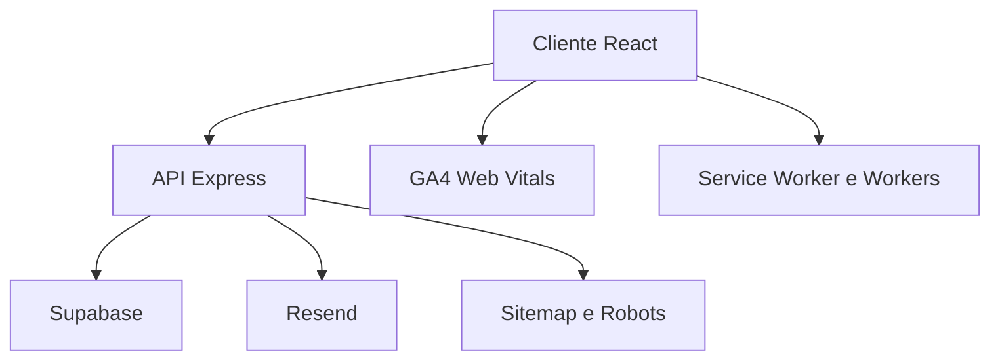
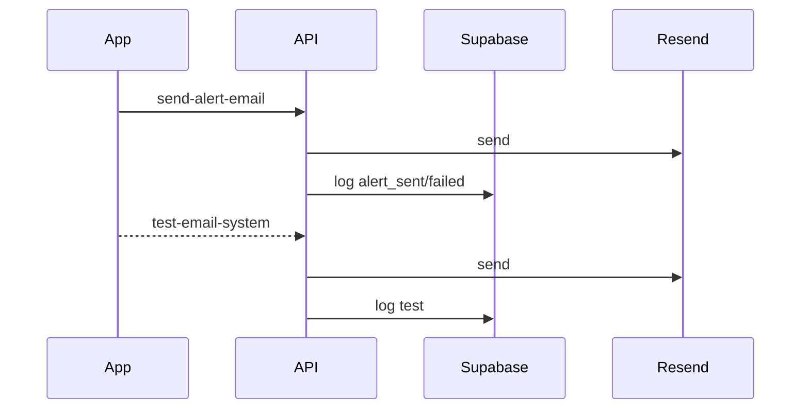

<div align="center" style="padding:28px;margin:0 0 16px 0;background:linear-gradient(135deg,#00d4ff 0%,#9333ea 100%);border-radius:16px;color:#ffffff">
  
  <h1 style="margin:8px 0 0 0">AIMindset</h1>
  <p style="margin:6px 0 12px 0;opacity:0.95">Agendamento inteligente • Performance • SEO • Observabilidade</p>

  <div>
    
    
    
    
    
    
    
    
  </div>

  <div style="margin-top:14px">
    <a href="./SISTEMA_ALERTAS.md" style="display:inline-block;padding:8px 14px;margin:4px;background:#111827;border:1px solid rgba(255,255,255,0.25);color:#fff;border-radius:9999px;text-decoration:none">🚨 Sistema de Alertas</a>
    <a href="./SISTEMA_LOGS_IMPLEMENTADO.md" style="display:inline-block;padding:8px 14px;margin:4px;background:#111827;border:1px solid rgba(255,255,255,0.25);color:#fff;border-radius:9999px;text-decoration:none">📊 Sistema de Logs</a>
    <a href="./VERCEL_ENV_SETUP.md" style="display:inline-block;padding:8px 14px;margin:4px;background:#111827;border:1px solid rgba(255,255,255,0.25);color:#fff;border-radius:9999px;text-decoration:none">🚀 Deploy (Vercel)</a>
  </div>
</div>

> 💡 O AIMindset entrega uma experiência minimalista e ágil, com foco em conteúdo e confiabilidade operacional.

---

## Quickstart
```
npm install
npm run dev
```
> Para APIs locais: `node server.js` (requer `SUPABASE_SERVICE_ROLE_KEY`).

## Índice
- [Visão Geral](#visão-geral)
- [Features](#features)
- [Arquitetura](#arquitetura)
- [Estrutura de Pastas](#estrutura-de-pastas)
- [Setup](#setup)
- [Desenvolvimento](#desenvolvimento)
- [Build & Deploy](#build--deploy)
- [Scripts Úteis](#scripts-úteis)
- [Observabilidade & Alertas](#observabilidade--alertas)
- [API (Endpoints)](#api-endpoints)
- [Segurança](#segurança)
- [Screenshots](#screenshots)
- [Diagramas](#diagramas)
- [FAQ](#faq)
- [Troubleshooting](#troubleshooting)
- [Checklist de Qualidade](#checklist-de-qualidade)
- [Changelog Real](#changelog-real)
- [Roadmap](#roadmap)
- [Licença](#licença)
- [Contribuição](#contribuição)
- [Créditos](#créditos)

## Visão Geral
- Frontend moderno em React + Vite com otimizações avançadas de UX, performance e SEO.
- APIs/Serviços para logs, alertas e backup integrados ao Supabase e Resend.
- Painel administrativo com monitoramento de logs, estatísticas e gestão de alertas.

## Features
<table>
  <tr>
    <td>🗓️ <strong>Agendamento Premium</strong><br/><span>Preview minimalista + glassmorphism</span></td>
    <td>⏱️ <strong>Contador Inteligente</strong><br/><span>Barra de progresso + pulso urgente</span></td>
    <td>✏️ <strong>Reagendar com UX</strong><br/><span>Validações + toasts claras</span></td>
  </tr>
  <tr>
    <td>📈 <strong>Logs & Stats</strong><br/><span>Backend/App/System em tempo real</span></td>
    <td>🔍 <strong>SEO Sólido</strong><br/><span>Sitemap/Robots + metadados</span></td>
    <td>⚡ <strong>Alta Performance</strong><br/><span>Web Vitals, lazy, virtualização</span></td>
  </tr>
  <tr>
    <td>📦 <strong>PWA</strong><br/><span>Service Worker otimizado</span></td>
    <td>📧 <strong>Alertas por Email</strong><br/><span>Templates profissionais (Resend)</span></td>
    <td>🛡️ <strong>Segurança</strong><br/><span>RLS e rate limiting</span></td>
  </tr>
</table>

## Arquitetura
- Frontend: React 18, Vite 6, TypeScript, Tailwind, Zustand, Zod, `react-router-dom`.
- Observabilidade: `web-vitals`, logs e métricas; GA4 Measurement Protocol.
- Backend/APIs: Express (`server.js`) e endpoints dedicados em `api/`.
- Integração com Supabase (RPC, RLS) e Resend para e-mails.
- Workers/Service Worker: `public/workers/articleProcessor.js`, `public/sw.js`.

## Estrutura de Pastas
```
.
├─ src/                # App React (componentes, hooks, lib)
├─ api/                # SEO e email endpoints (Express)
├─ public/             # Assets, manifest, service worker
├─ scripts/            # Manutenção, debug, testes, database, backup
├─ server.js           # API local para logs/backup
├─ docs/               # Documentação auxiliar de deploy e sistemas
├─ README.md           # Este arquivo
```

## Setup
- Pré-requisitos: Node 18+, npm.
- Instalação:
```
npm install
```
- Variáveis de ambiente (`.env`):
```
# Cliente
VITE_SUPABASE_URL=
VITE_SUPABASE_ANON_KEY=
NEXT_PUBLIC_SUPABASE_URL=
NEXT_PUBLIC_SUPABASE_ANON_KEY=

# Servidor
SUPABASE_URL=
SUPABASE_ANON_KEY=
SUPABASE_SERVICE_ROLE_KEY=

# Alertas
ENVIRONMENT=production|development
RESEND_API_KEY=

# Analytics
GA4_MEASUREMENT_ID=
GA4_API_SECRET=
```
- Segurança: nunca commitar segredos; Service Role só no servidor.

## Desenvolvimento
- Frontend:
```
npm run dev
```
- Qualidade:
```
npm run lint
npm run check
```
- API local de backup/logs (requer `SUPABASE_SERVICE_ROLE_KEY`):
```
node server.js
```

## Build & Deploy
- Build:
```
npm run build
```
- Preview:
```
npm run preview
```
- Deploy: Vercel (ver `VERCEL_ENV_SETUP.md`).

## Scripts Úteis
- Performance: `npm run build:perf`.
- Autenticação Google: `npm run setup-google-oauth`, `npm run google-oauth-wizard`, `npm run google-oauth-quick`, `npm run check-auth`.
- Pasta `scripts/` com utilitários de manutenção, debug, testes e banco.

## Observabilidade & Alertas
- Referências: `SISTEMA_LOGS_IMPLEMENTADO.md`, `SISTEMA_ALERTAS.md`.
- Resumo:
  - Logs: backend/app/system com RLS e índices otimizados.
  - Alertas automáticos com templates HTML (Resend) e assinantes.
  - Estatísticas e monitoramento no painel administrativo.

## API (Endpoints)
| Método | Rota | Descrição | Referência |
|-------|------|-----------|------------|
| POST | `/api/system-logs` | Inserir logs do sistema | `server.js:62` |
| POST | `/api/auto-backup` | Backup automático com limpeza | `server.js:97` |
| GET | `/api/backup-status` | Status e estatísticas | `server.js:229` |
| POST | `/api/backup-status` | Forçar verificação de saúde | `server.js:348` |
| GET | `/health` | Saúde do servidor | `server.js:408` |
| POST | `/api/send-alert-email` | Enviar alertas por email | `api/server.ts:27` |
| POST | `/api/test-email-system` | Testar sistema de email | `api/server.ts:72` |
| GET | `/sitemap.xml` | Sitemap | `api/server.ts:18` |
| GET | `/robots.txt` | Robots | `api/server.ts:18` |

### Exemplos (curl)
```
# Inserir log de sistema
curl -X POST http://localhost:3001/api/system-logs \
  -H "Content-Type: application/json" \
  -d '{
    "type": "app_error",
    "message": "Falha ao processar pagamento",
    "context": { "order_id": "123", "user_id": "abc" }
  }'

# Executar backup automático
curl -X POST http://localhost:3001/api/auto-backup

# Verificar status do backup
curl http://localhost:3001/api/backup-status

# Enviar email de alerta
curl -X POST http://localhost:3001/api/send-alert-email \
  -H "Content-Type: application/json" \
  -d '{
    "recipients": ["admin@example.com"],
    "alertData": {
      "type": "error",
      "source": "backup_system",
      "message": "Falha na rotina de backup",
      "timestamp": "2025-11-19T12:00:00.000Z",
      "details": { "job": "backup_all_data" }
    }
  }'
```

## Segurança
- RLS em todas as tabelas de logs no Supabase.
- Service Role apenas server-side; rate limiting simples para `/api/system-logs` (`server.js:38-52`).

---

## Screenshots
- Placeholder de branding: 
- Recomendações:
  - Adicionar captura do preview minimalista
  - Adicionar captura do card de agendamento premium
  - Adicionar captura da aba "Logs & Monitoramento" no admin

---

## Diagramas
### Arquitetura Geral


### Fluxo de Alertas


## FAQ
- O projeto usa Docker? Não. Desenvolvimento roda com `npm run dev` e APIs em `node server.js`.
- Como configuro GA4? Ver `VERCEL_ENV_SETUP.md` e `.env.example` (`GA4_MEASUREMENT_ID`, `GA4_API_SECRET`).
- Onde envio emails? Endpoint `POST /api/send-alert-email` (`api/server.ts:27`), via Resend.
- Como garantir RLS? Políticas definidas no Supabase; use Service Role somente no backend.

<details>
  <summary>Setup avançado (variáveis e dicas)</summary>

  - Cliente: `VITE_*` e `NEXT_PUBLIC_*`
  - Servidor: `SUPABASE_*`, `RESEND_API_KEY`, `GA4_*`
  - Segurança: não exponha Service Role no cliente
  - Deploy: ver `VERCEL_ENV_SETUP.md`

</details>

<details>
  <summary>Observabilidade (Logs & Alertas)</summary>

  - Logs: backend/app/system com estatísticas
  - Alertas: templates HTML profissionais via Resend
  - Painel admin: gestão de assinantes e testes de alertas

</details>

---

## Princípios de Design
- Minimalismo funcional: conteúdo em primeiro lugar
- Contraste e hierarquia visual consistentes
- Tipografia clara e escaneável
- Feedback imediato (toasts, estados, indicadores)
- Acessibilidade: foco, labels e semântica

## Troubleshooting
- Variáveis Supabase faltando: ver `.env.example` e `VERCEL_ENV_SETUP.md`.
- Emails não enviam: verificar `RESEND_API_KEY`, domínio verificado e logs (`system_logs`).
- GA4 sem eventos: conferir `ENVIRONMENT` e Measurement Protocol; usar DebugView.
- Rate limit em logs: reduzir chamadas por IP (implementado em `server.js:38-52`).

## Checklist de Qualidade
- `npm run lint` sem erros
- `npm run check` sem problemas de tipos
- `npm run build` com sucesso
- `.env` completo (Supabase, Resend, GA4)
- `/health` responde OK
- Web Vitals enviados em produção

## Changelog Real
### Fase 2.0
- Preview 100% minimalista, sem tags/categoria/data/TOC.
- Card premium para agendados; contador com barra e pulso; botão Voltar clean.

### Fase 2.1
- Reagendar funciona como editar; validações robustas.
- Feedback por toasts; logs completos; ordenação por data; limpeza de cancelados.

## Roadmap
- Fase 2.x: melhorias de SEO técnico e acessibilidade.
- Fase 3.x: automações avançadas de conteúdo e análises.

## Licença
- MIT — ver `LICENSE`.

## Contribuição
- Pull Requests e Issues são bem-vindos. Siga padrões de lint e tipos.

## Créditos
- AIMindset — engenharia, conteúdo e experiência.
> 🔎 Dica: use o índice para navegar rapidamente entre sessões.